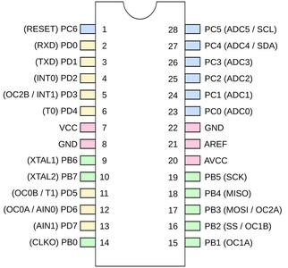

## Wat zijn microcontrollers?

Dit hoofdstuk dient als illustratie voor de student om een beeld te vormen van wat een microcontrollers (en in uitbreiding een embedded systeem is)

### Definitie van een microcontroller:  

Een microcontroller is:
* Een geintegreerde schakeling
* Programeerbaar met software (geschreven in C in ons geval)
* Meestal geïntegreerd is in een toestel (embedded)
* met de bedoeling het toestel een dd vorm van intelligent
gedrag te geven

Dus een microcontroller == computer?

#### Een microcontroller is een ... computer ...
Ja dus, een MCU
* bevat typische elementen van een computer-systeem
    * CPU (processor) +- 1-20 MHz
    * Een hoeveelheid geheugen
        * Dynamisch geheugen (RAM)
        * Non-volatile geheugen (Flash ROM en EEPROM)
    * divers I/O-poorten zijn ondergebracht.
* is programmeerbaar met dezelfde programmeer-talen die we gebruiken voor een computer(soms met wat beperkingen)
   * C
   * C++
   * Java
   * ...

#### Een microcontroller is een ... computer "*ON A CHIP*"

Een klassieke microcontroller kan je voorstellen als een typische geintegreerde schakeling (bv. AVR Atmega328P)


Je kan deze inschakelen in typische elektronica projecten, als een zeer flexibel (programmeerbaar) component (gevoed op 3.3-5V)

Het principe van zulk een "mini-computer" noemen we ook een SOC (System on a chip):  
* De microcontroller vormt een ‘stand alone’ computersysteem
* Heeft weinig anders nodig dan:
    * een externe voeding
    * optioneel een kloksignaal (kwartz)
* Bevat dus alle componenten op 1 chip zoals geillustreerd hieronder:


#### Een microcontroller is een "*ZEER KLEINE EN TRAGE*"" computer ...  

* 8- of 16-bit (hoewel 32 bit ook voorkomt)
* Zeer weinig geheugen
   * 1-32 KB tov 1-32 GB (bij een hedendaagse computer)
   * delen door +- 1000.000
* Zeer traag (relatief natuurlijk)
   * 20 Mhz is ook niet veel tov
* Geen operating system
* Dus niet ten onrechte **MICRO**CONTROLLER

>Opmerking:
>Wanneer we spreken over traag en klein is dat natuurlijk relatief als je dit vergelijkt met computers van 10 jaar terug.

#### Een microcontroller is een "embedded" computer ... (gebruik)

Naast dit schaalverschil ligt het **essentiele verschil** (tussen een PC en MCU) eigenlijk vooral in het **gebruik**:  

Een klassieke computer (pc, mac, server, tablet, ...) is een apparaat dat rechtstreeks bruikbaar is als apparaat voor een varieteit van "general purpose"-taken zoals:
   * Data-verwerking
   * Bureautica-toepassingen
   * Multimedia
   * Server-toepassingen  
   ...  

Een computer is dus in principe:
* eindproduct
* direct bruikbaar voor de eindgebruiker
* hoeft niet geïntegreerd te worden in een groter geheel

Een microntroller kan in dat opzicht niet rechtstreeks gebruikt worden als een "consumer"-apparaat.  

Een MCU heeft als doel **ingebed** (embedded) te worden in **specifieke**/gespecialiseerde elektronische (en/of mechanische) **toepassingen**.

Daarvoor heeft een MCU beschikking tot low-level interfaces die het toelaten elektrische signalen te lezen en te genereren vanuit software.

#### Link met embedded  

Deze gespecialiseerde systemen noemen we ook **embedded systemen.**  
Embedded dekt **vele ladingen** maar in essentie komt het er op neer op **systemen** die:
* Zowel soft- als hardware (elektronisch en mechanisch) combineren
* Een specifieke doel heeft, niet zoals

Dit komt vandaag de dag neer op zowat alle elektronische apparatuur die wordt aangestuurd door een controle-element.
 zoals:
   * Huishoud-appartuur: Wasmachines, TV's, Koffiezet-apparaten
   * Robots, Drones, 3D Printers
   * Industriële toepassingen en machines
   * Auto's
   * Dataloggers
   * Internet Of Things
   * USB toepassingen
   * Betaalterminals  
   * Sensornetwerken
   ...

> Bemerking:  
Het verschil tussen een computer en een microcontroller wordt echter de laatste jaren ietswat vager:  
* De opkomst van zeer krachtige SOC-systemen zoals de Raspberry PI, BeagleBone en consoorten die je zowel kan gebruiken als computer als voor lowel level IO
* Mobiele toepassingen, Smartphone en tablets kunnen worden bekeken als general-purpose devices


### AVR microcontrollers
De microcontroller-architectuur waar we met werken - in deze cursus - zijn de **AVR**-microcontrollers en worden geproduceerd door Atmel als antwoord op de populaire PIC-microcontrollers.

Deze architectuur is ontworpen door 2 Noorse studenten Alf-Egil Bogen and Vegard Wollan en in productie gebracht door Atmel (die daarvoor zich enkel met memory bezig hielden) in 1996.

AVR dankt hieraan zijn naam (Alf-Egil Bogen Vegard Wollan RISC microcontroller), ook soms vertaald als Advanced Virtual RISC.

AVR zich op de markt door de zeer lage kost (vanaf 0.5 € voor ATTiny), snelheid, gesupporteerd in GCC-compilers.  
Nadeel is dat deze architectuur maar door 1 fabrikant wordt geproduceerd (tov bijvoorbeeld ARM-architecturen)

AVR's is een microcontroller-architectuur die beschikbaar is verschillende maten en gewichten, algemeen zijn onderscheiden we 3 soorten die verschillen in prijs, grootte

* tinyAVR (8-bit) — de ATtiny-serie
    * 1–8 kB programmageheugen
    * 6-32 pins
    * tot 20 MHz
    * Gelimiteerde peripheral set
    * +- 0.5-1 €
* megaAVR (8-bit) — de ATmega-serie
    * 4–256 kB programmageheugen
    * 28-100 pins
    * Tot 20 MHz
    * Uitgebreide instructieset (vermenigvuldiginstructies en instructies voor het gebruik van grotere programmageheugens)
    * Uitgebreide peripheralset set
    * +- 2-4 €
* XMEGA (8-bit) — de ATxmega-serie
    * 16–384 kB programmageheugen
    * 44–64–100 pinbehuizing (A4, A3, A1)
    * Tot 32 MHz
    * Uitgebreide prestatie-eigenschappen, zoals DMA, "Event System" en cryptografie-ondersteuning
    * Zeer uitgebreide peripheral set
    * 4-10 €
* UC3 (32-bit)
    * 16-512KB programmageheugen
    * 48-144 pins
    * Tot 66 MHz
    * Zeer uitgebreide peripheral set
    * +10 €

In de meeste opdrachten maken we gebruik van de ATmega-serie.

Andere architecturen zijn bijvoorbeeld ARM Cortex M-serie (verschillende producenten), PIC (Microchip), Intel 8051, MSP (TI), ...

### Een eerste blik op microcontrollers (van buiten)
We weten wat een microcontroller of MCU (we zullen deze afkorting vanaf nu meer en meer gebruiken) is?  
Hoe ziet nu zo een microcontroller eruit en wat zijn zijn belangrijkste kenmerken

#### Geintegreerde chip  
Een microcontroller is (zoals eerder vermeld) een geintegreerde chip, typisch in een dip- (bruikbaar op een breadboard) of dim-verpakking:  
  

#### Pinnen
Gemeenschappelijk aan alle microcontrollers is dat deze een reeks van van pinnetjes bevatten die je in staat stellen om elektrische signalen uit te sturen vanuit deze controller.

Deze pins kan je vanuit een programma (dat je van een een computer op de MCU laadt) elektrische signalen uitsturen of inlezen zoals:
* Plaatsen van een specifieke spanning op een van deze pinnetjes (hoog of laag)
* Lezen van de spanning die op een van deze pinnetjes wordt geplaatst

Let wel, voor deze GPIO-functionaliteiten (General Purpose Input Output) kan je vanuit je programma voor een pin enkel 2 toestanden uitlezen of uitsturen, namelijk laag of hoog.
Voor output houdt dit in dat je ofwel 0 of een referentie-spanning (meestal 3.3v of 5v).  

#### Gespecialiseerde functionaliteit  
Naast deze GPIO-functionaliteit kan je op bepaalde pinnen ook meer gespecialiseerde functionaliteiten triggeren zoals:
* Pulse Width Modulation (PWM)
* Analog Digital Conversion (ADC)
* Seriele protocollen zoals
    * UART
    * SPI
    * I2C
...

### Tot hier toe...
De bedoeling van dit hoofdstuk was een een idee te vormen van wat een microcontroller eigenlijk is.  

In de volgend hoofdstukken gaan we bekijken hoe we deze AVR-MCU's gaan aanspreken vanuit C-code en de belangrijke elementen die daarbij horen zoals:  
* Registers (data-direction)
* Configureren poorten en pinnen
* Lezen en schrijven
* Interne opbouw

Alvorens dieper in te gaan op hoe dat een MCU werkt en opgebouwd is gaan we eerst een basis-introductie geven in programmeren in C aan de hand van een aantal command-line applicatie.

### Extra demo (enkel ter illustratie)
Ter vervollediging en als voorbeeld van een toepassing zie je hieronder een programma dat de schakeling (op breadboard) op de foto daaronder aanstuurt.



Het principe is klein programma dat elke 85 milliseconde de volgende led laat branden in de rij (en dit heen en weer)


```
#include <avr/io.h>
#include <util/delay.h>

int main(void) {

  uint8_t i;
  DDRB = 0xff;

  while (1) {
    while (i < 7) {
      PORTB = (1 << i);
      _delay_ms(85);
      i = i + 1;
    }

    while (i > 0) {
      PORTB = (1 << i);
      _delay_ms(85);
      i = i - 1;
    }
  }
  return (0);
}
```
Met als gevolg:


