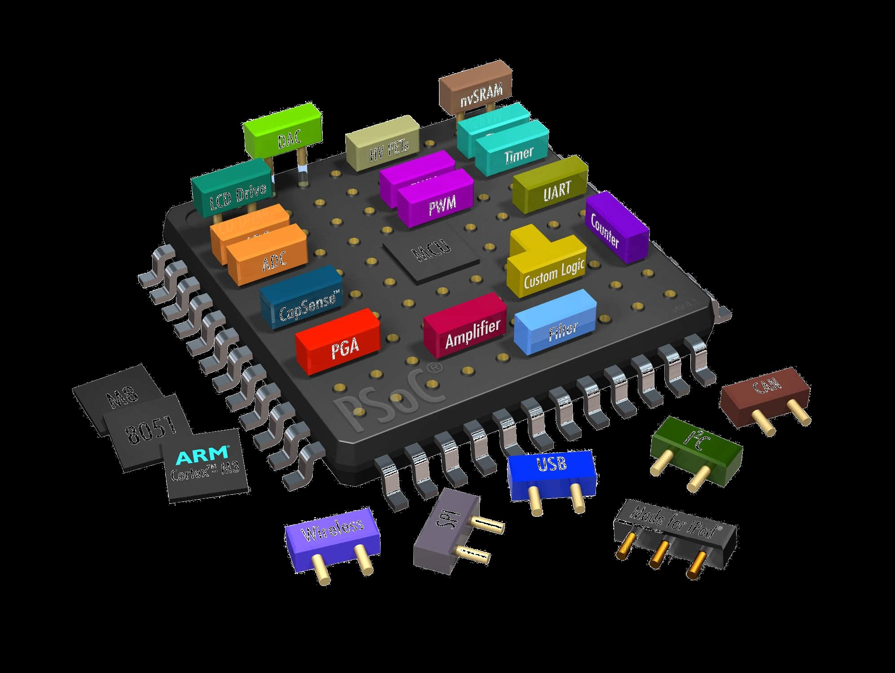

## Wat zijn microcontrollers?

Dit hoofdstuk dient als illustratie een eerste kennismaking met microcontrollers.  
Het heeft als doel je een **beeld** te doen vormen van **wat** een **microcontrollers zijn**, waarvoor ze **gebruikt** worden (en in uitbreiding een embedded systeem is)

### Definitie van een microcontroller:  

Een microcontroller is:

* Een **geïntegreerde** schakeling in een elektronisch circuit of toestel (met eventueel mechanische onderdelen)
* **Programmeerbaar** met **software** (geschreven in C in ons geval)
* Met de bedoeling een **controle-element** in de **hardware** in te bouwen  
(controle-element kan een sturing zijn maar ook gewoon een data-logging of sampling)  

#### ?Microcontroller == computer?
Je kan een microcontroller programmeren met software net zoals een computer, is dit dan het zelfde als een computer?

#### Een microcontroller is een ... computer ...
Ja dus, een **MCU** (een afkorting die we vanaf nu regelmatig gebruiken) bevat de typische elementen van een computer-systeem:  

* CPU (processor) +- 1-20 MHz
* Een hoeveelheid geheugen
   * Dynamisch geheugen (RAM)
    * Non-volatile geheugen (Flash ROM en EEPROM)
* Divers I/O-mogelijkheden

Een MCU Is programmeerbaar met **dezelfde programmeer-talen** die we gebruiken voor een **computer**(soms met wat beperkingen) zoals in ons geval C (of C++).

#### Een microcontroller is een ... computer met zeer veel IO-functionaliteiten

Een klassieke microcontroller kan je voorstellen als een typische geïntegreerde schakeling zoals bv. de AVR Atmega328P hieronder .


Je kan deze inschakelen in typische elektronica projecten, als een zeer flexibel (programmeerbaar) component (gevoed op 3.3-5V)  

Dat is iets wat je normaal gezien niet (gemakkelijk) terugvindt bij een gewone computer, namelijk de mogelijkheden om elektrische signalen door te sturen op een zeer laag niveau.  


#### Een microcontroller is een ... computer "*ON A CHIP*"

Alle elementen nodig om zijn taak uit te voeren (geheugen, cpu, opslag, ...) zit eigenlijk om 1 chip geplaatst, het principe van zulk een "mini-computer" noemen we ook een SOC (System on a chip):  

* De microcontroller vormt een ‘stand alone’ computersysteem
* Heeft weinig anders nodig dan:
    * een externe voeding
    * optioneel een kloksignaal (kwartz)
* Bevat dus alle componenten op 1 chip zoals geïllustreerd hieronder:



#### Een microcontroller is een "*ZEER KLEINE EN TRAGE*"" computer ...  

Een MCU is dus in dat opzicht (relatief gezien) niet te vergelijken met een gewone computer:

* meestal 8- of 16-bit tov de 64-bit bij hedendaagse computers
* Zeer weinig geheugen
    * 1-32 KB tov 1-32 GB (bij een hedendaagse computer)
    * dus delen door +- 1.000.000
* Zeer traag (relatief natuurlijk)
    * 20 Mhz is ook niet veel tov
* Geen operating system die hardware voor je beheert

Dus niet ten onrechte **MICRO**CONTROLLER

>Opmerking:
>Wanneer we spreken over traag en klein is dat natuurlijk relatief als je dit vergelijkt met computers van 10 jaar terug.

#### Een microcontroller is een "embedded" computer ... (gebruik)

Naast dit schaalverschil ligt het **essentiële verschil** (tussen een PC en MCU) eigenlijk vooral in het **gebruik**:  

Een klassieke computer (pc, mac, server, tablet, ...) is een apparaat dat rechtstreeks bruikbaar is als apparaat voor een varieteit van "general purpose"-taken zoals:

   * Data-verwerking
   * Bureautica-toepassingen
   * Multimedia
   * Server-toepassingen  
   ...  

Een computer is dus in principe:

* Een **eindproduct** dat direct bruikbaar is voor de eindgebruiker
* Kan op zich werken, hoeft **niet geïntegreerd** te worden in een groter **geheel**

Een microntroller kan in dat opzicht niet rechtstreeks gebruikt worden als een "consumer"-apparaat.  

Een MCU heeft als doel **ingebed** (embedded) te worden in **specifieke**/gespecialiseerde elektronische (en/of mechanische) **toepassingen**.

Zoals eerder vermeld heeft een MCU om die redenen beschikking tot low-level interfaces die het toelaten elektrische signalen te lezen en te genereren vanuit software.

#### Embedded systemen

De gespecialiseerde systemen waar we over spraken noemen we **"embedded systemen"**.   
Het woord embedded dekt **vele ladingen** , echter in essentie komt het er op neer op **systemen** die:

* Zowel soft- als hardware (elektronisch en mechanisch) combineren
* Een **specifiek** doel en/of toepassingsgebied hebben

Dit komt vandaag de dag neer op zowat alle elektronische apparatuur die wordt aangestuurd door een controle-element zoals:

   * Huishoud-apparatuur: Wasmachines, TV's, Koffiezet-apparaten
   * Robots, Drones, 3D Printers
   * Industriële toepassingen en machines
   * Auto's
   * Dataloggers
   * Internet Of Things en/of sensornetwerken
   * M2M (Machine to Machine)
   * USB toepassingen
   * Betaalterminals  
   * Sensornetwerken  
   ...

##### Raspberry Pi, Beaglebone, OLinuXino, Cubieboard, ...  

Het verschil tussen een computer en een microcontroller is tegenwoordig wel wat aan het vervagen ...   
De laatste jaren komen - mede door de vooruitgang in mobiele technologieën - zeer krachtige SOC-systemen op de markt (dikwijls gebaseerd op **ARM**) die een volwaardig **OS** (zoals Linux of Android) kunnen draaien.   

Net als de MCU bestaan deze **computers** uit een **SOC** waar de centrale componenten (CPU, RAM, ROM, hardware-controllers, ...) in 1 chip geïntegreerd zitten.  

Dit laat het toe van **zeer compacte** en kleine **computers** te maken, voorbeelden hiervan vind je in nieuwe **mini-computers** op de markt (gebaseerd op het SOC-principe) zoals de **Raspberry PI, BeagleBone, ** e.a. ...   

 

Deze **mini-computers** bevatten ook dikwijls dezelfde (of toch een deel van de) low-level-interface-mogelijkheiden van een MCU waardoor je deze (naast klassiek computergebruik) deze ook kan integreren in een elektronische schakeling.  
Dit kan zeer nuttig zijn als je meer krachtige toepassingen wil hebben waar je bijvoorbeeld: 

* Meer CPU en/of opslag nodig heb
* Wil integreren in een draadloos netwerk
* Eventueel een grafische software-applicatie op een scherm wil integreren in je hardware-toepassing
* ...

De keuze tussen het gebruik van een eenvoudige MCU en een mini-computer hangt sterkt af van wat je nodig hebt.    
Belangrijke nuance is wel dat voor de meeste elektronica-projecten je dikwijls hetzelfde resultaat kan bereiken met een eenvoudige MCU (0.5 - 5 €) tov een duurdere minicomputer (30-80 €)

> In de cursus focussen we op MCU hoewel het mogelijk zal zijn voor een aantal van de labo's deze MCU te laten communiceren met een Beaglebone, Raspberry Pi of soortgelijk apparaat ...

### AVR microcontrollers

De microcontroller-architectuur waar we met werken - in deze cursus - zijn de **AVR**-microcontrollers en worden geproduceerd door Atmel als antwoord op de populaire PIC-microcontrollers.

Deze architectuur is ontworpen door 2 Noorse studenten (Alf-Egil Bogen and Vegard Wollan) en in productie gebracht door Atmel (die daarvoor zich enkel met memory bezig hielden) in **1996**.

AVR dankt hieraan zijn naam (Alf-Egil Bogen Vegard Wollan RISC microcontroller), ook soms vertaald als Advanced Virtual RISC.

AVR onderscheidt zich op de markt door de zeer lage kost (vanaf 0.5 € voor ATTiny), snelheid, en de uitgebreide support in (GCC-)compilers.  
Nadeel is dat deze architectuur maar door 1 fabrikant wordt geproduceerd (tov bijvoorbeeld ARM-architecturen)

AVR's is een microcontroller-architectuur die beschikbaar is verschillende maten en gewichten, algemeen zijn onderscheiden we 3 soorten die verschillen in prijs, grootte

* tinyAVR (8-bit) — de ATtiny-serie
    * 1–8 kB programmageheugen
    * 6-32 pins
    * tot 20 MHz
    * Gelimiteerde peripheral set
    * +- 0.5-1 €
* megaAVR (8-bit) — de ATmega-serie
    * 4–256 kB programmageheugen
    * 28-100 pins
    * Tot 20 MHz
    * Uitgebreide instructieset (vermenigvuldiginstructies en instructies voor het gebruik van grotere programmageheugens)
    * Uitgebreide peripheralset set
    * +- 2-4 €
* XMEGA (8-bit) — de ATxmega-serie
    * 16–384 kB programmageheugen
    * 44–64–100 pinbehuizing (A4, A3, A1)
    * Tot 32 MHz
    * Uitgebreide prestatie-eigenschappen, zoals DMA, "Event System" en cryptografie-ondersteuning
    * Zeer uitgebreide peripheral set
    * 4-10 €
* UC3 (32-bit)
    * 16-512KB programmageheugen
    * 48-144 pins
    * Tot 66 MHz
    * Zeer uitgebreide peripheral set
    * > 10 €

> **Bemerking:**  
> In de meeste opdrachten zullen gebruik maken van de AVR ATmega-serie.
> AVR is vanzelfsprekend niet de enige microcontroller-architectuur.    
> Andere voorbeelden hiervan zijn de ARM Cortex M-serie (gemaakt door verschillende producenten), PIC (Microchip), Intel 8051, MSP (TI), ...  
> Deze architecturen zullen sporadisch aan bod komen ter vergelijking met AVR (of voor bepaalde optionele projecten en/of opdrachten)

#### Development-boards

De controller in zijn zuivere vorm is een dip- of dim-package die je integreert op een print (of een breadboard voor prototyping).  
Als je aan de slag wilt met een  moet je zelf:

* De MCU integreren in prototype of breadboard
* Voeding voorzien
* En een speciale programmer kopen om de software op deze MCU te laden  
... (zoals hieronder)  


Voor het echter makkelijker te maken snel toepassingen te ontwikkelen zonder een hele elektronica-setup maken we tijdens de cursus gebruik van 2 development-borden die we later in de cursus nog uitvoerig bespreken.

#### Arduino

Arduino is een open-source electronica platform waarin een AVR MCU is geintegreerd.  
In principe is dit hetzelfde als een MCU maar met reeds een programmer, voeding, kristal, ... geïntegreerd

Samengevat, om met een Arduino van start te gaan heb je in het begin niet meer nodig dan een USB-kabel om de MCU vanaf je computer te programmeren (en te voeden)

Voor de basis-oefeningen gaan we hun basis-platform gebruiken, de Arduino UNO


**Later** bij de start van de microcontroller-labo's volgt een verdere introductie rond Arduino en het werken ermee.  

> **Opmerking:**  
> Arduino is zowel hardware als software.  
> Hoewel dat de Arduino-software zijn nut heeft om mensen (of kinderen) zonder programmeer-ervaring snel te laten starten is het in deze cursus is **uitgesloten van de programmeer-omgeving van Arduino te gebruiken**.    
> Dit om verschillende redenen:  
>
> * We willen **inzicht** verwerven in de microcontroller  
Arduino-software schermt veel af achter abstracties om het gemakkelijk te maken  
(voor mensen die niet noodzakelijk een cursus microcontrollers volgen)
> * We willen meer **controle** te hebben op de hardware  
Ook met deze abstracties is het moeilijker om op een laag niveau controle te hebben.
> * **Performantie** en geheugen-plaats   
Binaries via Arduino zijn groter en trager dan binaries uit normale C-code.  
(20-40 * trager)

##### Digilent IO Explorer
Voor de meer gevorderde oefeningen gaan we gebruik maken van een ander bord, namelijk de Digilent IO Explorer  


(ook later voor het starten van de labo's met dit bord meer hierover)

### Een eerste blik op microcontrollers (van buiten)

We weten wat een microcontroller of MCU (we zullen deze afkorting vanaf nu meer en meer gebruiken) is?  
Hoe ziet nu zo een microcontroller eruit en wat zijn zijn belangrijkste kenmerken?

#### Geïntegreerde chip  

Zoals reeds vermeld; een microcontroller is een geïntegreerde chip.  
Deze komen meestal in 2 vormen voor:  

* **dip**-verpakking  
Bruikbaar op een breadboard en of prototype  
MCU's hieronder met lange pinnetjes
* **dim**-verpakking  
Meestal/typisch gebruikt om op een plc te plaatsen.  
Deze ga je meestal zelf niet gebruiken voor prototypes (meer voor eindproducten).

  

#### Pinnen
De belangrijkste eigenschap van alle microcontrollers is dat deze een reeks van pinnetjes (of pins) bevatten.  
Deze pins stellen je in staat om elektrische signalen uit te sturen vanuit de controller (en de software) naar de buiten wereld:

* Plaatsen van een specifieke spanning op een van deze pinnetjes (hoog of laag)
* Lezen van de spanning die op een van deze pinnetjes wordt geplaatst

Let wel, voor deze GPIO-functies (General Purpose Input Output) kan je vanuit je programma voor een pin enkel 2 toestanden uitlezen of uitsturen, namelijk laag of hoog.
Voor output houdt dit in dat je ofwel 0 of een referentie-spanning (meestal 3.3v of 5v).  

##### Voorbeeld

Zuiver ter illustratie momenteel (de code hiervan wordt binnen een 2-tal lessen uitgelegd).  
Hieronder heb je code om op de setup daaronder (op basis van een atmega168p) de leds 1 voor 1 (voor korte tijd 85ms) van links naar rechts te laten bewegen.  

> **Let wel**:  
Dit is enkel ter voorbeeld, het werken met c-code en meer specifiek op MCU zal snel duidelijk worden in de volgende hoofdstukken.

```
#include <avr/io.h>
#include <util/delay.h>

int main(void) {
  uint8_t i;
  DDRB = 0xff;

  while (1) {
    while (i < 7) {
      PORTB = (1 << i);
      _delay_ms(85);
      i = i + 1;
    }

    while (i > 0) {
      PORTB = (1 << i);
      _delay_ms(85);
      i = i - 1;
    }
  }
  return (0);
}
```
De hardware setup (mocht je zelf al willen proberen):


#### Gespecialiseerde functionaliteit  
Naast deze GPIO-functionaliteit kan je op bepaalde pinnen ook meer gespecialiseerde functionaliteiten triggeren (geïmplementeerd in hardware) zoals:  

* Pulse Width Modulation (PWM) voor het genereren van analoge signalen (soms in combinatie met een filter)
* Analog Digital Conversion (ADC) voor het omzetten en samplen van analoge signale
* Seriele protocollen (voornamelijk gebruikt voor instructies en data-overdracht tussen MCU's, sensors, computers, ...) 
    * UART (bijvoorbeeld via een ftdi-chip kan je de MCU met je computer laten praten)
    * I2C (serieel bus-protocol uitgevonden door Philips en voortgezet door NXP)
    * SPI (master-slave-protocol ontwikkeld door Motorolla)
...  

De beschikbare extra functionaliteiten hangen natuurlijk sterk af van het type MCU
Deze gespecialiseerde functionaliteiten zullen nog sterk aan bod komen in deze cursus.  

### Tot hier toe...
De bedoeling van dit hoofdstuk was een een idee te vormen van wat een microcontroller eigenlijk is, dus we hebben nog NIET gezien:

* Hoe je met een MCU in het algemeen (of specifiek een AVR) moet met werken
* Hoe deze intern is opgebouwd

Dit is de bedoeling dat we dit (simultaan met de labo's) gaan uitleggen en opbouwen.   
In de volgend hoofdstukken gaan we bekijken hoe we deze AVR-MCU's gaan aanspreken vanuit C-code en de belangrijke elementen die daarbij horen zoals:  

* Registers (data-direction)
* Configureren poorten en pinnen
* Lezen en schrijven
* Interne opbouw

Alvorens dieper in te gaan op hoe dat een MCU werkt en opgebouwd is gaan we **eerst** een **basis-introductie** geven in programmeren in **C** aan de hand van een aantal command-line applicaties (met als target de computer).

