## Interne opbouw AVR

### De AVR CPU_CORE

Onderstaande figuur toont de architectuur van de microcontroller, die bovendien gebaseerd is op de **Harvard structuur**, waarbij geheugens en bussen voor instructies (programma) en data gescheiden zijn.  De instructies in het programmageheugen worden uitgevoerd volgens het principe **single level pipelining**.

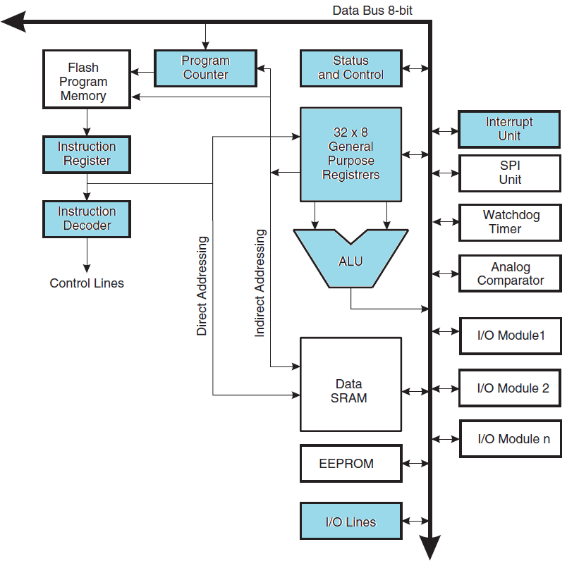

We kunnen volgende blokken opmerken:
* Geheugen
* General purpose registers
* Special purpose register
* Special purpose blokken
* ALU (Arithmetic Logic Unit)

De blokken die blauw ingekleurd zijn, zijn de typische componenten die standard aanwezig zijn in een microcontroller. De andere blokken zoals het geheugen maken het onderscheid of we spreken over een microprocessor of een microcontroller.

> Pipelining is een implementatietechniek waarbij meerdere instructies zijn overlapt.  Terwijl één instructie uitgevoerd wordt, wordt de volgende instructie al opgehaald uit het programmageheugen. Waardoor men elke klokcyclus een instructie kan uitvoeren. Hiervoor is geen extra hardware aan boord maar dit wordt verwezenlijkt door bepaalde hardware stukken gezamenlijk te laten werken voor verschillende instructies, en dit op het zelfde moment.

> | Klok cyclus    | 1                  | 2                   | 3                   | 4                   | 5                   |
|----------------|--------------------|---------------------|---------------------|---------------------|---------------------|
| Instructie i   | Instructie ophalen | Instructieuitvoeren |                     |                     |                     |
| Instructie i+1 |                    | Instructie ophalen  | Instructieuitvoeren |                     |                     |
| Instructie i+2 |                    |                     | Instructie ophalen  | Instructieuitvoeren |                     |
| Instructie i+3 |                    |                     |                     | Instructie ophalen  | InstructieUitvoeren |

### ALU – Arithmetic Logic Unit
De ALU is als rekeneenheid het centraal staande onderdeel van de processor. De ALU voert
rekenkundige en logische bewerkingen uit. Deze bewerkingen zijn binair. De basis bewerkingen van de
ALU zijn:
* Aritmetische bewerkingen (optellen, aftrekken, vermenigvuldigen, delen)
* Verlagen/verhogen met 1
* (Verlagen met 1 en dan) vergelijken met nul
* Het naar links of rechts verplaatsen van bits (Shiften)
* Logische bewerkingen zoals AND, NOT, OR en XOR  

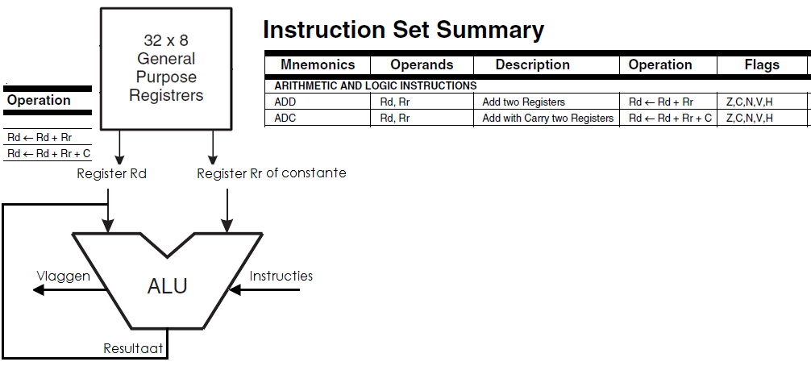

De AVR ALU ondersteunt bewerkingen tussen 2 registers, of tussen een constante en een register. Na een aritmetische bewerking wordt het resultaat terug in bestemmingsregister Rd geschreven. Ook het Status register wordt geüpdatet. De bits in het statusregisters noemt men **FLAGS** of vlaggen. Deze vlaggen geven meer informatie over het resultaat van de bewerking.
De ALU werkt direct samen met de 32 general purpose werkingsregisters.  
Bewerkingen worden in één klokcyclus voltooid.

De ALU geeft na ELKE bewerking een extra informatie bij een bepaald resultaat. Dit resultaat zijn vlaggen in de vorm van bits.  
Deze bits zijn weergegeven in het Status Register.  
Het status register wordt na elke bewerking geupdate.

### Het status register

De ALU geeft na ELKE bewerking een extra informatie bij een bepaald resultaat. Dit resultaat zijn vlaggen in de vorm van bits. Deze bits zijn weergegeven in het Status Register. Het status register wordt na elke bewerking geupdate.

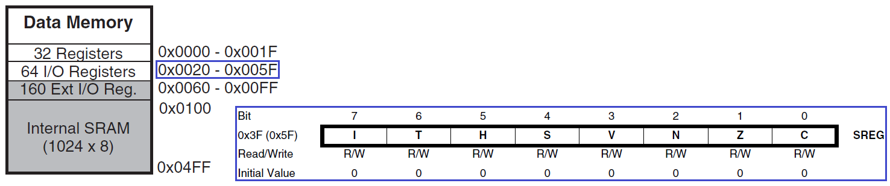

Het status register bevindt zich op adres 0x5F van het DATA geheugen. Alle bits van het register zijn ‘0’
na een RESET. Het status register bevat volgende bits:

> Opmerking:  
> De reden van de dubbele adreslocatie aanduiding wordt verder behandeld bij de
bespreking van de I/O registers.  

**Global interupt Enable (I) - Bit 7:**  
Indien bit op ‘1’ zijn interrupts toegestaan. Indien deze bit gecleard is dan kan er géén interrupt optreden, ondanks dat er in afzonderlijke interrupt registers een interrupt bit enabled is.  
Instructies die deze bit beinvloeden:  
* RETI = Interrupt return (PC ← STACK)
* SEI  = Global interrupt Enable
* CLI  = Global interrupt Disable

**Bit Copy Storage (T) - Bit 6:**
Onderstaande instructies gebruiken de T bit als bron of bestemming. Eén welbepaalde bit uit een register kan gekopieerd worden naar T, of kan vanuit T naar een welbepaald register gestuurd worden.
Bit copy instructies beïnvloeden deze bit:
* BLD = Bit Load
* BST = Bit Store

**Half Carry Flag (H) - Bit 5:**
Ook wel Auxilliary Carry Flag genoemd.. Dit is een hulp overdracht vlag, gebruikt bij BCD
bewerkingen. De half Carry wordt gezet of teruggezet gedurende een optelling of een
aftrekking en geeft een overdracht aan van bit 3 naar bit 4

**Sign Bit (S) - Bit 4:**
De S bit is steeds een EXOR functie tussen de negatieve vlag N en de overflow flag V.  
S = N ⊕ V

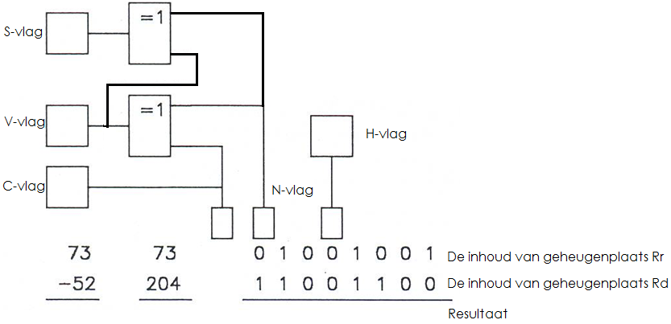

**Two’s Complement overflow flag (V) - Bit 3:**  
wordt gebruikt bij optelling en aftrekking van integers die in het twee-complement zijn
gegeven met teken. De overflowvlag wordt gezet als er een overdracht is naar het achtste
bit, terwijl er geen overdracht vanuit het achtste bit plaatsvindt. De overdracht-vlag geeft dus een teken bereik overflow aan

**Negative flag (N) - Bit 2:**  
Geeft weer dat het resultaat van de ALU negatief is.  

**Zero flag (Z) - Bit 1:**  
Geeft weer dat het resultaat van de ALU 0 is.

**Carry flag (C) - Bit 0:**  
Geeft weer dat er een overdacht geweest is om tot het resultaat te kunnen komen.

> Opmerking:  
> Wanneer er een interrupt optreedt, wordt het status register niet automatisch ergens
opgeslagen. Eveneens wordt bij het hervatten van het programma, na een interrupt
routine, het status register (zoals het was vóór de subroutine) niet automatisch
terug opgeroepen. De gebruiker moet dit zelf zo programmeren!

### General Purpose Register File
Het **General Purpose Register** is speciaal ontworpen voor de AVR met RISC instructieset. Doordat deze registers zeer dicht bij het geheugen staan zijn ze zeer snel en flexibel.
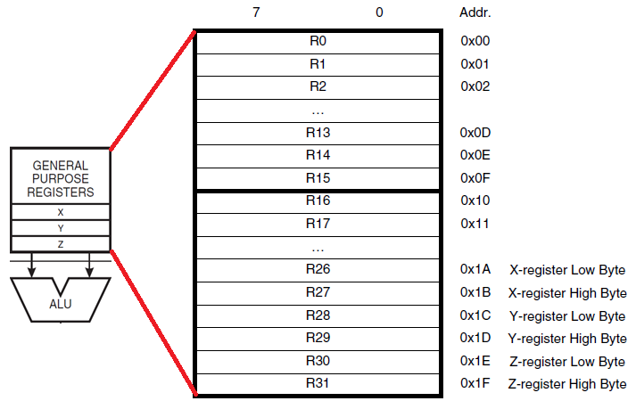

Bovenstaande figuur toont de structuur van het 32 bytes grote CPU GPR register. 6 van deze 32 registers
kunnen gebruikt worden als 3 16-bit indirect adresseerbare register adrespointers. Eén van deze
pointers kan ook gebruikt worden als adrespointer voor look-up tabellen in het Flash programma
geheugen. Deze functieregisters noemen we de X-,Y-, en Z-registers.

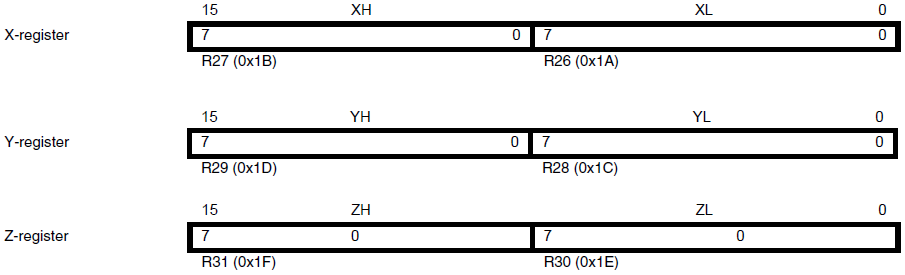

In de verschillende adresseringsmodes hebben deze registers functies zoals:
* Vaste vervanging
* Automatische increment
* Automatische decrement  

Hierover meer informatie bij de beschrijving van het SRAM geheugen  

De 32 registers hebben elk een geheugenplaats toegewezen gekregen in het datageheugen.
Om het overzichtelijk te houden zijn de eerste 32 adressen van het datageheugen voorbehouden voor deze 32 registers.

> Opmerking:  
> Het datageheugen begint dan wel te tellen vanaf 0x00, maar deze 32 registers zijn
> fysiek niet geïmplementeerd als SRAM locatie. De geheugenstructuur wordt in een
> later hoofdstuk verder behandeld.

### Stack en stackpointer
#### De stack  

De stack, ook wel Stapelgeheugen genoemd, is een gereserveerd
geheugengebied dat gebruikt wordt voor het opslaan van tijdelijke data,
lokale variabelen en return adressen na interrupts en subroutines. De Stack is opgebouwd als een LIFO register (Last in, first out).  Het laatst toegevoegde item wordt als eerste terug gebruikt.

Men kan dit visueel voorstellen door houten schijven rond een paaltje in de grond. Hij bestaat uit een aantal die elkaar in adres opvolgen en waarvan we zowel de locatie als het aantal zelf kunnen bepalen:

Het aantal geheugenlocaties dat gereserveerd moet worden is afhankelijk van het programma dat uitgevoerd wordt. Wordt er te veel geheugen gereserveerd voor de stack, dan blijven een heel deel stack registers, die nodig kunnen zijn als data geheugen, ongebruikt.  
Worden er te weinig registers gereserveerd dan kan het programma vast lopen. In principe moet men, na het afwerken van een programma, controleren hoeveel stackregisters er nodig zijn, en indien nodig de stack aanpassen.

#### De stack pointer

Bij de stack hoort ook een stackpointer. Deze pointer is in het I/O geheugen (op adres 0x5E en 0x5D) opgenomen als twee 8-bit registers (SPH en SPL). De stackpointer wijst naar het data SRAM stack-gebied waar de subroutine en interrupt stacks gelokaliseerd zijn. De stackpointer MOET boven 0xFF geïnitialiseerd worden.

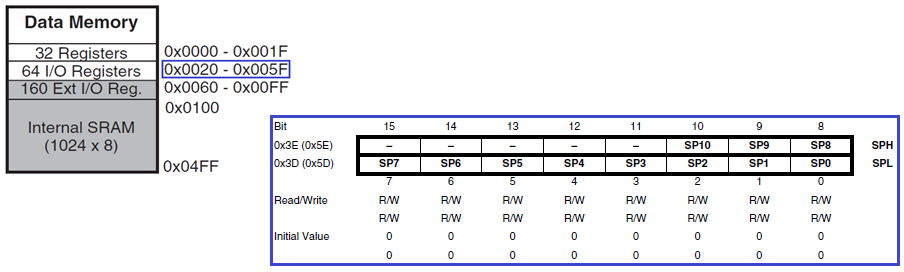

De stack pointer wordt:  
* **Verminderd met 1**; wanneer het return adres op de stack geduwd wordt met het PUSH
commando.
* **Verminderd met 2**; wanneer het return adres op de stack geduwd wordt met de subroutine
call OF bij een interrupt.
* **Vermeerderd met 1**; wanneer data van de stack gehaald wordt met de POP instructie
* **Vermeerderd met 2**; wanneer data van de stack gehaald wordt met een subroutine return instructie (RET) of na de return van een interrupt (instructie RETI)

De SPL en SPL (stackpointer LOW en stackpointer HIGH), die na een RESET de waarde 0x00h bekomen, worden impliciet gebruikt als adresregister voor indirecte adressering (principe van een pointer).  
Ze wijzen met andere woorden dus naar General Purpose Register R0. Dit snel register wordt veelvuldig door de CPU gebruikt.  
Vandaar dat we onze stackpointer ook steeds met een andere waarde moeten laden.

Een voorbeeld hier van kan als volgt opgebouwd worden:  

    .include "bestandsnaam bibliotheek van de registers"
     
    .def temp = r16  

             ldi temp, HIGH(RAMEND)        ; HIGH-Byte maximum RAM adres
             out SPH, temp
             ldi temp, LOW(RAMEND)         ; LOW-Byte maximum RAM adres
             out SPL, temp

Hier in dit voorbeeld, in assembly code met instructies uit de instructieset, wordt de adrespointer dus geladen met de waarde 0x04FFh. Onderstaande figuur geeft dit visueel weer. De stack begint dus bij de hoogste SRAM adreswaarde en groeit van boven naar onder aan. Terwijl het data geheugen van beneden naar boven aangroeit.  

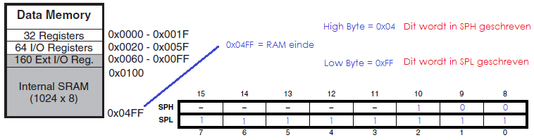
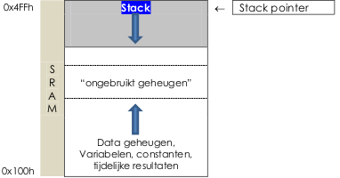

### Geheugen

De ATmega165P controller heeft verschillende soorten geheugen, namelijk:
* 16 K Programmageheugen
  * Applicatie FLASH geheugen
  * Boot FLASH sectie
* Data geheugen
  * 32 General Purpose Registers
  * 224 Registers
    * 64 I/O registers
    * 160 EXT I/O registers
  * 1K SRAM
* 512 bytes Extra EEPROM data geheugen

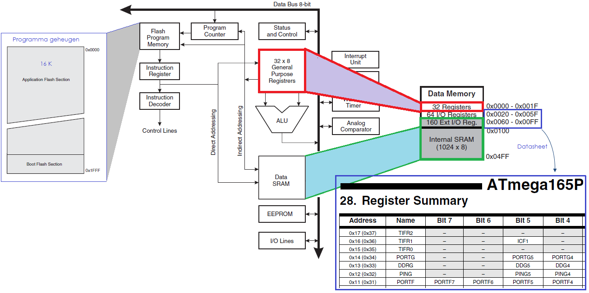

#### "In System" herprogrammeerbaar flash programma geheugen

Dit is geheugen van het type Flash. Na het laden van een programa in dit geheugen blijft het programma behouden, ook wanneer de voedingspanning van de microcontroller wegvalt.

#### SRAM Data geheugen

Het datageheugen kan in 4 onderdelen worden opgesplitst. Belangrijk om weten is dat al deze
onderdelen, hoewel wij ze zo tekenen, niet fysisch in één geheugen IC zijn ondergebracht.

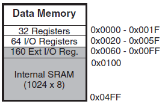

De ATmega165P controller is een complexe microcontroller met meer randapparatuur dan er kan ondersteund worden door de 64 locaties, die gereserveerd zijn voor de opcode voor de IN en UIT instructies.  
Voor deze randapparaten hebben we Extended I/O geheugenruimte. Deze EXT I/O geheugenruimte is beschikbaar van geheugenplaats 0x60h tot 0xFFh. De EXT I/O registers kunnen enkel aangesproken worden met de volgende instructies:

* LD: Load Indirect
* LDS: Load Direct from SRAM
* LDD: Load Indirect with Displacement

* ST: Store Indirect
* STS: Store Direct to SRAM
* STD: Store Indirect with Displacement

De beschrijving van deze instructies vindt u terug in de instructieset.
Er zijn 5 verschillende adresseringsmethodes beschikbaar die geldig zijn op de 32 General Purpose Registers, de 64 I/O registers, de 160 EXT I/O registers en de 1024 SRAM geheugenlocaties.  
Het betreft hier volgende adresseringsmodes:

* Directe Adressering: Deze methode bereikt de volledige data ruimte
* Indirect met verschuiving: Deze methode van adressering bereikt 63 adreslocaties gezien vanaf het basisadres dat weergegeven is in register Y of Z
* Indirect
* Indirect met Pré-decrement: de adresregisters X, Y en Z worden verminderd
* Indirect met Post-increment: De adresregisters X, Y en Z worden vermeerderd

#### EEPROM Data Geheugen

De ATmega165P controller bevat 512 bytes, afzonderlijk, EEPROM data geheugen waarin zuiver bytes geschreven kunnen worden. EEPROM toegang registers zijn bereikbaar in de I/O data ruimte.
We kunnen als gebruiker in dit geheugen gaan schrijven en lezen. Hiervoor moeten we enkele I/O registers initialiseren. Meer info hier omtrent is terug te vinden in de datasheet.

In het EEPROM geheugen kunnen we “configuratieparameters” opslaan. Bijvoorbeeld de structuur van een keuzemenu, taalinstellingen of andere door de gebruiker gekozen parameters, look-up tabels,...

Aan dit geheugen zijn 4 Registers gekoppeld, namelijk:
* EEARH en EEARL: EEPROM adres register (High en Low)
  * In deze 2 registers wordt de byte die men wil schrijven of lezen geschreven.
* EEDR: EEPROM Data Register
  *In dit register komt data die geschreven of gelezen moet worden
* EECR: EEPROM Control Register
  * Dit register wordt gebruikt om het lezen/schrijven te controleren.
  * Korte beschrijving van de bits:
    * Bit 0: EERE (EEPROM Read Enable)
    * Bit 1: EEWE (EEPROM Write Enable)
    * Bit 2: EEMWE (EEPROM Master Write Enable)
    * Bit 3: EERIE (EEPROM Ready Interrupt Enable)
Meer info over de write/read procedure van de EEPROM is terug te vinden in de datasheet.

#### IO Data Geheugen  

De gedefinieerde functies van de I/O data geheugens is beschreven in de “Register Summary” in de datasheet.
We werden reeds, bij de bespreking van het stackpointer register, geconfronteerd met de I/O registers en merkten op dat het register 2 adressen heeft. Dit is ook zichtbaar in het register overzicht dat besproken wordt in de datasheet.

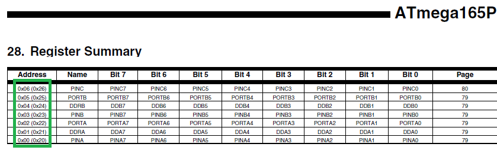

**Wat is hier het reden en doel van?**

We kunnen het totale DATA geheugen zien als een opeenstapeling van 4 blokken geheugens.  
Uiteraard ligt de referentie of het “nulpunt” dan bij het eerste register van het General Purpose Register File.  
Deze referentielijn noemen wij de referentie lijn voor register gebruik. Dit GPR file is 32 registers (0x1F)
groot. De volgende blok is het 64 registers grote I/O geheugen, dat begint, indien we de register referentielijn beschouwen, op 0x20 en eindigt op 5F.  
We kunnen ook het I/O geheugen op zichzelf beschouwen. Dan wordt onze referentie, het startpunt vanwaar we beginnen te tellen, de I/O referentielijn. Het bereik van dit blok is nu 0x3F groot, begint op 0x00 en eindigt op 0x3F. De volgenden figuur geeft dit grafisch weer:

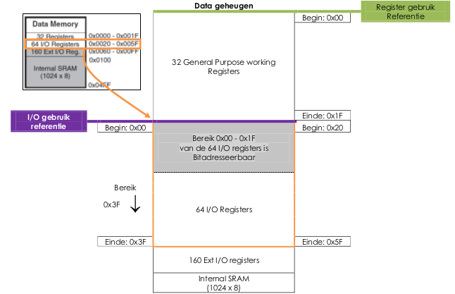

Waarom dit ondescheid?

**A. I/O gebruik**  
Indien de registers gebruikt worden als I/O, het oorspronkelijke doel waarvoor deze ontworpen zijn, dan dient de instructie IN/OUT gebruikt te worden. De adressering gebeurt dan tov de I/O referentie en men gebruikt dus de linkse adressering uit de register tabel.  
Het bereik van 0x00 tot 1F is BIT adresseerbaar.  
**B. Register gebruik**  
Indien deze I/O registers benaderd worden als onderdeel van het totale Data geheugen (variabelen en dergelijke), dan moet men andere instructies gebruiken, namelijk LD en ST. Nu moet men bij elk registeradres 0x20 optellen (adreswaarde tussen haakjes)  
Al deze I/O locaties kunnen, teneinde datatransport tussen de 32 General Purpose working registers en de I/O geheugenruimte te verzorgen, bereikt worden met de instructies ST / STS / STD / LD / LDS /LDD (zie eerder, of datasheet).  

> Opmerking
> Dit I/O en register gebruik is zeer verwarrend en wordt als extra informatie meegegeven. Dit onderscheid is enkel van belang wanneer men assembler gaat
programmeren. In het hoofdstuk Embedded C zal aan de hand van het “Hello World”
voorbeeld programma duidelijk worden hoe we deze registers gaan gebruiken.  

#### General Purpose Registers.  

Zoals eerder besproken bezit de ATmega165P controller een ingewikkeld kloksysteem. Een schematisch overzicht is hieronder weergegeven. Op een bepaald moment zal elke klok eens actief zijn. De niet-gebruikte klokken kunnen, teneinde het verbruik te verlagen, in een slaapmodus geplaatst worden.  
Dit powermanagement valt echter buiten het doel van deze cursus en is volledig beschreven in de datasheet.

Deze registers bevinden zich op volgende adressen:
* GPIOR0: 0x1E (0x3E)
* GPIOR1: 0x2A (0x4A)
* GPIOR2: 0x2B (0x4B)  

### De systeemklok en klokopties  

Zoals eerder besproken bezit de ATmega165P controller een ingewikkeld kloksysteem. Een schematisch overzicht is hieronder weergegeven. Op een bepaald moment zal elke klok eens actief zijn. De niet-gebruikte klokken kunnen, teneinde het verbruik te verlagen, in een slaapmodus geplaatst worden. Dit powermanagement valt echter buiten het doel van deze cursus en is volledig beschreven in de datasheet.

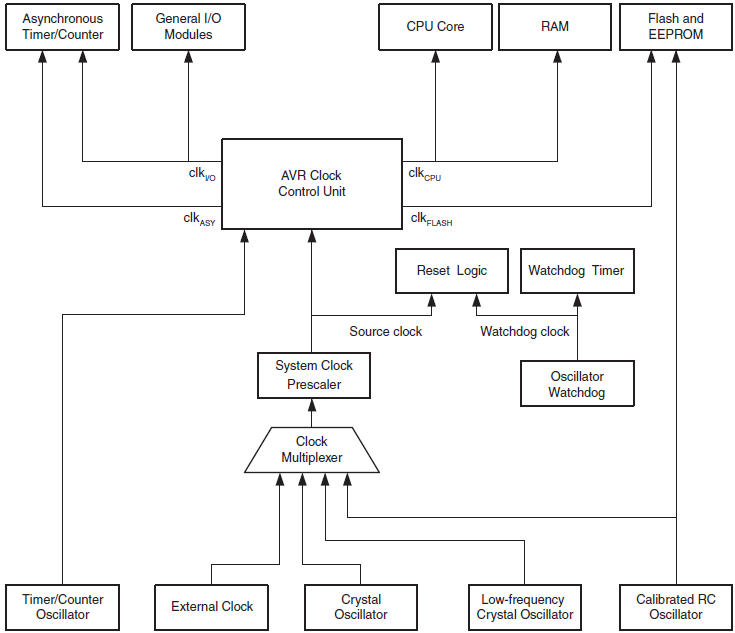

**CPU klok (clk cpu )**  
Alle componenten die betrokken zijn bij de werking van de AVR CPU core werking ontvangen deze klok. Hierbij denken we bijvoorbeeld aan het General Purpose Register file, het status register, het datageheugen dat de Stackpointer bevat. Indien deze klok onderdrukt wordt dan zal de CPU er van weerhouden worden om algemene operaties en berekeningen uit te voeren.

**I/O klok (clk I/O )**  
De meerderheid van de I/O modules, zoals timers/tellers, SPI en USART gebruiken deze klok. Alsook wordt ze gebruikt door de Externe interrupt module.  

**Flash klok (clk FLASH )**  
Deze klok loopt doorgaans synchroon met de CPU klok. Ze beheert het gebruik van de flash interface.  

**Asynchrone Timer klok (clk ASY )**  
De asynchrone timer klok staat toe dat de asynchrone timer/teller direct vanaf een externe klok of extern 32kHz crystal klok wordt geklokt.  
Dit specifiek klok domein staat toe om de timer/teller als real-time teller te gebruiken.  

**ADC klok (clk ADC )**  
De analoog-digitaal convertor heeft een eigen klok domein. Dit moet ruis, gegenereerd door het digitaal circuit, verminderen en een dus een meer accurate conversie teweeg brengen.

#### Klokbronnen

Er zijn verschillende manieren waarop we een klok kunnen genereren voor onze controller. Zo kunnen we bijvoorbeeld een externe klok die "éénen" en "nullen" produceert, een extern kristal of keramiek oscillator aansluiten.  
Onze microcontroller bezit zelfs een ingebouwde RC trillingsgenerator.  

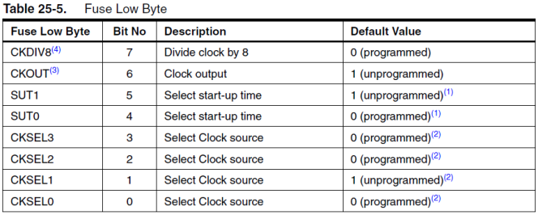

Men kan aan de hand van de zogenaamde fuse bits softwarematig kiezen welke klok er gebruikt wordt.  
Via de Fuse Low byte kan de gewenste klok geselecteerd worden.  
De bits die hiervoor moeten worden aangepast zijn de bits Select clock source CKSEL 3 t.e.m. 0.  
De klok van de geselecteerde bron is de input voor de AVR klok generator.

|Device Clocking Option |  CKSEL3 t.e.m. 0 |
|-----------------------|------------------|  
|External Crystal/Ceramic Resonator|1111 - 1000|
|External Low-frequency Crystal|0111 - 0110|
|Calibrated Internal RC Oscillator|0010|
|External Clock|0000|
|Reserved|0011, 0001, 0101, 0100|

Fabrieksnieuw is de controller ingesteld met volgende fusebits:
* CKSEL = “0010” (Interne RC oscillator)
* SUT = “10” (maximale start-up tijd)
* CKDIV8 = “0” (De geselecteerde klok door 8 gedeeld = prescaler werking)  
(De prescaler bespreken we dadelijk verder)

Een maximale start-up tijd heeft als doel een stabiele controllervoeding te waarborgen alvorens instructies beginnen uit te voeren.  
Meer info mbt de “SUT” fuse bit is terug te vinden in de datasheet.

##### Keuzes in clock-controllers:

###### Interne RC oscillator (fuse bits CKSEL3...0 = “0010”)  
Deze oscillator, die geen externe componenten nodig heeft, genereert een kloksignaal van **+/- 8MHz** die bij levering door 8 gedeeld wordt. De frequentie is afhankelijk van de voedingsspanning VCC en de temperatuur. Om deze reden kan men deze oscillator voor een grotere nauwkeurigheid gaan hercalibreren via het Oscillator Calibration register OSCCAL. (meer info in datasheet)  

###### Kristal oscillator  
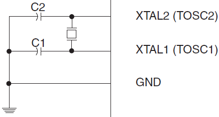

Via de penaansluitingen XTAL1 en XTAL2, die respectievelijk in- en uitgang zijn van een inverterende versterker, kan een quartz kristal of een keramische resonator aangesloten worden om een klok te genereren.  

|CKSEL 3...1|Frequentie bereik|C 1 en C 2 [pF]|
|-----------|-----------------|---------------|
|100        |0,4 – 0,9        | -             |
|101        |0,9 – 3,0        |12 - 22        |
|110        |3,0 – 8,0        |12 – 22        |
|111        |8,0 –            |12 - 22        |

Indien een kristal met lage frequentie gebruikt wordt dient men rekening te houden met
vervangingsweerstanden.  
Meer technische info hieromtrent is terug te vinden in de datasheet.

###### Externe klok (fuse bits CKSEL3...0 = “0000”)  
Fuse bits: 0000  
XTAL1 = Extern klok signaal  
XTAL2 = niet aangesloten  
Frequentiebereik = 0-16MHz  

###### Welke klok kies ik?  
Dit hangt af van meerdere factoren.  
Indien hoge nauwkeurigheid een must is, dan gebruikt men best de externe klok of kristal.  
Indien de kost laag moet blijven dan kan men de interne oscillator of de keramische resonator gebruiken.  
Deze laatste zijn uiteindelijk ook de meest makkelijke oplossingen.

##### Clock output  

Wederom met behulp van een fuse bit, namelijk CKOUT, kunnen we de systeemklok naar buiten brengen om zo ook andere apparaten aan te kunnen sturen die buiten de controller liggen.

##### De system klok prescaler  

Om de systeemklok frequentie te kunnen verlagen en om zo eveneens het verbruik, op niet-kritische momenten, te reduceren kunnen we een prescaler gebruiken.  
Deze prescaler kan de klokfrequentie delen door 1,2,4,8,16,32,64,128 of 256.  
De prescaler kan worden ingesteld door:  
* de fuse bit CKDIV8 enerzijds en door (delen door 8)
* het klok prescale register CLKPR (adres 0x61)anderzijds. (delen door 1,2,4,16,32, 64,128 of 256)

Deze prescaler gaat in combinatie met alle klok mogelijkheden en zal invloed hebben op de klokfrequentie van de CPU en alle synchrone randapparatuur.  
De voorheen besproken kloksignalen clk I/O , clk ADC , clk CPU , en clk FLASH worden allemaal gedeeld door de gekozen factor.  

Het prescale register bevat volgende bits (zie datasheet)  
* **Bit 7: CLKPCE:** Clock Prescaler Change Enable  
1 = wijzigingen op CLKPS bits toestaan  
* **Bit 3...0: CLKPS:** Clock Prescaler Select Bits  
Met deze bits wordt de gewenste schaal factor gekozen.  

|CLKPS|CLKPS|CLKPS|CLKPS|Deel factor|
|-----|-----|-----|-----|-----------|
| 0   | 0 | 0 | 0 | 1   |
| 0   | 0 | 0 | 1 | 2   |
| 0   | 0 | 1 | 0 | 4   |
| 0   | 0 | 1 | 1 | 8   |
| 0   | 1 | 0 | 0 | 16  |
| 0   | 1 | 0 | 1 | 32  |
| 0   | 1 | 1 | 0 | 64  |
| 0   | 1 | 1 | 1 | 128 |
| 1   | 0 | 0 | 0 | 256 |

**Voorbeeld:**  
we sluiten een kristal van 8MHz aan, de fuse bit CLKDIV8 laten we ongeprogrammeerd (=”1”).  
In het prescale register (CLKPR) zetten we de prescale register select bits (CLKPS3...0) op “00010”.  
De prescale factor is nu 0,25 (delen door 4). De systeemklok wordt 2Mhz  

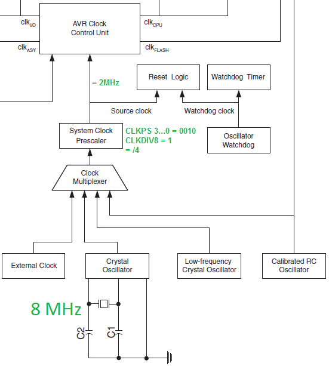

> Opmerking:  
> De fuse bit CKDIV8 bepaalt de initiële waarde van de CLKPS bits.  
* CKDIV8 = “1” = fuse bit ongeprogrammeerd => CLKPS = “0000”  
* CKDIV8 = “0” = fuse bit geprogrammeerd   => CLKPS = “0011” = klok delen door 4 bij
opstarten  

> Bij het wijzigen van de prescale factor tijdens programma uitvoer moet men
voorzichtig te werk gaan. Tijdens deze cursus gaan we deze procedure niet gebruiken.
De in acht te houden zaken zijn beschreven in de datasheet (p33)
