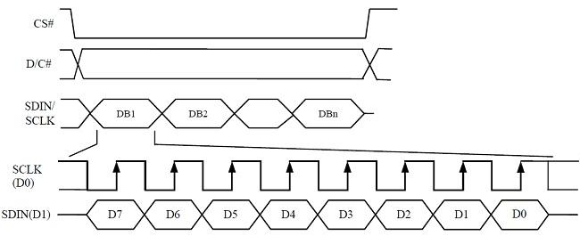
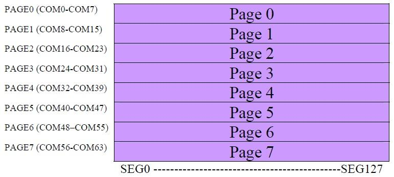
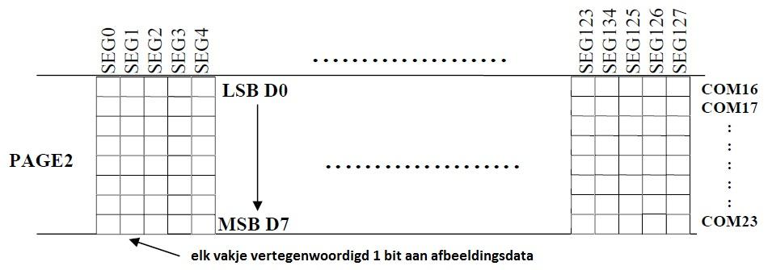
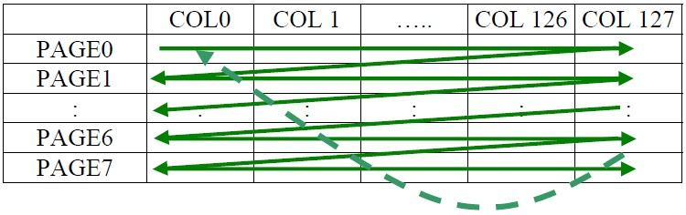
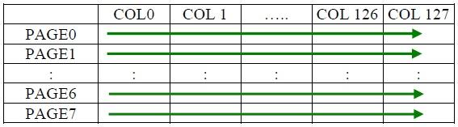

## SPI op de Pmod Oled

Serial data in (MOSI) wordt in een 8-bit shift register geschoven, MSB eerst, LSB laatst.
Gelijktijdig met de LSB (D0) wordt D/C (data/commando) gesampled en naar het juiste register geschreven (display data RAM of Commando register).

Zoals te zien op bovenstaande figuur, is het niet belangrijjk of de klok hoog dan laag is in rust (CPOL).
Wel moet de data worden ingelezen op de rising edge en moet de transitie plaats vinden op de falling edge (CPHA).
Daarom zullen we kiezen voor CPOL = 0 en CPHA = 0. Dit is handig omdat het de default waarden zijn in het Atmega SPI register en we dus niets hoeven in te stellen.

De CS# ingang is de SS (of slave select) uitgang van de microcontroller die hier als chip select wordt benoemd, deze is ook actief laag.

Met de D/C# ingang wordt bepaald of we een commando of data versturen. Indien we een commando versturen moet deze ingang laag zijn, indien we data versturen naar het GDRAM moet deze ingang hoog zijn.

### De PMOD Registers

#### Graphic display data RAM (GDDRAM)

Het GDDRAM is een statische RAM, met als inhoud de bitmap van de te vertonen afbeelding.  
De grootte van het RAM is 128 x 64 bits en is onderverdeeld in 8 pagina’s (page 0 tot page 7).

Aangezien we een 128X32 display gebruiken, maar de contoller voorzien werd om een 128X64 display aan te sturen, zullen we bij het initialiseren moeten instellen dat Page 3 de laatste pagina is.

Als er een databyte wordt geschreven in het GDDRAM, zal de imagedata van alle rijën die overeenkomen met de huidig geselecteerde kolom op de huidige pagina worden overschreven met nieuwe data. D0 wordt in de bovenste rij geschreven, D7 in de onderste.

Er zijn 3 adresserings modes voor het GDDRAM nl.:
* Horizontal adressing mode
* Vertical adressing mode
* Page adressing mod

##### Horizontal adressing mode

Wanneer de horizontale adressering mode is ingesteld, zal de kolom adres pointer telkens met 1 verhoogd worden wanneer er data naar het GDDRAM verstuurd wordt.
Als de kolom adres pointer het eindadres van de kolommen bereikt heeft zal de adres pointer terug naar 0 gereset worden en zal de pagina adres pointer met 1 verhoogd worden. Dit gaat zo door tot wanneer de eindpagina bereikt wordt, dan zal ook de pagina pointer gereset worden naar 0.

##### Vertical adressing mode

Wanneer vertical adressing mode geselecteerd is zal de pagina adres pointer telkens worden verhoogd tot aan de eindpagina, bij het bereiken van de eindpagina wordt deze pointer gereset naar 0 en wordt de kolom pointer geïncrementeerd.  
Wanneer de kolom pointer aan de eindwaarde komt wordt deze op zijn beurt gereset naar 0.

##### Page adressing mode

Indien page adressing mode geselecteerd is wordt de kolom adres pointer steeds van begin -tot eindkolom geïncrementeerd om dan opnieuw gereset te worden naar de begin waarde.
De pagina blijft dezelfde en moet softwarematig verzet worden indien gewenst.

### De PMOD Registers

De SSD1306 heeft een uitgebreide commando set, deze commandos zijn in de datasheet goed gedocumenteerd. Daarom verwijzen we voor een compleet overzicht naar deze datasheet.
