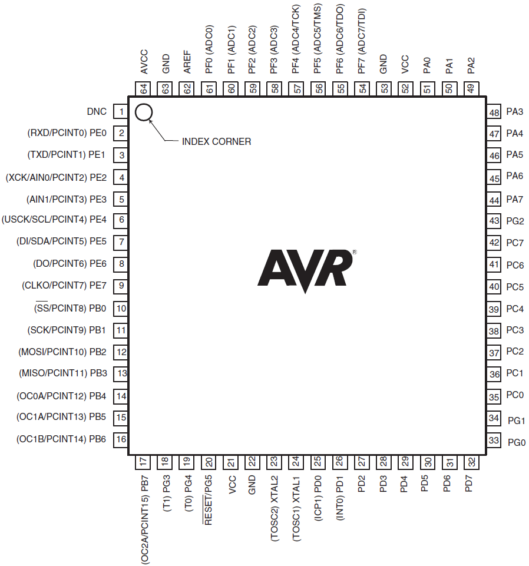

introductie: getting started (programmeren en omgeving)
content:
    wat is wat
    mcu vs computer (bekenste elementen)
    diepgang voor later
  tools leren kennen (command line en toolchain)
  principe copy/paste en een led doen blinken
resultaat:
* men begrijpt wat een mcu

# Basis van programmeren
content:
* variabelen en expressies
* condities
* loops
resultaat:
* men kan een eenvoudig command-line schrijven

met bits spelen
  getal-representaties

met pointers spelen

structs
macros

# memory (soorten memory in c)
* stack
* heap

diepgang:
  steek eens zelf een mcu in elkaar
resultaat:
  herhaling van

<!--- Comment -->

# Introductie
## Wat is een microcontroller?
### waar worden microcontrollers voor gebruikt

* Hoe zit een computer-systeem in elkaar
* Een microcontroller is een computer-systeem maar een heel klein

### hoe zit een microcontroller in elkaar
* wat is de werking van een microcontroller (10.000 mile-view)
* 8-bit
* categorien en voorbeelden

# Getting started: programmeren
## Basis van programmeren  (1ste kennismaking)
### Wat is programmeren
### Wat zijn de typische basis-elementen van een programma (producereel)
* input, output, variabelen,condities, loopen, functies en procedures
* illustratie met scratch
* events (later vergeleken met interrupts)

### Oefening en illustratie met scratch

## Basis van programmeren - elementen

### van code naar programmeren (x86)
* uitvoeren van een programma
* mains (unit-testen volgt later)

### hoe werkt een programma
* instructies
* gecodeerd als een sequenties van bits en bytes

### process and tools - X86
* code (c)
* build
* test
* deploy

### tools
* command-line
* ide
* toolchains en builds

### inleiding in c
* io
* variabelen en types
* basis-programma in C (1ste opdracht in C)

# Toolchain en uitrusting
## setup van programmeer-omgeving
## toolchaining
## Elektronica
* Breadboard opbouwen?
* Osciloscoop
* Voltmeter
* Programmer

## command-line
## make
## editors en ide's
## simulatie
## Coding process
* process and tools - AVR
* code (c)
* build (make and avr-gcc)
* test (cunit)
* deploy (avrdude)

compilen:

    avr-gcc -g -Os -mmcu=atmega165p -c test.c
    avr-gcc -g -mmcu=atmega165p -o test.elf test.o
    avr-objcopy -j .text -j .data -O ihex test.elf test.hex

deployen:

    avrdude -c dragon_jtag -p ATmega165P -U flash:w:test.hex

# Bits en bytes
* integer-types
* geheugen-adressen
* pointers intro (week daarna extended)
* registers
  * Registers (“special function registers”) are fixed memory
  * locations with side-effects
* bit-masking

# Loops en arrays

# Pointers

# Micro-controller-architectuur
* Interne opbouw van processoren
* Interne opbouw van controllers

## Avr
## Instructieset
## Voorbeeld Arduino
AVR-architectuur

## Samenstelling van mcu
## Lezen van datasheet (oefening maken)

# Timers en interrupts

# Seriele communicatie
## UART
communicatie met computer

## I2C

## SPI

# Analoog
## PWM
motoren

## ADC

# Macros

# bekijken van buitenuit
* Sourcen en sinken
* Fuse-bits

# Verder gaan met programmeren
## defensive programmeren
* be nice to your readers, write readable code
* defensive

## modulariteit
* interfaces vs mocks vs stubs

## design
* wanneer complexiteit
* kappen in stukjes die oplosbaar zijn en onderhoudbaar zijn
* hoe functies, modules, klasses, objecten, ...
* SOLID

# sensors
* soorten
* gebruik
* sensor-netwerken
* tablets

# debuggen
debugserver:

    avarice --dragon --ignore-intr --jtag usb --file test.hex :4242
debuggen:

    avr-gdb test.elf

# verder gaan operating systems
* operating systems
* command line (basis of bash)

# extra projecten
    met database werken
