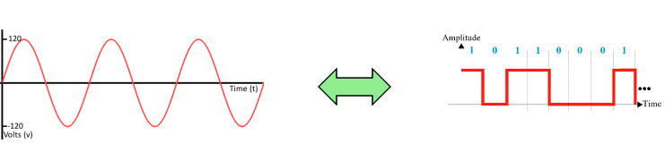

# Analoog vs digitaal

1 van de redenen waarom we met microcontrollers werken (naast het feit dat ze in bijna elke elektronische schakeling worden verwerkt) is het connecteren van onze code naar de **echte wereld**.
Veel van deze echte wereld is **analoog**:

* Elektrische spanning en stroom
* Geluid, radio en andere signalen
* Licht, warmte
* ...

In dit deel van de cursus gaan we 2 mechanismes/technieken kijken die aanwezig zijn in de meeste moderne microcontrollers:

* ADC (of **A**nalog **D**igital **C**onversion)
* PWM (of **P**ulse **W**idth **M**odulation)
