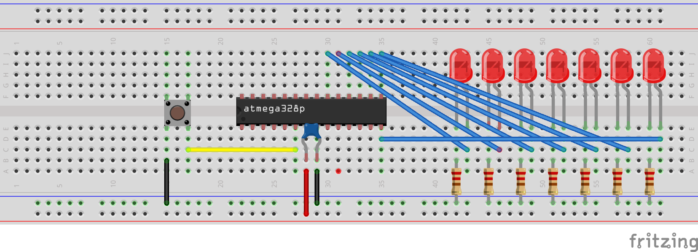
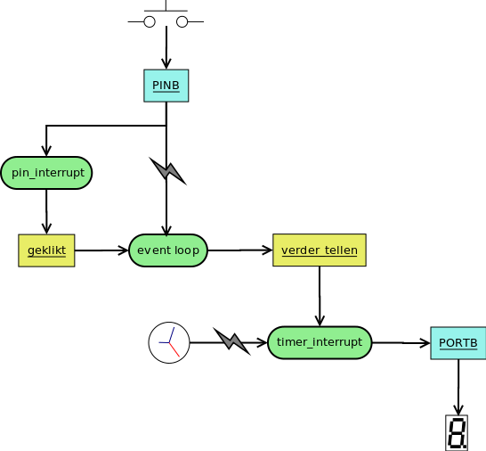

## Asynchroon programmeren (interrupts en timers)

Met de 2 nieuwe technieken (interrupts en timers) die we hebben geïntroduceerd hebben we ook een nieuw programmeer-paradigme geleerd, namelijk asynchroon programmeren.

Met dit paradigme komen ook nieuwe uitdagingen en problemen.  
Daarom gaan we - op basis van een voorbeeld - een aantal richtlijnen en aandachtpunten belichten.

### Opstelling: 8 leds en button

We gaan voor het merendeel van de punten uitleggen aan de hand van hetzelfde voorbeeld.  
Voor dit voorbeeld gebruiken we dezelfde opstelling die we hebben gebruikt voor de timers:



### Voorbeeld: meerdere interrupts gebruiken

We bouwen verder op 1 van de voorbeelden uit het timer-hoofdstuk:

* Een teller
* Verhoogt elke seconde
* De waarde van deze teller wordt via bank B op de leds getoverd

We voegen echter nieuwe functionaliteit aan toe:

* De teller stoppen en starten met op een button te drukken
* We gebruiken een interrupt hiervoor

> **Nota:**   
> Om de code wat leesbaarder hebben we de configuratie-code wat verdeeld over een aantal procedures.  
> (tip: als je niet meer weet wat het verschil is tussen een functie en een procedure ga je best in het hoofdstuk van functies kijken)

```c
#include <avr/io.h>
#include <util/delay.h>
#include <avr/interrupt.h>

# define TICKS_OM_AAN_SECONDE_TE_RAKEN      15625

volatile int verder_tellen = 1;
volatile int geklikt = 0;

void configureer_leds()
{
      DDRB = 0xFF;
}

void configureer_timer()
{
    TCCR1B |= (1 << CS10) | (1 << CS12);
    TCCR1B &= ~ (1 << CS11);

    TCCR1B &= ~(1 << WGM13);
    TCCR1B |=  (1 << WGM12);
    TCCR1A &= ~((1 << WGM10) | (1 << WGM11));

    OCR1A = TICKS_OM_AAN_SECONDE_TE_RAKEN;
    TIMSK1 |= (1 << OCF1A);
}

void configureer_button()
{
    PORTD |= (1 << PD4);
    PCICR |= (1 << PCIE2);
    PCMSK2 |= (1 << PCINT20);
}

int main(void)
{
    configureer_leds();
    configureer_timer();
    configureer_button();
    sei();

    while (1) {
      if(geklikt) {
          _delay_ms(500);
          if(PIND & (1 < PD4)) {
              verder_tellen=!verder_tellen;
          }
          geklikt=0;
      }
    }
    return 0;
}

ISR(TIMER1_COMPA_vect)
{
    if(verder_tellen) {
        PORTB = PORTB + 1;
    }
}

ISR(PCINT2_vect)
{
    if(PIND & (1 < PD4)) {
        geklikt=1;
    }
}
```

Wat is er veranderd in de code?

* **Meerdere interrupts** worden geactiveerd en gecombineerd (pin en timer)  
  Tot nog toe werkten we met 1 interrupt tegelijk.
* De pin-interrupt zal een globale **variabele "geklikt"** op 1 zetten  
  Deze wordt gebruikt als **communicatie** tussen de "pin-interrupt" en de "event loop"
* De **event loop** zal deze variabele inspecteren  
  om te weten of hij verder mag tellenn en andere **variabele "verder_tellen"** op 1 zetten
* Deze variabele wordt door de **timer** gebruikt of hij mag **verder tellen of niet**
* Deze 2 variabelen worden voorafgegaan door het keyword **volatile**  
  (we komen hier direct op terug)



### Duiding: communicatie tussen processen

Belangrijk te onthouden is dat dit programma 3 stukken code bevat die onafankelijk van elkaar een bepaalde taak uitvoeren.  
Om met elkaar te communiceren gebruiken deze 3 **"processen"** globale variabelen (verder_tellen en geklikt).  

Het concurentieel gebruik van data tussen verschillende processen

### Duiding: interrupts zijn timing gevoelig

* Interrupts moeten daarom **korte atomaire acties** zijn:  
* Vermijden van blokkeren van code
* Algemeen patroon je code gaat enkel variabelen gaan bewerken
* Oppassen met shared state
* Niet overdrijven met interrupts
* Stack ... (gewoon voorstellen als circels of een stapel ...)

Volgend hoofdstuk gaat over geheugen pointers ...

Een interrupts is **timing**-gevoelig

Gebruik van het keyword **volatile**

Gebruik interrupts wijs

Pattroon:

3de deel van timers en interrupts:

activeren van timers
starten van timer
gebruik van volatile
waarschuwing wees spaarzaam met
