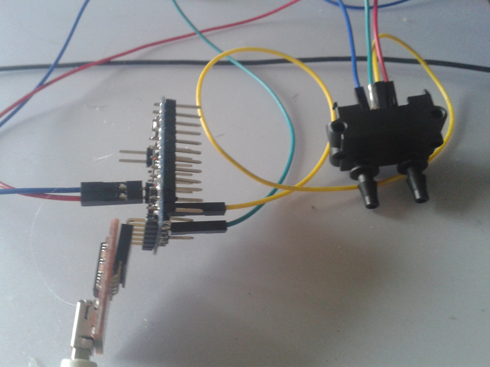

## I2C/TWI op de AVR

AVR geeft vanzelfsprekend support voor **i2c**, hoewel dat je deze **naam niet** zal terugvinden in de **datasheet**.  
De naam die AVR gebruikt is TWI, wat staat voor "two wire interface".  
Dit is zo omdat NXP (vroeger deel van Philips) licentie-kosten vereist voor het gebruik van de naam ```I2C```

### TWI-registers op de AVR

De TWI-hardware kan je besturen via een aantal register-adres:

* Configuratie: TWCR en TWBR
* Status: TWSR
* Data: TWDR

**TWCR: (control register)**  
Controleert de werking van TWI:

* Inschakelen van TWI
* Start en stop
* ACK en NACK

**TWBR: (bit rate register)**  

* Bepaalt de bit-rate voor de master rate volgens de formule

```
F(scl) = F(cpu) / (16 + (2 * TWBR * prescaler))
```
In het hieropvolgend code voorbeeld komt dit neer op +-
```
F(scl) = 16Mhz / (16 + (2 * 32 * 1)) = ~229 Mhz
```

**TWDR: (data register)**  

* Buffer voor verzonden of ontvangen data  
* 1 byte lang

**TWSR: (status register)**

* 5 MSB bevatten status
* 2 LSB kan je gebruiken voor de prescaler (ter aanvulling van bit-rate)

> **Nota:**    
> Omdat we niet de datasheet willen herhalen laten we het aan de student om de voorgaande principes en code te bekijken aan de hand van de datasheet (MCU en sensor)

### Voorbeeld: voorbeeld-code voor het lezen  

Hieronder hebben een voorbeeld van het gebruik van een sensor, namelijk de SDP600 van sensirion.  

Dit is een sensor die "differential pressure" (luchtverplaatsing) opmeet en zijn resultaat ter beschikking stelf via een ```I2C```-interface.



In dit geval is deze sensor geconnecteerd op een arduino mini pro van 8mHz gezien de sensor op 3.3 v werkt.  
Dit is het geval voor de meeste sensors dus bij een 5 v MCU is het aangeraden van een "logic convertor" te gebruiken die 5 v-signalen omzet naar 3.3 v en omgekeerd.

Het programma zal de data (buffer) en geconverteerde data daarna doorsturen.  


```c
#include <util/delay.h>
#include <util/twi.h>
#include <avr/io.h>
#include <avr/interrupt.h>
#include "serieel.h"

#define SCL_PORT    PORTC   
#define SCL_BIT     PC5
#define SDA_PORT    PORTC
#define SDA_BIT     PC4

#define LOOP_TOT_BIT_SET(sfr, bit) do { } while (bit_is_clear(sfr, bit))

#define ADRESS_SDP600                                  0x40
#define COMMAND_FOR_DIFFERNTIAL_PRESSURE_WITH_HOLD     0xF1

int main(void) {
    serieel_initialiseer();
    _delay_ms(11);

    SCL_PORT |= 1 << SCL_BIT;   // pull up op TWI-clock-lijn
    SDA_PORT |= 1 << SDA_BIT;   // pull up on TWI-data-lijn
    TWBR = 32;                  // 8MHz / (16+2*TWBR*1) ~= 115kHz

    TWCR |= (1 << TWEN);        //activatie

    while (1) {

        //ST
        TWCR = ((1 << TWINT) | (1 << TWEN) | (1 << TWSTA));
        LOOP_TOT_BIT_SET(TWCR, TWINT);

        //SAD+W
        TWDR = (ADRESS_SDP600 << 1) + 0;
        TWCR = ((1 << TWINT) | (1 << TWEN));
        LOOP_TOT_BIT_SET(TWCR, TWINT);

        //SUB
        TWDR = COMMAND_FOR_DIFFERNTIAL_PRESSURE_WITH_HOLD;
        TWCR = ((1 << TWINT) | (1 << TWEN));
        LOOP_TOT_BIT_SET(TWCR, TWINT);

        //RT
        TWCR = ((1 << TWINT) | (1 << TWEN) | (1 << TWSTA));
        LOOP_TOT_BIT_SET(TWCR, TWINT);

        //SAD+R
        TWDR = (ADRESS_SDP600 << 1) + 1;
        TWCR = ((1 << TWINT) | (1 << TWEN));
        LOOP_TOT_BIT_SET(TWCR, TWINT);

        unsigned char buffer[3];

        //Leesmodus (met ACK)
        TWCR = ((1 << TWINT) | (1 << TWEN) | (1 << TWEA));
        LOOP_TOT_BIT_SET(TWCR, TWINT);
        buffer[0] = (TWDR);

        //Leesmodus (met ACK)
        TWCR = ((1 << TWINT) | (1 << TWEN) | (1 << TWEA));
        LOOP_TOT_BIT_SET(TWCR, TWINT);
        buffer[1] = (TWDR);

        //Leesmodus (met NACK)
        TWCR = (1 << TWINT) | (1 << TWEN);
        LOOP_TOT_BIT_SET(TWCR, TWINT);
        buffer[2] = (TWDR);

        //omvormen naar sensor-waarde
        int val;
        val = buffer[0];
        val <<= 8;
        val += buffer[1];
        val &= 0xFFFC;

        //versturen van de data
        serieel_verstuur_getal(buffer[0]);
        serieel_verstuur_string(" - ");
        serieel_verstuur_getal(buffer[1]);
        serieel_verstuur_string(" - ");
        serieel_verstuur_getal(buffer[2]);
        serieel_verstuur_string(" - ");
        serieel_verstuur_getal(val);
        serieel_verstuur_string("\n\r");
        _delay_ms(1000);
    }
    return 0;
}
```
