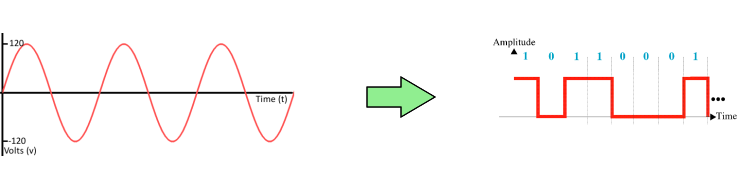
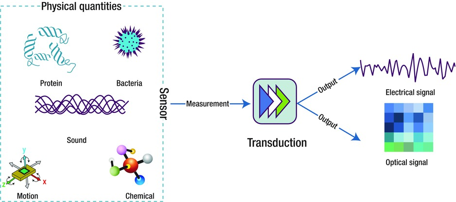
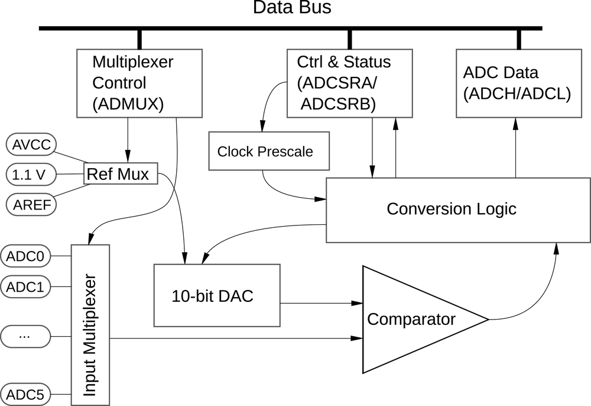
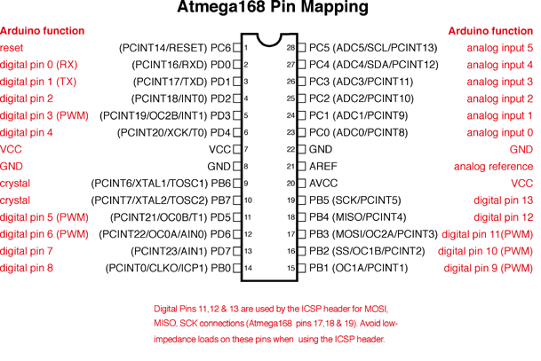
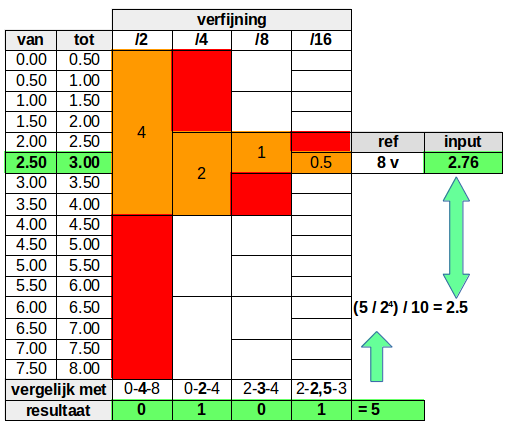
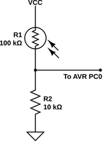
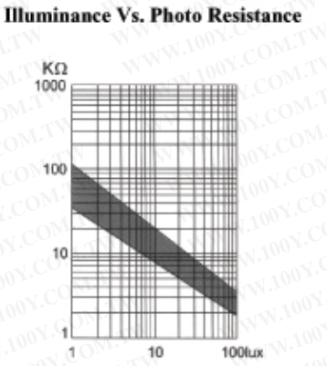
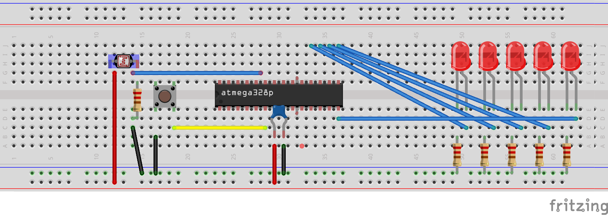
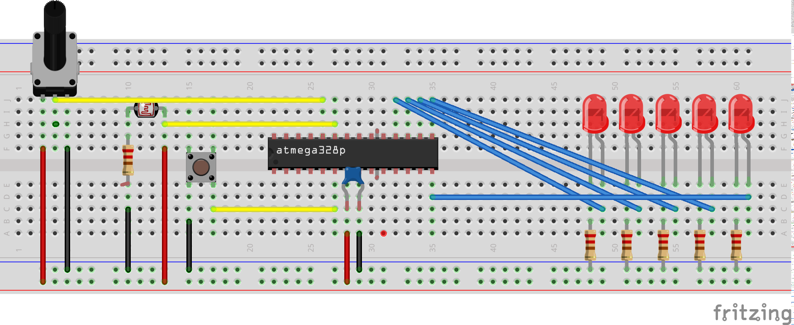

## ADC



In dit hoofdstuk introduceren we **ADC** (en hoe dit wordt toegepast op de AVR-mcu's)

Het waarnemen van waarden uit de **"echte wereld"** gebeurt in elektronica via **sensors**, bijvoorbeeld:

* Beweging
* Licht
* Acceleratie
* Geluid
* ...


Zulke sensors zullen:

* via een chemisch, mechanisch, optisch, ... proces
* metingen uitvoeren
* in de meeste gevallen worden deze metingen waarden dan **omgezet**
* naar een **analoog** elektronisch signaal.  



Deze elektronische (analoge) signalen moeten door de **digitale** processoren van onze microcontrollers (AVR, ARM, PIC,...) omgezet worden in discrete getallen en bytes.  
Om dit te kunnen uitvoeren gebruiken we ADC (ofwel **A**nalog **D**igital **C**onversion), een mechanisme dat samples van een analoog signaal zal nemen en deze omrekenen naar een discrete waarde.


### Duiding: ADC-hardware

Om deze taak (ADC) uit te voeren bevat de AVR heel wat hardware
Onderstaande tekening geeft een overzicht van de ADC-architectuur van de AVR:  
(geen paniek, het is niet zo moeilijk als het er uit ziet)



De 2 belangrijkste/centrale onderdelen hiervan zijn:

* **DAC** (Digital to Analog Converter)  
  Deze **gegenereert** een **spanning** relatief aan een **referentie**-spanning   
  Deze DAC werkt met een precisie van 10 bit
  (**AREF**)
* **Comparator**  
  Deze **vergelijkt** de spanning gegenereerd door de DAC met een **input**-spanning  

2 spanningen dienen er aangelegd te worden om met ADC te werken:

* **Referentie-spanning**  
  Dit is een spanning waartegen we andere input-spanningen gaan vergelijken.  
  Het resultaat dat we verkrijgen bij ADC zijn concrete spannings (in volt) maar eerder een waarde relatief aan deze referentie.  
  Deze referentie-spanning wordt (meestal) afgeleid van de **AREF**-input-pin
* **Input-spanningen**  
  Dit zijn input-kanalen waar men een spanning kan aanleggen.  
  Hoewel we maar 1 DAC en Comparator hebben kunnen we door middel van **multiplexing** meerdere kanalen samplen/meten  
  Deze input-kanalen zijn beperkt tot de pinnen **ADC0** tem **ADC5** (6 in totaal)

Bij de AVR ga je deze vergelijkingen tegen een specifieke snelheid meten.  
Deze snelheid wordt bepaald door een klok, die wordt afgeleid van de systeem-klok via een **prescaler** (vergelijkbaar mechanisme dat we ook bij de timers hebben gezien).

> **Nota:**  
> De DAC kan maar werken tussen een minimum en maximum snelheid.  
> Zoek in de datasheet deze waardes (hint, kijk in de uitleg ivm de prescaler)  



### Duiding: succesive aproximation

Hoe werken deze onderdelen samen?  
Het antwoord ligt in een mechanisme/proces dat men **"succesive aproximation"** noemt (zie alsook datasheet).  
Eénvoudig gezegd is eigenlijk een intelligente manier van het benaderen van een specifieke input-spanning tov een referentie-spanning.

We leggen dit uit aan de hand van een voorbeeld (cijfers abritrair gekozen):

* De referentie-spanning is 8 v
* De input is 2.76
* Het resultaat van onze meting wordt opgevangen in een 4 bit register  
  (in werkelijkheid is het een 10-bit register)



Succesive zal een aantal **opeenvolgende stappen** nemen om tot een schatting te geraken:

* **Stap 1:**    
  De DAC genereert een spanning die in het midden ligt **tussen 0 v en 8 v** (8v referentie-spanning), namelijk **4 v**.  
  De comparator oordeelt dat de spanning ```2.76 v < 4 v``` en schrijft een **0** naar de **1ste MSB-bit**.  
  We weten nu dat de spanning  ```0 >= 2.76 v <= 4 v``` !!
* **Stap 2:**  
  De DAC genereert een spanning die **tussen 0 v en 4 v** ligt, namelijk **2 v**   
  De comparator oordeelt dat de spanning ```2.76 v > 2 v``` en schrijft een **1** naar de **2de MSB-bit**   
  We weten nu dat de spanning ```2 >= 2.76 v <= 4 v``` !!
* **Stap 3:**  
  De DAC genereert een spanning die **tussen 2 v en 4 v** ligt, namelijk **3 v**   
  De comparator oordeelt dat de spanning ```2.76 v < 3 v``` en schrijft een **0** naar de **2de MSB-bit**   
  We weten nu dat de spanning ```2 >= 2.76 v <= 3 v``` !!
* **Stap 4:**  
  De DAC genereert een spanning die **tussen 2 v en 3 v** ligt, namelijk **2.5 v**   
  De comparator oordeelt dat de spanning ```2.76 v > 2.5 v``` en schrijft een **1** naar de **2de MSB-bit**   
  We weten nu dat de spanning ```2.5 >= 2.76 v <= 3 v``` !!  

Als we hier nu de volgende berekeningen op los laten:

```
Max-waarde 2 ^ 16       = 16
ADC        0101         =  5
Verhouding 16/5         =  0,3125
Spanning   0,3125 * 8 v =  2,5
```

#### Nauwkeurigheid

We hebben in dit geval de spanning kunnen bepalen met een nauwkeurigheid van ```0.5 V = 8 V / 2 ^ 4```

Om het voorbeeld éénvoudig te houden gebruikten we een 4 bit nauwkeurigheid , in werkelijkheid hebben we een 10-bit nauwkeurigheid (8 / 2 ^ 10 = 0,0078125).  
Als je dan de werkelijke waarde zou willen weten moet je de volgende formule toepassen:


### Setup: LDR en spannings-deling

Om een LDR te integreren de volgende relevante informatie rond de LDR:

* Een LDR is een variabele weerstand de weerstand
* Je maakt een spannings-deler met een weerstand
* De waarde van deze weerstand hangt af van het type LDR maar voor deze LDR wordt aangeraden van een 10 Kohm te gebruiken.



De LDR die we gebruikt hebben voor de cursus/oefening dient gebruikt te worden in combinatie met een weerstand van +- kOhm.  
Zie hier hieronder de relatie tussen de weerstand enerzijds (y-as) in functie van het aantal lux.



Bij +- 10 K ga je bij 10 lux een 50-50 spannings-deling krijgen.
De regel die algemeen bij LDR's wordt gebruikt is:  

```
R = vierkantswortel(R_ldr_min_licht * R_ldr_max_licht)
```

Voor meer info rond de LDR die we gebruiken in de cursus, de datasheet van deze LDR kan je vinden te:                                                                     
https://www.iprototype.nl/docs/ldr-technische-datasheet.pdf     


### Setup: LDR en Arduino

De code die we gaan schrijven werkt met de volgende opstelling



Deze setup gaan we gebruiken als volgt:

* De LDR gaat zijn weerstand en desgevolg de spanning wijzigen naargelang de belichting
* De AVR gaat dit opvangen via ADC0
* De AVR gaat de led gebruiken als een sterkte indicator.  
* 1 LED zal maar tegelijk branden
* Bij weinig licht gaan dit leds aan de rechterkant zijn (PB0 is meest recht).
* Hoe meer licht gaan dit verschruiven naar links  
* Hoe meer de LDR gaat branden gaat deze LED uit verschuiven naar

### Voorbeeld: enkelvoudige meting

Het eerste voorbeeld:

* **Enkelvoudige conversie:**  
  We geven vanuit de code telkens de opdracht om de **conversie** (sampling) uit te voeren.  
  Het tegengestelde is **free-running mode** waar de MCU continue de conversie gaat herstarten
* **Geen multiplexing:**  
  Enkel 1 input kanaal

(de rest van de functionaliteit als hierboven omschreven)


```c
#include <avr/io.h>
#include <util/delay.h>

#define LOOP_TOT_DAT_BIT_IS_GECLEARED(sfr, bit) while(sfr & (1 << bit)) {}
#define VAN_LED        0
#define TOT_LED        4
#define AANTAL_LEDS    5
#define PRECISIE       1024
#define DDR_BANK       DDRB
#define PORT_BANK      PORTB

void initialiseer_leds()
{
    int teller = VAN_LED;
    while(teller <= TOT_LED ) {
        DDR_BANK |= (1 << teller);
        teller++;
    }
}

void clear_van_leds()
{
    int teller = VAN_LED;
    while(teller <= TOT_LED ) {
        PORT_BANK &= (~(1 << teller));
        teller++;
    }
}

int main(void)
{

  unsigned char adc_geschaald_naar_aantal_leds;
  unsigned short adc_resultaat;

  ADMUX |= (1 << REFS0);                 // interne referentie van 5 v AVCC
  ADMUX &= 0xF0;                         // selecteer ADC0
  ADCSRA |= (1 << ADPS1) | (1 << ADPS2); // prescaler op /64
  ADCSRA |= (1 << ADEN);                 // activeer ADC

  initialiseer_leds();

  while (1) {

    ADCSRA |= (1 << ADSC);                       // start ADC-conversie
    LOOP_TOT_DAT_BIT_IS_GECLEARED(ADCSRA, ADSC); // loopen tot conversie gedaan
    adc_resultaat = ADC;                         // lees de 10 bit-waarde in

    //schalen naar een getal tussen 0 en 4
    adc_geschaald_naar_aantal_leds = (adc_resultaat * AANTAL_LEDS) / PRECISIE;

    clear_van_leds();

    PORT_BANK |= (1 << adc_geschaald_naar_aantal_leds);

    _delay_ms(50);
  }
  return (0);
}
```

Uit dit voorbeeld zijn er 7 lijnen code die relevant zijn naar ADC toe

De eerste 4 zijn bij de initialisatie van de ADC

```c
  ADMUX |= (1 << REFS0);                 // interne referentie van 5 v AVCC
  ADMUX &= 0xF0;                         // selecteer ADC0
  ADCSRA |= (1 << ADPS1) | (1 << ADPS2); // prescaler op /64
  ADCSRA |= (1 << ADEN);                 // activeer ADC
```

* De eerste lijn selecteert de referentie-spanning  
  In dit geval zal dit 5 v zijn, maar als je in de datasheet kijkt zal je ook zien dat je een externe spanning kan hangen op de AVCC-input-pin.
* De 2de lijn selecteert het kanaal waar me met werken (ADC0)
* De 3de lijn selecteert de prescaler van 64 (16Mhz / 64 =  250 Khzi)
* De 4de lijn activeert ADC op de AVR

> **Nota:**   
> De snelheid van 250 kKz is iets te snel volgens de specificaties maar werkt wel.  
> Corrigeer als oefening deze snelheid zodat deze met de specificaties (datasheet overeenkomt)

De volgende code bevindt zich in de event-loop en wordt bij elke conversie uitgevoerd

```c
    ADCSRA |= (1 << ADSC);                       // start ADC-conversie
    LOOP_TOT_DAT_BIT_IS_GECLEARED(ADCSRA, ADSC); // loopen tot conversie gedaan
    adc_resultaat = ADC;                         // lees de 10 bit-waarde in
```

* De eerste lijn zal een conversie starten
* De volgende lijn is een macro die blijft loopen zolang een specfieke bit niet gezet is  
  Als je deze macro niet verstaat kijk terug naar de hoofdstukken rond bitmasking en macros
* Nadat deze conversie gedaan is kan je het resultaat inlezen  
  (datatype van minimum 2 bytes nodig)

### Duiding: registers

Als extra duiding:  

* ADMUX wordt gebruikt voor selectie van input-spanningen:  
  Selectie van input-kanaal  
  Selectie van referentie-input
* ADCSR wordt gebruikt voor configuratie van:  
  Prescaler  
  Activatie  
  maar ook voor status-flags
* ADC bevat het resultaat van de conversie (10 bits in een 2 byte register)

### Voorbeeld: free-run

Het volgend voorbeeld is in free-run modus.  
Het grote verschil is dat je hier niet opnieuw manueel moet triggeren door middel van de
ADSC-bit.

```c
#include <avr/io.h>
#include <util/delay.h>

#define LOOP_TOT_DAT_BIT_IS_GECLEARED(sfr, bit) while(sfr & (1 << bit)) {}
#define VAN_LED        0
#define TOT_LED        4
#define AANTAL_LEDS    5
#define PRECISIE       1024
#define DDR_BANK       DDRB
#define PORT_BANK      PORTB

void initialiseer_leds()
{
    int teller = VAN_LED;
    while(teller <= TOT_LED ) {
        DDR_BANK |= (1 << teller);
        teller++;
    }
}

void clear_van_leds()
{
    int teller = VAN_LED;
    while(teller <= TOT_LED ) {
        PORT_BANK &= (~(1 << teller));
        teller++;
    }
}

int main(void)
{

  unsigned char adc_geschaald_naar_aantal_leds;
  unsigned short adc_resultaat;

  ADMUX |= (1 << REFS0);                 // interne referentie van 5 v AVCC
  ADCSRA |= (1 << ADPS1) | (1 << ADPS2); // prescaler op /64
  ADCSRA |= (1 << ADEN);                 // activeer ADC

  ADCSRA |= (1 << ADATE);                //auto-trigger

  initialiseer_leds();
  ADCSRA |= (1 << ADSC);                 // slechts 1 maal starten van ADC-conversie

  while (1) {

    //LOOP_TOT_DAT_BIT_IS_GECLEARED(ADCSRA, ADSC); // loopen tot conversie gedaan
    adc_resultaat = ADC;                         // lees de 10 bit-waarde in

    //schalen naar een getal tussen 0 en 4
    adc_geschaald_naar_aantal_leds = (adc_resultaat * AANTAL_LEDS) / PRECISIE;

    clear_van_leds();

    PORT_BANK |= (1 << adc_geschaald_naar_aantal_leds);

    _delay_ms(50);
  }
  return (0);
}
```

Het voorbeeld hier heeft 1 groot verschil, namelijk het je start maar 1 maal een conversie.  

```c
ADCSRA |= (1 << ADSC);                 // slechts 1 maal starten van ADC-conversie
```
is nu buiten de event-loop geplaatst

Hiervoor moet je wel de auto-trigger-mode activeren:

```c
ADCSRA |= (1 << ADATE);                //auto-trigger
```

### Setup: uitbreiding met potentio-meter

Om ons voorbeeld met multiplexing te kunnen tonen voegen we een potentio-meter toe.  
We gebruiken deze om een threshold-spanning op te bouwen om de leds te inverteren (stel je wilt een nachtlicht opbouwen)



### Voorbeeld: activeren van nacht-modus

Om multiplexing te kunnen tonen gebruiken we het volgende principe:

* We gebruiken 2 kanalen (1 voor potentiometer en 1 voor sensor)
* We gebruiken multiplexing om beide te lezen
* We vergelijken beide metingen met elkaar in de code
* Als de sensor een hogere waarde meet is het donker  
  dus belichten we alle leds buiten de indicator
* Als de sensor een lageren waarde meet is het licht  
  dus belichten we zoals de vorige voorbeelden enkel de indicator led


```c
#include <avr/io.h>
#include <util/delay.h>

#define LOOP_TOT_DAT_BIT_IS_GECLEARED(sfr, bit) while(sfr & (1 << bit)) {}
#define VAN_LED                 0
#define TOT_LED                 4
#define AANTAL_LEDS             5
#define PRECISIE                1024
#define DDR_BANK                DDRB
#define PORT_BANK               PORTB

#define SENSOR_KANAAL           MUX0
#define POT_METER_KANAAL        MUX1

void initialiseer_leds()
{
    int teller = VAN_LED;
    while(teller <= TOT_LED ) {
        DDR_BANK |= (1 << teller);
        teller++;
    }
}

void clear_van_leds()
{
    int teller = VAN_LED;
    while(teller <= TOT_LED ) {
        PORT_BANK &= (~(1 << teller));
        teller++;
    }
}

unsigned short lees_kanaal(unsigned char kanaal)
{
    ADMUX = ADMUX & (0xF0 | kanaal);             // selecteer ADC0
    ADCSRA |= (1 << ADSC);                       // start ADC-conversie
    LOOP_TOT_DAT_BIT_IS_GECLEARED(ADCSRA, ADSC); // loopen tot conversie gedaan
    return ADC;                                  // lees de 10 bit-waarde in
}

int main(void)
{

  unsigned char adc_geschaald_naar_aantal_leds;
  unsigned short sensor_resultaat,pot_meter_resultaat;

  ADMUX |= (1 << REFS0);                 // interne referentie van 5 v AVCC
  ADCSRA |= (1 << ADPS1) | (1 << ADPS2); // prescaler op /64
  ADCSRA |= (1 << ADEN);                 // activeer ADC

  initialiseer_leds();

  while (1) {

    sensor_resultaat = lees_kanaal(SENSOR_KANAAL);
    pot_meter_resultaat = lees_kanaal(POT_METER_KANAAL);

    //schalen naar een getal tussen 0 en 4
    adc_geschaald_naar_aantal_leds = (sensor_resultaat * AANTAL_LEDS) / PRECISIE;
    clear_van_leds();

    if(sensor_resultaat > pot_meter_resultaat) {
        // het is donker want meer spanning op sensor
        PORT_BANK |= (1 << adc_geschaald_naar_aantal_leds);
    } else {
        // het is licht want minder spanning op sensor
        PORT_BANK |= ~(1 << adc_geschaald_naar_aantal_leds);
    }


    _delay_ms(50);
  }
  return (0);
}
```

De code die de meting uitvoerde hebben we nu geisoleerd naar een functie:

```c
unsigned short lees_kanaal(unsigned char kanaal)
{
    ADMUX = ADMUX & (0xF0 | kanaal);             // selecteer ADC0
    ADCSRA |= (1 << ADSC);                       // start ADC-conversie
    LOOP_TOT_DAT_BIT_IS_GECLEARED(ADCSRA, ADSC); // loopen tot conversie gedaan
    return ADC;                                  // lees de 10 bit-waarde in
}
```

Deze functie roepen we nu 2 maal aan:

* 1 maal met het sensor-kanaal
* 1 maal met het potentio-meter kanaal

```c
    sensor_resultaat = lees_kanaal(SENSOR_KANAAL);
    pot_meter_resultaat = lees_kanaal(POT_METER_KANAAL);
```

Daarna gebruiken we dit resultaat om een "nachtmodus" of "dagmodus" te activeren:

```c
    if(sensor_resultaat > pot_meter_resultaat) {
        // het is donker want meer spanning op sensor
        PORT_BANK |= (1 << adc_geschaald_naar_aantal_leds);
    } else {
        // het is licht want minder spanning op sensor
        PORT_BANK |= ~(1 << adc_geschaald_naar_aantal_leds);
    }
```
