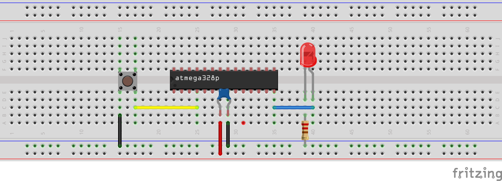

## Input en output met de AVR

We hebben reeds gezien (gerelateerd aan MCU's) hoe:

* Je een heel eenvoudig programma moet schrijven met een microcontroller
* De onboard led laten blinken op de Arduino
* In standaard C programmeren op een MCU (niet met de Arduino library)
* Principe van memory mapped IO (high level)
* Gebruiken van datasheets

Het dit hoofdstuk van dit deel van de cursus (getting started) bouwt verder op dit voorbeeld door de gpio's te connecteren aan externe componenten.  
(in dit geval een button en leds)

> **Nota:**  
> Gezien dit binnen het vakgebied elektronica ligt gaan we ook vanaf nu starten met wat relevante maar minimale elektronica.  

> **Nota:**  
> De breadboard-schema's die je ziet zijn gemaakt met Fritzing

### Componenten: LED

LED is de afkorting van **Light Emitting Diode**, wat zoveel betekent als lichtgevende diode.  

En inderdaad vertoont een led ook een belangrijke eigenschap van een diode, namelijk dat de stroom slechts in één richting wordt doorgelaten.
Er kan alleen stroom lopen van de anode (positieve pool) naar de kathode (negatieve pool).  

Dit is een belangrijk verschil tussen een led en een gloeilamp, waarbij de polariteit niet uitmaakt.   
In feite zijn er meer verschillen dan overeenkomsten tussen leds en gloeilampen:

* Zo wordt het licht in een led niet opgewekt door het verhitten van een draadje, maar doordat elektronen in het halfgeleidermateriaal zoals dat heet worden aangeslagen
* In feite gebeurt ditzelfde in een TL-buis of andere gasontladingslamp, zodat een led dus meer gemeen heeft met een TL-buis dan met een gloeilamp.


Bij de hierboven weergegeven “gewone” led met twee aansluitdraden zijn de anode en de kathode als volgt te herkennen:

* De anode (de positieve aansluiting) is de langste draad.
* De kathode (de negatieve aansluiting) is de kortste draad.  

Verder is de kathode bij ronde leds vanaf 5 millimeter ook aangegeven door middel van een **plat vlakje** bij een van de draden.

Houd er rekening mee dat er leds in talloze kleuren, vormen, maten en varianten verkrijgbaar zijn, zodat niet altijd direct duidelijk is wat de anode en de kathode is. 

Een ander essentieel verschil tussen een led en een gloeilamp is de manier waarop je ze van elektriciteit voorziet: leds moeten worden aangestuurd door er een bepaalde stroom doorheen te sturen, niet door er een bepaalde spanning overheen te zetten.  
Je kunt een gewone led dus ook niet zomaar op een batterij of andere spanningsbron aansluiten – ze zullen dan niet werken of juist heel snel kapot gaan.  

Bij een led wordt dan ook aangegeven bij welke stroom de lichtopbrengst optimaal is (dat wil zeggen: zoveel mogelijk licht bij een zo lang mogelijke levensduur).  
Bij de van oudsher verkrijgbare standaard-leds is dit vaak iets van 20 mA, bij zogenoemde low-current-leds is dit aanzienlijk minder, vaak iets tussen 3 en 5 mA.


### Duiding: beschermen van de stroom naar een LED toe  

Bij een MCU is het equivalent van een "Hello World"-programma in vele gevallen een programmaatje dat naar een LED schrijft  
(tekst schrijven zonder dat je seriële verbinding gebruikt is wat moeilijk)

De eerste stap om een elektronische verbinding tussen een MCU en een is dus een weerstand te plaatsen.  
Wat je zeker wil **vermijden** (verwijzende naar bovenstaande inleiding) is dus dit:  


**(Let op: BOVENSTAANDE CIRCUIT NIET GEBRUIKEN)**

Bovenstaande schakeling LED geschakeld aan een MCU heeft een weerstand nodig:

* Een pin op een MCU kan maar een maximum aantal stroom sinken (leveren van positieve stroom) of source (trekken van negatieve stroom)  
  Over het algemeen beperkt dit zich tot +- 30-40 mA maximum per pin
* De stroom op een standaard LED dient beperkt worden tot 20 mA per LED

Dus we vervangen de voorgaande schema door:


> **Belangrijke nota:**
> Zoals eerder vermeld de kathode moet zich verbinden aan de grond (zwarte draad op voorgaand schema).  
>
> * In de praktijk betekent dit meestal het kortste eind dat dient verbonden te worden
> * Indien de draden of benen reeds zijn ingekort kan je deze nog altijd herkennen uit de opbouw (bv. vlakke kant = cathode)
>
> 

### Herhaling: waarde van de weerstand

De waarde van de weerstand die we voor een led schakelen is gemakkelijk te berekenen met de wet van Ohm.

> Ter herhaling: **Wet van ohm**  
> ```
> V = R * I  
> R = V / I
> I = V * R
>```

Wetende dat we werken (afhankelijk van de set-up) met een voltage van 5 V of wel 3.3 V op de output-pins:

* In geval van 5 V spreken we meestal van waardes groter dan 250 ohm (afhangende van de helderheid):  
```
R = 5 V   / 0.02 A = 250 ohm
```
* In geval van 3.3 V:
```
R = 3.3 V / 0.02 A = 165 ohm
```

### Duiding: opzoeken in datasheet  

We werken met c-code en niet met de Arduino-omgeving (zoals besproken) dus moeten we weten welke pin we moeten gebruiken in onze code.
In het volgende voorbeeld willen we een de led aansturen vanuit poort 10 op de Arduino.


> **Nota:**  
> Bovenstaande mapping verwijst naar Atmega168 terwijl Arduino de Atmega328 gebruik.  
> Beide MCU's zijn echter volledig compatibel op niveau van pin-mapping.

De pinmapping duidt in dit geval dat de uitgang nummer 10 (digitale pin) mapt aan het AVR IO-register PB2 (pin 2 op bank B).

### Voorbeeld: blinken van LED

Het volstaat nu eigenlijk om ons voorbeeld van vorige week te herhalen maar naar een andere memory-location te verwijzen (PB5 door PB2 vervangen)

```{.c}
#include <avr/io.h>
#include <util/delay.h>

int LED_NUMMER = PB2;

int main(void)
{
  DDRB |= (1<<LED_NUMMER);

  while (1)
  {
      PORTB |= (1<<LED_NUMMER);
      _delay_ms(500);
      PORTB &= ~(1<<LED_NUMMER);
      _delay_ms(500);
  }
  return 0;
}
```

### Duiding: push-button

Onze eerste stap was een LED te gebruiken als output.  
Laten we het programma een beetje interactiever maken




De volgende stap bij MCU-programmeren is het experimenteren met input, we gaan dit illustreren met een "pushbutton".
In dit geval het geval dat deze button wordt ingedrukt zal er een verbinding ontstaan tussen:

* aan de ene kant de grond
* aan de andere kant de pin


Deze setup zal echter niet goed werken om dat de input ("by default") wel een spanning kan aanvoelen maar niet aan een circuit is verbonden.  
En we weten als een component dat niet aan een circuit is verbonden geen voorspelbare spanning heeft.

### Duiding pull-up-weerstand

Dit wordt in de elektronica opgelost door het gebruik van een pull-up weerstand.


Deze weerstand trekt (pulled) als het ware de spanning omhoog zolang de button niet is ingedrukt.  
(m.a.w. De spanning zal by default VCC zijn)

Het principe is éénvoudig:

* Men verbindt een weerstand aan VCC (5 V in geval van Arduino)
* Wanneer de button niet ingedrukt is wordt er een spanning geregistreerd
* Wanneer de button wel ingedrukt wordt de spanning afgeleid naar de grond
* Deze weerstand is best groot genoeg (+ 10 KOhm) om te veel "lekstroom" te vermijden

### Duiding: interne pull-ups

In het vorige voorbeeld was nog geen weerstand geplaatst maar bij een AVR is zo'n een externe weerstand eigenlijk niet nodig.  
Bij AVR-microcontrollers is dit voorzien in de microcontroller zelf.  


> **Nota:**  
> Je hoeft dus geen externe weerstand plaatsen, in sommmige gevallen zoals we later gaan zien bij i2c kan dit van tel zijn voor snelheid.  

### Voorbeeld: led laten blinken (en pull up activeren)

We hernemen het voorbeeld van daarnet maar we gaan code toevoegen die:

* Gaat luisteren naar een button  
* Een led laat branden zolang je op deze "push-button" drukt 


Gemakkelijkheidshalve gebruiken we pin 11 op de arduino, degene die overeenkomt met PB3 (ook op bank B).  

> **Nota:**  
> Het is niet noodzakelijk dat we de pins configureren op de dezelfde bank (maar gemakkelijkheidshalve ...)  

We starten met de volgende code:

```{.c}
#include <avr/io.h>
#include <util/delay.h>

int LED_NUMMER = PB2;
int BUTTON_NUMMER = PB3;

int main(void)
{
  DDRB  |= (1<<LED_NUMMER);           //output
  DDRB  &= ~(1 << BUTTON_NUMMER);     //input
  PORTB |= (1 << BUTTON_NUMMER);      //pull-up

  PORTB = PORTB & ~(1 << LED_NUMMER); //button is by default 0

  while (1)
  {
      if(!(PINB & (1 << BUTTON_NUMBER))) {
          PORTB = PORTB & (1 << LED_NUMBER);
      }
  }
  return 0;
}
```
Het doel van voorgaande code is een een led van waarde te laten veranderen:

* We configureren PB2 als output
* We configureren PB3 als input
* We activeren een pull-up op PB3
* In de event-loop kijken we na of de button ingedrukt is  
(waarde van P2 moet 0 zijn)
* Als de button is ingedrukt togglen we de waarde

Deze code voert een stuk code uit (led laten blinken) zolang een button is ingedrukt.  

### Voorbeeld: een button als schakelaar gebruiken

Je kan ook een button gebruiken als schakelaar.  
In dit voorbeeld willen we een led van waarde laten wijzigen bij het drukken op de button.

We starten met volgende code:

```{.c}
#include <avr/io.h>
#include <util/delay.h>

int LED_NUMMER = PB2;
int BUTTON_NUMMER = PB3;

int main(void)
{
  DDRB  |= (1<<LED_NUMMER);
  DDRB  &= ~(1 << BUTTON_NUMMER);
  PORTB |= (1 << BUTTON_NUMMER);

  PORTB &= (1 << LED_NUMMER);

  while (1)
  {
      if(!(PINB & (1 << BUTTON_NUMBER))) {
          PORTB = PORTB ^ (1 << LED_NUMBER);
      }
  }
  return 0;
}
```

Zal deze code **correct** werken?  
**Neen**, deze code zal een een onvoorspelbaar resultaat opleveren.  

De tijd dat je de button indrukt (aantal ms tot seconen) zal het stuk code blijven uitgevoerd worden en de let zal blijven togglen:  

* De led zal flikkeren
* Je hebt 50 % kans dat er een effectieve toggle is uitgevoerd

### Voorbeeld: state gebruiken (verbetering vorig voorbeeld)

Het probleem met voorgaande code is dat deze button ingedrukt kan blijven.  
Om dit te corrigeren kunnen we een **state** (staat) in het programma inbouwen:  

* Die onthoudt of de knop reeds was ingedrukt
* In een variabele
* Niets opnieuw togglet als deze op true staat
* Als de gebruiker gedaan heeft met drukken wordt deze variabele of state terug op 0 gezet  
  (voor de volgende keer als met drukt) 


```{.c}
#include <avr/io.h>
#include <util/delay.h>

int LED_NUMMER = PB2;
int BUTTON_NUMMER = PB3;

int main(void)
{
  DDRB  |= (1<<LED_NUMMER);
  DDRB  &= ~(1 << BUTTON_NUMMER);
  PORTB |= (1 << BUTTON_NUMMER);

  PORTB &= (1 << LED_NUMMER);

  int button_was_ingeduwd = 0;

  while (1)
  {
      if (!(PINB & (1 << BUTTON_NUMBER))) {
        if(button_was_ingeduwd==0) {
          PORTB = PORTB ^ (1 << LED_NUMBER);
          button_was_ingeduwd = 1;
        }
      } else { //button is niet meer ingeduwd
            button_was_ingeduwd = 1;
      }
  }
  return 0;
}
```

Zal deze code **correct** werken?  
**Neen**, deze code zal nog altijd een een onvoorspelbaar resultaat opleveren.  
Reden hiervoor is **button bounce** (of contact-dender)

### Duiding: button bounce (contact-dender)

Probleem hierboven is dat er bij eender welk electro-mechanisch contact - en zeker schakelaars (button, schuifschakelaar, joystick, ...) - trillingen optreden zodat gedurende kort tijd de waarde van een contact (of pin in dit geval) varieert.  

Onderstaande foto van een osciloscoop illustreert illustreert wat er gebeurt als je op push-button duwt, namelijk het fluctueren van de spanningen aan het begin en einde van het indrukken van de knop.  


Er bestaan hiervoor software-matige als hardware-matige oplossingen (condensator, flip-flops, ...)
De keuze tussen deze verschillende oplossingen hangt af van verschillende factoren (kost, hardware, performantie cpu), in vele gevallen echter gaat men software-matige oplossingen gebruiken zodat met op componenten kan besparen.  

### Voorbeeld: Gebruik maken van timeouts

Onderstaande code is een voorbeeld van zo'n een oplossing (zijn meerdere mogelijk).  

We maken namelijk gebruik van delays (timeouts) die we trouwens ook al hebben gebruikt in eerdere programma's.  
Dit zijn functies die er voor zorgen dat de uitvoering van je programma wordt gepauzeerd gedurende specfieke periode.  

AVR-GCC voorziet in zulk een bibliotheek (util/delay.h)

```{.c}
#include <avr/io.h>
#include <util/delay.h>

int LED_NUMMER = PB2;
int BUTTON_NUMMER = PB3;
int DEBOUNCE-TIJD = 1000;

int main(void)
{
  DDRB  |= (1<<LED_NUMMER);
  DDRB  &= ~(1 << BUTTON_NUMMER);
  PORTB |= (1 << BUTTON_NUMMER);

  PORTB &= (1 << LED_NUMMER);

  int button_was_ingeduwd = 0;

  while (1)
  {
      if (!(PINB & (1 << BUTTON_NUMBER))) {
        _delay_us(DEBOUNCE_TIME);
        if (!(PINB & (1 << BUTTON_NUMBER))) {
          if(button_was_ingeduwd==0) {
            PORTB = PORTB ^ (1 << LED_NUMBER);
            button_was_ingeduwd = 1;
          }
        }
      } else {
        button_was_ingeduwd = 0;
      }

  }
  return 0;
}
```

In dit geval gaan we:

* Een time-out inlassen na de eerste "detectie"
* Na deze time-out zijn we zeker dat we een stabiele staat moeten hebben
* We behouden ook onze state (variabele) voor het geval als de gebruiker langer drukt 
* Nadeel is dat als de gebruiker lang genoeg moet drukken  

### Korte herhaling

Dit is niet de enige manier (en later gaan we nog varianten zien) maar de voorbeelden illustren wel een aantal belangrijke concepten waar je moet met rekening houden als je met gpio-pinnen werkt:

* Configuratie van deze uit- en ingangen  
* Beschermen van je pinnen met weerstanden
* Pull-ups
* State bijhouden in je programma
* Contact-dender
