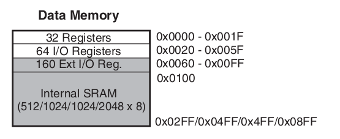
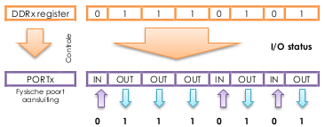
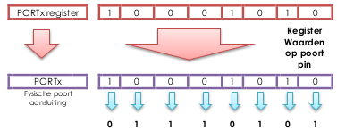
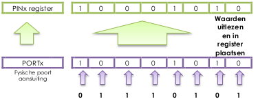

## Embedded programming (een MCU-programma schrijven)

### We gebruiken Arduino   

In dit deel van de cursus (getting started) gebruiken we Arduino-borden (meer specifiek de UNO met de atmega328p on board).


De keuze op dit bord is gevallen om 2 belangrijke redenen: 

* Het programmeren van Arduino (en AVR in het algemeen) is goed gesupporteerd op zowat alle operating systemen (Linux, Mac OS X, Windows, ...)
* Meest gebruikt microcontroller-bord ter wereld (voor starters en hobbyisten) met als gevolg  
  zeer veel referenties, documentatie, hulp, ...
* Open source zowel hardware als software  
  Op de koop toe is deze zeer goed gedocumenteerd en onderhouden

> **Nota:**   
> Aan de hand van deze documentatie gaan we in het volgende deel de details van de Arduino bestuderen

### Wat is Arduino?

Arduino is eigenlijk niet alleen hardware, het bestaat uit de volgende onderdelen (die je in principe los van elkaar kunnen gebruiken):

* Een volledig ontwikkel-board (MCU, geintegreerde USB-2-SERIAL, kristal, ...) uniform aan bepaalde specificaties dat het mogelijk maken van verschillende extensies (of  shields te produceren 
  (er bestaan trouwens meerdere fabrikanten die Arduino's of compatibele versies aanmaken)
* Een bootloader (software die al op de MCU is geladen die andere programma's laadt en initialiseert)
* Een ontwikkelingsomgeving die er voor zorgt dat je kan ontwikkelen zonder de specifieke (en low-level) details van het programmeren met de microcontroller moet kennen

De ontwikkel-omgeving is gebaseerd:

* op de taal processing (sterk verwant met C++)
* komt met zijn eigen libraries die het mgoelijk maken te programmeren op Arduino zonder de onderliggende architectuur

Het voorbeeld hieronder toont de typische "Hello World" schrijft voor een Arduno 

```{.c}
int led = 13;

void setup() {                
  pinMode(led, OUTPUT);     
}

void loop() {
  digitalWrite(led, HIGH);  
  delay(500);              
  digitalWrite(led, LOW);    
  delay(500);               
}
```

Eigenlijk heel gemakkelijk/ideaal om snel te starten en leren programmeren **maar dit gaan we niet gebruiken**

### Maar geen Arduino-programeer-omgeving  

Concreet gezien gaan we enkel de hardware en bootloader gebruiken (en zelfs deze laatste gaan we in het laatste deel overboord gooien).  
Deze brengen on het voordeel dat we met een (relatief goedkoop) bord al heel wat functionaliteit hebben)

De ontwikkelingsomgeving echter gaan we vermijden (lees als **niet te gebruiken in de labo's**)  
om de volgende redenen:  

#### Programmeren in C

Programmeren in C is een essentiële vaardigheid voor ieder die professioneel met MCU's wil werken (of zelfs elektronica in zijn geheel vandaag de dag).  
Deze taal werkt in alle omgevingen, in alle situaties en laat je toe 

Deze taal is nog altijd (+- samen met/op deze zelfde hoogte als Java) de meest gebruikte programmeer-taal op deze planeet.  


#### De Arduino-omgeving schermt de details van de MCU-architectuur af  

De vaardigheden die we willen aanleren is niet hoe dat je kan leren werken met een specifieke architectuur en omgeving.  
Na deze cursus zou zelfstandig moeten kunnen leren een andere architectuur en/of setup te gebruiken zoals ARM, MSP, ...  

Dit kan je enkel als je de vaardigheden: 

* De basis-principes van embedded programmeren kent, low-level memory, pointers, ...
* Datasheets hebt leren lezen om een embedded omgeving te ontwikkelen
	
#### Het gaat hier om een opleiding naar het beroep van embedded ontwikkelaar (of elektronicus)   
  
De kans is groot als je in een beroepssituatie dat je niet zo maar kan kiezen welke omgeving en hardware je mag gebruiken.  
Je moet daar ook meestal zeer specifieke requirements of consideraties rekening houden zoals onder andere

* Kost  
  Als je miljoenen stuks moet produceren van iets telt elke eurocent en moet je proberen te werken met omgevingen met weinig overhead  
  Zowel op niveau van memory en snelheid, en dat is iets waar Arduino-software niet optimaal voor is.  
  Dit telt trouwens ook voor de hardware, een bord kost +- 20 € je kan meestal voor 3 € hetzelfde gebruiken (ATTiny + aantal componenten)
* Verbruik
  Dikwijls gaat het om hardware die op batterijen waardoor je zo zuinig mogelijk moet zijn in je software.  
  Ter illustratie: een uitgang op 1 zetten in Arduino neemt +- 40-60 cycles in beslag tov 2-4 als je het in C doet   
  Ter illust
* Grootte  
  Meestal moet je deze integreren in klein apparaat
* Sommige zaken kan je niet met de abstracties van arduino zoals:  
     * Werken met interrupts (dit kan enkel met AVR-specifieke kennis)
     * Specifieke configuratie-opties voor i2c, spi, ...
     * ...

### Memory mapped IO

De basis van MCU-programmeren met AVR (en eigenlijk alle MCU's) is het principe van **Memory Mapped IO**  
(ook wel gerefereerd als **IO-mapped perhipherals**).

Dit houdt in dat fysieke input- en output-peripherals (gpio-pins, usart, i2c, adc, ...) worden gemapped naar locaties in het geheugen.  
Met andere woorden, dit wil zeggen dat je de de in- en output van een MCU kan controleren door het uitlezen en manipuleren van geheugen.

Het geheugen van een microcontroller kan je voorstellen als een lange rij van bytes.
Elk van deze bytes heeft een adres waarmee je vanuit een programma dit kan adresseren.



Hierboven zie je het overzicht van alle data-memory (het geheugen dat je programma kan aanspreken).  
224 (64 gemeenschappelijk voor de gehele atmega-famillie) van deze zijn IO-registers die je vanuit je code kan aanspreken. 

```{.c}
uint8_t *an_io_port = (int *) 0x2B;
*an_io_port = *an_io_port | 1;
```

> Voor een overzicht van deze adressen en andere details rond deze processoren gaan we in het volgende deel van de cursus dieper ingaan door de datasheets te bestuderen.

### GPIO

In AVR refereren we deze IO-registers (locaties in het geheugen) dikwijls als hardware registers.  
De eerste (en voor deze les de enige) van deze hardware registers die we bekijken zijn de registers gebruikt om de pinnetjes van je MCU aan te sturen.  

In deze les focussen we dus op het aansturen van gpio-pinnen (general purpose input output).


#### DDRx data-direction registers (port x)

Deze registers controleren welke pin is geconfigureerd als input of output.  
Bij de power-up van een MCU (of na reset), is de default status van deze registers allemaal 0 (hetgeen betekent input).

Om een pin als output te configureren schrijf je 1 naar een specifieke positie binnen de DDR




#### PORTx port x data registers
Het gedrag van deze poort hangt af van hoe dat je de DDR-poort hebt geconfigureerd
Als voor de specifieke DDR-pin de bit op 1 staat (de pin is als output geconfigureerd), zal je dit register kunnen gebruiken om te controlleren of een pin hoog of laat (vcc of ground).   



Wanneer de DDR echter geconfigureerd is als input, zal dit register bepalen of ofwel een interne pull-up geactiveerd word ofwel dat deze als hoog-impedant is geconfigureerd (effectief ontkoppeld van het circuit maar toch nog in staat om spanning te meten).  
Hier komen we later nog op terug.

#### PINx port x input pins address

Deze registers hebben als functie de spanning te meten voor elke pin die is geconfigureerd als als input.  
Elke PINx-geheugen-locatie is verbonden aan een comparator-circuit dat detecteert of de pin hoog of laag staat.  
Deze geheugen-locatie is wel read-only, je kan er niet naar schrijven.



### Structuur van een AVR-programma

Een AVR-programma is in principe een oneindige lus, het is meestal gestructureerd als volgt:

```
[include-statements]
[globale variabelen]
[functie-definities]
int main(void){
    [pin/poort en andere hardware-initialisatie]
    [event loop]
    while(1) {
      [herhalen tot in de eeuwigheid]
    }
    return(0);
}
```

### Voorbeeld: blinken van een LED

We bespreken deze structuur aan de hand van een meest eenvoudige (zichtbare) voorbeeld mogelijk (op een Arduino UNO).  
Namelijk het programma dat het ledje op de Arduino UNO doet blinken:

```{.c}
#include <avr/io.h>
#include <util/delay.h>

int LED_NUMMER = PB5;

int main(void)
{
  DDRB |= (1<<LED_NUMMER);

  while (1)
  {
      PORTB |= (1<<LED_NUMMER);
      _delay_ms(500);
      PORTB &= ~(1<<LED_NUMMER);
      _delay_ms(500);
  }
  return 0;
}
```

Het programma doet het zelfde als het processing-voorbeeld hierboven.

#### include-statement

Het eerste dat je doet (eigenlijk in elk c-programma) is het importeren van een aantal header-files die bepaalde constante waardes en functies bevatten die we gebruiken verder in ons programma:

```{.c}
#include <avr/io.h>
#include <util/delay.h>
```

* avr/io.h bevat constanten zoals DDRB en PORTB zodat je het exacte geheugenadres niet van buiten moet kennen
* util/delay.h bevat de methode delay_ms waarmee je kan bepalen hoelang je programma moet wachten alvorens naar de volgende statement te gaan

#### Globale variabelen

Deze variabele die wordt gebruikt op meerdere plekken in het programma.

``` 
int LED_NUMMER = PB5;
```

Het voordeel aan zo'n globale variabele is ook dat je deze maar op 1 plek moet veranderen om een andere pin aan te spreken.

#### Initialisatie en configuratie

```
DDRB |= (1<<LED_NUMMER);
```
Deze statement configureert dat de bit op de positie LED_NUMMER (5 in dit geval) op 1 wordt gezet.
In dit geval zorgen we hiermee dat deze pin als output wordt geconfigureerd.  

#### Event loop

Na deze configuratie volgt wat men noemt de event-loop.  
Dit is voor elk AVR-programma hetzelfde, namelijk een oneindig loop.

```
while (1)
{
    PORTB |= (1<<LED_NUMMER);
    _delay_ms(500);
    PORTB &= ~(1<<LED_NUMMER);
    _delay_ms(500);
}
```

Binnen deze loop wordt er gealterneerd tussen een 1 en 0-bit op positie 5 (LED_NUMMER of PB5)
Tussen elke actie pauzeert het programma 500 milliseconden, met als effect dat de led 500 milliseconden zal aanblijven gedurende het togglen.

#### Bit-masks

Zoals je ziet worden bit-masks gebruikt om de IO-registers te manipuleren.  
Sommige **slechte voorbeelden** op het internet doen het zelfde door een volledige poort te initialiseren.  

Je zou inderdaad hetzelfde kunnen bereiken met volgend statement:

```
PORTB = 0x20
```

Het probleem hiermee is dat je hiermee ook andere registers manipuleert hetgeen al niet proper is.  
In bepaalde gevallen kan je bijvoorbeeld een register-bit kunnen aanraken die je niet wil aanraken.  

**De afspraak is dus van enkel via bitmasks te werken**:  

* Dit maakt de code meestal veel leesbaarder (aangezien je met bits werkt)
* Dit vermijdt risico's (de verkeerde pin aanraken)
* Later gaan we zien dat we dit nog kunnen optimaliseren met het gebruik van macro's
 zouden het durven van deze 
