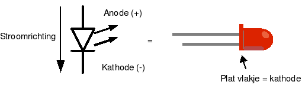
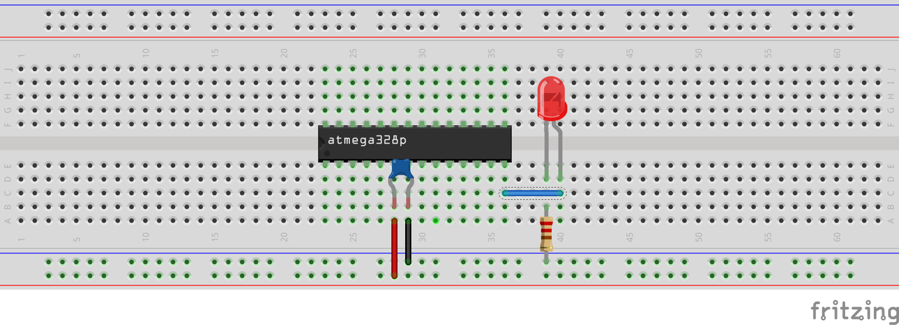
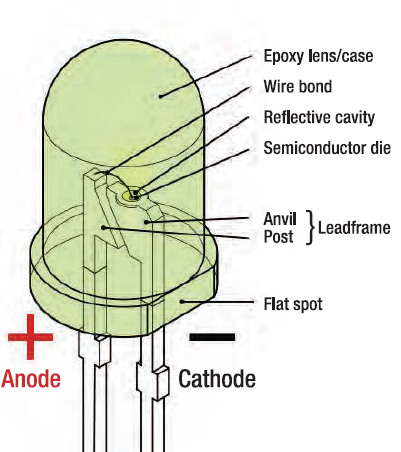

## GPIO: Output met de AVR

We hebben reeds gezien (gerelateerd aan MCU's) hoe:

* Je een heel eenvoudig programma moet schrijven met een microcontroller
* De onboard led laten blinken op de Arduino
* In standaard C programmeren op een MCU (niet met de Arduino library)
* Principe van memory mapped IO (high level)
* Gebruiken van datasheets

Dit hoofdstuk van dit deel van de cursus (getting started) bouwt verder op dit voorbeeld door de gpio's te connecteren aan externe componenten.  
(in dit geval een button en leds)

> **Nota:**  
> Gezien dit binnen het vakgebied elektronica ligt gaan we ook vanaf nu starten met wat relevante maar minimale elektronica.  

> **Nota:**  
> De breadboard-schema's die je ziet zijn gemaakt met Fritzing

### Componenten: LED

LED is de afkorting van **Light Emitting Diode**, wat zoveel betekent als lichtgevende diode.  

En inderdaad vertoont een led ook een belangrijke eigenschap van een diode, namelijk dat de stroom slechts in één richting wordt doorgelaten.
Er kan alleen stroom lopen van de anode (positieve pool) naar de kathode (negatieve pool).  

Dit is een belangrijk verschil tussen een led en een gloeilamp, waarbij de polariteit niet uitmaakt.   
In feite zijn er meer verschillen dan overeenkomsten tussen leds en gloeilampen:

* Zo wordt het licht in een led niet opgewekt door het verhitten van een draadje, maar doordat elektronen in het halfgeleidermateriaal zoals dat heet worden aangeslagen
* In feite gebeurt ditzelfde in een TL-buis of andere gasontladingslamp, zodat een led dus meer gemeen heeft met een TL-buis dan met een gloeilamp.



Bij de hierboven weergegeven “gewone” led met twee aansluitdraden zijn de anode en de kathode als volgt te herkennen:

* De anode (de positieve aansluiting) is de langste draad.
* De kathode (de negatieve aansluiting) is de kortste draad.  

Verder is de kathode bij ronde leds vanaf 5 millimeter ook aangegeven door middel van een **plat vlakje** bij een van de draden.

Houd er rekening mee dat er leds in talloze kleuren, vormen, maten en varianten verkrijgbaar zijn, zodat niet altijd direct duidelijk is wat de anode en de kathode is.

Een ander essentieel verschil tussen een led en een gloeilamp is de manier waarop je ze van elektriciteit voorziet: leds moeten worden aangestuurd door er een bepaalde stroom doorheen te sturen, niet door er een bepaalde spanning overheen te zetten.  
Je kunt een gewone led dus ook niet zomaar op een batterij of andere spanningsbron aansluiten – ze zullen dan niet werken of juist heel snel kapot gaan.  

Bij een led wordt dan ook aangegeven bij welke stroom de lichtopbrengst optimaal is (dat wil zeggen: zoveel mogelijk licht bij een zo lang mogelijke levensduur).  
Bij de van oudsher verkrijgbare standaard-leds is dit vaak iets van 20 mA, bij zogenoemde low-current-leds is dit aanzienlijk minder, vaak iets tussen 3 en 5 mA.


### Duiding: beschermen van de stroom naar een LED toe  

Bij een MCU is het equivalent van een "Hello World"-programma in vele gevallen een programmaatje dat naar een LED schrijft  
(tekst schrijven zonder dat je seriële verbinding gebruikt is wat moeilijk)

De eerste stap van dit "Hello World"-programma is het opzetten van een elektronische verbinding tussen een MCU en een led.  
Wat je daar zeker wil **vermijden** (verwijzende naar bovenstaande inleiding) is dus dit (geen weerstand):  


**(Let op: BOVENSTAANDE CIRCUIT NIET GEBRUIKEN)**

Bovenstaande schakeling LED geschakeld aan een MCU heeft een weerstand nodig:

* Een pin op een MCU kan maar een maximum aantal stroom sinken (leveren van positieve stroom) of source (trekken van negatieve stroom)  
  Over het algemeen beperkt dit zich tot +- 30-40 mA maximum per pin
* De stroom op een standaard LED dient beperkt worden tot 20 mA per LED

Dus we vervangen de voorgaande schema door:



> **Belangrijke nota:**
> Zoals eerder vermeld de kathode moet zich verbinden aan de grond (zwarte draad op voorgaand schema).  
>
> * In de praktijk betekent dit meestal het kortste eind dat dient verbonden te worden
> * Indien de draden of benen reeds zijn ingekort kan je deze nog altijd herkennen uit de opbouw (bv. vlakke kant = cathode)
>
> 

### Herhaling: waarde van de weerstand

De waarde van de weerstand die we voor een led schakelen is gemakkelijk te berekenen met de wet van Ohm.

> Ter herhaling: **Wet van ohm**  
> ```
> V = R * I  
> R = V / I
> I = V * R
>```

Wetende dat we werken (afhankelijk van de set-up) met een voltage van 5 V of wel 3.3 V op de output-pins:

* In geval van 5 V spreken we meestal van waardes groter dan 250 ohm (afhangende van de helderheid):  
```
R = 5 V   / 0.02 A = 250 ohm
```
* In geval van 3.3 V:
```
R = 3.3 V / 0.02 A = 165 ohm
```

### Duiding: opzoeken in datasheet  

We werken met c-code en niet met de Arduino-omgeving (zoals besproken) dus moeten we weten welke pin we moeten gebruiken in onze code.
In het volgende voorbeeld willen we een de led aansturen vanuit poort 10 op de Arduino.


> **Nota:**  
> Bovenstaande mapping verwijst naar Atmega168 terwijl Arduino de Atmega328 gebruik.  
> Beide MCU's zijn echter volledig compatibel op niveau van pin-mapping.

De pinmapping duidt in dit geval dat de uitgang nummer 10 (digitale pin) mapt aan het AVR IO-register PB2 (pin 2 op bank B).

### Voorbeeld: blinken van LED

Het volstaat nu eigenlijk om ons voorbeeld van vorige week te herhalen maar naar een andere memory-location te verwijzen (PB5 door PB2 vervangen)

```{.c}
#include <avr/io.h>
#include <util/delay.h>

int LED_NUMMER = PB2;

int main(void)
{
  DDRB |= (1<<LED_NUMMER);

  while (1)
  {
      PORTB |= (1<<LED_NUMMER);
      _delay_ms(500);
      PORTB &= ~(1<<LED_NUMMER);
      _delay_ms(500);
  }
  return 0;
}
```
