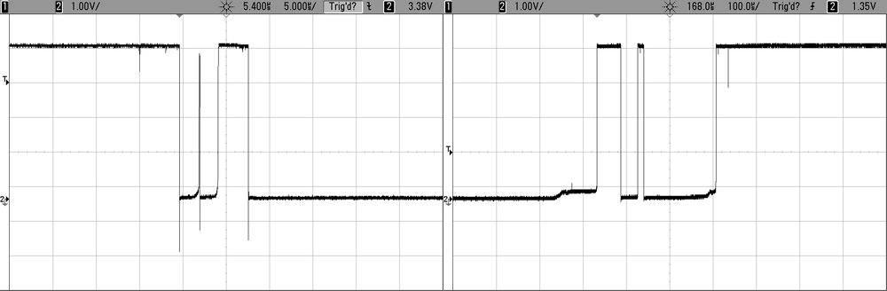

## GPIO: Input met de AVR

### Duiding: push-button

Onze eerste stap was een LED te gebruiken als output.  
Laten we het programma een beetje interactiever maken


De volgende stap bij MCU-programmeren is het experimenteren met input, we gaan dit illustreren met een "pushbutton".
In het geval dat deze button wordt ingedrukt zal er een verbinding ontstaan tussen:

* aan de ene kant de grond
* aan de andere kant de pin


Deze setup zal echter niet goed werken om dat de input ("by default") wel een spanning kan aanvoelen maar niet aan een circuit is verbonden.  
En we weten dat als een component niet aan een circuit is verbonden er geen voorspelbare spanning staat op de pin.

### Duiding pull-up-weerstand

Dit wordt in de elektronica opgelost door het gebruik van een pull-up weerstand.


Deze weerstand trekt (pulled) als het ware de spanning omhoog zolang de button niet is ingedrukt.  
(m.a.w. De spanning zal by default VCC zijn)

Het principe is éénvoudig:

* Men verbindt een weerstand aan VCC (5 V in geval van Arduino)
* Wanneer de button niet ingedrukt is wordt er een spanning geregistreerd
* Wanneer de button wel ingedrukt wordt de spanning afgeleid naar de grond
* Deze weerstand is best groot genoeg (+ 10 KOhm) om te veel "lekstroom" te vermijden

### Duiding: interne pull-ups

In het vorige voorbeeld was nog geen weerstand geplaatst maar bij een AVR is zo'n een externe weerstand eigenlijk niet nodig.  
Bij AVR-microcontrollers is dit voorzien in de microcontroller zelf.  


> **Nota:**  
> Je hoeft dus geen externe weerstand plaatsen, in sommmige gevallen zoals we later gaan zien bij i2c kan dit van tel zijn voor snelheid.  

### Voorbeeld: led laten blinken (en pull up activeren)

We hernemen het voorbeeld van daarnet maar we gaan code toevoegen die:

* Gaat luisteren naar een button  
* Een led laat branden zolang je op deze "push-button" drukt


Gemakkelijkheidshalve gebruiken we pin 11 op de arduino, degene die overeenkomt met PB3 (ook op bank B).  

> **Nota:**  
> Het is niet noodzakelijk dat we de pins configureren op de dezelfde bank (maar gemakkelijkheidshalve ...)  

We starten met de volgende code:

```{.c}
#include <avr/io.h>
#include <util/delay.h>

int LED_NUMMER = PB2;
int BUTTON_NUMMER = PB3;

int main(void)
{
  DDRB  |= (1<<LED_NUMMER);           //output
  DDRB  &= ~(1 << BUTTON_NUMMER);     //input
  PORTB |= (1 << BUTTON_NUMMER);      //pull-up

  PORTB = PORTB & ~(1 << LED_NUMMER); //button is by default 0

  while (1)
  {
      if(!(PINB & (1 << BUTTON_NUMBER))) {
          PORTB = PORTB & (1 << LED_NUMBER);
      }
  }
  return 0;
}
```
Het doel van voorgaande code is een led van waarde te laten veranderen:

* We configureren PB2 als output
* We configureren PB3 als input
* We activeren een pull-up op PB3
* In de event-loop kijken we na of de button ingedrukt is  
(waarde van P2 moet 0 zijn)
* Als de button is ingedrukt togglen we de waarde

Deze code voert een stuk code uit (led laten blinken) zolang een button is ingedrukt.  

### Voorbeeld: een button als schakelaar gebruiken

Je kan ook een button gebruiken als schakelaar.  
In dit voorbeeld willen we een led van waarde laten wijzigen bij het drukken op de button.

We starten met volgende code:

```{.c}
#include <avr/io.h>
#include <util/delay.h>

int LED_NUMMER = PB2;
int BUTTON_NUMMER = PB3;

int main(void)
{
  DDRB  |= (1<<LED_NUMMER);
  DDRB  &= ~(1 << BUTTON_NUMMER);
  PORTB |= (1 << BUTTON_NUMMER);

  PORTB &= (1 << LED_NUMMER);

  while (1)
  {
      if(!(PINB & (1 << BUTTON_NUMBER))) {
          PORTB = PORTB ^ (1 << LED_NUMBER);
      }
  }
  return 0;
}
```

Zal deze code **correct** werken?  
**Neen**, deze code zal een een onvoorspelbaar resultaat opleveren.  

De tijd dat je de button indrukt (aantal ms tot seconen) zal het stuk code blijven uitgevoerd worden en de led zal blijven togglen:  

* De led zal flikkeren
* Je hebt 50 % kans dat er een effectieve toggle is uitgevoerd

### Voorbeeld: state gebruiken (verbetering vorig voorbeeld)

Het probleem met voorgaande code is dat deze button ingedrukt kan blijven.  
Om dit te corrigeren kunnen we een **state** (staat) in het programma inbouwen:  

* Die onthoudt of de knop reeds was ingedrukt
* In een variabele
* Niets opnieuw togglet als deze op true staat
* Als de gebruiker gedaan heeft met drukken wordt deze variabele of state terug op 0 gezet  
  (voor de volgende keer als met drukt)


```{.c}
#include <avr/io.h>
#include <util/delay.h>

int LED_NUMMER = PB2;
int BUTTON_NUMMER = PB3;

int main(void)
{
  DDRB  |= (1<<LED_NUMMER);
  DDRB  &= ~(1 << BUTTON_NUMMER);
  PORTB |= (1 << BUTTON_NUMMER);

  PORTB &= (1 << LED_NUMMER);

  int button_was_ingeduwd = 0;

  while (1)
  {
      if (!(PINB & (1 << BUTTON_NUMBER))) {
        if(button_was_ingeduwd==0) {
          PORTB = PORTB ^ (1 << LED_NUMBER);
          button_was_ingeduwd = 1;
        }
      } else { //button is niet meer ingeduwd
            button_was_ingeduwd = 1;
      }
  }
  return 0;
}
```

Zal deze code **correct** werken?  
**Neen**, deze code zal nog altijd een een onvoorspelbaar resultaat opleveren.  
Reden hiervoor is **button bounce** (of contact-dender)

### Duiding: button bounce (contact-dender)

Probleem hierboven is dat er bij eender welk electro-mechanisch contact - en zeker schakelaars (button, schuifschakelaar, joystick, ...) - trillingen optreden zodat gedurende kort tijd de waarde van een contact (of pin in dit geval) varieert.  

Onderstaande foto van een osciloscoop illustreert illustreert wat er gebeurt als je op push-button duwt, namelijk het fluctueren van de spanningen aan het begin en einde van het indrukken van de knop.  




Er bestaan hiervoor software-matige als hardware-matige oplossingen (condensator, flip-flops, ...)
De keuze tussen deze verschillende oplossingen hangt af van verschillende factoren (kost, hardware, performantie cpu), in vele gevallen echter gaat men software-matige oplossingen gebruiken zodat men op componenten kan besparen.  

### Voorbeeld: Gebruik maken van timeouts

Onderstaande code is een voorbeeld van zo'n een oplossing (zijn meerdere mogelijk).  

We maken namelijk gebruik van delays (timeouts) die we trouwens ook al hebben gebruikt in eerdere programma's.  
Dit zijn functies die er voor zorgen dat de uitvoering van je programma wordt gepauzeerd gedurende specfieke periode.  

AVR-GCC (compiler) voorziet voor zulke requirements een bibliotheek die je kan gebruiken via de header-file "util/delay.h".

```{.c}
#include <avr/io.h>
#include <util/delay.h>

int LED_NUMMER = PB2;
int BUTTON_NUMMER = PB3;
int DEBOUNCE-TIJD = 1000;

int main(void)
{
  DDRB  |= (1<<LED_NUMMER);
  DDRB  &= ~(1 << BUTTON_NUMMER);
  PORTB |= (1 << BUTTON_NUMMER);

  PORTB &= (1 << LED_NUMMER);

  int button_was_ingeduwd = 0;

  while (1)
  {
      if (!(PINB & (1 << BUTTON_NUMBER))) {
        _delay_us(DEBOUNCE_TIME);
        if (!(PINB & (1 << BUTTON_NUMBER))) {
          if(button_was_ingeduwd==0) {
            PORTB = PORTB ^ (1 << LED_NUMBER);
            button_was_ingeduwd = 1;
          }
        }
      } else {
        button_was_ingeduwd = 0;
      }

  }
  return 0;
}
```

In dit geval gaan we:

* Een time-out inlassen na de eerste "detectie"
* Na deze time-out zijn we zeker dat we een stabiele staat moeten hebben
* We behouden ook onze state (variabele) voor het geval als de gebruiker langer drukt
* Nadeel is dat als de gebruiker lang genoeg moet drukken  

### Korte herhaling

Dit is niet de enige manier (en later gaan we nog varianten zien) maar de voorbeelden illustreren wel een aantal belangrijke concepten waar je moet mee rekening houden als je met gpio-pinnen werkt:

* Configuratie van deze uit- en ingangen  
* Beschermen van je pinnen met weerstanden
* Pull-ups
* State bijhouden in je programma
* Contact-dender
