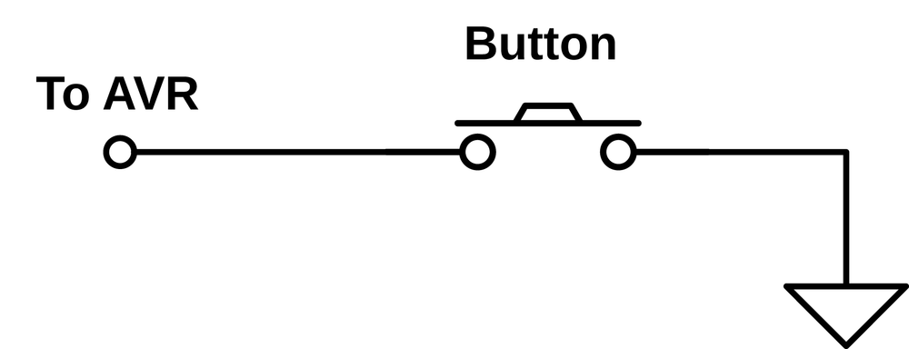
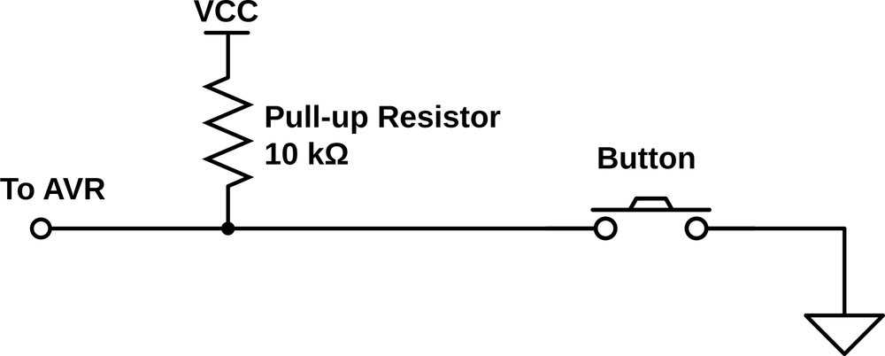
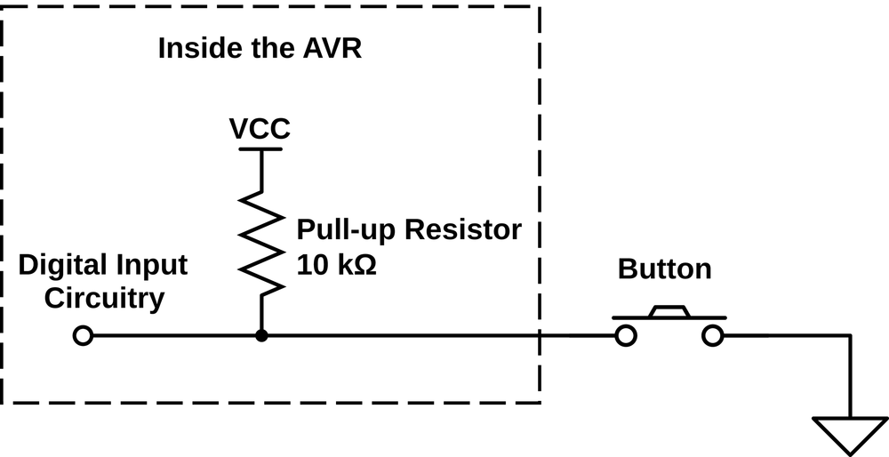

## GPIO: Input met de AVR

### Duiding: push-button

Onze **eerste stap** was een **LED** te gebruiken als output.  
Laten we het programma een beetje **interactiever** maken


De volgende stap bij MCU-programmeren is het experimenteren met **input**, we gaan dit illustreren met een **"pushbutton"**.

### Duiding: setup van push-button

We starten met een basis-setup:



In het geval dat deze button wordt ingedrukt zal er een verbinding ontstaan tussen:

* aan de ene kant de **ground**
* aan de andere kant de **pin**

### Duiding pull-up-weerstand

Deze **setup** zal echter niet goed werken, de input ("by default") kan een spanning aanvoelen maar is - wanneer niet ingedrukt - **niet** aan een circuit is **verbonden**.  
En we weten dat als een component **niet** aan een **circuit** is **verbonden** er **geen voorspelbare spanning** staat op de pin.

Dit wordt in de elektronica opgelost door het gebruik van een **pull-up** weerstand.



Deze weerstand **trekt** (pulled) als het ware de **spanning omhoog** zolang de button niet is ingedrukt.  
(m.a.w. De spanning zal by default VCC zijn)

Het principe is éénvoudig:

* Men **verbindt** een **weerstand aan VCC** (5 V in geval van Arduino)
* Wanneer de button **niet ingedrukt** is wordt er een **spanning** geregistreerd
* Wanneer de button wel **ingedrukt wordt** de spanning **afgeleid** naar de **grond**
* Deze **weerstand** is best **groot genoeg** (+ 10 KOhm) om te veel **"lekstroom" te vermijden**

### Duiding: interne pull-ups

In het vorige **schema** was nog **geen weerstand** geplaatst maar bij een AVR is zo'n een externe weerstand eigenlijk niet nodig.  
Bij AVR-microcontrollers is een **interne pull-up** voorzien in de **microcontroller** zelf.  



> **Nota:**  
> Je hoeft dus geen externe weerstand plaatsen, in sommmige gevallen zoals we later gaan zien bij i2c kan dit van tel zijn voor snelheid.  

### Voorbeeld: led laten blinken (en pull up activeren)

We hernemen het voorbeeld van daarnet maar we gaan code toevoegen die:

* Gaat **luisteren** naar een **button**
* Een led laat **uit** zolang je op deze **"push-button"** drukt


> **Nota:**  
> Het is niet noodzakelijk dat we de pins configureren op de dezelfde bank (maar gemakkelijkheidshalve ...)  

### Code: led aan en uit

We starten met de volgende code:

```c
#include <avr/io.h>
#include <util/delay.h>

int LED_NUMBER = PB2;
int BUTTON_NUMBER = PB3;

int main(void)
{
  DDRB  |= (1<<LED_NUMBER);           //output
  DDRB  &= ~(1 << BUTTON_NUMBER);     //input
  PORTB |= (1 << BUTTON_NUMBER);      //pull-up

  PORTB &= ~(1 << LED_NUMBER); //button is by default 0

  while (1)
  {
      if(!(PINB & (1 << BUTTON_NUMBER))) {
        PORTB = PORTB & ~(1 << LED_NUMBER);
      } else {
        PORTB = PORTB | (1 << LED_NUMBER);
      }
  }
  return 0;
}
```

### Hoe: led aan en uit

* We configureren **PB2** als **output** (via DDRB)
* We configureren **PB3** als **input** (via DDRB)
* We activeren een **pull-up** op **PB3** (via PORTB)
* In de **event-loop** kijken we na of de **button ingedrukt** is
* Als de button is **ingedrukt** gaat de **LED aan**, anders uit

### Te onhouden: PORT-registers en Configuratie

Een **PORT-register**:

* Dient dus **niet alleen** als een register om **output** aan te sturen
* Je kan dit dus **ook gebruiken** om een interne **pull-up** te **activeren**

> **Bemerking:**  
> We zien hier opnieuw het belang van bitmasking, je wil namelijk nu vermijden
> een bit te overschrijven die je eerder als pull-up had geactiveerd.

### Voorbeeld: een button als schakelaar gebruiken

Voorgaand voorbeeld kan je vrij gemakkelijk maken zonder MCU.

Je kan ook een button echter ook gebruiken als schakelaar, het programma zal als het ware je keuze onthouden.  
In dit voorbeeld willen we een led van waarde laten wijzigen bij het drukken op de button.


### Code: een button als schakelaar gebruiken (poging 1)

We starten met volgende code:

```c
#include <avr/io.h>
#include <util/delay.h>

int LED_NUMBER = PB2;
int BUTTON_NUMBER = PB3;

int main(void)
{
  DDRB  |= (1<<LED_NUMBER);           //output
  DDRB  &= ~(1 << BUTTON_NUMBER);     //input
  PORTB |= (1 << BUTTON_NUMBER);      //pull-up

  PORTB &= ~(1 << LED_NUMBER); //button is by default 0

  while (1)
  {
      if(!(PINB & (1 << BUTTON_NUMBER))) {
          PORTB = PORTB ^ (1 << LED_NUMBER);
      }
  }
  return 0;
}
```

### Verklaring: een button als schakelaar gebruiken (poging 1)

Zal deze code **correct** werken?  
**Neen**, deze code zal een een onvoorspelbaar resultaat opleveren.  

De tijd dat je de button indrukt (aantal ms tot seconen) zal het stuk code blijven uitgevoerd worden en de led zal blijven togglen:  

* De led zal **flikkeren**
* Je hebt **50 % kans** dat er een effectieve toggle is uitgevoerd

### Voorbeeld: state gebruiken (poging 2)

Het probleem met voorgaande code is dat deze button ingedrukt kan blijven.  
Om dit te corrigeren kunnen we een **state** (staat) in het programma inbouwen:  

* Die onthoudt of de knop reeds was ingedrukt
* In een variabele
* Niets opnieuw togglet als deze op true staat
* Als de gebruiker gedaan heeft met drukken wordt deze variabele of state terug op 0 gezet  
  (voor de volgende keer als met drukt)

### Code: state gebruiken (poging 2)

```c
#include <avr/io.h>
#include <util/delay.h>

int LED_NUMBER = PB2;
int BUTTON_NUMBER = PB3;

int main(void)
{
  DDRB  |= (1<<LED_NUMBER);           //output
  DDRB  &= ~(1 << BUTTON_NUMBER);     //input
  PORTB |= (1 << BUTTON_NUMBER);      //pull-up

  PORTB &= ~(1 << LED_NUMBER); //button is by default 0

  int button_was_ingeduwd = 0;

  while (1)
  {
      if(!(PINB & (1 << BUTTON_NUMBER))) {
    	  if(button_was_ingeduwd==0) {
    		  PORTB = PORTB ^ (1 << LED_NUMBER);
    		  button_was_ingeduwd = 1;
    	  } else {
    		  button_was_ingeduwd = 0;
    	  }
      }
  }
  return 0;
}
```

### Verklaring: state gebruiken (poging 2)

Zal deze code **correct** werken?  
**Neen** (nog altijd niet), deze code zal nog altijd een een onvoorspelbaar resultaat opleveren.  
Reden hiervoor is **button bounce** (of contact-dender)

### Duiding: button bounce (contact-dender)

Probleem hierboven is dat er bij eender welk electro-mechanisch contact - en zeker schakelaars (button, schuifschakelaar, joystick, ...) - trillingen optreden zodat gedurende kort tijd de waarde van een contact (of pin in dit geval) varieert.  

Onderstaande foto van een osciloscoop illustreert illustreert wat er gebeurt als je op push-button duwt, namelijk het fluctueren van de spanningen aan het begin en einde van het indrukken van de knop.  


Er bestaan hiervoor software-matige als hardware-matige oplossingen (condensator, flip-flops, ...)
De keuze tussen deze verschillende oplossingen hangt af van verschillende factoren (kost, hardware, performantie cpu), in vele gevallen echter gaat men software-matige oplossingen gebruiken zodat men op componenten kan besparen.  

### Voorbeeld: Gebruik maken van timeouts (3de keer beter)

Onderstaande code is een voorbeeld van zo'n een oplossing (zijn meerdere mogelijk).  

We maken namelijk gebruik van delays (timeouts) die we trouwens ook al hebben gebruikt in eerdere programma's.  
Dit zijn functies die er voor zorgen dat de uitvoering van je programma wordt gepauzeerd gedurende specfieke periode.  

AVR-GCC (compiler) voorziet voor zulke requirements een bibliotheek die je kan gebruiken via de header-file "util/delay.h".

### Voorbeeld: Gebruik maken van timeouts (3de keer beter)

```c
#include <avr/io.h>
#include <util/delay.h>

int main(void)
{
	int LED_NUMBER = PB2;
	int BUTTON_NUMBER = PB3;
	int DEBOUNCE_TIME = 1000;

	DDRB |= (1 << LED_NUMBER);         //output
	DDRB &= ~(1 << BUTTON_NUMBER);     //input
	PORTB |= (1 << BUTTON_NUMBER);     //pull-up

	PORTB &= ~(1 << LED_NUMBER); //button is by default 0

	int button_was_ingeduwd = 0;

	while (1) {
		if (!(PINB & (1 << BUTTON_NUMBER))) {
			_delay_us(DEBOUNCE_TIME);
			if (!(PINB & (1 << BUTTON_NUMBER))) {
				if (button_was_ingeduwd == 0) {
					PORTB = PORTB ^ (1 << LED_NUMBER);
					button_was_ingeduwd = 1;
				}
			} else {
				button_was_ingeduwd = 0;
			}
		}
	}
	return 0;
}
```

In dit geval gaan we:

* Een time-out inlassen na de eerste "detectie"
* Na deze time-out zijn we zeker dat we een stabiele staat moeten hebben
* We behouden ook onze state (variabele) voor het geval als de gebruiker langer drukt
* Nadeel is dat als de gebruiker lang genoeg moet drukken  

### Korte herhaling en besluit

Dit is niet de enige manier (en later gaan we nog varianten zien) maar de voorbeelden illustreren wel een aantal belangrijke concepten waar je moet mee rekening houden als je met gpio-pinnen werkt:

* Configuratie van deze uit- en ingangen  
* Beschermen van je pinnen met weerstanden
* Pull-ups
* State bijhouden in je programma
* Contact-dender

Let wel deze aanpak is voldoende voor hobby-toepassingen maar wil je een **bullet-proof** moet deze code worden uitgebreid of dient er **specifieke hardware** worden gebruikt.  
We gaan hier momenteel echter niet dieper op in.
