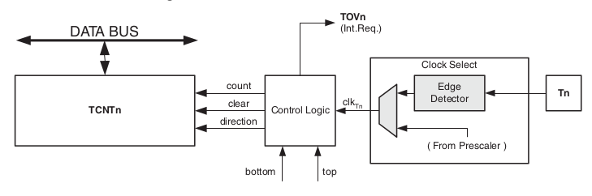
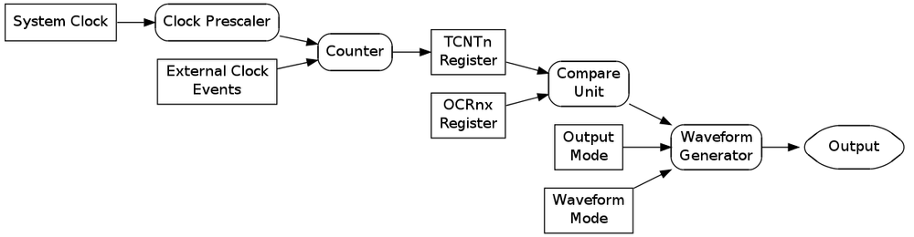
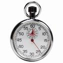

## Timers/Counters (deel 1 zonder PWM)

Ter herhaling, er zijn 3 basis-elementen bij AVR (en MCU's in het algemeen) waarop de alle andere "features" (zoals o.a. PWM, ADC, UART, I2C, SPI, ...) zijn gebaseerd:

* **GPIO**  
  Rechtstreeks manipuleren van en in- en uitgangen via pinnen
* **Interrupts**  
  Opvangen van events met het gevolg asynchroon uitvoeren van code
* **Timers/Counters**  
  Het tellen en meten van (verlopen) tijd en eventueel verbinden van deze tijd aan specifieke acties of zelfs code (via interrupts)

Dit 3de basis-element - **Timers/Counters** - gaan we bekijken in dit hoofdstuk.  

> **Nota:**  
> De hardware/timer-setup in AVR heeft zeer veel configuratie-mogelijkheden die zelfs verschillen van welke van de 3 timers je gebruikt.  
> Deze cursus heeft als bedoeling het concept van een counter/timer uit te leggen zodat je in AVR of zelfs een ander platform zelfstandig kan werken aan de hand van de datasheet.  
> Daarom leggen we de grondbeginselen en principes uit binnen dit hoofdstuk, voor meer specifieke details kan je altijd de datasheet lezen.


### Duiding en herhaling: wat is een teller (counter)

We starten bij het basis-element, de counter (zonder voorlopig rekening te houden met het timing en interrupt-aspect).  
Wat is een teller (counter)?    

* Het is een **hardware-component** (en 1 van vele registers)
* Het bevindt zich in de meeste **moderne MCU's**
* **Telt** in al zijn eenvoud **events**.  
  (events wil zeggen in de betekenis van MCU's **elektrische pulsen**)
* Telkens wanneer een **puls** wordt **geregistreerd**
* Verhoogt de waarde **verhoogt** de waarde van deze teller **met 1**.

### Werken met een teller (configuratie)

Als je werkt met timers zijn er **3 niveaus** van **configuratie** van belang:

```
+-----------------------------------------------------------------------------------+
|                    +--------------------+      +--------------------+             |
|                    |                    |      |                    |             |
|                    |   Source-select    +--+---+      Prescale      |             |
| IN                 |   (trigger)        |  |   |                    |             |
|                    |                    |  |   |                    |             |
|                    +--------------------+  |   +---------+----------+             |
+--------------------------------------------|--------------------------------------+
|                                            |                                      |
|                                            v                                      |
|                                  +---------+----------+                           |
|                                  |                    |                           |
| COUNT                            |       Count        |                           |
|                                  |                    |                           |
|                                  |                    |                           |
|                                  +---------+----------+                           |
|                                            |                                      |
+--------------------------------------------|--------------------------------------+
|                                            v                                      |
|        +--------------------+    +--------------------+    +--------------------+ |
|        |                    |    |                    |    |                    | |
| OUT    |    Interrupt       +<---+      Compare       +--->+      Output        | |
|        |                    |    |                    |    |                    | |
|        |                    |    |                    |    |                    | |
|        +--------------------+    +--------------------+    +--------------------+ |
------------------------------------------------------------------------------------
```

* **IN**: Wat is **bron/trigger** om te tellen?
* **COUNT**: Het eigenlijke **tellen**, configuratie, **lezen van** en **initialisatie** van de teller
* **OUT**: Reageren op **teller-events** en eventueel output te genereren


#### IN

Een counter (zoals we deze kennen uit de lessen digitale) telt **events** komende van een **source** (in meeste gevallen een klok):

```
                         +--------------+        
                         |            Q +==0:8==>
                         |              |        
                         |              |        
                         |   COUNTER    |        
       +-----------+     |              |        
       |           |     |              |        
       | PRESCALER |     |           UP <--------+
       |           |     |              |
 +-----> C         |     |              |
       |           |     |              |
       +-----------+----->  CE        D <==0:8===+
                   +-----> C          L <--------+
                         +------+-------+
```

2 **configuraties** zijn belangrijk hier:

* **Source-select** (en trigger)  (C)
  De teller heeft een **source** of **bron** (input-signaal) nodig waarvoor hij events gaat tellen.  
  Dit kan een **externe** ingang zijn, maar dikwijls is dit een **interne klok** van de MCU (meestal systeem-klok van de MCU).
* **Prescale** (of klokdeling)  (C en CE)
  Om de snelheid van deze teller te manipuleren (vertragen) kan er meestal een klokdeling of prescaling worden geconfigureerd.  

#### COUNT

De waarde van de teller wordt dan opgeslagen in een **buffer** die je ten alle tijden kan uitlezen en in de meeste gevalen ook kan **resetten** naar een **startwaarde**

```
      +--------------+        +--------------+       
      |            Q +==0:8==>|              |
      |              |        |              |        
      |              |        |              |        
      |   COUNTER    |        |    CPU       |        
      |              |        |              |        
      |              |        |              |        
      |           UP <--------+              |
      |              |        |              |
      |              |        |              |
      |              |        |              |
+----->  CE        D <==0:8===+              |
+-----> C          L <--------+              |
      +------+-------+        +--------------+
```

Een basis klok-ingang:

* Een **klok-ingang** (C)  
  Die **pulsen/signalen** geeft aan de counter om de volgende actie uit te voeren (meestal tellen).  
* Een **clock enable** (CE)
  Deze wordt meestal gebruikt voor/door een **prescaler** of om tellers aan elkaar te koppelen (MSB-counter wordt hieraan gekoppeld)

Configuratie:

* Een **direction-input** (UP)  
  Je kan via deze input beslissen of je **optelt- of aftelt**
* Een **start-waarde** (D) die bijvoorbeeld in geval van **reset** wordt gebruikt  
* Als je de counter dan wil resetten kan je **load**-flag aanzetten (synchroon op de klok)

Counter-waarde:

* De **output** (Q)  
  Een vector-uitgang met de telwaarde

> Een ander aspect - waar we later nog op terugkomen - is het overflow-gedrag.  
> Wat gebeurt er als de counter aan zijn maximum-waarde komt  


#### COMPARE

Je kan vanuit de CPU rechtstreeks de telwaarde gebruiken en controleren maar je kan
meestal ook comparatoren een groot deel van het werk voor jou laten doen:  

* Interrupts triggeren wanneer een bepaalde waarde is bereikt
* Reset te initieren op de teller
* Rechtstreeks een output aansturen


```
            +--------------+        +--------------+
 Q +==0:8===>        CV[n] +==0:8===>              <==0:8== Q
            |              |        |              |
            |              |        |              |        
            |    CPU       |        |    COMPARE   |        
            |              <--------+ I   UNIT     |    
            |              |        |       |      |      +---------+  
UP <--------+              |        |--------------+------> l       |
            |              |        |       |      |      | COUNTER |
            |              |        |       V      |      |
            |              |        |     OUTPUT   |      +---------+      
 D <==0:8===+              |        |              |           (BLOCK)
 L <--------+              |        |         O[n] +---------> (PWM)
            +------+-------+        +--------------+
```

### AVR beschikt over 3 counter/timers

Ter voorbeschouwing:

* De AVR atmega328p bevat **3 counter/timers** waarvan
    * **2 8-bit**-tellers: Timer/Counter 0 en 2
    * **1 16-bit**-teller: Timer/Counter 1
* Vanzelfsprekend wordt hiermee gecommuniceerd over **memory-mapped IO** (registers)
* **Belangrijk**: De **tellers** zijn **onafhankelijk** van de **CPU**  
  maw Het tellen en bijgevolg meten van tijd neemt geen **CPU-cycles** in.  

> **Nota:**  
> Zoals je direct gaat zien zijn de timer en counter 2 onafhankelijke concepten in de AVR-architectuur.
> Vandaar dat men niet zomaar timer zegt in de datasheets

### Counter in AVR Atmega

Het centrale element (eigenlijke counter) van AVR wordt in de datasheet als volgt voorgesteld.



Deze teller is beschikbaar voor de DATA-bus via het register TCNTn (waar n staat voor de nummer van de timer)

We gaan met een paar code-voorbeelden bekijken om te bekijken hoe dat je dit bestuurt.  

### Voorbeeld counter => tellen van een externe input

Een eerste voorbeeld, een counter gebruiken om de klok-pulsen een extern signaal...  
We gebruiken hiervoor een opstellen met een button.


**De basis-opstelling:**  

* Een knop om een de pin T0 (zelfde locatie als PD4) aan te sturen
* 8-tal ledjes om de binaire waarde te vertonen


**De bedoeling/functionaliteit:**

* De counter gaat het **aantal pulsen** tellen (tellen op stijgende flank)
* Deze pulsen worden gegenereerd door op de **knop/button** te drukken
* De software zal deze waarde **binair via deze leds** tonen

> **Nota**:  
> Als de configuratie van de pinnen (input en output) chinees lijkt gelieve
> zo snel mogelijk de intro op AVR te herhalen...

We passen de volgende code toe:

```c
//avr-gcc-p
#include <avr/io.h>

int main(void)
{
    //the complete B-bank can be confiured as output
    DDRB = 0xFF;

    //configure the external pin (input & pull-up)
    DDRD &= ~(1 << PD4);
    PORTD |= (1 << PD4);

    //setting chip-select-bits to select externe clock
    TCCR0B |= (1 << CS02) | (1 << CS01) | (1 << CS00);
    while (1) {
        PORTB = TCNT0;
    }
    return 0;
}
```

**Het resultaat:**

* Dit programma zal de **binaire representatie** op de leds **per button-click** optellen.  
* Let wel dat we hier rekening moeten houden met "button-bounce" en het tellen soms een paar stappen kan overslagen (afhankelijk van button).

**Het verloop van het programma:**

* Initialiseert alle pinnetjes van bank DDRB als output
* Initialiseert pin PD4 als input en activeert het pullup-register
* Het configureert via het configuratie-register TCCR0B
* Het kopieert de waarde van deze teller in de bank B (beide zijn 8 bit registers)

Belangrijk hieruit te onthouden is dat we **2 nieuwe registers** hebben gebruikt

> **Nota**:  
> Hoewel dit niet echt gebruikelijk is (en ook niet echt stabiel rekening houdende met button bounce) illustreert dit programma dat je éénvoudig een teller kan aansturen vanuit registers.

#### Duiding: Configureren van de counter (met TCCR0B)

Het eerste register dat we tegen kwamen was **TCCR0B** (Timer/Counter Control Register B)  
Dit is 1 van de 2 registers die we gebruiken voor het configureren van de counter (het A-register zien we bij volgende voorbeelden).  

> **Nota**:   
> Er bestaat ook een 2de configuratie register TCCR1A dat we hierna gaan gebruiken.    
> De andere counter/timer-componenten hebben parallelle namen  
> (TCCR1A/TCCR1B en TCCR2A/TCCR2B)

```
TCCR0B |= (1 << CS02) | (1 << CS01) | (1 << CS00);
```

De 3 macro's - **CS00** en **CS01** en **CS00** - zijn eigenlijk **mnemomics** voor de **3 LSB** (rechtse) bits van het **TCCR0B-register**.  
Deze 3 LSB-bits worden de **clock-select**-bits (of flags) genoemd, en de combinatie van deze 3 bits bepaalt het volgende:

* Werken met interne of externe klok
* In geval van externe klok of men telt bij dalende of stijgende flank  
  (in dit geval simuleren we een externe klok met een button)
* In geval van interne klok welke prescaler (zien we later)   

De 3 waardes die in dit stadium relevant zijn:

* ```000```: Geen klok (dus teller niet actief) dit is ook de default-waarde
* ```110```: Externe klok op t0-pin met count op dalende klok.
* ```111```: Externe klok op t0-pin met count op stijgende klok.

> **Nota:**  
> Als oefening bekijk in de datasheet van atmega328p de documentatie over TCCR0B (15.9.2)  
> Zoek ook naar de tabel die de verschillende mogelijkheden van clock-select bevat

#### Duiding: lezen van de huidige waarde van de teller (met TCNT0)

De waarde van counter 0 kan je uitlezen via het register TCNT0 zoals in voorgaand voorbeeld.  

```c
PORTB = TCNT0;
```

Gezien hier beide 8-bit registers zijn kan je deze aan elkaar gelijk stellen.

> **Nota**:   
> Let wel, later gaan we ook nog de 16-bit teller bekijken.

### Duiding: overflow

Deze teller is beperkt tot 8 bits (0...255).  
Als je lang genoeg op de button drukt (tot aan de maximum waarde 255) zullen de leds terug de waarde 0 bereiken.  

Deze counter zet zich automatisch - na het bereiken van deze maximum waarde - de volgende count terug naar de initiële waarde.  Men noemt dit gedrag **overflow**.

Ter voorbereiding.  
In de datasheet spreekt men - gerelateerd aan overflow - ook van 3 waarde-definities (let op hexadecimaal...):

* **BOTTOM**  
  De counter geraakt aan de bodem wanneer hij de waarde 0x0 bereikt
* **MAX**  
  De counter geraakt aan het maximum wanneer hij de waarde 0xff (8-bit) en 0xffff (16-bit) bereikt.  
  maw de maximum waarde dat het counter-register kan bevatten
* **TOP**  
  De counter bereikt alvorens een overflow te genereren een ingestelde maximum waarde.  
  Deze waarde noemt de *TOP*-waarde en is gerelateerd aan de CTC-mode

> **Nota:**  
> In de niet-PWM-modussen telt de counter telt enkel naar boven.  
> Als je de de counter wil laten aftellen moet je dit omrekenen.  

### Duiding: CTC-mode

Je kan dit gedrag (overflow) echter ook controleren door met een "top-waarde" te configureren.  
Via een ingebouwde comparator zal dan de clear (naar 0 plaatsen) worden ingeschakeld wanneer de teller deze top-waarde bereikt.  

Hiervoor dien je wel de **CTC-mode** te activeren (Clear Timer on Compare Match).  
Deze activeert deze comparator en de hardware zal dus de teller gaat clearen nadat je een bepaalde waarde bereikt

De andere modus waar we in het voorgaand voorbeeld met werken noemt **normal mode**, deze is dan ook de default-modus.  

> **Nota:**  
> Er zijn ook nog andere modussen maar daar komen we later op terug als we bij PWM komen (step-by-step).

Deze waarde wordt dan geconfigureerd in het **OCR0A**-register en kan gedurende de looptijd van het programma worden aangepast.

### Voorbeeld counter => tellen tot een bepaalde (TOP-)waarde

Eerder hebben we gezien dat binnen een counter/timer een comparator-functionaliteit is voorzien.  
Je kan deze bijvoorbeeld gebruiken om een reset te configureren van de teller naar 0 éénmaal een bepaalde waarde is bereikt.

Dan kan je bijvoorbeeld voorgaand voorbeeld aanpassen om te tellen tot 10 (ipv tot 255):

```c
#include <avr/io.h>

#define TELLEN_TOT    10

int main(void)
{
    DDRB = 0xFF;
    DDRD &= ~(1 << PD4);
    PORTD |= (1 << PD4);

    //CTC-still external clock (or input)
    TCCR0B |= (1 << CS02) | (1 << CS01) | (1 << CS00);

    //configuring  van CTC-mode
    TCCR0A &= ~(1 << WGM00);
    TCCR0A |= (1 << WGM01);
    TCCR0B &= ~(1 << WGM02);
    // pay attention => ctc-mode spread over 2 registers

    //setting the TOP-value
    OCR0A = TELLEN_TOT;

    while (1) {
        PORTB = TCNT0; //making leds represent the counter-value
    }
    return 0;
}
```

Als alles goed loopt zal er het volgende gebeuren:  

* Eenmaal de teller (en TCNT0) de waarde 10 moet bereikt (00001010) zal TCNT automatisch resetten naar naar 0 (00000000) bij het volgende *event*
* Het gevolg is dat de leds na de waarde 10 (00001010) zullen overflowen naar de waarde 0 (00000000)

Nieuw is dat we hier de CTC-mode gebruiken (clear timer on compare...)

#### Duiding: configureren van de comparator registers (WGM-bits)

Om CTC-modus te kunnen configureren zijn er 2 assignment-statements toegevoegd aan het vorige voorbeeld:

```c
    TCCR0A &= ~(1 << WGM00);
    TCCR0A |= (1 << WGM01);
    TCCR0B &= ~(1 << WGM02);
```

Voor deze mode te configureren moet je de **WGM-bits (of flags)** configureren.  
WGM staat voor "waveform generation mode" waar waveform verwijst naar het gebruik van timers om met PWM te kunnen werken (maar daar komen we later nog op terug).  

Zoals je kan zien in bovenstaande code (en in de datasheet) zijn deze 3 flags verspreid over de 2 configuratie-registers.  
Als je in de datasheet kijkt zie je een tabel met alle mogelijke combinaties (zoek ook als oefening deze tabel op), van deze tabel zijn er 2 relevant voor deze fase:

* ```000``` voor normal mode (deze is ook de default mode)
* ```010``` voor ctc-mode (degene die we nu bekijken)

> **Nota:**  
> Bij deze voorbeelden zie je ook hoe belanrijk het is van met bitmasks te kunnen werken.  
> Als je deze code niet kan verstaan, gelieve terug het hoofdstuk rond bitmasking te herhalen

#### Duiding: initialiseren van compare-waarde (OCR0A)

```c
OCR0A = TELLEN_TOT;
```

Bedoeling was natuurlijk van maar te tellen tot 10:

* We gebruiken hiervoor een register dat deze waarde bijhoudt, **OCR0A**
* Deze waarde moet gelijk zijn aan het maximum getal dat je op de leds wil zien verschijnen.  
  (counter zal dus effectief tot de waarde geconfigureerd in OCR0A tellen)

OCR0A staat voor **O**utput **C**ompare **R**egisters (0 staat voor het nummer van de timer/counter).  
Er bestaat ook nog een OCR0B-register, hier komen we nog later op terug.

> **Nota**:  
> Equivalente registers bestaan ook voor de andere counter/timers
> 0CR1A en OCR2A

### Van counter naar timer

**Tot nog toe** hebben we deze hardware enkel gebruikt als een gewone **teller**.  
Wat we eigenlijk deden was het simuleren van een externe klok via een button.  
In praktijk echter ga je een externe klok koppelen aan deze pin.  

Er is echter ook de mogelijkheid van de **interne systeem-klok** te gebruiken.  
Als je dan deze  als je deze pulsen toepast op een bekende (en constante) snelheid, wordt deze teller ook een timer.



### Voorbeeld: tellen met een timer


**Opstelling:**  

* We starten met dezelfde setup als daarnet (8 leds)
* De button hebben niet meer nodig (voor nu)

We starten met bijna dezelfde code als het allereerste voorbeeld maar we linken deze keer niet naar de input op PD4 (button).   
In de plaats daarvan gebruiken we een andere clock-select-mode ```001```.

Deze modus (kijk ook naar de datasheet) gebruikt de systeem-klok om de events voor de teller te genereren.  
maw telkens de klok hoog gaat zal de teller een puls krijgen.


```c
#include <avr/io.h>

int main(void)
{
    DDRB = 0xFF;
    TCCR1B |= (1 << CS10);
    TCCR1B &= ~ (1 << CS11 | 1 << CS12);
    while (1) {
        PORTB=TCNT1;
    }
    return 0;
}
```

**Code:**  
De code is vergelijkbaar met ons eerste voorbeeld maar:

* We gebruiken **counter/timer 1**  
  Je kan dit zien doordat we als configuratie-register TCCR**1**B gebruiken ipv TCCR**0**B  
  Het verschil is dat dit een 16-bit register is (dit gaat ons nog van pas komen bij de volgende
* Geen input-configuratie meer want we gebruiken een klok om de counter aan te sturen
* ```001``` wordt hier geconfigureerd ipv ```111``` voor de clock-select-bits  
  Deze waarde zorg er voor dat de teller aan de systeem-klok wordt gekoppeld (in dit geval 16 MHz)

**Resultaat:**  
Als je deze code uitvoert zal je zien dat alle lichtjes tegelijk branden, niet het verwachte resultaat, of net wel...  

We hebben deze code uitgevoerd **zonder prescaler** dit betekent dat de teller zal tellen met het ritme van de klok.  
Als je dit op een standaard klok uitvoert is dit 16 mHz (ofwel 16.000.000 keer per seconden).  

maw Je zal het optellen niet zien, enkel een vorm van PWM, namelijk de leds die minder hard branden omdat ze zeer snel alterneren

### Voorbeeld: tellen met prescaler

Tot nu toe hebben we de CS-flags gebruikt voor 2 soorten van instellingen:

* ```111``` om een externe timer aan te koppelen (stijgend flank - ```110``` is dalende flank)
* ```001``` om de systeem-klok aan te koppelen   

We kunnen deze systeem-klok echter afleiden naar een trager signaal (klok delen) door een **prescaler** in te stellen.  
(zoals we hebben gezien in de lessen digitale sequentiële)

Deze CS-flags (clock-select) kan je dan ook gebruiken

```c
#include <avr/io.h>

int main(void)
{
    DDRB = 0xFF;
    TCCR1B |= ((1 << CS10) | (1 << CS12));
    TCCR1B &= ~(1 << CS11);
    while (1) {
        PORTB=TCNT1;
    }
    return 0;
}
```
**Code:**  

* We gebruiken nu ```101``` ipv ```001```
* ```101``` komt overeen een **prescaler** van 1024 (kijk na als oefening in datasheet)
* Dit houdt in dat de systeem klock vertraagd/gedeeld wordt met een factor 1024
* 16 MHz/1024 = 15625 Hz = 1 tel/64 µs

**Resultaat:**  

Het resultaat zal echter niet veel verschillen van vorige keer.  
De teller zal evolueren met een snelheid van +- 15 KHz (of 1 tel per 64 µs) hetgeen ook nog niet zichtbaar is met het blote oog.  

Dit is nog altijd niet bruikbaar maar we hebben nu een nieuw mechanisme gebruikt dat ons kan helpen een exacte timing te bereiken.  

### Voorbeeld: exact timen met prescaler

Vorig voorbeeld was niet echt bruikbaar omdat de klok en bijgevolg de teller te snel gaat om zichtbaar te zijn.  
In volgende voorbeelden gaan we echter leren de timer te gebruiken.



Stel bijvoorbeeld, dat we onze leds enkel willen (exact) laten alterneren (of incrementeren) per seconde?  
Hiervoor wijzigen we het **principe** van het programma als volgt:

* We gebruiken TCNT1 niet meer rechtstreks als **teller** maar als **timer**
* We **rekenen** uit hoeveel **"ticks"** het duurt voor een seconde
* We verhogen de waarde van PORTB met 1 als deze dit aantal ticks bereikt

**Probleem**: grootte van registers

Als we de **systeem-klok** zouden gebruiken (**16 mHz** bij Arduino-configuratie) zouden we onze code tot 16000000 laten tellen om aan een seconde te raken. Het tel-register (TCNT1) is echter **maar 16 bits** groot dus:

* Dit betekent (rekening houdende dat dit register unsigned is) we maar tot ```(2^16 - 1) = 65535``` kunnen tellen
* Dit komt overeen met een **maximum bereik** van ```65535 / 16 000 000 s = 0.004096 s =  ~ 4 ms```
* Je kan ook uitrekenen hoeveel dit zou zijn als je maar een 8-bit register zoals bij de andere timers zou hebben

**Oplossing**: prescaling

* We gebruiken een **prescaling** de **klok** kunnen **delen**
* Bij een prescaler van **1024** kan je op **15625 Hz** draaien (zie vorige voorbeeld).   
* Aangezien we nu met een **16 bit** count werken
* Hebben we **15625** tellen of ticks nodig om een **seconde** te benaderen.

```c
#include <avr/io.h>
#include <avr/interrupt.h>

#define TICKS_OM_AAN_SECONDE_TE_RAKEN      15625

int main(void)
{
    DDRB = 0xFF;
    TCCR1B |= ((1 << CS10) | (1 << CS12));
    TCCR1B &= ~(1 << CS11);
    while (1) {
        if(TCNT1 >= TICKS_OM_AAN_SECONDE_TE_RAKEN - 1) {
            PORTB = PORTB + 1;
            TCNT1 = 0;
        }
    }
    return 0;
}
```

**Werking**:  

* Wanner de teller 15624 bereikt (15625 - 1 gezien we vanaf 0 tellen)
* Is er een seconde voorbij
* Verhogen we PORTB
* De teller wordt gereset (terug van 0 starten)

**Resultaat**:  

Het programma zal nu de waarde van PORTB telkens **verhogen** met **1 per seconde**.  
(bij het bereiken van de maximum-waarde 255 voor PORTB zal trouwens ook een overflow gebeuren)

### Voorbeeld: timen met TIFR1

Een **alternatief** op bovenstaande code is het gebruik van de **compare**-functionaliteit.  
Hiervoor kunnen we het register **TIFR1** gebruiken, dit register bevat een aantal flags die worden geactiveerd als specifieke events gebeuren.  

Onderstaand voorbeeld:

* Zal continue nakijken als de flag **OCF1A** in **TIFR1** wordt gezet
* Indien zo zal deze incrementeren

```c
#include <avr/io.h>
#include <avr/interrupt.h>

# define TICKS_OM_AAN_SECONDE_TE_RAKEN      15625

int main(void)
{
    DDRB = 0xFF;
    TCCR1B |= (1 << CS10) | (1 << CS12);
    TCCR1B &= ~ (1 << CS11);

    TCCR1B &= ~(1 << WGM13);
    TCCR1B |=  (1 << WGM12);
    TCCR1A &= ~((1 << WGM10) | (1 << WGM11));

    OCR1A = TICKS_OM_AAN_SECONDE_TE_RAKEN;

    while (1) {
        if(TIFR1 & (1 <<OCF1A)) {
            PORTB = PORTB + 1;
            TIFR1 = (1 << OCF1A);
        }
    }
    return 0;
}
```

### Duiding: TIFR-register en interrupts

**TIFR1** uit voorgaand voorbeeld staat voor **T**imer/Counter**1 I**nterrupt **F**lag **R**egister
Dit is een register dat wordt "ge-refreshed" telkens een event gebeurt gerelateerd aan de counter.  
In voorgaand voorbeeld zie je bijvoorbeeld de flag **OCF1A** die aangeeft of het compare-register 1 de waarde van **OCR1A** (zie eerder) heeft bereikt.
(zie de datasheet voor meer details en overeenkomstige flags).

Wel belangrijk is dat je deze flags wel moet clearen.  
Ook zeer **specifiek** voor dit register is dat als je flags wil clearen je deze moet **setten** (logische 1 schrijven) opdat het wordt **gecleared** (logische 0), zie voor meer details ook in de datasheet).

Dit **TIFR**-register (zie ook andere counters) worden **echter** over het algemeen **niet rechtstreeks** gebruikt door je **code** maar eerder gebruikt bij **interrupt**-afhandeling.

In het volgende voorbeeld gaan we TIMSK1 gebruiken om interrupts te genereren.

### Duiding: Interrupts gerelateerd aan timers

Interrupts gerelateerd aan timers volgen het zelfde patroon dat we reeds hebben gezien bij pin-interrupts:

* Algemene activatie via sei() (enablen van globale interrupt-mechanisme)
* Maskeren en activeren van de interrupts via een mask-register, in dit geval **TIMSK1**   
  **T**IMER **I**NTERRUPT **M**A**SK**-register **1**
* Het schrijven van de interrupt-code aan de hand van een **ISR-macro**  
  (in de datasheet vindt je deze mapping van deze interrupt-vector-codes, zie ook vorige les)

Belangrijk te onthouden is dat we niet 1 maar 3 interrupts kunnen activeren via dit register:

* Het bereiken van **overflow**
* Het bereiken van de waarde in **OCR1A**
* Het bereiken van de waarde in **OCR1B**

> **Nota:**  
> Er is inderdaad een 2 de compare-regiser **OCR1B**.  
> We komen later nog terug op dit register in het hoofdstuk over pwm.  

### Voorbeeld: timers en interrupt op counter

We kunnen het voorgaand voorbeeld gemakkelijk herwerken om met timers te werken.  
Het verschil met voorgaande code

* Activeren van de correcte interrupt via **TIMSK**
* Activeren van alle interrupts via **sei()** (zie vorige les ivm interrupts)
* Verplaatsen van het het **optellen** naar een **interrupt-vector**
* **Verwijderen** van de **poll**- en **reset**-code rond **TIFR1**

```c
	#include <avr/io.h>
	#include <avr/interrupt.h>

	# define TICKS_OM_AAN_SECONDE_TE_RAKEN      15625

	int main(void)
	{
		  DDRB = 0xFF;
		  TCCR1B |= (1 << CS10) | (1 << CS12);
		  TCCR1B &= ~ (1 << CS11);

		  TCCR1B &= ~(1 << WGM13);
		  TCCR1B |=  (1 << WGM12);
		  TCCR1A &= ~((1 << WGM10) | (1 << WGM11));

		  OCR1A = TICKS_OM_AAN_SECONDE_TE_RAKEN;

		  TIMSK1 |= (1 << OCF1A);
		  sei();

		  while (1) {
		      //niets te doen tijdens loop
		  }
		  return 0;
	}

	ISR(TIMER1_COMPA_vect)
	{
		  PORTB = PORTB + 1;
	}
```

**Het resultaat** is idem aan de 2 vorige voorbeelden, de teller zal verhogen met 1 per seconde.  

### Voorbeeld: overflow-interrupt

Ter volledigheid, een andere soort interrupt is de overflow-interrupt.  
De interrupt die we nu gebruiken is een interrupt die bij overflow reageert, dit wil zeggen wanneer de teller (en het TCNT1-register) aan zijn maximale waarde geraakt.   

Deze maximum waarde hangt af van het de precesie van van het tel register:

* **256** voor **8**-bit
* **65535** voor **16**-bit registers

```c
#include <avr/io.h>
#include <avr/interrupt.h>

int main(void)
{
    DDRB = 0xFF;
    TCCR1B |= (1 << CS10) | (1 << CS12);
    TCCR1B &= ~ (1 << CS11);

    TIMSK1 |= (1 << TOIE1);
    sei();

    while (1) {
        //niets te doen tijdens loop
    }
    return 0;
}

ISR(TIMER1_OVF_vect)
{
    PORTB = PORTB + 1;
}
```

**De code:** is identiek aan het vorige voorbeeld met 2 kleine verschillen:

* Een andere flag, namelijk **TOIE1** ipv OCF1A, wordt aangeduid in het TIMSK1-register
* Je moet de equivalente interrupt-vector gebruiken, namelijk **TIMER1_OVF_vect**

### En verder?

We komen later nog terug op timers in PWM dat zeer sterkt steunt op deze counter/timer-infrastructuur
