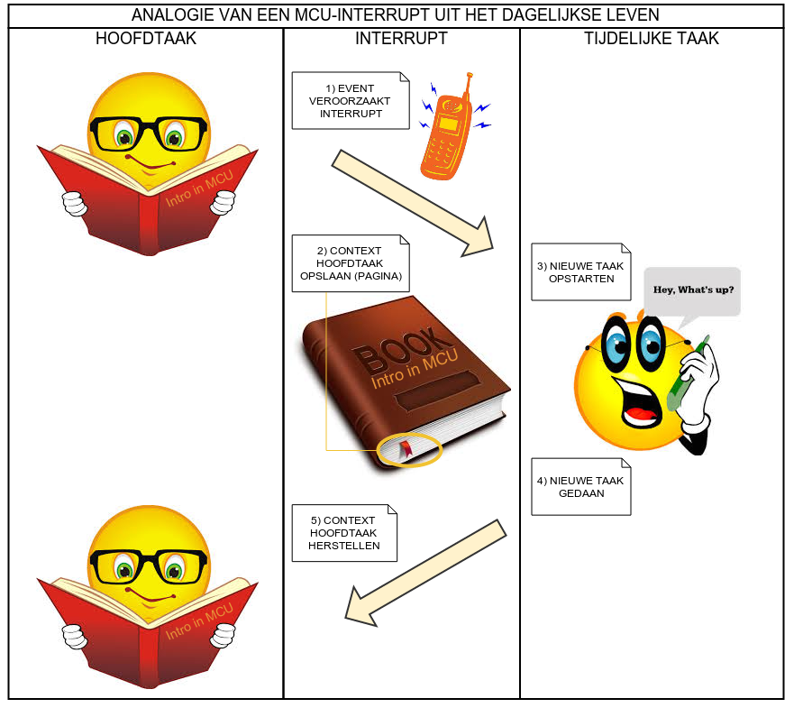
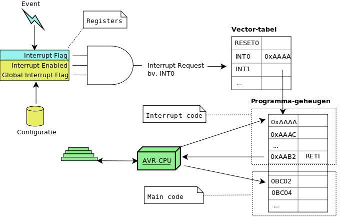

## Interupts

Eén van de belangrijkste vaardigheden in het embedded hardware in het werken met MCU's is proberen zo veel mogelijk de aanwezige hardware te gebruiken.  
Dit houdt onder andere in:

* **Memory-mapping** kennen en gebruiken
* De **datasheet** lezen om te weten wat er beschikbaar is
* Algemene gebruikte **protocollen** zoals i2c, spi en uart kennen
* Het concept van **interrupts** en **timers** goed te kennen

Het eerste dat we geleerd hadden bij AVR is hoe correct gpio-registers te manipuleren.  
Het volgende aspect dat we in dit hoofdstuk gaan zien is het begrijpen en werken met de **interrupt-architectuur** van een MCU (AVR in dit geval)

> **Nota:**  
> In de meeste aspecten die we nu gaan zien rond AVR (komende hoofdstukken) zal dit aspect steeds terugkomen.

### Duiding: wat zijn interrupts

Eén van de meest fundamentele en bruikbare principes van de moderne embedded processoren zijn interrupts.  
In een notendop een interrupt is:

* Een stuk **uitvoerbare code** in het programma-geheugen
* Dat niet specifiek wordt aangeroepen (of toch niet rechtstreeks) door andere code 
* Maar wordt aangeroepen/geactiveerd door een **event**.  
  
In geval van MCU's zijn deze meestal afkomstig van hardware (bijvoorbeeld spanning op een pin die wijzigt, timer, ...) maar voor complexere systemen kunnen deze ook door software worden gegenereerd.

Tot nog toe hebben we enkel een event-loop geprogrammeerd, het hoofdprogramma.  
Het interrupt-mechanisme in een MCU (of andere computer-systeemookKortom) zal echter deze loop kunnen ond, een interrupt is een manier om:

* Ten gevolge van zo'n event 
* De activiteit van de huidige processor pauzeren (event-loop) 
* Zodat het een korte taak (stuk code) kan voltooien 
* En er voor zorgen dat de taak (die gepauzeerd was)  
  kan hervatten waar het gebleven was.  

### Duiding: interrupts in de echte wereld (analogie)

Als illustratie is het principe van interrupts gemakkelijk te beschrijven in een analogie uit het dag-dagelijkse leven:

* Laten we zeggen we zijn een goed boek aan het lezen (liefst een boek of cursus ivm microcontrollers)  
  Dit vereist al onze aandacht, dus we zijn geen andere activiteiten aan het uitvoeren
* Echter, halverwege het boek, rinkelt de telefoon rinkelt.  
* We zorgen dat we de pagina onthouden  
  (door er bijvoorbeeld een papiertje tussen te plaatsen)
* We voeren onze (korte) taak uit;,we beantwoorden de telefoon op
* Daarna hervatten we het lezen van onze boek op de zelfde manier



Wat wij doen wordt ook wel genoemd **asynchrone verwerking**:

* We verwerken van de interrupt buiten de reguliere taak van het hoofdprogramma (het boek lezen)
* De interrupt (telefoon-bel) is een event die het hoofdprogramma stopt
* We slagen de staat op van ons programma (pagina van het boek en eventueel wat nota's) 
* Nadien kunnen we (na het telefoongesprek) het boek terug kunnen hervatten met wat we onthouden hebben

### Duiding: hardware- vs software-interrupts

Nu even terug naar de computerwereld.    
In een computer-systeem (MCU is ook een computer-systeem) kunnen deze interrupts vanuit 2 soorten events ontspringen:

* **Hardware**  
  Dit is het equivalent van een telefoonbel uit het vorige voorbeeld.  
  Een electrisch signaal (pin), een interne timer die afloopt, een boodschap die binnenkomt via UART, ...
* **Software**   
  Interrupts geactiveerd door een andere programma, dit komt meer voor bij computersystemen met een OS

> **Nota:**  
> Software-interrupts worden niet ondersteund door AVR 8-bit processoren waar we met werken.  
> We gaan deze ook niet verder bekijken in de context van MCU's.  
> Dit is eigenschap die je gemakkelijker gaat terugvinden bij 32-bit platformen waar veelal met een operating sytem wordt gewerkt.

### Duiding: Interupts in AVR

AVR ondersteunt een heel grote variëteit aan  hardware-interrupts:  

* Pin interrupts (wijzigingen op de spanning op een pin)
* Timer interrupts (een teller die een specifiek specifiek tijdsverloop kan opmeten)
* Interrupts gerelateerd aan seriële protocollen) i2c, spi, uart, ...
* Interrupts gerelateerd aan ADC 
* ...

De volledige lijst kan je zien in de vector-tabel die direct wordt besproken of voor nog meer details in de datasheet van de atmega328p (mcu op Arduino).  
In dit deel verduidelijken we enkel de pin-interrupts, geleidelijk aan komen we terug op de andere interrupts.  

### Duiding: werking van interrupts (overzicht)

Om met interrupts te werken zijn er een aantal belangrijke stappen die we moeten bekijken (voordat we in de code duiken).  

> **Nota:**  
> Het mag geen verassing zijn dat we hier opnieuw terug gaan vallen op registers.  

In het schema hieronder zie je een overzicht van deze stappen en de elementen die hiervoornodig zijn:



* *Stap: definieren van een interrupt*   
  Dit houdt in een stuk uitvoerbare code associeren met een type van event.    
  In de meeste platformen wordt (zeker voor hardware-interrupts) hiervoor een **Interrupt Vector-Table** gebruikt.   
  Deze tabel (die in een aparte locatie in het geheugen zit bij AVR) is een tabel met referenties naar code die moet worden uitgevoerd als een     bepaalde event zich voordoet.   
* *Stap: activeren (en configureren) van een interrupt*   
  Hiervoor gebruiken wat we noemen de **Interrupt Enabled Bit**.   
  Dit zijn bits in de registers die we gebruiken om een specifieke interrupt te activeren of te desactiveren (enable/disable), met andere woorden of de MCU moet reageren op het specifiek event.   
  Een voorbeeld dat we later gaan terugzien is de PCICR (of Pin Change Interrupt Control Register)  
  We komen hier in de voorbeelden nog op terug (registers, waarden, ...) 
* *Stap: activeren van alle interrupts*   
  Je kan alle interrupts ook tegelijkertijd activeren of deactiveren.   
  Dit kan via de **Globale Interrupt Enable-flag** (of ook wel I-bit genoemd) binnen het SREG-register (7de bit).   
  Deze staat by default op non-actief, deze moet je altijd via code activeren als je wil met interrupts werken.   
  Deze interrupt wordt meestal niet rechtsreeks gemanipuleerd (set/clear) vanaf de code maar via specifieke instructies (zie later)
* *Stap: detecteren van de interrupt*   
  Dit is een taak van de hardware, deze zal een flag activeren die we **Interrupt Flag Bit** (per interrupt)   
  Deze soort van interrupts maken ook deel uit van register zoals bijvoorbeeld de PCIFR (Pin Change interrupt flag)
  Hoewel niet gebruikelijk kan je deze flag ook via software (manueel) zetten. 
* *Stap: uitvoeren van de code*   
  Als deze flag aangezet wordt zal de hardware de volgende stappen uitvoeren:
     * Uitschakelen van de **Globale Interrupt Enable-flag** (om te vermijden dat andere interrupts kunnen worden uitgevoerd)
     * De status van de huidige code bewaren in een stack-register (komen we later nog op terug)
     * Opzoeken van de code via de **Interrupt Vector-Table** en deze code uitvoeren
* *Stap: beindigen van de interrupt*   
  Hoewel de hardware de **Globale Interrupt Enable-flag** heeft afgezet moet de interrupt-code deze terug aanzetten.  
  In assembly-code (en machine-instructies) gebeurt door op het einde van de interrupt-code de RETI-instructie (return from interrupt) aan te roepen.  
  In onze voorbeelden gaan we dit niet moeten doen omdat we daar een macro kunnen gebruiken.

### Duiding: Overzicht van de AVR-interrupts (Atmega328p)  

Hieronder heb je een overzicht naar alle beschikbare interrupts (copy van de datasheet atmega168p die equivalent is aan atmega328p)  

* Het programma-adres is het adres binnen de **Interrupt Vector-Table**
* De vector-naam is de naam die je in de code gaat moeten gebruiken om interrupt-code te schrijven  
  (met behulp van macros)
  
Deze tabel zal je ook terugvinden als je naar de datasheet van de atmega328p gaat zoeken in de datasheet

| Programma-adres  | Source       | Vector-naam       | Beschrijving                   |
|------------------|--------------|-------------------|--------------------------------|
| 00               | RESET        |                   |                                |
| 02               | INT0         | INT0_vect         | External Interrupt Request 0   |
| 04               | INT1         | INT1_vect         | External Interrupt Request 1   |
| 06               | PCINT0       | PCINT0_vect       | Pin Change Interrupt Request 0 |
| 08               | PCINT1       | PCINT1_vect       | Pin Change Interrupt Request 1 |
| 0A               | PCINT2       | PCINT2_vect       | Pin Change Interrupt Request 2 |
| 0C               | WDT          | WDT_vect          | Watchdog Time-out Interrupt    |
| 0E               | TIMER2 COMPA | TIMER2_COMPA_vect | Timer/Counter2 Compare Match A |
| 10               | TIMER2 COMPB | TIMER2_COMPB_vect | Timer/Counter2 Compare Match B |
| 12               | TIMER2 OVF   | TIMER2_OVF_vect   | Timer/Counter2 Overflow        |
| 14               | TIMER1 CAPT  | TIMER1_CAPT_vect  | Timer/Counter1 Capture Event   |
| 16               | TIMER1 COMPA | TIMER1_COMPA_vect | Timer/Counter1 Compare Match A |
| 18               | TIMER1 COMPB | TIMER1_COMPB_vect | Timer/Coutner1 Compare Match B |
| 1A               | TIMER1 OVF   | TIMER1_OVF_vect   | Timer/Counter1 Overflow        |
| 1C               | TIMER0 COMPA | TIMER0_COMPA_vect | Timer/Counter0 Compare Match A |
| 1E               | TIMER0 COMPB | TIMER0_COMPB_vect | Timer/Counter0 Compare Match B |
| 00               | TIMER0 OVF   | TIMER0_OVF_vect   | Timer/Counter0 Overflow        |
| 22               | SPI, STC     | SPI_STC_vect      | SPI Serial Transfer Complete   |
| 24               | USART, RX    | USART_RX_vect     | USART Rx Complete              |
| 26               | USART, UDRE  | USART_UDRE_vect   | USART, Data Register Empty     |
| 28               | USART, TX    | USART_TX_vect     | USART, Tx Complete             |
| 2A               | ADC          | ADC_vect          | ADC Conversion Complete        |
| 2C               | EE READY     | EE_READY_vect     | EEPROM Ready                   |
| 2E               | ANALOG COMP  | ANALOG_COMP_vect  | Analog Comparator              |
| 30               | TWI          | TWI_vect          | 2-wire Serial Interface        |
| 32               | SPM READY    | SPM_READY_vect    | Store Program Memory Ready     |


### Setup: Setup voor de praktijk-voorbeelden

Genoeg theorie, terug naar de praktijk.  
We hernemen de setup van de gpio-tutorial maar voegen hier 1 led aan toe:


We gaan van start met de code die we al eerder gebruikten.  
Nu we echter ervaren zijn met het gebruik van macro's maken we hier ook gebruik van.  

We starten met de volgende code (nog zonder interrupts)

```{.c}
#include <avr/io.h>
#include <util/delay.h>

#define DELAYTIME               200    // milliseconden                               
#define LED_PORT                PORTB
#define LED_DDR                 DDRB
#define LED0                    PB2

void initialiseer_de_pins() 
{
   LED_DDR = LED_DDR | (1 << LED0);
}

int main(void) {

  initialiseer_de_pins();
 
  while (1) {
    _delay_ms(DELAYTIME);
    LED_PORT ^= (1 << LED0);
  }
  return (0);
}

```

Deze code zal zorgen dat pin 2 op bank B zal blinken.

> **Nota:**  
> Op basis van het voorgaande hoofdstuk over bitmasks zou je perfect moeten weten wat deze code doet.  
> Mocht de code ```LED_PORT ^= (1 << LED0)``` niet duidelijk zijn (gelieve voorgaande hoofdstukken te herhalen)  

### Duiding: interrupt-macro's

We willen aan voorgaand voorbeeld een interrupt toevoegen.  

De taal C heeft zelf echter geen rechtstreekse support voor interrupts, hetgeen ook logisch is aangezien C als doel heeft platform-onafhankelijk te blijven (zonder platform-details).  

Dit is dus verschillend voor elk platform/compiler combinatie, meestal via macros, taalextensies (of beide).   
De omgeving die wij gebruiken, AVR-GCC, ondersteunt die ISR-macros (die de low level detals en extensies afschermen).    

Om deze te gebruiken moet je:  

* Toevoegen van een include van de header-file avr/interrupt.h
* Hierdoor kan je 2 macro's gebruiken  
    * De macro ISR (die 1 argument aanneemt)
    * Een vector die je ook kan selecteren uit deze header-file
* Na deze mag je een code-block toevoegen.  
  Die samen met de macro tot een functie zal worden expanded.  
  Hoe dit exact gebeurt zullen we in het 3de deel van de cursus bekijken als we bij de advanced topics komen.

```{.c}
#include <avr/interrupt.h>

ISR(INT0_vect) // interrupt die geactiveerd wordt telkens dat PD2 wijzigt
{
   //voeg hier je code toe
}
```

Belangrijk hier te noteren dat de functie die uit de macro komt geen return-statement mag bevatten.  
De code die uit deze macro wordt expanded zal een RETI-instructie bevatten.

> **Nota:**  
> In gevallen waar nodig is kan je dezelfde interrupt-code koppelen aan 2 interrupts door volgende code:  
> ```ISR(PCINT1_vect, ISR_ALIASOF(PCINT0_vect));```  

### Voorbeeld: het gebruik van pin-interrupts

Voorgaande code zal 1 led doen blinken.  

We willen nu de volgende functionaliteit toevoegen:  

* We intercepteren het klikken op de button op het schema
* Zolang deze button is ingedrukt zal de led gaan branden

Als je dit zou willen toepassen zonder interrupts zou je heel wat code moeten schrijven waarin je:

* Continue moet nakijken of de button is ingedrukt
* De tijd moet bijhouden (de delays moeten verdwijnen of zeer klein worden gehouden) om te weten wanneer je led moet branden

Je moet 2 **taken** in 1 taak hetgeen je code:  

* Onoverzichtelijk maakt
* Minder optimaal omdat je constant je processor moet bezighouden
  
Nu kunnen we echter onze bestaande code behouden en hoeven we enkel een extra stuk code.  
De 2 taken zitten mooi van elkaar afscheiden in volgene code (beter nog we hebben zelfs geen code moeten wijzigen).  

```{.c}
#include <avr/io.h>
#include <util/delay.h>
#include <avr/interrupt.h>


#define DELAY                   200
#define LED_PORT                PORTB
#define LED_DDR                 DDRB
#define LED0                    PB2
#define LED1                    PB3
#define BUTTON_PIN              PIND
#define BUTTON_PORT             PORTD
#define BUTTON                  PD2

ISR(PCINT2_vect)
{
    if (bit_is_set(BUTTON_PIN, BUTTON)) {
        LED_PORT |= (1 << LED1);
    } else {
       LED_PORT &= ~(1 << LED1);
    }
}


void initialiseer_de_interrupts() 
{
    PCICR  |= (1 << PCIE2);    // activeer de pin-interrupts voor de D-bank
    PCMSK2 |= (1 << PCINT18);  // masker om aan te duiden op welk pins er moet worden gereageerd
    // PCMSK2 |= (1 << PD2);   // minder officieel maar werkt ook
    sei();                     // activeer all interrupts
}

void initialiseer_de_pins() {
    LED_PORT |= (1 << LED1);
    BUTTON_PORT |= (1 << BUTTON);
}

int main(void) 
{
  initialiseer_de_pins();
  initialiseer_de_interrupts();
  LED_PORT |= (1 << LED1);
  while (1) {
    _delay_ms(DELAY);
    LED_PORT ^= (1 << LED0);
  }
  return (0);
}
```

In deze code zijn 3 belangrijke elementen te vermelden:  

* Je moet nog altijd de pin-initialisatie doen voor de button net als voor klassieke gpio-access
* Een vector is toegevoegd via de ISR-macro van het type ```PCINT2_vect```
* Deze interrupts moeten worden geinitialiseerd (zie procedure ```initialiseer_de_interrupts()```) 

### Duiding: configuratie van PIN-interrupts

De configuratie van deze interrupts gebeurt over 2 belangrijke 

```{.c }
void initialiseer_de_interrupts() 
{
    PCICR  |= (1 << PCIE2);   // activeer de pin-interrupts voor de D-bank
    PCMSK2 |= (1 << PCINT18); // masker om aan te duiden op welk pins er moet worden gereageerd
    // PCMSK2 |= (1 << PD2);  // minder officieel maar werkt ook
    sei();                    // activeer all interrupts
}
```

Voor het configureren van deze: 

* PCICR  Pin Change Interrupt Control    
  Verwijzende naar het eerder vermelde **Interrupt Enabled Bit**  
  Hier duid je aan welke interrupt-vector en bijgevolg geassocieerde welke bank (A-B-C-D) je een interrupt wil activeren  
  Voor te weten welke vector overeenkomt met welke interrupt zie de tabel hieronder die je ook in de datasheet terugvindt
* PCMSK1 Pin Change Mask Register  
  Dit register dient om te configureren op welke van de pins er moet worden getriggered  
  De interrupt-codes (labels) die je moet gebruiken bevinden zich ook in de datasheet (zie afbeelding hieronder)
* sei()  
  Met deze activeer je bij de start van het programma alle interrupts.  
  De hardware zal deze opnieuw deactiveren en de ISR-macro zal deze opnieuw activeren
  Als je zelf alle interrupts wil afzetten kan die via cli() 

| Interrupt-naam         | Vector-naam ISR's       | Pins               |
|------------------------|-------------------------|--------------------|
| PCINT0                 | PCINT0_vect             | PB0 .. PB7         |
| PCINT1                 | PCINT1_vect             | PC0 .. PC6         |
| PCINT2                 | PCINT2_vect             | PD0 .. PD7         |


> **Nota:**  
> Ter info, er bestaat ook het PCIFR (Pin Change Interrupt Flag) dat je eventueel rechtstreeks kan aanspreken om de interrupt te activeren.  


