## PWM op de AVR

Tot nog toe hebben we gezien hoe dat PWM kan worden gemaakt met met behulp van een teller.  
In dit deel gaan we kijken hoe we dit principe kunnen toepassen vanuit een C-programma op de AVR.

### Duiding: PWM en counters

Vanuit een MCU zijn verschillende manieren om PWM te genereren:

* **Bit-banging**  
  Op basis van de cpu-frequentie (door middel van macro delay()) tel je in een loop hoeveel maal je een 1 en 0 naar een specifieke pin schrijft
* **Timer-gebaseerd**  
  Je maakt gebruik van de timer/counter infrastructuur om te weten hoe lang je deze logische 0 en 1 scrhrijft
* **Timer-gebaseerd met interrupts**  
  Idem dito maar met interrupts
* **PWM**-generatie  
  Veel moderne MCU's zoals de AVR beschikken over functionaliteit die deze duty-cycle kan genereren.

In dit hoofdstuk gaan we elk van deze technieken bekijken.

> **Nota**:  
> Er zijn natuurlijk ook verschillende opties voor PWM:
>
> * Externe DAC
> * Spanningsdeler (als je de spanning niet moet wijzigen)
> * Specifieke hardware zoals bijvoorbeeld dc-motor-drivers
> * ...
>
> Deze alternatieven vallen echter buiten de scope van deze introductie in PWM.  

### Setup: Led dimmen

We gaan uit van een **éénvoudige setup** om PWM te bestuderen:

* We laten een led dimmen door de spanning via PWM vanuit de MCU.
* Voor de laaste voorbeelden zullen we een 2de led gebruiken

### Brute-force PWM (loop)

In dit eerste voorbeeld genereren we PWM op zuivere software/gpio-basis.

```c
#include <avr/io.h>
#include <util/delay.h>

#define LED_DELAY      20
#define PWM_BANK_PORT  PORTB
#define PWM_BANK       DDRB
#define PWM_PIN        PB2
#define HELDERHEID     127

void pwm(uint8_t helderheid)
{
  uint8_t i;
  PWM_BANK_PORT = PWM_BANK_PORT | (1 << PWM_PIN);
  for (i = 0; i < 255; i++) {
    if (i >= helderheid) {
        PWM_BANK_PORT = PWM_BANK_PORT & ~(1 << PWM_PIN);
    }
    _delay_us(LED_DELAY);
  }
}

int main(void)
{
  PWM_BANK = PWM_BANK | (1 << PWM_PIN);
  while (1) {
     pwm(HELDERHEID);
  }
  return 0;
}
```

Deze code vereist weinig uitleg:

* Functie pwm() heeft een argument helderheid
* Dit argument is een verhouding tov 255 (maximum voor een 8-bit)
* In functie van deze verhouding zal deze meer of minder helderheid weergeven.

Als we terug verwijzen/vergelijken met voorgaand hoofdstuk:

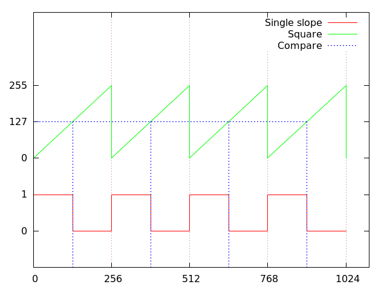

* De variabele herderheid komt overeen met **COMPARE**
* Deze is in dit geval **127** ticks van **256**
* De feitelijke lengte van de periode wordt bepaald door **LED_DELAY**


#### brute-force PWM 50 %

Als we een scope gebruiken om de spanning te analyzeren krijgen we volgend resultaat.

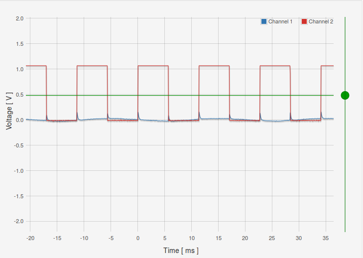

#### brute-force PWM 75 %

Als we de verhouding wijzignen naar 192/256 (macro HELDERHEID aanpassen)

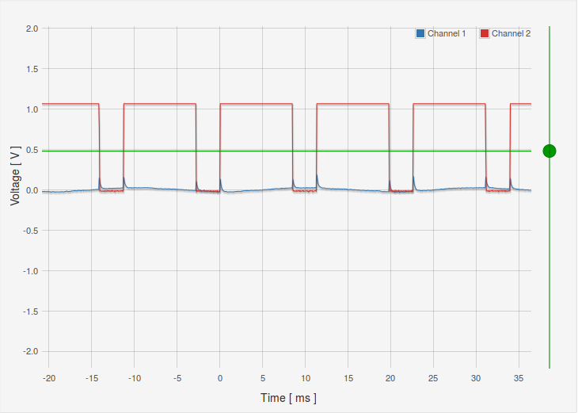

> Nota: deze spanning is afgemeten over een LED, vandaar dat de maximum spanning op +- 1 v komt

### Voorbeeld: brute-force PWM (driehoek-patroon)

Ter aanvulling kunnen we deze functie ook gebruiken om de helderheid van een led te doen wijzigen.

Als je volgende code uitvoert zal in en periode van +- 3-4 seconden zien dimmen en feller worden.

```c
#include <avr/io.h>
#include <util/delay.h>

#define LED_DELAY      20
#define PWM_BANK_PORT  PORTB
#define PWM_BANK       DDRB
#define PWM_PIN        PB1
#define HELDERHEID     128

void pwm(uint8_t helderheid)
{
  uint8_t i;
  PWM_BANK_PORT = PWM_BANK_PORT | (1 << PWM_PIN);
  for (i = 0; i < 255; i++) {
    if (i >= helderheid) {
        PWM_BANK_PORT = PWM_BANK_PORT & ~(1 << PWM_PIN);
    }
    _delay_us(LED_DELAY);
  }
}

int main(void)
{
  PWM_BANK = PWM_BANK | (1 << PWM_PIN);
  while (1) {
     int i = 0;
     for(i=0;i<255;i++) {
         pwm(i);
     }
     for(i=254;i>=0;i--) {
         pwm(i);
     }
  }
  return 0;
}
```

### Voorbeeld: PWM met timer (polling-based)

Een volgende stap is het gebruik van een timer ipv het zuivere bit-banging.
De hardware zal voor ons de tijd afmeten, in de software wordt nagekeken:

* De flag voor de compare-waardes OCF1B  
  Dit is de eerste compare-waarde (128 tellen), we clearen de uitgang
* De flag voor de compare-waardes OCF1A  
  Dit is de 2de compare-waarde (255 tellen), we setten de uitgang  
  Bij het bereiken van deze flag wordt ook de teller gereset (CTC-mode)


```c
#include <avr/io.h>
#include <util/delay.h>
#include <avr/interrupt.h>

#define PWM_BANK_PORT  PORTB
#define PWM_BANK       DDRB
#define PWM_PIN        PB1
#define HELDERHEID     128

int main(void)
{
      DDRB = 0xFF;
      PWM_BANK_PORT = PWM_BANK_PORT | (1 << PWM_PIN);

      TCCR1B |= (1 << CS10) | (1 << CS12);
      TCCR1B &= ~ (1 << CS11);

      TCCR1B &= ~(1 << WGM13);
      TCCR1B |=  (1 << WGM12);
      TCCR1A &= ~((1 << WGM10) | (1 << WGM11));

      OCR1B = 128;
      OCR1A = 255;

      TIMSK1 |= (1 << OCF1A);
      TIMSK1 |= (1 << OCF1B);

      while (1) {
        if(TIFR & (1 << OCF1A) ) {
          PWM_BANK_PORT = PWM_BANK_PORT | (1 << PWM_PIN);
          TIFR = TIFR | (1 << OCF1A);
        }
        if(TIFR & (1 << OCF1B) ) {
          PWM_BANK_PORT = PWM_BANK_PORT & ~(1 << PWM_PIN);
          TIFR = TIFR | (1 << OCF1B);
        }
      }
      return 0;
}
```

> Bemerking:
> Let ook dat je opnieuw moet schrijven naar de betreffende bit in TIFR
> Dit hoef je niet te doen als je interrupts gebruikt.

#### Timer polling-based PWM 50 %

Als we een scope gebruiken om de spanning te analyzeren krijgen we volgend resultaat.

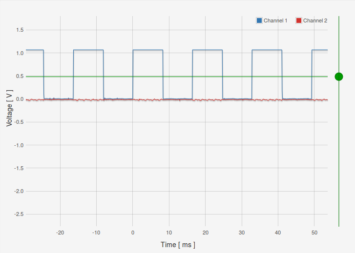

#### Timer polling-based PWM 75 %

Als we de verhouding wijzignen naar 192/256

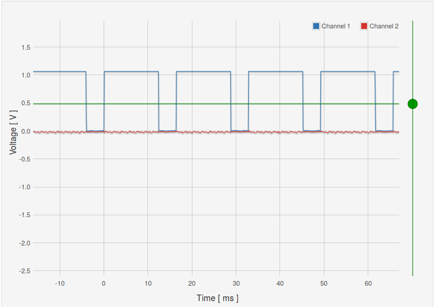

### Voorbeeld: PWM met timer (interrupt-based)

Ter vervollediging gebruiken gebruiken we interrupts ipv al dit werk in de event-loop uit te voeren.

```c
#include <avr/io.h>
#include <util/delay.h>
#include <avr/interrupt.h>

#define PWM_BANK_PORT  PORTB
#define PWM_BANK       DDRB
#define PWM_PIN        PB1
#define HELDERHEID     128

int main(void)
{
      DDRB = 0xFF;
      PWM_BANK_PORT = PWM_BANK_PORT | (1 << PWM_PIN);


      TCCR1B |= (1 << CS10) | (1 << CS12);
      TCCR1B &= ~ (1 << CS11);

      TCCR1B &= ~(1 << WGM13);
      TCCR1B |=  (1 << WGM12);
      TCCR1A &= ~((1 << WGM10) | (1 << WGM11));

      OCR1B = 128;
      OCR1A = 255;

      TIMSK1 |= (1 << OCF1A);
      TIMSK1 |= (1 << OCF1B);

      sei();

      while (1) {
      }
      return 0;
}

ISR(TIMER1_COMPB_vect)
{
    PWM_BANK_PORT = PWM_BANK_PORT & ~(1 << PWM_PIN);
}

ISR(TIMER1_COMPA_vect)
{
    PWM_BANK_PORT = PWM_BANK_PORT | (1 << PWM_PIN);
}
```

#### Timer interrupt-based PWM 50 %

Als we een scope gebruiken om de spanning te analyzeren krijgen we volgend resultaat.

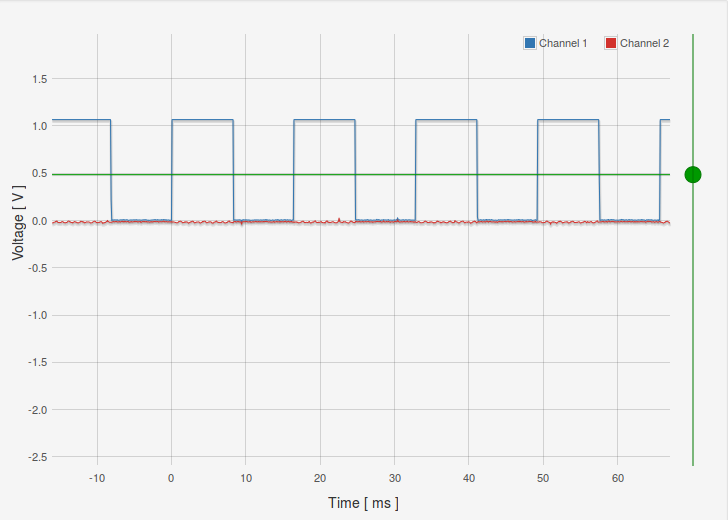

#### Timer interrupt-based PWM 75 %

Als we de verhouding wijzignen naar 192/256

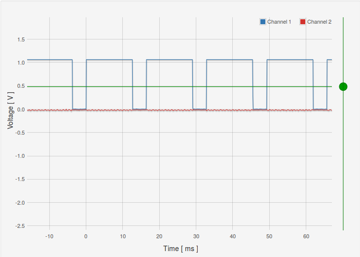

### Duiding: PWM-modes

De timer/counter-infrastructuur bevat namelijk een aantal interessante uitbreidingen om PWM direct te supporteren.  

Ter **herhaling**, tot nog toe hebben we 2 waveform-generation-modes gezien:

* **Normal**-modus:  
  Waar de teller blijft doortellen en reset bij overflow van deze teller  
  (255 bij 8 bit en 65536 bij 16 bot)
* **CTC**-modus (CLEAR TIMER ON COMPARE)
  Waar de teller reset wanneer hij op een waarde van een compare-register komt  

In de vorige voorbeeld gebruikten we deze timer/counter-architectuur om zo pinnen aan te sturen.  
Er zijn echter nog echter andere modes meer efficient om PWM te generen:

* Fast PWM
* Phase correct PWM
* Phase and frequency correct

> Zoals bij de introductie van deze cursus vermeld, embedded programmeren is **optimaal gebruik maken van hardware** (en dus ook de datasheet te lezen).  

### PWM op een AVR

Om het gedrag van PWM te beschrijven kunnen we terugvallen op "boundary"-concepten die ons al eerder zijn geintroduceerd:

* **BOTTOM**  
  De teller bereikt BOTTOM als hij de waarde 0x0000 bereikt.  
  (de waarde 0 voor BOOTOM is voor 8-bit tellers vanzelfsprekend ook geldende)
* **TOP**  
  De teller bereikt MAX als hij 0xFFFF (decimal 65535) wordt.
  (bij 8-bit-tellers zal dit 0xFF of 255 zijn)
* **MAX**  
  De teller bereikt TOP wanneer hij gelijk is aan de hoogste waarde bij de teller-sequentie.  
  De waarde hangt af van "mode of operation"
     * Dit kan van de volgende waardes zijn: 0x00FF, 0x01FF, or 0x03FF
     * Dit kan de waarde zijn van het OCR1A-register.
     * Dit kan de waarde zijn van het ICR1-register  
       (als we het OCR1A-register willen gebruiken voor COMPARE).
* **COMPARE MATCH**  
  De waarde waarmee de duty-cycle bepalen (OCR1A en/of OCR1B)

> Voor een exacte beschrijving van welke waarde deze TOP kan hebben kijk naar register TCCR1A in de datasheet  
> (hint: tabel die overeenkomt met de verschillende waveforms)

Het centrale component dat deze blokken beheert wordt in de datasheet benoemd als de "Waveform-generator", verwijzende naar het feit dat deze een "square wave" genereert op basis van bovestaande configuratie.

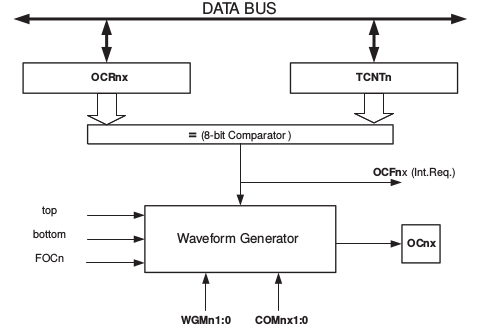

### Voorbeeld: PWM-functionaliteit (fast PWM)

We introduceren de PWM-hardware met de eerst beschikbare techniek, namelijk **Fast PWM**

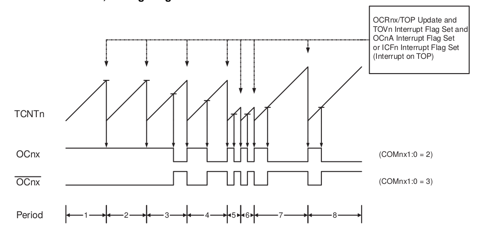

Deze **Fast PWM** komt overeen met de **single slope** die we eerder hebben gezien.   

> **Fast** verwijst naar het feit dat deze techniek sneller is dan **dual slope**

```c
#include <avr/io.h>
#include <util/delay.h>
#include <avr/interrupt.h>

int main(void) {
    DDRB |= (1 << DDB1) | (1 << DDB2); // PB1 and PB2 als output

    ICR1 = 0xFFFF; //TOP-waarde op 16-bit

    //Je hebt 2 uitgangen die je kan laten uitgaan bij ...
    OCR1A = 0x3FFF; // 25% duty cycle PB1
    OCR1B = 0xBFFF; // 75% duty cycle @ 16bit
    //TOP = 0xFFFF


    TCCR1A |= (1 << COM1A1) | (1 << COM1B1); // none-inverting mode

    // FAST PWM mode (16-bit) met ICR1 as TOP    1110
    TCCR1A |= (1 << WGM11);
    TCCR1B |= (1 << WGM12) | (1 << WGM13);

    // Voorlopig geen prescaler nodig (volle snelheid)
    TCCR1B |= (1 << CS10);

    while (1) {
        //nu kan je nog andere code schrijven
        //om leds te dimmen of aan te sturen bijvoorbeeld
    }
    return 0;
}
```

Let op:

* Gebruik van OCR1A en OCR1B om 2 outputs te benutten
* Kijk naar de tabel in de datasheet voor hoe de waveforms (pwm-mode) te selecteren

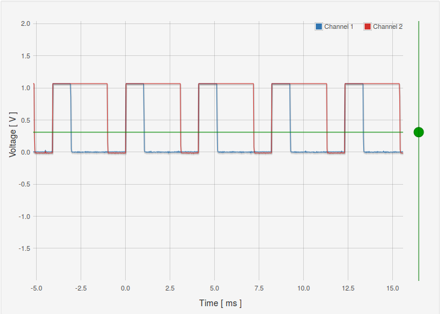


> Om deze code te verklaren kijk naar de datasheet, je moet in staat zijn de tabellen terug te vinden waarmee je de verschillende PWM-modes kan selecteren.

### Voorbeeld: PWM-functionaliteit (PHASE correct)

De volgende PWM-mode die we uitproberen is de **Phase Corrrect PWM**, zoals we eerdere hebben gezien:

* dual slope <-> dubbel zo traag
* beide signalen zijn in fase

Net zoals eerder gezien zie je op de scope dat:

* Telt zowel omhoog als omlaag
* Output Compare Registers (OC1A en OC1B voor timer 1)
     * worden ge-cleared bij een compare match (bij omhoog-tellen) tussen TCNT1 and OCR1x
     * worden ge-set bij compare match between

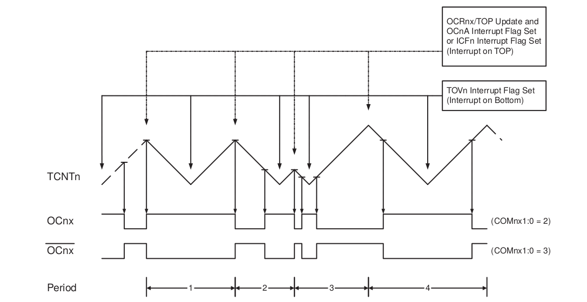


```c
#include <avr/io.h>
#include <util/delay.h>
#include <avr/interrupt.h>

int main(void) {
    DDRB |= (1 << DDB1) | (1 << DDB2); // PB1 and PB2 als output

    ICR1 = 0xFFFF; //TOP-waarde op 16-bit

    //Je hebt 2 uitgangen die je kan laten uitgaan bij ...
    OCR1A = 0x3FFF; // 25% duty cycle PB1
    OCR1B = 0xBFFF; // 75% duty cycle @ 16bit
    //TOP = 0xFFFF


    TCCR1A |= (1 << COM1A1) | (1 << COM1B1); // none-inverting mode

    // PHASE CORRECT mode
    TCCR1A |= (1 << WGM11);
    TCCR1B |= (1 << WGM13);

    // Voorlopig geen prescaler nodig (volle snelheid)
    TCCR1B |= (1 << CS10);

    while (1) {
        //nu kan je nog andere code schrijven
        //om leds te dimmen of aan te sturen bijvoorbeeld
    }
    return 0;
}
```


### Voorbeeld: PWM-functionaliteit (PHASE and frequency correct)

De laatste PWM-mode is de **PHASE and frequency correct PWM**.  
Deze gedraagt zich indentiek aan de **PHASE correct PWM** maar zal er zal ervoor zorgen dat de frequentie altijd consistent blijft tov de top en compare-waarde (door de top-waarde enkel op specifieke tijdstippen te laten wijzigen).  

> Als je meer wil weten over dit verschil kijk naar de datasheet

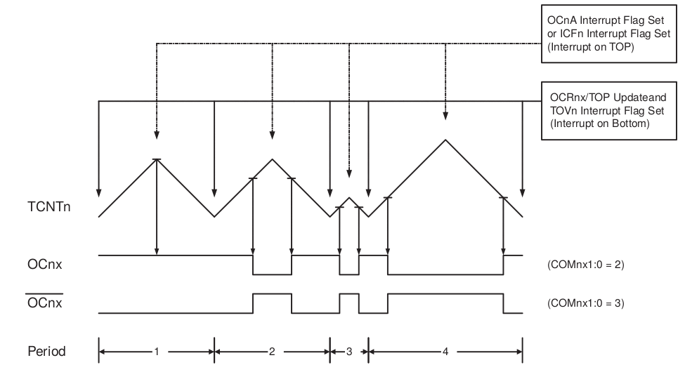

```c
#include <avr/io.h>
#include <util/delay.h>
#include <avr/interrupt.h>

int main(void) {
    DDRB |= (1 << DDB1) | (1 << DDB2); // PB1 and PB2 als output

    ICR1 = 0xFFFF; //TOP-waarde op 16-bit

    //Je hebt 2 uitgangen die je kan laten uitgaan bij ...
    OCR1A = 0x3FFF; // 25% duty cycle PB1
    OCR1B = 0xBFFF; // 75% duty cycle @ 16bit
    //TOP = 0xFFFF


    TCCR1A |= (1 << COM1A1) | (1 << COM1B1); // none-inverting mode

    // PHASE AND FREQUENCY CORRECT PWM mode (16-bit) met ICR1 as TOP    1110
    TCCR1A |= (1 << WGM11);
    TCCR1B |= (1 << WGM13);

    // Voorlopig geen prescaler nodig (volle snelheid)
    TCCR1B |= (1 << CS10);

    unsigned short toggle = 1;

    while (1) {
        _delay_ms(20);

        toggle = !( toggle);

        if(toggle) {
            ICR1 = 0xCFFF;
        } else {
            ICR1 = 0xFFFF;
        }
        //nu kan je nog andere code schrijven
        //om leds te dimmen of aan te sturen bijvoorbeeld
    }
    return 0;
}
```


