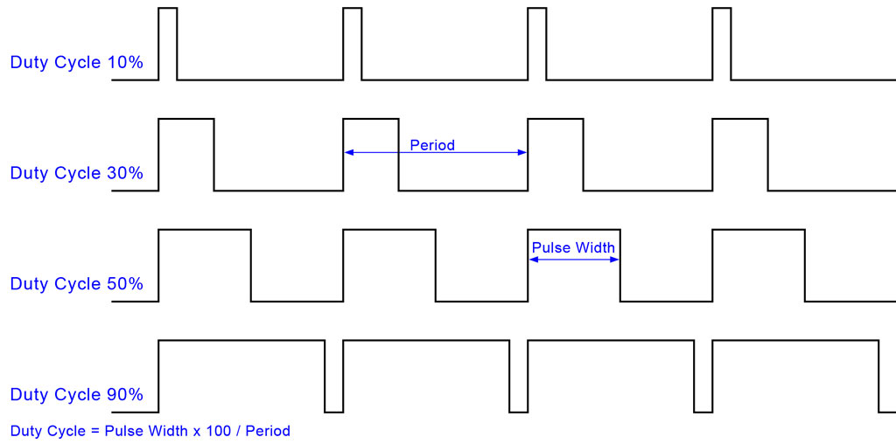
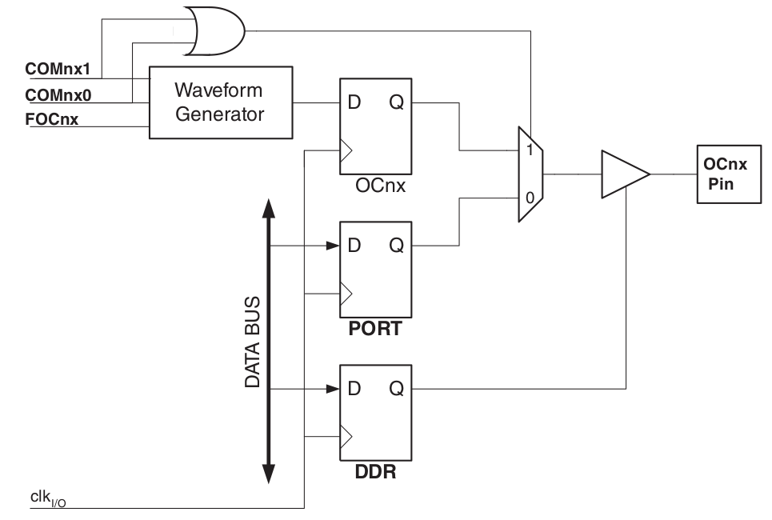
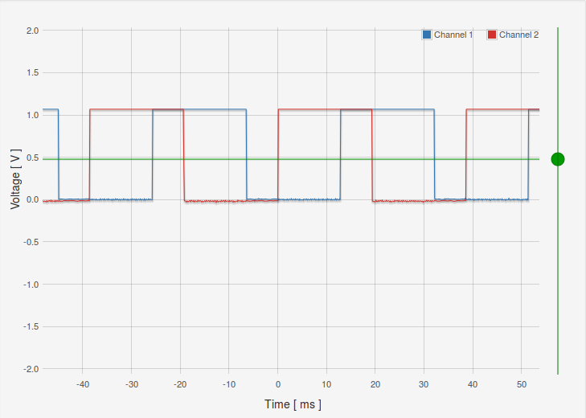
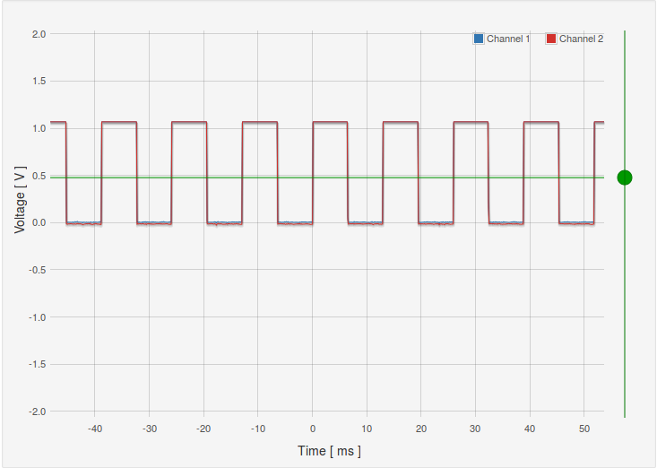
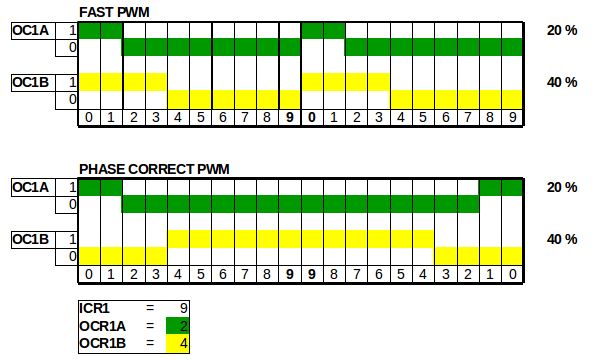

## PWM

In de lessen elektronica (en vermogenselektronica) ben je al geïntroduceerd met het begrip PWM.  
Voor degenen met een kort geheugen een korte herhali

### Herhaling: analoge spanning genereren met PWM

**PWM** of "**P**ulse  **W**idth **M**odulation" is een modulatie-**techniek**

* om een specifieke spanning (analoog gegeven) te genereren
* vanuit een digitaal medium
* dat enkel 0 of een 1 kan genereren
* ofwel 0 of VCC (meestal 3.3 of 5 v)

> **Nota:**  
> We hadden eerder bij ADC gezien dat je ook met een DAC een specifieke spanning kan genereren.  
> PWM is echter een zeer éénvoudige manier waarop je een spanning kan genereren enkel en alleen door het op en afzetten van spanning


### Herhaling: PWM en Duty-cylce

PWM is gebaseerd op het begrip **duty-cycle**:

* Een blokgolf wordt gegenereerd
* Met een vaste frequentie
* Maar de verhouding in functie van tijd tussen logisch 1 en 0 varieert
* De duty cycle is het percentage van een periode
* Deze verhouding (percentueel) zal een gemiddelde spanning genereren

De voorbeelden hieronder illustreren:



Stel het volgende:

* VCC is 5 v
* Frequentie is 1 kHz (periode = 1 ms)

Dan kijg je volgende (gemiddelde) spanningen bij overeenkomstige duty-cycles:

| 0      | 1      | duty cycle | spanning |
|--------|--------|------------|----------|
| 0.9 ms | 0.1 ms | 10 %       | 0.5 v    |
| 0.3 ms | 0.7 ms | 30 %       | 1.5 v    |
| 0.5 ms | 0.5 ms | 50 %       | 2.5 v    |
| 0.1 ms | 0.9 ms | 90 %       | 4.5 v    |
| 0.0 ms | 1.0 ms | 100 %      | 5.0 v    |

### Duiding: PWM en counters

Vanuit een MCU zijn verschillende manieren om PWM te genereren:

* **Bit-banging**  
  Op basis van de cpu-frequentie tel je in een loop hoeveel maal je een 1 en 0 naar een specifieke pin schrijft
* **Timer-gebaseerd**  
  Je maakt gebruik van de timer/counter infrastructuur om te weten hoe lang je deze logische 0 en 1 scrhrijft
* **Timer-gebaseerd met interrupts**  
  Idem dito maar met interrupts
* **PWM**-generatie  
  Veel moderne MCU's zoals de AVR beschikken over functionaliteit die deze duty-cycle kan genereren.

In dit hoofdstuk gaan we elk van deze technieken bekijken.

> **Nota**:  
> Er zijn natuurlijk ook verschillende opties voor PWM:
>
> * Externe DAC
> * Spanningsdeler (als je de spanning niet moet wijzigen)
> * Specifieke hardware zoals bijvoorbeeld dc-motor-drivers
> * ...
>
> Deze alternatieven vallen echter buiten de scope van deze introductie in PWM.  

### Setup: led dimmen

Voor de eerste voorbeelden starten we met éénvoudige setup, we laten een led dimmen door de spanning via PWM vanuit de MCU.

### Voorbeeld: brute-force PWM

In dit eerste voorbeeld genereren we PWM op zuivere software/gpio-basis.

```c
#include <avr/io.h>
#include <util/delay.h>

#define LED_DELAY      20
#define PWM_BANK_PORT  PORTB
#define PWM_BANK       DDRB
#define PWM_PIN        PB2
#define HELDERHEID     128

void pwm(uint8_t helderheid)
{
  uint8_t i;
  PWM_BANK_PORT = PWM_BANK_PORT | (1 << PWM_PIN);
  for (i = 0; i < 255; i++) {
    if (i >= helderheid) {
        PWM_BANK_PORT = PWM_BANK_PORT & ~(1 << PWM_PIN);
    }
    _delay_us(LED_DELAY);
  }
}

int main(void)
{
  PWM_BANK = PWM_BANK | (1 << PWM_PIN);
  while (1) {
     pwm(HELDERHEID);
  }
  return 0;
}
```

Deze code vereist weinig uitleg:

* Functie pwm() heeft een argument helderheid
* Dit argument is een verhouding tov 256 (maximum voor een 8-bit)
* In functie van deze verhouding zal deze meer of minder helderheid weergeven.

#### brute-force PWM 50 %

Als we een scope gebruiken om de spanning te analyzeren krijgen we volgend resultaat.


#### brute-force PWM 75 %

Als we de verhouding wijzignen naar 192/256 (macro HELDERHEID aanpassen)


> Nota: deze spanning is afgemeten over een LED, vandaar dat de maximum spanning op +- 1 v komt

### Voorbeeld: brute-force PWM (zaagtand)

Ter aanvulling kunnen we deze functie ook gebruiken om de helderheid van een led te doen wijzigen.

Als je volgende code uitvoert zal in en periode van +- 3-4 seconden zien dimmen en feller worden.

```c
#include <avr/io.h>
#include <util/delay.h>

#define LED_DELAY      20
#define PWM_BANK_PORT  PORTB
#define PWM_BANK       DDRB
#define PWM_PIN        PB1
#define HELDERHEID     128

void pwm(uint8_t helderheid)
{
  uint8_t i;
  PWM_BANK_PORT = PWM_BANK_PORT | (1 << PWM_PIN);
  for (i = 0; i < 255; i++) {
    if (i >= helderheid) {
        PWM_BANK_PORT = PWM_BANK_PORT & ~(1 << PWM_PIN);
    }
    _delay_us(LED_DELAY);
  }
}

int main(void)
{
  PWM_BANK = PWM_BANK | (1 << PWM_PIN);
  while (1) {
     int i = 0;
     for(i=0;i<255;i++) {
         pwm(i);
     }
     for(i=254;i>=0;i--) {
         pwm(i);
     }
  }
  return 0;
}
```

### Voorbeeld: PWM met timer (polling-based)

Een volgende stap is het gebruik van een timer ipv het zuivere bit-banging.
De hardware zal voor ons de tijd afmeten, in de software wordt nagekeken:

* De flag voor de compare-waardes OCF1B  
  Dit is de eerste compare-waarde (128 tellen), we clearen de uitgang
* De flag voor de compare-waardes OCF1A  
  Dit is de 2de compare-waarde (255 tellen), we setten de uitgang  
  Bij het bereiken van deze flag wordt ook de teller gereset (CTC-mode)


```c
#include <avr/io.h>
#include <util/delay.h>
#include <avr/interrupt.h>

#define PWM_BANK_PORT  PORTB
#define PWM_BANK       DDRB
#define PWM_PIN        PB1
#define HELDERHEID     128

int main(void)
{
      DDRB = 0xFF;
      PWM_BANK_PORT = PWM_BANK_PORT | (1 << PWM_PIN);

      TCCR1B |= (1 << CS10) | (1 << CS12);
      TCCR1B &= ~ (1 << CS11);

      TCCR1B &= ~(1 << WGM13);
      TCCR1B |=  (1 << WGM12);
      TCCR1A &= ~((1 << WGM10) | (1 << WGM11));

      OCR1B = 128;
      OCR1A = 255;

      TIMSK1 |= (1 << OCF1A);
      TIMSK1 |= (1 << OCF1B);

      while (1) {
        if(TIFR & (1 << OCF1A) ) {
          PWM_BANK_PORT = PWM_BANK_PORT | (1 << PWM_PIN);
          TIFR = TIFR | (1 << OCF1A);
        }
        if(TIFR & (1 << OCF1B) ) {
          PWM_BANK_PORT = PWM_BANK_PORT & ~(1 << PWM_PIN);
          TIFR = TIFR | (1 << OCF1B);
        }
      }
      return 0;
}
```

> Bemerking:
> Let ook dat je opnieuw moet schrijven naar de betreffende bit in TIFR
> Dit hoef je niet te doen als je interrupts gebruikt.

#### Timer polling-based PWM 50 %

Als we een scope gebruiken om de spanning te analyzeren krijgen we volgend resultaat.


#### Timer polling-based PWM 75 %

Als we de verhouding wijzignen naar 192/256


### Voorbeeld: PWM met timer (interrupt-based)

Ter vervollediging gebruiken gebruiken we interrupts ipv al dit werk in de event-loop uit te voeren.

```c
#include <avr/io.h>
#include <util/delay.h>
#include <avr/interrupt.h>

#define PWM_BANK_PORT  PORTB
#define PWM_BANK       DDRB
#define PWM_PIN        PB1
#define HELDERHEID     128

int main(void)
{
      DDRB = 0xFF;
      PWM_BANK_PORT = PWM_BANK_PORT | (1 << PWM_PIN);


      TCCR1B |= (1 << CS10) | (1 << CS12);
      TCCR1B &= ~ (1 << CS11);

      TCCR1B &= ~(1 << WGM13);
      TCCR1B |=  (1 << WGM12);
      TCCR1A &= ~((1 << WGM10) | (1 << WGM11));

      OCR1B = 128;
      OCR1A = 255;

      TIMSK1 |= (1 << OCF1A);
      TIMSK1 |= (1 << OCF1B);

      sei();

      while (1) {
      }
      return 0;
}

ISR(TIMER1_COMPB_vect)
{
    PWM_BANK_PORT = PWM_BANK_PORT & ~(1 << PWM_PIN);
}

ISR(TIMER1_COMPA_vect)
{
    PWM_BANK_PORT = PWM_BANK_PORT | (1 << PWM_PIN);
}
```

#### Timer interrupt-based PWM 50 %

Als we een scope gebruiken om de spanning te analyzeren krijgen we volgend resultaat.


#### Timer interrupt-based PWM 75 %

Als we de verhouding wijzignen naar 192/256


### Duiding: PWM-modes

De timer/counter-infrastructuur bevat namelijk een aantal interessante uitbreidingen om PWM direct te supporteren.  

Ter **herhaling**, tot nog toe hebben we 2 waveform-generation-modes gezien:

* **Normal**-modus:  
  Waar de teller blijft doortellen en reset bij overflow van deze teller  
  (255 bij 8 bit en 65536 bij 16 bot)
* **CTC**-modus (CLEAR TIMER ON COMPARE)
  Waar de teller reset wanneer hij op een waarde van een compare-register komt  

In de vorige voorbeeld gebruikten we deze timer/counter-architectuur om zo pinnen aan te sturen.  
Er zijn echter nog echter andere modes meer efficient om PWM te generen:

* Fast PWM
* Phase correct PWM
* Phase and frequency correct

> Zoals bij de introductie van deze cursus vermeld, embedded programmeren is **optimaal gebruik maken van hardware** (en dus ook de datasheet te lezen).  

Alvorens direct naar deze pwm te springen een

### Duiding: compare output mode

Vorige keer bekeken we de timer/counter-architectuur puur vanuit het gebruik als timer.  
Vanuit interrupt-code (of via directe interactie met het TIFR-register in de main) stuurden we 1 van de gpio-pinnen aan.

Het aansturen van pinnen kan echter ook rechtstreeks vanuit deze hardware (dus zonder in de software de gpio's aan te spreken!!).  
Dit is mogelijk voor een beperkte selectie van output-pinnen.



Voor elke timer bestaan er 2 zulke pinnen, zoals we direct gaan zien kan je dan ook deze 2 pinnen apart aanspreken.
Voor bijvoorbeeld timer 1 noemen deze **OC1A** en **OC1B** en komen deze respectievelijk overeen met PB1 en PB2 (bank 2)


> Op je Arduino-bordje zullen deze pinnen aangeduid staan met het teken ~ (tilde)

### Voorbeeld: output van timers

Het gebruik van deze pinnen is een basis-bouwsteun naar de andere PWM-modes toe.  
We starten met een kleine demonstratie in de al vertrouwde CTC-mode.  

> **Let wel:**  
> Je moet nog altijd de betreffende pinnen al output aanduiden.  
> Als je wil weten met welke pinnen OC1A en OC1B overeenstemmen zie de datasheet.

```c
#include <avr/io.h>
#include <util/delay.h>
#include <avr/interrupt.h>

int main(void)
{
      DDRB |= (1 << DDB1) | (1 << DDB2); // PB1 and PB2 als output

      TCCR1B |= (1 << CS10) | (1 << CS12);
      TCCR1B &= ~ (1 << CS11);

      TCCR1B |= (1 << WGM12);
      TCCR1A |= (1 << COM1A0) | (1 << COM1B0);

      OCR1B = 100;
      OCR1A = 300;

      while (1) {
          //nu kan je nog andere code schrijven
      }
      return 0;
}
```
Het grootste deel van de code is identiek aan vorige voorbeelden:

* Initialiseren van de pinnen
* Configuratie van de prescaler (clock-select)
* Selectie van CTC als waveform-output
* Initialiseren van een compare-waarde met OCR1A

We zien echter 2 verschillen:

* **Geen rechtstreeks** setten of clearen van **GPIO's**
* Het instelen van een andere **Compare Output Mode**

Deze configuratie (COM1A0 en COM1B0) zorgt ervoor dat OC1A/OC1B worden getoggled als een compare wordt bereikt op een respectievelijk OCR1A/OCR1B.

> Kijk als oefening in de datasheet voor de tabel die dit gedrag beschrijft   
> (hint: vlak bij de beschrijving van TCCR1A-register)

Dit resulteert in volged resultaat:



Als je de code wijzigt en beide OCR1A en OCR1B op 100 zet krijg je volgend resultaat:



### Voorbeeld: PWM-functionaliteit (fast PWM)


```c
#include <avr/io.h>
#include <util/delay.h>
#include <avr/interrupt.h>

int main(void) {
    DDRB |= (1 << DDB1) | (1 << DDB2); // PB1 and PB2 als output

    ICR1 = 0xFFFF; //TOP-waarde op 16-bit

    //Je hebt 2 uitgangen die je kan laten uitgaan bij ...
    OCR1A = 0x3FFF; // 25% duty cycle PB1
    OCR1B = 0xBFFF; // 75% duty cycle @ 16bit
    //TOP = 0xFFFF


    TCCR1A |= (1 << COM1A1) | (1 << COM1B1); // none-inverting mode

    // FAST PWM mode (16-bit) met ICR1 as TOP    1110
    TCCR1A |= (1 << WGM11);
    TCCR1B |= (1 << WGM12) | (1 << WGM13);

    // Voorlopig geen prescaler nodig (volle snelheid)
    TCCR1B |= (1 << CS10);

    while (1) {
        //nu kan je nog andere code schrijven
        //om leds te dimmen of aan te sturen bijvoorbeeld
    }
    return 0;
}
```


### Voorbeeld: PWM-functionaliteit (PHASE correct)

* dual slope <-> dubbel zo traag
* beide signalen zijn in fase

* Telt zowel omhoog als omlaag
* Output Compare Registers (OC1A en OC1B voor timer 1)
     * worden ge-cleared bij een compare match (bij omhoog-tellen) tussen TCNT1 and OCR1x
     * worden ge-set bij compare match between


```c
#include <avr/io.h>
#include <util/delay.h>
#include <avr/interrupt.h>

int main(void) {
    DDRB |= (1 << DDB1) | (1 << DDB2); // PB1 and PB2 als output

    ICR1 = 0xFFFF; //TOP-waarde op 16-bit

    //Je hebt 2 uitgangen die je kan laten uitgaan bij ...
    OCR1A = 0x3FFF; // 25% duty cycle PB1
    OCR1B = 0xBFFF; // 75% duty cycle @ 16bit
    //TOP = 0xFFFF


    TCCR1A |= (1 << COM1A1) | (1 << COM1B1); // none-inverting mode

    // PHASE CORRECT mode
    TCCR1A |= (1 << WGM11);
    TCCR1B |= (1 << WGM13);

    // Voorlopig geen prescaler nodig (volle snelheid)
    TCCR1B |= (1 << CS10);

    while (1) {
        //nu kan je nog andere code schrijven
        //om leds te dimmen of aan te sturen bijvoorbeeld
    }
    return 0;
}
```


### Voorbeeld: PWM-functionaliteit (PHASE and frequency correct)


```c
#include <avr/io.h>
#include <util/delay.h>
#include <avr/interrupt.h>

int main(void) {
    DDRB |= (1 << DDB1) | (1 << DDB2); // PB1 and PB2 als output

    ICR1 = 0xFFFF; //TOP-waarde op 16-bit

    //Je hebt 2 uitgangen die je kan laten uitgaan bij ...
    OCR1A = 0x3FFF; // 25% duty cycle PB1
    OCR1B = 0xBFFF; // 75% duty cycle @ 16bit
    //TOP = 0xFFFF


    TCCR1A |= (1 << COM1A1) | (1 << COM1B1); // none-inverting mode

    // PHASE AND FREQUENCY CORRECT PWM mode (16-bit) met ICR1 as TOP    1110
    TCCR1A |= (1 << WGM11);
    TCCR1B |= (1 << WGM13);

    // Voorlopig geen prescaler nodig (volle snelheid)
    TCCR1B |= (1 << CS10);

    unsigned short toggle = 1;

    while (1) {
        _delay_ms(20);

        toggle = !( toggle);

        if(toggle) {
            ICR1 = 0xCFFF;
        } else {
            ICR1 = 0xFFFF;
        }
        //nu kan je nog andere code schrijven
        //om leds te dimmen of aan te sturen bijvoorbeeld
    }
    return 0;
}
```

```c
#include <avr/io.h>
#include <util/delay.h>
#include <avr/interrupt.h>

int main(void) {
    DDRB |= (1 << DDB1) | (1 << DDB2); // PB1 and PB2 als output

    ICR1 = 0xFFFF; //TOP-waarde op 16-bit

    //Je hebt 2 uitgangen die je kan laten uitgaan bij ...
    OCR1A = 0x3FFF; // 25% duty cycle PB1
    OCR1B = 0xBFFF; // 75% duty cycle @ 16bit
    //TOP = 0xFFFF


    TCCR1A |= (1 << COM1A1) | (1 << COM1B1); // none-inverting mode

    // PHASE AND FREQUENCY CORRECT PWM mode (16-bit) met ICR1 as TOP    1110
    TCCR1B |= (1 << WGM13);

    // Voorlopig geen prescaler nodig (volle snelheid)
    TCCR1B |= (1 << CS10);

    unsigned short toggle = 1;

    while (1) {
        _delay_ms(20);

        toggle = !( toggle);

        if(toggle) {
            ICR1 = 0xCFFF;
        } else {
            ICR1 = 0xFFFF;
        }
        //nu kan je nog andere code schrijven
        //om leds te dimmen of aan te sturen bijvoorbeeld
    }
    return 0;
}

```


### Samengevat: verschil tussen fast PWM en phase correct

Onderstaande tekening vat het verschil tussen fast en frequency-correct samen:

* Phase Correct past dual slope toe
* (als gevolg dubbel zo traag)
* Maar zal (zelfst bij wijziging van OCR1A of B) dezelfde fase blijven behouden



