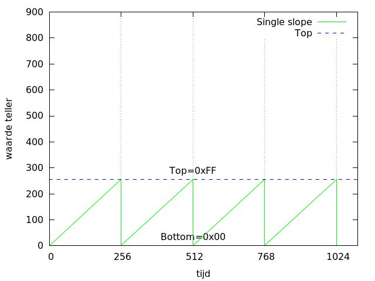
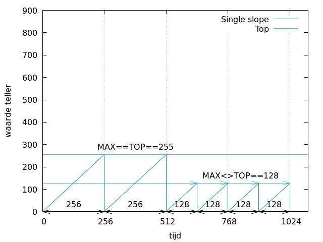
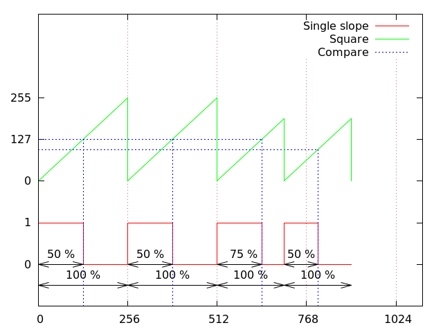

## Basis-principes PWM

In de lessen elektronica (en vermogenselektronica) ben je al geïntroduceerd met het begrip PWM.  
Voor degenen met een kort geheugen een korte **herhaling**.

### Herhaling: analoge spanning genereren met PWM

**PWM** of "**P**ulse  **W**idth **M**odulation" is een modulatie-**techniek** om:

* een specifieke **spanning** (analoog gegeven)
* te **genereren** vanuit een **digitaal medium**
* dat enkel **logisch 0** of een **logisch 1** kan genereren
* dus ofwel **0** of **VCC** (meestal 3.3 of 5 v)

> **Nota:**  
> We hadden eerder bij ADC gezien dat je ook met een DAC een specifieke spanning kan genereren.  
> PWM is echter een zeer éénvoudige manier waarop je een spanning kan genereren enkel en alleen door het op en afzetten van spanning


### PWM en Duty-cycle

PWM is gebaseerd op het begrip **duty-cycle**:

* Een **blokgolf** wordt gegenereerd
* Met een **frequentie** (meestal vast)
* Maar de **verhouding** in functie van tijd **tussen** logisch **1 en 0 varieert**
* Deze verhouding (percentueel) zal een **gemiddelde spanning** genereren
* De **duty cycle** is de **verhouding** tussing **hoog een laag** als percentage van een periode


De **essentie** van **pwm** is dus de **verhouding in periode** tussen 1 enkele **hoog** en **laag** waarmee we **gemiddelde spanning genereren**.

De hoeveelheid spanning die wordt genereerd is gelijk aan de

 ```
 V_UITGANG = VCC * P_HOOG / (P_HOOG + P_LAAG)
 ```

(P=periode V= spanning)

### Herhaling: voorbeeld pwm

De **tabel** met **voorbeelden** hieronder illustreren deze **formule**:

Van uitgaande van het volgende:

* **VCC** is **5 v**
* Frequentie is **1 kHz** (periode = 1 ms)

Dan kijg je volgende **gemiddelde) spanningen** bij overeenkomstige **duty-cycles**:

| 0      | 1      | duty cycle | spanning |
|--------|--------|------------|----------|
| 0.9 ms | 0.1 ms | 10 %       | 0.5 v    |
| 0.7 ms | 0.3 ms | 30 %       | 1.5 v    |
| 0.5 ms | 0.5 ms | 50 %       | 2.5 v    |
| 0.1 ms | 0.9 ms | 90 %       | 4.5 v    |
| 0.0 ms | 1.0 ms | 100 %      | 5.0 v    |

> **Nota:**  
> We proberen hieonder een aantal **concepten** uit te leggen (met de zelfde namen zoals in de datasheet) van de atmega328p worden gebruikt **zonder** ons op **details** zoals de **REGISTERS** te concentreren.
>
> Dit zou het **gemakkelijker** moeten maken de **datasheet** van de **AVR te lezen om de verschillende soorten PWM te begrijpen, alsook PWM om **andere MCU-architecturen**

### Grafisch voorstellen van tellers

Vooraleer in de praktijk te duiken (met de avr) wordt er een korte introductie gegeven in een aantal **pwm-concepten**.  

**PWM** is - bij de meeste MCU's - gebaseerd op een **teller/timer**.  
Om de **relatie van PWM tov timers** te duiden gaan we dit **voorstellen** op een **x-y-as** waarbij:

* de **x-as** het aantal **ticks** voorstelt (tijd)
* de **y-as** de **waarde** in de **teller** voorstelt (waarde teller)

Dit **resulteert** dan in een diagram dat lijkt op een **zaagtand**.



### Single slope-teller

Een teller met zo'n **zaagtand**-vorm benoemen we **single-slope**-teller (1 helling):

* Deze telt omhoog van 0 te starten (op het ritme van de klok)
* Tot de top-waarde 255 (top-waarde voor 8-bit resolutie)
* Zal terug naar de bodem-waarde gaan

### Bottom en Max

Aan deze zaagtand zijn dus 2 belangrijke **boundaries** verbonden:

* Een **BOTTOM**-waarde:  
  De "bodem"-waarde vanaf waar men (terug) begint naar boven te tellen.
* een **MAX**-waarde:   
  De hoogste waarde die deze teller kan bevatten (afhankelijk van de resolutie).    

In dit voorbeeld werken we met een **8-bit** teller en is deze **TOP** gelijk aan **0xFF** (255).   
Bij een **16-bit** teller zou dit **0xFFFF** (65535) zijn

> **Nota**:  
> Als we vanaf hier over **frequentie** spreken, spreken we over **aantal ticks**.  
> **Gemakkelijkshalve** laten we de **werkelijke snelheid** van de klok **achterwege**, we gaan er van uit dat deze snelheid een **constante** is.  
> Als we over de implementatie op de **AVR** starten zullen we deze frequentie afleiden van de basis-klok zoals we dat eerder bij timers dede.  

### TOP (vs frequentie)

Met de vaste **BOTTOM** en **MAX** blijft de **frequentie** echter op een **constant** niveau zitten  van **256** ticks (0-255 bij 8-bit).  
(ook natuurlijk afhankelijk van de onderliggene counter/timer + prescaler)

Bij **PWM** kan je frequentie-keuze nog verfijnen door het concept van **MAX** toe te voegen:



Waar **MAX** de absolute grens was, is **TOP** nu de **feitelijke maximum waarde** tot waar we kunnen tellen.  
Deze hoeft (zie hierboven) niet gelijk te zijn aan **MAX** (maar dient vanzelfsprekend welk kleiner te zijn).  

Door top te laten varieren kunnen we de **frequentie** of **periode** van het het **optellen** **wijzigen** zonder de onderliggende timer te manipuleren:  

* Bij de eerste 2 slopes is deze MAX==TOP en zitten we op een periode van 256 ticks
* Bij de slopes die daarop volgen brengen we TOP naar 128 waardoor we een kortere periode krijgen (ook 128 gezien de BOTTOM==0)

### PWM maken met een teller?

We weten nu hoe we een **teller grafisch** moeten voorstellen, en hoe je de **frequentie** van dit tellen van de verschillend periodes kunnen wijzigen.

Hoe kan je dan hier PWM met maken?  
Je voegt hier het concept van een **COMPARE** of **MATCH-waarde** aan toe.    


Bedoeling is dat we een signaal aansturen vanuit deze teller.  
We passen de volgende sequentie toe:

1. Wanneer de **teller** aan de **BOTTOM**-waarde zit **set** je een signaal => lijn gaat **HOOG**
2. Wanneer de teller een **COMPARE** OF **MATCH**-waarde hebt **clear** je dit signaal => lijn gaat **LAAG**
3. Bij het bereiken van de **TOP**-waarde zal de teller zich naar de **BOTTOM**-waarde
4. ... Het process herhaalt zich bij punt 1:
     * Het signaal zet zich terug **HOOG** zetten (zie punt 1)
     * We tellen terug omhoog richting punt 2

### Duty-cycle

Het **COMPARE**-element zal de duty-cycle gaan bepalen:


In bovenstaand voorbeeld zien we dat de compare-waarde op 127 staat, in de helft van het **MAXIMUM** van deze teller.  
De verhouding tussen **COMPARE** en de **MAXIMUM**-waarde zal de duty-cycle (zie eerder) bepalen, in dit geval zal deze de 50 % benaderen.

### Variatie in duty-cycle

De duty-cycle kan varieren door de **COMPARE**-waarde te lateren varieren


In bovenstaand voorbeeld:

* **1ste 2 pulsen** hebben net zoals vorige voorbeeld een duty-cycle van **50 %**
* Bij de volgende puls valt de compare op 192, met als resultaat **75 %** duty-cycle
* In het laatste geval is **COMPARE**==**MAXIMUM** en krijgen we een duty-cycle van **100 %**  
(gezien de lijn nooit laag gaat)

### Variatie in frequentie

* De **MATCH** (of **compare**) zal ons de **duty-cycle** bepalen
* De **MAXIMUM**-waarde zal dan de **frequentie** waarde bepalen



In bovenstaand voorbeeld zien we ook dat als we de **TOP** ook onrechtstreeks van invloed is op de **duty-cycle** als je niet tegelijkertijd de **MATCH** aanpast:

* De eerste **2 pulsen**, zoals voorgaande voorbeelden geven een duty-cycle van ~50 %.
* Bij de **3de puls** echter **wijzigt** de **frequentie**.  
  Maar doordat de **match-waarde niet wijzigt**, past de **duty-cycle** zich aan naar  ~**75 %**.
* Bij de **4de puls** is de duty-cycle **terug ~50 %** doordat de **compare-waarde** mee is gezakt

> We zien dus dat als je het maximum aanpast om de frequentie te beinvloeden, je ook de match-waarde moet aanpassen als je de duty-cycle wil behouden.

### 1 teller met meerdere uitgangen

Bij vele MCU's kan je ook:

* **Meerdere uitgangen** aansturen
* Op **1 zelfde basis-teller**
* Door **2** (of meerdere) **compare-waardes** te gebruiken
* Die elk aan een **pin/output** zijn **gekoppeld**  


We zien ook dat:

* door de **verschillende compare-waardes**
* verschillende **duty-cycles** kunnen worden gehandhaafd.  
* de frequentie blijft idem voor beide (uitgezonderd bij duty-cycle 100 %)

> Bij AVR gaan we hiervoor OCR1A en OCR1B voor gebruiken

### Dual slope

Als **variant** op de single-slope heb je ook **dual-slope**, deze stelt zich voor als een **dubbel-zijdige zaagtand** (of driehoek-patroon).  

Bij dit soort PWM werken we met **1-zelfde teller** maar:

* **eerst** tellen we naar **boven** van **BOTTOM**
* De lijn **start hoog**
* Als we een **1ste** maal bij **COMPARE** komen gaat de lijn **laag**
* Aan aan een **MAX**-waarde tellen we terug naar **beneden**
* Als we een **2de** maal bij **COMPARE** komen gaat de lijn **hoog**
* 1-maal terug bij **BOTTOM** tellen we terug naar **omhoog**
* enzovoort ...


In het voorbeeld hierboven bij het tellen:

* Blijfd de output **127 (COMPARE)** de lijn hoog
* Vervolgens daalt deze lijn terug
* Wanneer de teller terug de **COMPARE** bereikt gaat de output

Het gedeelte dat de teller onder deze **COMPARE**-waarde zit bepaalt (net zoals bij de single slope) de duty-cycle, hoe groter de **COMPARE** hoe groter de duty-cycle.

De **duty-cycle** **verspreidt** zich bij een **dual slope** als ware over **2 delen**/helften van de puls.  


### Voor- en nadelen van Dual Slope

Dit heeft 2 belangrijke **(zij-)effecten**:

* De puls zal **2 maal zo traag** zijn in verhouding tot een type **single slope** **(nadeel)**  
  Je telt 1 maal naar top en naar bottom
* De puls zal echter altijd in **dezelfde fase** blijven **(voordeel)**  
 ongeacht de **match**-waarde  
(en meestal ook de top-waarde)

### Dual slope met meerdere outputs

Het in fase blijven van de 2 outputs wordt nog meer duidelijk als je een **dual slope** met 2 outputs bekijkt:


ook al verander je de duty-cycle behouden we dezelfde verhouding:


### Samengevat

We hebben een **teller-functie** grafisch voorgesteld:

* In functie van tijd (x-as)
* Als tellerwaarden (y-as)
* Die lineair stijgt (en daalt in geval van een dual slope)
* Tot dat we aan een TOP-waarde geraken
* zich reset naar BOTTOM (0)

Op basis van deze teller-functie hebben we de eigenlijde **pwm-functie**

* (ook) in functie van tijd (x-as)
* met als waarde 0 of 1
* die togglet als de teller-functie een COMPARE-waarde bereikt

**TOP** zal de frequentie bepalen waar **COMPARE** de duty-cycle zal bepalen
