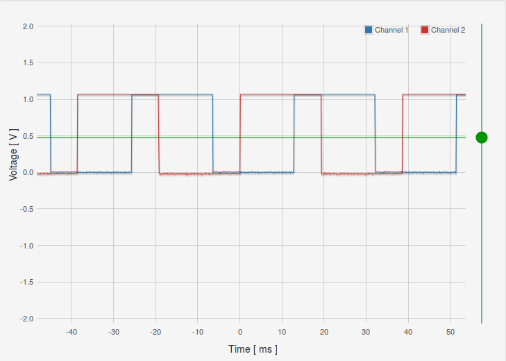

## Directe output met timers

Tot nog toe bekeken we de timer/counter-architectuur puur **vanuit het gebruik als timer**.  
Vanuit interrupt-code (of via directe interactie met het TIFR-register in de main) stuurden we 1 van de gpio-pinnen aan.

Vanaf hier gaan we deze bekijken **als generator**

Het aansturen van pinnen kan namelijk ook rechtstreeks vanuit deze hardware (dus zonder in de software de gpio's aan te spreken!!).  
Dit is mogelijk voor een beperkte selectie van output-pinnen.


Voor elke timer bestaan er 2 zulke pinnen, zoals we direct gaan zien kan je dan ook deze 2 pinnen apart aanspreken.
Voor bijvoorbeeld timer 1 noemen deze **OC1A** en **OC1B** en komen deze respectievelijk overeen met PB1 en PB2 (bank 2)


> Op je Arduino-bordje zullen deze pinnen aangeduid staan met het teken ~ (tilde)

### Voorbeeld: compare output mode

Het gebruik van deze pinnen is een basis-bouwsteun naar de andere PWM-modes toe.  
We starten met een kleine demonstratie in de al vertrouwde CTC-mode.  

> **Let wel:**  
> Je moet nog altijd de betreffende pinnen al output aanduiden.  
> Als je wil weten met welke pinnen OC1A en OC1B overeenstemmen zie de datasheet.

```c
#include <avr/io.h>
#include <util/delay.h>
#include <avr/interrupt.h>

int main(void)
{
      DDRB |= (1 << DDB1) | (1 << DDB2); // PB1 and PB2 als output

      TCCR1B |= (1 << CS10) | (1 << CS12);
      TCCR1B &= ~ (1 << CS11);

      TCCR1B |= (1 << WGM12);
      TCCR1A |= (1 << COM1A0) | (1 << COM1B0);

      OCR1B = 100;
      OCR1A = 300;

      while (1) {
          //nu kan je nog andere code schrijven
      }
      return 0;
}
```
Het grootste deel van de code is identiek aan vorige voorbeelden:

* Initialiseren van de pinnen
* Configuratie van de prescaler (clock-select)
* Selectie van CTC als waveform-output
* Initialiseren van een compare-waarde met OCR1A

We zien echter 2 verschillen:

* **Geen rechtstreeks** setten of clearen van **GPIO's**
* Het instelen van een andere **Compare Output Mode**

Deze configuratie (COM1A0 en COM1B0) zorgt ervoor dat OC1A/OC1B worden getoggled als een compare wordt bereikt op een respectievelijk OCR1A/OCR1B.

> Kijk als oefening in de datasheet voor de tabel die dit gedrag beschrijft   
> (hint: vlak bij de beschrijving van TCCR1A-register)

Dit resulteert in volged resultaat:



Als je de code wijzigt en beide OCR1A en OCR1B op 100 zet krijg je volgend resultaat:


### Vervolg...

Door CTC te gebruiken kunnen we:

* **Zonder software-acties** (buiten configuratie) 2 blok-golven aansturen
* Op 2 uitgangen
* Wijzigen van **OCR1A** stelt ons in staat de frequentie te wijzigen
* Door **OCR1B** te manipuleren kunnen we de fase wijzigen

Wat er nog ontbreekt echter, om PWM te kunnen genereren, is het genereren van een duty-cycle.  
Dit kan door het gebruik van andere PWM-Modes, hier komen we nog snel op terug...
