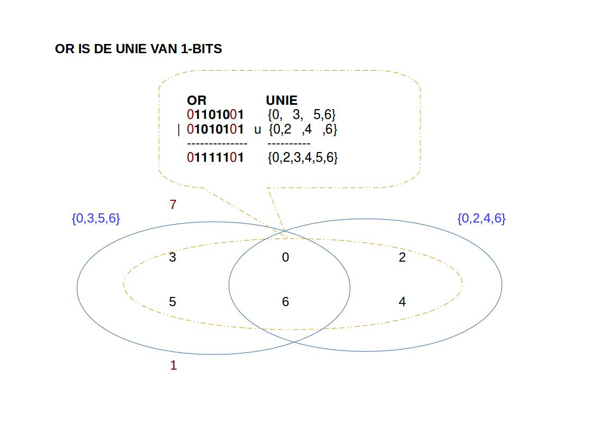

## Integers als verzamelingen

### Verzamelingen

Een getal kan je ook bekijken als een verzameling van (unieke getallen).  
Voor elke positie waar een 1 staat, noteer je de positie:

| 7   | 6   |   5 |   4 |   3 |   2 |   1 |   0 | vector          |
|-----|-----|-----|-----|-----|-----|-----|-----|-----------------|
| 0   |**1**|**1**|0    |**1**|0    |0    |**1**| => {6,5,3,0}    |
| 0   |**1**| 0   |**1**| 0   |**1**| 0   |**1**| => {6,4,2,0}    |

Zo verkrijg je een bit-vector of verzameling van getallen, zoals hierboven beschreven voor 2 verschillende getallen.  

~~~
  AND         OR          XOR         COMPLEMENT
  01101001    01101001    01101001  
& 01010101  | 01010101  ^ 01010101  ~ 01010101
  --------    --------    --------    --------
  01000001    01111101    00111100    10101010
~~~

Elke bit-wise bewerking (and,or,xor,not) kan je vergelijken met een operatie op verzamelingen

~~~
& intersectie          {0,3,5,6} &  {0,2,4,6} = {0,6}
| unie                 {0,3,5,6} |  {0,2,4,6} = {0,2,3,4,5,6}
^ symetrisch verschil  {0,3,5,6} ^  {0,2,4,6} = {2,3,4,5}
~ complement                     ~  {0,2,4,6} = {1,3,5,7}
~~~

### Or vs Unie

### And vs Intersectie

### XOR vs Symetrisch verschil

### Not

