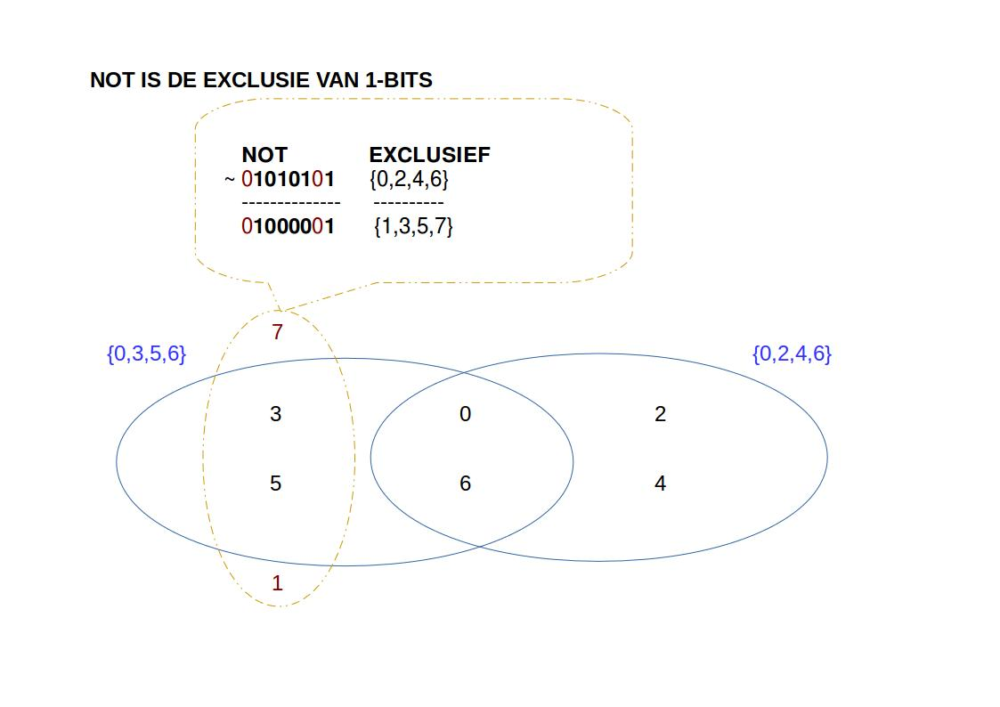

## Integers als verzamelingen

### Verzamelingen

Je kan deze ook bekijken als bit-vectoren of **set** (verzameling) van getallen.  

~~~
76543210
01101001 => {0,3,5,6}
01010101 => {0,2,4,6}
~~~

~~~
  AND         OR          XOR         COMPLEMENT
  01101001    01101001    01101001  
& 01010101  | 01010101  ^ 01010101  ~ 01010101
  --------    --------    --------    --------
  01000001    01111101    00111100    10101010
~~~

Waar je dan aan de hand van bitwise-operatoren een aantal set-operaties kan uitvoeren:

~~~
& intersectie          {0,3,5,6} &  {0,2,4,6} = {0,6}
| unie                 {0,3,5,6} |  {0,2,4,6} = {0,2,3,4,5,6}
^ symetrisch verschil  {0,3,5,6} ^  {0,2,4,6} = {2,3,4,5}
~ complement                     ~  {0,2,4,6} = {1,3,5,7}
~~~

### Or vs Unie

### And vs Intersectie

### XOR vs Symetrisch verschil

### Not

