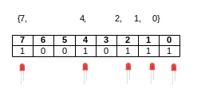

## Bit-level operaties in C

### Operaties op bit-level

Tot nog toe hebben we getallen enkel bekeken naar hun totale waardes, in dit deel gaan we niet de waardes maar de bits (en bytes) van integers bekijken.  

Over het algemeen worden er in C (en andere) 4 operaties gebruikt:

~~~
  AND         OR          XOR         COMPLEMENT
  01101001    01101001    01101001  
& 01010101  | 01010101  ^ 01010101  ~ 01010101
  --------    --------    --------    --------
  01000001    01111101    00111100    10101010
~~~

Deze operators gaan we zodadelijk in meer detail bekijken.

### Bit-vectoren

Je kan deze ook bekijken als bit-vectoren of **set** (verzameling) van **getallen**.  
Meer concreet je gaat naar de **posities** gaan kijken van de bits in een getal.

Hieronder vormen we bovenstaande getallen om tot vectoren.

~~~
Posities: 7-6-5-4-3-2-1-0
          --------
          0 1 1 0 1 0 0 1 => {0,3,5,6}
          0 1 0 1 0 1 0 1 => {0,2,4,6}
~~~

Voor elke getal noteer je de posities die op 1 staan in deze vector of set.  
AWaarWaarls je dan aan de hand van bitwise-operatoren een aantal set-operaties kan uitvoeren:

~~~
  AND           INTERSECTIE
  01101001      {0,3,5,6}
& 01010101      {0,2,4,6}
  --------      ---------
  01000001      {0,6}    
~~~

~~~
  OR            UNIE   
  01101001      {0,3,5,6}
| 01010101      {0,2,4,6}
  --------      ---------
  01111101      {0,2,3,4,5,6}
~~~

~~~
  XOR           SYMETRISCH VERSCHIL   
  01101001      {0,3,5,6}
^ 01010101      {0,2,4,6}
  --------      ---------
  00111100      {2,3,4,5}
~~~

~~~
  INVERTOR      COMPLEMENT   
~ 01010101      {0,2,4,6}
  --------      ---------
  10101010      {1,3,5,7}
~~~


Bij het programmeren van microcontrollers bijvoorbeeld gaan we in het volgende hoofdstuk gaan zien dat het heel belangrijk is deze operaties te kunnen uitvoeren om hardware te manipuleren.  

Het punt hier is dat we getallen niet meer om hun waarde gaan bekijken maar als een verzameling van

Bijvoorbeeld een block van 8 output-pinnen die bijvoorbeeld gecontrolleerd wordt via 1 byte in het geheugen (register).

~~~c
LED_REGISTER =  LED_REGISTER | ((1<<7) | (1<<4) | (1<<2) | (1<<1) | (1<<7));
~~~



### Bitwise operatoren vs logische operatoren

Tot nog toe hebben we **logische operatoren** gezien zoals **&&, || en !**, deze hadden als eigenschappen:

* Een integer-operand met waarde 0 wordt beschouwd als een **logische 0**
* Elke integer-operand met een waarde <> 0 wordt beschouwd als een **logische 1**
* Je krijgt een logische uitkomst, dus enkel 0 of 1 als uitkomst

De operatoren die we vandaag bekijken noemen we **bitwise operatoren**.  
Met bitwise willen we zeggen dat deze op bit-niveau opereren.  

Bitwise operatoren werken echter op een andere manier:

* **Elke bit** van elke operand (getal of variabele) wordt individueel bekeken
* Elke bit (of **positie**) van de ene operand wordt vergeleken met de bit (positie) van de andere operand

We gaan dit direct met een aantal voorbeelden **illustreren**.

### Verschil tussen logische en bitwise operatoren

```c
#include <stdio.h>
int main()
{
	printf("2 && 2 = %i\n",2 && 2);
	printf("2 & 2 = %i\n", 2 & 2);
  return 0;
}
```
Als je dit uitvoert krijg je de volgende output

```
$ gcc twoandtwo.c -o twoandtwo
$ ./twoandtwo
2 && 2 = 1
2 & 2 = 2
```

Bij de eerste statement (&&) gaat men enkel kijken of de integer <> is van 0.  
Zo ja wordt deze als een 1 bekeken.  

Het resultaat van een logische AND toe te passen op deze getallen heeft dan ook het getal 1 als resultaat.  

|**&&**                 |**2**|**1**|**0**|
|-----------------------|-----|-----|-----|
|**2 wordt 1**          |0    |0    |1    |
|**2 wordt 1**          |0    |0    |1    |
|**2 && 2 == 1 && 1 = **|0    |0    |1    |

Bij de bitwise operator gaat deze de bits individueel met elkaar gaan matchen en krijgen we het getal 2 als resultaat

|**&**          |**2**|**1**|**0**|
|---------------|-----|-----|-----|
|**2 blijft 2** |0    |1    |0    |
|**2 blijft 2** |0    |1    |0    |
|**2 & 2**      |0    |1    |0    |

### Verschil tussen logische en bitwise operatoren (voorbeeld 2)

Nog een ander voorbeeld is de combinatie 5 en 2.  
Hier is het verschil tussen beide nog opvallender (1 en 0),.

```c
#include <stdio.h>
int main()
{
	printf("5 && 2 = %i\n",5 && 2);
	printf("5 & 2 = %i\n", 5 & 2);
}
```
Als je dit uitvoert krijg je de volgende output:

```
$ gcc twoandtwo.c -o twoandtwo
$ ./twoandtwo
5 && 2 = 1
5 & 2 = 0
```
Bij de logische operator krijgen we opnieuwe 1 als resultaat:

|**&&** |**2**|**1**|**0**|
|-------|-----|-----|-----|
|**5**  |0    |0    |1    |
|**2**  |0    |0    |1    |
|**1**  |0    |0    |1    |

Bij de bitwise worden de individuele bits vergeleken.  
Gezien er op elke positie bij beide getallen minstens één 0 voorkomt is het resultaat van deze combinatie ook 0.

|**&**  |**2**|**1**|**0**|
|-------|-----|-----|-----|
|**5**  |1    |0    |1    |
|**2**  |0    |1    |0    |
|**2**  |0    |0    |0    |

> Dit kan gevaarlijk zijn als je dit in een if-conditie of loop zou gebruiken (& ipv &&)

### Overzicht van de bitwise operatoren  

Naast & heb je hier een overzicht van all bitwise operatoren:

| Operator | Betekenis             | Voorbeeld    | Resultaat (per bit-positie)                       |
|----------|-----------------------|--------------|---------------------------------------------------|
| &        | AND                   | x & y        | 1 enkel en alleen als beide 1 zijn                 |
| &#124;   | OR                    | x &#124; y   | 1 als er 1 van de 2 bits 1 is                     |
| ^        | XOR                   | x ^ y        | 1 als enkel 1 operatand 1 is                      |
| ~        | NOT                   | ~x           | 1 als x 0 is anders 0                             |


> **Nota:**  
> Binaire getallen worden vanaf hier bits genoemd (binary digits)  
> Als we in deze tekst bits vergelijken, vergelijken we bits op de zelfde positie bij 2 integers

### Bitwise operator & (and)

& (and) zal:  
* in 0 resulteren als 1 van beide bits gelijk zijn aan 0  
* in 1 als beide bits 1 zijn

zoals in onderstaand waarheidstabel

| A | B | S  |
|:--|:--|:---|
| 0 | 0 | 0  |
| 0 | 1 | 0  |
| 1 | 0 | 0  |
| 1 | 1 | 1  |

Toegepast op een concreet voorbeeld zie je dat enkel de binaire digits (of posities) waar bij beide getallen/operanden
een 1 voorkomt een 1 als uitkomst hebben (anders 0).

| &         | 7 | 6 | 5 | 4 | 3 | 2 | 1 | 0 |
|-----------|---|---|---|---|---|---|---|---|
|**5B**     | 0 | 1 | 0 | 1 | 1 | 0 | 1 | 1 |
|**CA**     | 1 | 1 | 0 | 0 | 1 | 0 | 1 | 0 |
|**4A**     | 0 | 1 | 0 | 0 | 1 | 0 | 1 | 0 |

Code:

```c
#include <stdio.h>
int main()
{
	printf("0x5B & 0xCA = %x\n", 0x5B & 0xCA);
  return 0;
}
```
Als je dit uitvoert krijg je de volgende output

```
$ gcc example_bit_and.c -o example_bit_and
$ ./example_bit_and
0x5B & 0xCA = 4a
$
```

### Bitwise operator | (or)

| (or) zal in 1 resulteren als minstens 1 van opereranden gelijk is aan 1 volgens de waarheidstabel.

| A | B | S  |
|:--|:--|:---|
| 0 | 0 | 0  |
| 0 | 1 | 1  |
| 1 | 0 | 1  |
| 1 | 1 | 1  |

Voorbeeld:

| &#124;   | 7 | 6 | 5 | 4 | 3 | 2 | 1 | 0 |
|----------|---|---|---|---|---|---|---|---|
|**5B**    | 0 | 1 | 0 | 1 | 1 | 0 | 1 | 1 |
|**CA**    | 1 | 1 | 0 | 0 | 1 | 0 | 1 | 0 |
|**DB**    | 1 | 1 | 0 | 1 | 1 | 0 | 1 | 1 |

Code:

```c
#include <stdio.h>
int main()
{
	printf("0x5B | 0xCA = 0x%x\n", 0x5B | 0xCA);
}
```
Als je dit uitvoert krijg je de volgende output

```
$ gcc example_bit_or.c -o example_bit_or
$ ./example_bit_or
0x5B | 0xCA = 0xdb
$
```

### Bitwise operator ^ (xor)

^ (xor) zal in 1 resulteren als 1 van beide operanden 1, anders zal de uitslag altijd 0 zijn

| A | B | S  |
|:--|---|:---|
| 0 | 0 | 0  |
| 0 | 1 | 1  |
| 1 | 0 | 1  |
| 1 | 1 | 0  |

Zoals je zien in de laatste rij resulteren de kolommen waar beide bits gelijk zijn in een 0.

| ^        | 7 | 6 | 5 | 4 | 3 | 2 | 1 | 0 |
|----------|---|---|---|---|---|---|---|---|
|**5B**    | 0 | 1 | 0 | 1 | 1 | 0 | 1 | 1 |
|**CA**    | 1 | 1 | 0 | 0 | 1 | 0 | 1 | 0 |
|**91**    | 1 | 0 | 0 | 1 | 0 | 0 | 0 | 1 |

Hetzelfde voorbeeld in code bevestigd de tabel:  

```c
#include <stdio.h>
int main()
{
	printf("0x5B ^ 0xCA = 0x%x\n", 0x5B ^ 0xCA);
  return 0;
}
```

Als je dit uitvoert krijg je de volgende output

```bash
$ gcc example_bit_xor.c -o example_bit_xor
$ ./example_bit_xor
0x5B ^ 0xCA = 0x91
$
```

### Bitwise operator ~ (invertor)

De laatste bitwise operator die we zien is de invertor.  
Dit is een unitaire operator (slechts 1 operand).  

```c
#include <stdio.h>
int main()
{
	printf("~0xAA = %x\n", 0x55);
  return 0;
}
```

Deze operator zal dus de waarde gaan om van elke individuele bit

|          | 7 | 6 | 5 | 4 | 3 | 2 | 1 | 0 |
|----------|---|---|---|---|---|---|---|---|
|**0xAA**  | 1 | 0 | 1 | 0 | 1 | 0 | 1 | 0 |
|**~0xAA** | 0 | 1 | 0 | 1 | 0 | 1 | 0 | 1 |

> **Nota:**  
> Bij de laatste voorbeelden gaan we zien dat we de xor kunnen gebruiken voor individuele bits te inverteren

### Bit-shifting

Een 2de soort van bit-operatoren zijn de bit-shift-operatoren

| Operator | Betekenis             | Voorbeeld    | Resultaat (per bit-positie)                                        |
|----------|-----------------------|--------------|--------------------------------------------------------------------|
| <<       | shift links           | x << y       | Elke bit van x wordt y posities naar links (richting MSB) geduwd   |
| >>       | shift rechts          | x >> y       | Elke bit van x wordt y posities naar rechts (richting LSB geduwd   |

Belangrijke kenmerken van deze operatoren (logical shift):

* De **bits** die aan de rand van je getal zitten **verdwijnen** (worden bijna letterlijk **weggeduwd**)
    * 00000101 >> 1 zal resulteren in 00000010, de LSB ben je kwijt  
    * 10100000 << 1 zal resulteren in 01000000, de MSB ben je kwijt
* De nieuwe bits die worden **ingeschoven** zijn 0  

> **Nota:**  
> Dit gedrag is trouwens niet 100 % overeenkomstig bij **signed** getallen waar een arithmatische shift wordt uitgevoerd.  
> Hier komen we later in de cursus nog op terug.

### Left-shift-operator (<<)

|      expressie|   base 10|   base 16|    base 2|
|---------------|----------|----------|----------|
|       0xa << 0|        10|         a|  00001010|
|       0xa << 1|        20|        14|  00010100|
|       0xa << 3|        80|        50|  01010000|
|       0xa << 4|       160|        a0|  10100000|

> Bemerking: de getallen worden in dit geval ook vermenigvuldigd met 2

```c
#include <stdio.h>
int main()
{
    printf("%x\n",0xa << 0);
    printf("%x\n",0xa << 1);
    printf("%x\n",0xa << 3);
    printf("%x\n",0xa << 4);
}
```


### Right-shift-oeprator (>>)

|      expressie|   base 10|   base 16|    base 2|
|---------------|----------|----------|----------|
|      0xa0 >> 0|       160|        a0|  10100000|
|      0xa0 >> 1|        80|        50|  01010000|
|      0xa0 >> 3|        20|        14|  00010100|
|      0xa0 >> 4|        10|         a|  00001010|

> Bemerking: de getallen worden in dit geval ook gedeeld door 2

```c
#include <stdio.h>
int main()
{
    printf("%x\n",0xa >> 0);
    printf("%x\n",0xa >> 1);
    printf("%x\n",0xa >> 3);
    printf("%x\n",0xa >> 4);
    return 0;
}
```
### Opletten, wegshiften van bits (right-shift)

|      expressie|   base 10|   base 16|    base 2|
|---------------|----------|----------|----------|
|      0x0a >> 0|        10|         a|  00001010|
|      0x0a >> 1|         5|         5|  00000101|
|      0x0a >> 3|         1|         1|  00000001|
|      0x0a >> 4|         0|         0|  00000000|

### Opletten, wegshiften van bits (left-shift)

|      expressie|   base 10|   base 16|    base 2|
|---------------|----------|----------|----------|
|      0xa0 << 0|       160|        a0|  10100000|
|      0xa0 << 1|        64|        40|  01000000|
|      0xa0 << 3|         0|         0|  00000000|
|      0xa0 << 4|         0|         0|  00000000|
