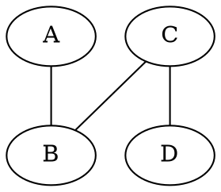

## Bit-wise operaties

### Bitwise operatoren in c

#### Logical operators

#### Bit-shifting

### Bits manipuleren

#### Bits lezen

#### Bits wijzigen naar 1 (met or)

#### Bits wijzigen naar 0 (met and)

#### Bits wisselen (met xor)
