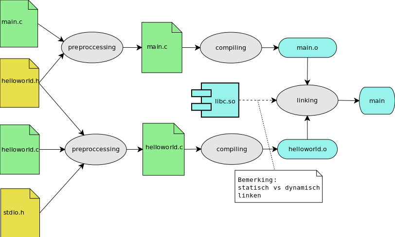

# Keywords

-----------

## Tot nu toe

* Algoritmes schrijven
    * sequentieel:  
      input/output,statement, expressies,  
      variabelen en types
    * selectief:
      if/else/else if
    * repititief:
      loops,  do while, for, ...
* Bit-twiddling and masking
* Functies en procudures
* Linken vs Compilen vs preprocessing => Macro's

-------------

## C-memory

------------

* lvalue vs rvalue-experssions
* blocks
* translation units: a source code file plus its included header files

------------

### Memory in het algemeen (herhaling)

Zoals we reeds eerder hebben gezien   
Het **werk-geheugen** van een computer wordt:

* Opgedeeld in **geheugen-locaties**
     * **1 byte** groot
     * **aaneengesloten**
    * 1 grote **array**
* Elk van deze adressen is **adresseerbaar**
* Deze **adressen volgen elkaar op** zoals in het onderstaand voorbeeld
* Je kan dit het gemakkelijkst bekijken als een **lange rij** van geheugencellen van 1 byte lang


-----------

### Voorbeeld: adres opvragen

```c
//file: {memory/requesting_adress.c}
#include <stdio.h>

short global_a;
short global_a_with_value = 2;

short global_b;
short global_b_with_value = 2;

void print_some_local()
{
  short local_a,local_b;
  printf("&local_a = %p\n",&local_a);
  printf("&local_b = %p\n",&local_b);
}


int main()
{
    short local_a,local_b;
    printf("&local_a = %p\n",&local_a);
    printf("&local_b = %p\n",&local_b);

    printf("&global_a = %p\n",&global_a);
    printf("&global_b = %p\n",&global_b);

    printf("&global_a_with_value = %p\n",&global_a_with_value);
    printf("&global_b_with_value = %p\n",&global_b_with_value);


    printf("main = %p\n",main);

    print_some_lcoal();

    return 0;
}
```

----------

```bash
$ memory/requesting_adress
&local_a = 0x7fff5e0194fc
&local_b = 0x7fff5e0194fe
&global_a = 0x601048
&global_b = 0x601046
&global_a_with_value = 0x601040
&global_b_with_value = 0x601042
main = 0x40052d
```

```bash
&local_a = 0x7fffffffddbc
&local_b = 0x7fffffffddbe
&global_a = 0x601048
&global_b = 0x601046
&global_a_with_value = 0x601040
&global_b_with_value = 0x601042
main = 0x40052d
```


```bash

...
23 .data         00000014  0000000000601030  0000000000601030  00001030  2**3
                 CONTENTS, ALLOC, LOAD, DATA
24 .bss          0000000c  0000000000601044  0000000000601044  00001044  2**1
                 ALLOC
25 .comment      0000004d  0000000000000000  0000000000000000  00001044  2**0
                 CONTENTS, READONLY
```

-----------

### Voorbeeld: adres opvragen

```c
//file: {memory/requesting_adress_array.c}
#include <stdio.h>
int main()
{
    short a[5];
    printf("%p\n",a );
    printf("%p\n",&a[0]);
    printf("%p\n",&a[2]);
    return 0;
}
```

----------

### Voorbeeld: adres opvragen

Run 1:

```bash
$ make memory/requesting_adress
cc     memory/requesting_adress.c   -o memory/requesting_adress
$ memory/requesting_adress
0x7ffe9f6c6cb0
0x7ffe9f6c6cb0
0x7ffe9f6c6cb4
$
```

### Voorbeeld: adres opvragen

Run 2:

```bash
$ memory/requesting_adress
0x7ffec0e12500
0x7ffec0e12500
0x7ffec0e12504
```

### Voorbeeld: adres opvragen

Observaties:

*
*
*


### sizeof-operator

----------

### Identifier en object

Je moet aan deze variabele aangeraken:

```c
int a;
```
* Identifier duidt aan hoe dat de compiler het object moet behandelen
* Je declareert het
* Verwijzing naar een stuk
identifier...name
object


----------
TODO: Show memory-map en leg uit!!
TODO Memory-management defenitie

-----------

storage management is een model

-----------
```c
int entity = 3;
```

* creert een identifier entity
* kan gebruikt worden om het object (waar nu 3) in staat aan te spreken

```
int * pt = &entity;
int ranks[10];
```

* 2de manier zijn pointers en arrays (komt min of meer op het zelfde neer)
* pt en ranks zijn identifiers
* \*pt is een lvalue expressie


## Keywords (1ste deel)

* static
* auto
* extern
* register

## Keywords (2de deel)

* volatile
* const
* restricted

Deze keywords kunnen echter een andere betekenis hebbende afhangende van ...

-----------

Character class beshrijft een object in functie van 3 zaken


-----------

## Methodes

* malloc()
* calloc()
* free()

-----------

## 3 principes

Dus eerst bekijken we 3 principes

* Scope en zichtbaarheid
* Linkage
* Storage duration

Scope and linkage describe the visibility of identifiers. Storage duration describes the persistence of the objects accessed by these identifiers.

-----------

### Scope

* Deel van het programma
* Waar een symbool kan gebruikt worden

File/Function/Block
Lexical sscope

* Global vs static visibility

-----------

### Duration

* Duurtijd van een symbool
* tov Uitvoering van het programma

* Global (static) vs Local lifetime

-----------

### Linkage

* Indentifier name
* Refeffering to different identifiers
* In dezelfde Scope

A C variable has one of the following linkages: external linkage, internal linkage, or no linkage. Variables with block scope, function scope, or function prototype scope have no linkage.

```c
int giants = 5;          // file scope, external linkage
static int dodgers = 3;  // file scope, internal linkage
int main()
{
    ...
}
```
-----------

### Block

* Block is code binnen
     * functie
     * loop
     * condities
* Meestal gemarkeerd door accolades  
  (tenzij 1 lijn)

-----------

### Translation units



-----------

### Translation units

* We gaan spreken van **file scope**
* Met file bedoelen we **translation unit**
* Translation unit == preprocessed c-file


-----------


### Overview

| Class               |  Duration  |  Scope    | Linkage    | How                              |
|---------------------|------------|-----------|------------|----------------------------------|
| Automatic           | auto       | Block     | None       | In block met/zonder keyword auto |
| Register            | auto       | Block     | None       | In block met keyword register    |
| Static ext linkage  | static     | File      | External   | Buiten alle functies             |
| Static int linkage  | static     | File      | Internal   | Buiten alle fucnties/kw static   |
| Static no linkage   | static     | Block     | None       | In block met keyword static      |


-----------

### Voorbeeld

```c
//file {memory/testing_stack.c}
#include <stdio.h>

void print_a()
{
  int a = 5;
  printf("a=%i\n",a);
}

void print_b()
{
  int b;
  printf("b=%i\n",b);
}

int main()
{
  print_a();
  print_b();
  return 0;
}
```

```bash
$ gcc memory/testing_stack.c -o memory/testing_stack
$ memory/testing_stack
5
5
```

### Voorbeeld - stack

```c
//file {memory/testing_stack.c}
#include <stdio.h>

void print_a_and_b()
{
  int a;
  static int b;
}

int main()
{


  return 0;
}
```

--------

### Voorbeeld - stack

```bash
$ gcc memory/testing_stack.c -o memory/testing_stack
$ memory/testing_stack
5
5
```

-------

###

Identifier vs object

### Scope

* Beschrijft de regio van je programma
* Dat een identifier kan accessen

### Scope: automatic vs static

* Locale variabelen hebben een automatische

### Scope

```c
#include <stdio.h>

int main()
{
	int a = 0;

	if(1) {
		int a = 3;
		printf("a=%i\n",a);
	}

	printf("a=%i\n",a);

	return 0;
}
```

-------

```c
int main() {
  for (int i = 0; i < 10; i++) {
  	printf("A C99 feature: i = %i", i);
  }
  return 0;
}
```


-std=c99

### Voorbeeld - scope van lokale variabelen

```bash
a=3
a=0
```

### Principe van hiding
```c
// hiding.c -- variables in blocks
#include <stdio.h>
int main()
{
    int x = 30;      // original x

    printf("x in outer block: %d at %p\n", x, &x);
    {
        int x = 77;  // new x, hides first x
        printf("x in inner block: %d at %p\n", x, &x);
    }
    printf("x in outer block: %d at %p\n", x, &x);
    while (x++ < 33) // original x
    {
        int x = 100; // new x, hides first x
        x++;
        printf("x in while loop: %d at %p\n", x, &x);
    }
    printf("x in outer block: %d at %p\n", x, &x);
return 0;
}
```

### Block scope (visibility) - Static durability

```c
/* loc_stat.c -- using a local static variable */
#include <stdio.h>
void trystat(void);

int main(void)
{
	int count;

	for (count = 1; count <= 3; count++) {
		printf("Here comes iteration %d:\n", count);
		trystat();
	}

	return 0;
}

void trystat(void)
{
	int fade = 1;
	static int stay = 1;

	printf("fade = %d and stay = %d\n", fade++, stay++);
}
```


### Register

```c
int main(void)
{
   register int quick;
}
```

Enkel een hint

### Voorbeeld

default-waardes


file scope with internal linkage
file scope with external linkage


### Voorbeelden linkage

```c
/* Example 1 */
int Hocus;
int magic();
int main(void)
{
   extern int Hocus;  // Hocus declared external
   ...
}
int magic()
{
   extern int Hocus;  // same Hocus as above
   ...
}
```

```c
/* Example 2 */
int Hocus;
int magic();
int main(void)
{
   extern int Hocus;  // Hocus declared external
   ...
}
int magic()
{
                      // Hocus not declared but is known
   ...
}
```

```c
/* Example 3 */
int Hocus;
int magic();
int main(void)
{
  int Hocus;        // Hocus declared, is auto by default
   ...
}
int Pocus;
int magic()
{
   auto int Hocus;  // local Hocus declared automatic
   ...
}
```

## Voorbeeld: Memory map


-----------


## Static memory-management

Met **memory-classes** bepaal je dus:

* **Waar** het bruikbaar is  
  => **scope**
* Hoe lang het bruikbaar is  
  => **storage duration**
* Of je al dan niet linkt naar een andere variabele  
  => **Linkage**

We benoemen als **static memory-management**

-------

### Static memory-management

Met 3 memory-strategien

* bepaal je **@compile-time**
* hoe dat de uiteindelijke binary memory moet behandelen  

Handig toch?

-------

### Dynamic memory-management

Maar wat als je:

* Waarde van data moet **groeien** @runtime
* Je weet niet op voorhand **hoeveel memory** je nodig hebt
* **Flexibele datastructuren** wil maken (symbol tables, linked lists, ...)
* **Abstructie en modulariteit** verhogen (zie later)
* en veel meer ...


### Dynamic memory-management

Meer precies...

* malloc()  
  Alloceren van een block memory  
  (staat enkel rommel in)
* free()  
  De-alloceren van een block memory  
  (kan worden herbruikt bij een nieuwe allocatie)
* calloc()  
  Alloceren van een block memory  
  (maar alles op 0 zetten)
* realloc()  
  Her-alloceren van een block memory

### malloc

```c
#include <stdlib.h>
#include <stdio.h>

int main()
{
   char* str;
   str = (char*) malloc(15);
   strcpy(str, "tutorialspoint");
   printf("String = %s,  Address = %u\n", str, str);
}
```

### malloc

```c
#include <stdlib.h>
#include <stdio.h>

int main()
{
   char* str;
   str = (char*) malloc(15);
   strcpy(str, "tutorialspoint");
   printf("String = %s,  Address = %u\n", str, str);
   free(str);
}
```


### Dynamic array


### Simplified linked list

### Flexibiliteit brengt miserie

### Valgrind
