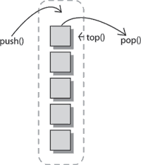

## Memory management

### Voorbeschouwing: Identifier en object

Tot nog toe hebben we bij variabelen gesproken over het reserveren van memory.  
We moeten dit beeld echter  - om memory-management in C te begrijpen - een beetje verfijnen.

Beschouw volgende **declaratie**:

```c
int a=2;
```

2 aspecten spelen hier een rol:

* **Identifier** (of symbool)
  Het symbool "a" maakt het mogelijk geheugen aan te spreken.
* Dit **geheugen** dat wordt gereserveerd noemen we het **object**  
  (niet te verwarren met object-oriented)
* **Identfier <> Object**
* We zien later dat **meerdere identifiers** kunnen bestaan voor **1 object**

### Herhaling: Locale vs globale variabelen

* **Locale** variabelen:
    * Variabelen gedeclareerd binnen een **functie**
    * (Meestal) **beperkte levensduur**
* **Globale** variabelen
    * Variabelen gedeclareerd buiten een **functie** (meestal)
    * **Levensduur** van deze **variabelen** **==** Levensduur **applicatie**
* Gaat iets verder (zie Visibility (scope), durability en linkage)

### Voorbeeld: Memory map

Een programma en het process dat in het geheugen wordt geladen heeft een specfieke structuur.


Het eerste onderdeel dat we gaan bekijken is de stack, de lokale opslag voor functies.

### Wat is een stack

De stack lokale variabelen waar we zonet over praten worden meestal opgelsagen op de stack:

* **Deel** van het **geheugen**
* Gereserveerd voor
    * **lokale variabelen**
    * **Beperkte levensduur**
* **Geoptimaliseerd** door **cpu** dus zeer snel  
  (meeste architecturen hebben instructies voor het beheer hiervan)



### Stack - werking

Hoe kunnen we dit zien in de code, we voeren het volgende experiment uit met afdrukken van de code:

```c
#include <stdio.h>
#include <string.h>

void print_a()
{
	char a = 2;
	printf("c: %p\n",&a);
	print_b();
}

void print_b()
{
	char b1 = 2;
	char b2 = 2;
	printf("b: %p\n",&b1);
	printf("b: %p\n",&b2);
}

int main()
{
	char m=1;
	printf("m: %p\n",&m);
	print_a();
	print_b();
	return 0;
}
```

``` bash
m:  0x7ffdcb37c6ff
a:  0x7ffdcb37c6df
b1: 0x7ffdcb37c6be
b2: 0x7ffdcb37c6bf
b1: 0x7ffdcb37c6de
b2: 0x7ffdcb37c6df
```

Als we starten met de code in main is er maar 1 variabele op de stack:

| adres | waarde| var    | functie    |
|-------|-------|--------|------------|
|  ff   |   1   |    x   | main       |

Daarna roepen we print_a aan, er wordt als gevolg ruimte vrijgemaakt voor variabele f:

| adres | waarde| var    | functie   |
|-------|-------|--------|-----------|
|  ff   |   1   |    x   | main      |
|  ..   |       |        |           |
|  df   |   2   |    a   | print_a   |

Daarna roept de functie print_a de functie print_b aan die ook zijn plekje reserveert:

| adres | waarde| var    | functie   |
|-------|-------|--------|-----------|
|  ff   |   1   |    x   | main      |
|  ..   |       |        |           |
|  df   |   2   |    a   | print_a   |
|  ..   |       |        |           |
|  be   |   2   |    b   | print_b   |
|  bf   |   2   |    b   | print_b   |

Ten slotte roepen we print_b rechtstreeks aan vanuit de main

| adres | waarde| var    | functie   |
|-------|-------|--------|-----------|
|  ff   |   1   |    x   | main      |
|  ..   |       |        |           |
|  de   |   2   |    b   | print_b   |
|  df   |   2   |    b   | print_b   |


## 3 principes van static memory-management

Dus eerst bekijken we 3 principes

* Visibility:
     * **Scope** en zichtbaarheid
     * **Linkage**
* Lifetime/Persistence
     * **Storage duration**

### Translation units


* We gaan spreken van **file scope**
* Met file bedoelen we **translation unit**
* Translation unit == preprocessed c-file

### Scope

Scope and linkage describe the visibility of identifiers. Storage duration describes the persistence of the objects accessed by these identifiers.


* **Deel** van het **programma**
* Waar een **identifier** kan gebruikt worden
* **File/Function/Block**
* Global vs static visibility (binnen translation unit)

### Duration

* Duurtijd van een symbool
* tov Uitvoering van het programma

* Global (static) vs Local lifetime

### Linkage

* **Linken** van **identifier** aan **objects**
* Binnen en tussen verschillende  **translation units**


### Scope voorbeeld

```c
#include <stdio.h>

int a=5;

void print_a()
{
  printf("a=%i\n",a);
}

int main()
{
	int a = 0;

	print_a();

	if(1) {
		int a = 3;
		printf("a=%i\n",a);
	}

	printf("a=%i\n",a);

	return 0;
}
```

### External vs internal Linkage

```c
int a = 5;          // file scope, external linkage
static int b = 3;  // file scope, internal linkage

int main()
{
    ...
}
```

### Keyword extern voor linkage

```c
int x;

void hello() {
	x=5;

}
```

```c
extern int x;

void world() {
	x=6;
}
```

```c
#include <stdio.h>

extern int x;

int main(void) {

	x=100;
	printf("%d\n",x);
	hello();
	printf("%d\n",x);
	world();
	printf("%d\n",x);

	return EXIT_SUCCESS;
}
```

```
100
5
6
```

### Voorbeeld - scope van lokale variabelen

```bash
a=3
a=0
```

### Principe van hiding

```c
// hiding.c -- variables in blocks
#include <stdio.h>
int main()
{
    int x = 30;      // original x

    printf("x in outer block: %d at %p\n", x, &x);
    {
        int x = 77;  // new x, hides first x
        printf("x in inner block: %d at %p\n", x, &x);
    }
    printf("x in outer block: %d at %p\n", x, &x);
    while (x++ < 33) // original x
    {
        int x = 100; // new x, hides first x
        x++;
        printf("x in while loop: %d at %p\n", x, &x);
    }
    printf("x in outer block: %d at %p\n", x, &x);
return 0;
}
```

### Block scope (visibility) - Static durability

```c
/* loc_stat.c -- using a local static variable */
#include <stdio.h>
void trystat(void);

int main(void)
{
	int count;

	for (count = 1; count <= 3; count++) {
		printf("Here comes iteration %d:\n", count);
		trystat();
	}

	return 0;
}

void trystat(void)
{
	int fade = 1;
	static int stay = 1;

	printf("fade = %d and stay = %d\n", fade++, stay++);
}
```

### Storage Duration

* **Duurtijd** van een object (<> identifier)
* tov **Uitvoering** van het **programma**
* Global (static) vs Local lifetime


### Overview

| Class               |  Duration  |  Scope    | Linkage    | How                              |
|---------------------|------------|-----------|------------|----------------------------------|
| Automatic           | auto       | Block     | None       | In block met/zonder keyword auto |
| Register            | auto       | Block     | None       | In block met keyword register    |
| Static ext linkage  | static     | File      | External   | Buiten alle functies             |
| Static int linkage  | static     | File      | Internal   | Buiten alle fucnties/kw static   |
| Static no linkage   | static     | Block     | None       | In block met keyword static      |
