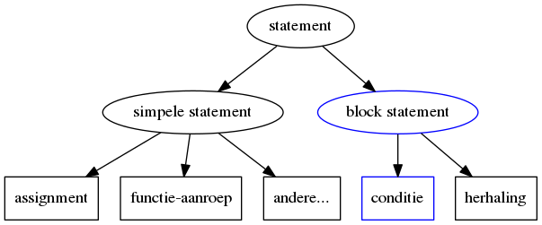

## Loops en condities in C

Tot nu toe hebben we geleerd:

* Data in te lezen uit een console (integers)
* Deze data bij te houden in een variabele
* Bewerkingen te doen hiermee
* Data naar een console te schrijven (integers)

We gaan in deze les bekijken hoe dat we een programma intelligenter kunnen maken door het zelf beslissingen te laten nemen



Eerst gaan we kennis maken met een nieuw soort van expressies van operators.

### Duiding: Logische expressies

Een logische expressie - zoals we die nu gaan zien - heeft als resultaat een integer, net zoals de "arithmetic"-expressies die we eerder hebben gezien.  
Het grote verschil is echter dat zulk een expressie die slechts 2 mogelijke waarden kan opleveren, namelijk 0 of 1.  

We noemen deze expressies (vergelijkingen in dit geval) ook wel boolean-expressies aangezien 0 false voorstelt en elke andere waarden (1 inclusief) true.

### Duiding: Relationele operatoren

Om te kunnen beslissen moet je meestal kunnen vergelijken (zoals je in de winkel ook prijs en/of kwaliteit gaat vergelijken).

Dus voor met condities te kunnen werken bekijken we eerst wat we noemen "relationele operatoren"

Tot nog toe hebben we "arithmetic" (wiskundige) operatoren gezien, die zijn gemaakt om met getallen te werken (berekeningen).

De werking en kenmerken van deze relationele operatoren zij vrij eenvoudig:

* Het zijn ook binaire operatoren (2 operanden)
* Ze vergelijken 2 getallen

### Overzicht: Relationele operatoren:

Er bestaan binnen de syntax van C 6 relationele operatoren:

| Operator | Vergelijking            |
|:---------|:------------------------|
| ```>```  | Kleiner dan             |
| ```<```  | Groter dan              |
| ```>=``` | Kleiner of gelijk dan   |
| ```<=``` | Groter of gelijk dan    |
| ```==``` | Gelijk aan              |
|```!=```  | Niet gelijk aan         |


### Voorbeeld: resultaat relationele expressie 0 of 1

Een relationele operator geeft als resultaat een integer, weliswaar met 2 mogelijke waarden.

```{.c}
#include <stdio.h>

void main()
{
    int is_5_smaller_compared_to_10 = 5 < 10;
    int is_5_bigger_compared_to_10 = 5 > 10;
    printf("%i\n",is_5_smaller_compared_to_10);
    printf("%i\n",is_5_bigger_compared_to_10);
}
```
Als we deze code daarna uitvoeren

```
$ gcc result_is_an_int.c - result_is_an_int
$ ./result_is_an_int
$ 1
$ 0
$
```
zien we bij het uitvoeren van deze code dat :

* 0 wordt gebruikt als representatie van een logische "false"
* 1 wordt gebruikt als representatie van een logische "true"

### Voorbeeld: inline vergelijking

Net zoals mathematische expressies kan je deze inline in een functie (of andere statements gebruiken).

```{.c}
#include <stdio.h>

void main()
{
    printf("%i\n",(5 < 10));
    printf("%i\n",(5 > 10));
}
```
Vanzelfsprekend geeft dit hetzelfde resultaat


```
$ gcc comparing_inline.c -o comparing_inline
$ ./comparing_inline
$ 1
$ 0
$
```

### Voorbeeld: Opletten het verschil tussen = en == (assignment vs equality)

Een equality-operator bestaat uit 2 maal ```=``` omdat dit symbaal (1 maal) - zoals we eerder hadden gezien - gereserveerd is voor assignemnts.

Dus onthoudt **```=``` is niet hetzelfde als ```==```**.
Dit is een veel voorkomende bug zelfs in professionele software, later bij condities gaan we dit nog verder bekijken.

```{.c}
#include <stdio.h>

void main()
{
	int a=5;
	int b=6;
	printf("%i\n",(a==b));
	printf("%i\n",(a=b));
}
```
```
$ gcc mixing_comparing_and_equals.c -o mixing_comparing_and_equals
$ ./mixing_comparing_and_equals
$ 0
$ 6
$
```

Zoals je ziet geeft dit als resulaat ipv 0 een 6.

### Voorbeeld: ```!=``` geeft het omgekeerde resultaat van ```==```


```{.c}
#include <stdio.h>

void main()
{
	printf("%i!=%i geeft %i\n",5,5,(5!=5));
	printf("%i==%i geeft %i\n",5,5,(5==5));

	printf("%i!=%i geeft %i\n",5,6,(5!=6));
	printf("%i==%i geeft %i\n",5,6,(5==6));
}

```

```
$ gcc not_equal.c -o not_equal
$ ./not_equal
$ 5!=5 geeft 0
$ 5==5 geeft 1
$ 5!=6 geeft 1
$ 5==6 geeft 0
$
```

### Voorbeeld: <= en >=

De >= en <= doen hetzelfde dan > en <, maar geven 1 terug als beide operanden gelijk aan elkaar zijn.

```{.c}
#include <stdio.h>

void main()
{
	printf("%i<=%i geeft %i\n",5,5,(5<=5));
	printf("%i<=%i geeft %i\n",5,6,(5<=6));

	printf("%i>=%i geeft %i\n",5,5,(5>=5));
	printf("%i>=%i geeft %i\n",5,6,(5>=6));
}
```

```
$ gcc equal_gt_st.c -o equal_gt_st
$ ./equal_gt_st
$ 5<=5 geeft 1
$ 5<=6 geeft 1
$ 5>=5 geeft 1
$ 5>=6 geeft 0
$
```

### Duiding: Condities uitdrukken in een C-programma

De relationele operatoren die we nu hebben gezien worden meestal gebruikt wanneer je een beslissing wil maken in een programma.   
Hierbij komen we bij onze eerste complexe statement in C, namelijke de if-else-statement.

Dit is een samengesteld of complex statement:

* Je plaatst een expressie die een integer produceert tussen ```if(``` en ```)```
* Als deze expressie een integer-waarde geeft verschillend van 0 wordt de code tussen ```{``` en ```}``` uitgevoerd (na de ```if(<expressie>)```)
* Een if-else-statement (of kortweg if-statement) bestaat uit if-clausule en optionele else-clausule
* Deze else-clausule bevat code tussen ```else {``` en ```}``` die wordt uitgevoerd enkel en alleen als de expressie een 0 produceert

We gaan direct van start met een aantal voorbeelden.

### Voorbeeld: "if"-statement

We gebruiken hier als voorbeeld een programma dat een getal inleest en iets afdrukt op het scherm indien het een even getal is.

```{.c}
#include <stdio.h>

void main()
{
    int input;
    printf("Gelieve een getal in te geven: ");
    scanf("%i",&input);
    if((input % 2) == 0) {
	printf("Het getal %i is even",input);
    }

}
```

Het if-stament zal er voor zorgen dat alle code die tussen accolades staat wordt uitgevoerd enkel en alleen als de logische expressie waar is (verschillend van 0)

> **Belangrijke nota:  **
> Ondanks het feit dat een logische expressie garandeert dat "true" naar 1 wordt vertaald en "false" naar 0 wordt vertaald, zal een if-statement (en aanverwanten) alles wat niet 0 is als "true" interpreteren.

Als je het programma runt een een positief getal in geeft dan zal het programma antwoorden.

```
$ gcc is_even.c -o is_even
$ ./is_even.c
$ Gelieve een getal in te geven:
$ 4
$ Het getal 4 is even
```

Als je hetzelfde opnieuw uitvoert maar dan met een oneven getal krijgt je niets als antwoord.

```
$ ./is_even.c
$ Gelieve een getal in te geven:
$ 3
$
```

Het is wel een beetje ongelukkig dat het programma niets afdrukt wanneer het getal oneven is.  

Dit zouden we kunnen oplossen door in het programma een **2de if-statement** toe te voegen (waar we naar de omgekeerde conditie testen) maar daarvoor hebben we een betere oplossing.  
 	
> **Belangrijke nota:  **  
> Een goede programmeur is naast verstandig echter ook een lui en dus zoeken naar de meest optimale oplossing.

### Voorbeeld: "else"-clause

Dit is waar een 2de element van een if-statement ter sprake komt.  
De ```if(<logische)``` is een eerste clausule (deel) van de if-statement.  
Je kan echter nog een 2de clausule inschakelen, nameljk de else-clausule.

De statements die binnen deze clausule binnen de haakjes te voorschijn komen, worden enkel uitgevoerd indien de logische expressie niet waar is.

We herschrijven als gevolg hiervan het programma

```{.c}
#include <stdio.h>

void main()
{
    int input;
    printf("Gelieve een getal in te geven: ");
    scanf("%i",&input);
    if((input % 2) == 0) {
	printf("Het getal %i is even",input);
    } else {
       printf("Het getal %i is oneven",input);
    }
}
```
Het programma zal het zelfde resultaat als het vorige, zoals je hieronder ziet...

```
$ gcc is_pair_or_not.c -o is_pair_or_not
$ ./is_pair_or_not
$ Gelieve een getal in te geven:
$ 4
$ Het getal 4 is even
$
```

Als je hetzelfde opnieuw uitvoert maar dan met een oneven getal krijgt uiteindelijk een antwoord...

```
$ ./is_even.c
$ Gelieve een getal in te geven:
$ 3
$ Het getal 4 is oneven
$
```

### Voorbeeld: Geneste if-staments

We willen ons programma uitbreiden en naast even/oneven ook testen of het negatief of positief is.  
Bedoeling is dat het programma 4 mogelijke zinnen afdrukt:

* Het getal x is een positief even getal
* Het getal x is een positief oneven getal
* Het getal x is een negatief even getal
* Het getal x is een negatief oneven getal

We wijzigen ons programma door binnen de 2 verschillende clausules (if en else) een andere te plaatsen

```{.c}
#include <stdio.h>

void main()
{
    int input;
    printf("Gelieve een getal in te geven: ");
    scanf("%i",&input);
    if(input > 0) {
    	if((input % 2) == 0) {
    		printf("Het getal %i is een positief even getal",input);
    	} else {
    		printf("Het getal %i is een positief oneven getal",input);
        }
    } else {
    	if((input % 2) == 0) {
    		printf("Het getal %i is een negatief even getal",input);
    	} else {
    		printf("Het getal %i is een negatief oneven getal",input);
        }
    }
}
```

Dit programma uitvoeren geeft ons het resultaat dat we wensen.

```{.c}
$ gcc check_pair_positive_and_negative.c -o check_pair_positive_and_negative.
$ ./check_pair_positive_and_negative.
$ Gelieve een getal in te geven:
$ 4
$ Het getal 4 is een positief even getal
$ ./check_pair_positive_and_negative
$ -5
$ Het getal -5 is een negatief oneven getal
$
```

Aan dit programma is echter nog iets fout, wat als we het getal 0 ingeven?

```{.c}
#include <stdio.h>

void main()
{
    int input;
    printf("Gelieve een getal in te geven: ");
    scanf("%i",&input);
    if(input > 0) {
    	if((input % 2) == 0) {
    		printf("Het getal %i is een positief even getal",input);
    	} else {
    		printf("Het getal %i is een positief oneven getal",input);
        }
    } else {
    	if((input % 2) == 0) {
    		printf("Het getal %i is een negatief even getal",input);
    	} else {
    		printf("Het getal %i is een negatief oneven getal",input);
        }
    }
}
```

Een mogelijke oplossing is dat we dit we rond het buitenste if-else-statement een if-else-statement plaatsen die nakijkt of het het getal gelijk is aan 0.

Er is echter een alternatieve manier om dit te bekomen

### Voorbeeld: "else if"-clausule

Er is nog een 3de soort clausule die je kan toevoegen namelijk "else if"

* Deze bevat net als de if-clausule een logische expressie
* Deze moet altijd tussen de de "else"- en de "if"-clausule geplaatst worden
* Men kan meerdere "if else"-clausules tussen de "if-" en "else-"clausules plaatsen
* Maar wel maar 1 "if"- en 1 "else"-clausele (waarbij if verplict is en else optioneel)

```{.c}
#include <stdio.h>

void main()
{
    int input;
    printf("Gelieve een getal in te geven: ");
    scanf("%i",&input);
    if(input > 0) {
    	if((input % 2) == 0) {
    		printf("Het getal %i is een positief even getal",input);
    	} else {
    		printf("Het getal %i is een positief oneven getal",input);
        }
    } else if(input==0) {
	printf("Het getal %i is noch even of oneven",input);
    } else {
    	if((input % 2) == 0) {
    		printf("Het getal %i is een negatief even getal",input);
    	} else {
    		printf("Het getal %i is een negatief oneven getal",input);
        }
    }
}
```

> **Belangrijke nota:**  
> **Leesbaarheid van een programma**  
> Je ziet dat de programma's groter en groter worden naarmate de cursus vordert.  
> In de programma's worden de statements altijd geindenteerd om leesbaarheid te behouden.  
> Gelieve deze regel ook aan te houden, in het beroepsleven moet je meestal je code delen met collega's dus je hebt er alle belang bij om deze leesbaar te houden (en er wordt rekening met gehouden in de punten).  

Als we dit testen zien we dat dit programma correct omgaat met het getal 0.

```
$ gcc check_pair_positive_and_negative_and_zero.c -o check_pair_positive_and_negative_and_zero
$ ./check_pair_positive_and_negative_and_zero.c
$ Gelieve een getal in te geven:
$ 4
$ Het getal 4 is een positief even getal
$ ./check_pair_positive_and_negative
$ Gelieve een getal in te geven:
$ -5
$ Het getal -5 is een negatief oneven getal
$ Gelieve een getal in te geven:
$ 0
$ Het getal 0 is noch even of oneven
$
```

### Voorbeeld: Mathematische expressies en getallen

Tot nog toe hebben we een if-statement enkel met logische expressies gebruikt.  
Een if-statement kan echter ook met getallen of mathematische expressies werken  
(die een integer terug geven) zoals het voorbeeld hieronder

```{.c}
#include <stdio.h>

void main()
{
     if(5 + 5) {
    	 printf("hello\n");
     }
     if(5 - 5) {
    	 printf("Deze statement print niet af\n");
     }
}
```

Dit programma zal enkel hello afdrukken, de regel is simpel:

* 0 zal altijd evalueren als false
* Alle andere getallen als true


### Logische operatoren

Een 2de soort operator die je kan gebruiken in logische expressies is de logische operator.

| Operator | Vergelijking            |
|:----------------|:------------------------|
| &&              | Logische "AND"          |
| &#124;&#124;    | Logische "OR"           |
| !               | Logische "NOT"          |

De 2 eerste operatoren && en ||

* stellen respectievelijk de combinaties and or voor
* zijn binair (2 operanden)
* geven 0 of 1 terug
* evalueren volgens de klassiek waarheidstabellen (die je hebt gezien in combinatorische)
* maar gelijkaardig aan if-statement wordt elke getal verschillend van 0 gezien als "true"

> Nota: x in de waarheidheids-tabel stelt elke niet 0 waarde voor

&& (and) zal in 0 resulteren als 1 van beide operanden gelijk is aan 0

| A | B | S  |
|:--|:--|:---|
| 0 | 0 | 0  |
| 0 | x | 0  |
| x | 0 | 0  |
| x | x | 1  |

|| (or) zal in 1 resulteren als 1 van beide opereranden niet gelijk is aan 0

| A | B | S  |
|:--|---|:---|
| 0 | 0 | 0  |
| 0 | x | 1  |
| x | 0 | 1  |
| x | X | 1  |


> Nota:  
> Je zou je kunnen afvragen waarom deze operatoren bestaan uit 2 karakters.  
> Dit wordt verklaard in de volgende les, wanneer we "bitwise"-operators bekijken.

De negatie-operator ! is een unitaire operator:

* Maakt van een 0 een 1
* Maakt van eender welk ander getal een 0

| A | S  |
|:--|:---|
| 0 | 1  |
| x | 0  |


### Voorbeeld: ! (negatie-operator)

We hernemen het voorbeeld van ons programma dat nagaat of een getal:

* positief of negatief is
* even of oneven is

In dit programma voeren we 2 wijzigingen uit:

* ((input % 2) == 0) wijzigen we naar !(input % 2)
* (input == 0) wijzigen we naar !input

```{.c}
#include <stdio.h>

void main()
{
    int input;


    printf("Gelieve een getal in te geven: ");
    scanf("%i",&input);
    if(input > 0) {
    	if(!(input % 2)) {
    		printf("Het getal %i is een positief even getal",input);
    	} else {
    		printf("Het getal %i is een positief oneven getal",input);
        }
    } else if(!input) {
    	printf("Het getal %i is noch even of oneven",input);
    } else {
    	if(!(input % 2)) {
    		printf("Het getal %i is een negatief even getal",input);
    	} else {
    		printf("Het getal %i is een negatief oneven getal",input);
        }
    }
}
```

Dit wijzigt de karakteristiek van het programma echter niet.  

We bekomen hetzelfde resultaat als we dit resultaat inverteren:
Onderstaande tabel verduidelijkt dit:

|        | **(input % 2)** | **! (input % 2)**  |
|:-------|:------------|:-----------------------|
| even   | 0           | 1                      |
| oneven | 1           | 0                      |

* Als de input even is zal (input % 2) in 0 resulteren en !(input % 2) in 1
* Als de input oneven is zal (input % 2) in 1 resulteren en !

Als we dit uittesten krijgen we hetzelfde resultaat:

```
$ gcc check_pair_positive_and_negative_and_zero2.c -o check_pair_positive_and_negative_and_zero2
$ ./check_pair_positive_and_negative_and_zero2.c
$ Gelieve een getal in te geven:
$ 4
$ Het getal 4 is een positief even getal
$ ./check_pair_positive_and_negative2
$ Gelieve een getal in te geven:
$ -5
$ Het getal -5 is een negatief oneven getal
$ ./check_pair_positive_and_negative2
$ Gelieve een getal in te geven:
$ 0
$ Het getal 0 is noch even of oneven
$
```

### Voorbeeld: &&

We bouwen voor op hetzelfd programma en vervangen de geneste statements door &&
Om het programma overzichtelijk te maken houden we de testen bij in een variabele.

```{.c}
#include <stdio.h>

void main()
{
    int input;
    int number_is_pair;
    int number_is_positive;

    printf("Gelieve een getal in te geven: ");
    scanf("%i",&input);

    number_is_pair = !(input % 2);
    number_is_positive = input > 0;

    if(!input) {
    	printf("Het getal %i is noch even of oneven",input);
    } else if(number_is_positive && number_is_pair) {
    	printf("Het getal %i is een positief even getal",input);
    } else if (number_is_positive && ! number_is_pair){
    	printf("Het getal %i is een positief oneven getal",input);
    } else if(!number_is_positive && number_is_pair) {
    	printf("Het getal %i is een negatief even getal",input);
    } else {
    	printf("Het getal %i is een negatief oneven getal",input);
    }
}
```

### Voorbeeld: ||

Voor het volgende deel schrijven we een programma dat nakijkt of een getal zich tussen 2 andere getallen bevindt.

```{.c}
#include <stdio.h>

void main()
{
    int first,second;

    printf("Gelieve een positief getal in te geven: ");
    scanf("%i",&first);

    printf("Gelieve een 2de positief getal in te geven: ");
    scanf("%i",&second);

    if(first < 0 || second < 0) {
    	printf("1 van de 2 getallen is negatief");
    } else {
    	printf("beide getatllen zijn positief");
    }
}
```
### Voorbeeld: Alles tesamen

```{.c}
#include <stdio.h>

void main()
{
    int first,second,test;

    printf("Gelieve een getal in te geven: ");
    scanf("%i",&first);

    printf("Gelieve een 2de getal in te geven: ");
    scanf("%i",&second);


    printf("Gelieve een test-getal in te geven: ");
    scanf("%i",&test);


    if( ((test <= first) &&  (test >= second))
    	||
		((test >= first) &&  (test <= second))
    	) {
    	printf("Getal %i ligt tussen %i en %i",test,first,second);
    } else {
    	printf("Getal %i ligt niet tussen %i en %i",test,first,second);
    }
}
```

### While-loops

Tot **nog toe** hadden we **logische expressies** en operatoren enkel gebruikt voor het **conditioneel uitvoeren** van code.  
Als je een stuk code wil **herhalen** op basis van een logische expressie kan je dit doen met een **while loop**.

* Deze is **gelijkaardig** aan de **if**-conditie **van vorm**, ipv een if schrijf je while.  
* Een while-statement bevat geen clausules (1 body)  

### Voorbeeld: Eenvoudige lus

We starten met een programma:

* Dat een **vermenigvuldigings-tabel** afdrukt 
* Op **basis** van een **getal** dat de gebruiker **ingeeft**

```{.c}
#include <stdio.h>

void main(void) {
  int number_to_multiply,i;
  printf("Gelieve het basis-nummer in te geven voor de tafel: \n");
  scanf("%i",&number_to_multiply);

  i=1;
  while(i<10) {
    printf("%i * %i = %i\n",i,number_to_multiply,(i * number_to_multiply) );
    i=i+1;
  }
}
```

* Dit programma zal de statements binnen de while-statement **blijven uitvoeren zolang i kleiner is dan 10**.  
* **"i"** wordt **telkens verhoogt met 1** met het gevolg dat de vermenigvulding **9 maal** wordt afgedrukt.

```
$ gcc multiplication.c -o multiplication
$ ./multiplication
$ Gelieve het basis-nummer in te geven voor de tafel:
$ 5
$ 1 * 5 = 5
$ 2 * 5 = 10
$ 3 * 5 = 15
...
```

### Voorbeeld: Geneste loops

Je kan deze loops ook in elkaar nesten (zoals we reeds bij de if's hebben gezien).  
We wijzigen het voorgaande programma en drukken alle tafels af (geen input meer vereist).    

```{.c}
void main(void) {
	int j,i;

	i=1;
	while (i<10) {
		j=1;
		while(j<10) {
			printf("%i * %i = %i\n",i,j,(i * j) );
			j=j+1;
		}
		i=i+1;
	}
}

```
De output is gelijkaardig aan het vorige-programma maar zal dus de tafels van alle getallen afdrukken.

### Voorbeeld: <= tov <

We gebruikten voor de vergelijking de expressie ```i < 10```, je kan dit ook wijzigen naar ```i <= 9```.  

> Welke optie je gebruikt is een kwestie van leesbaarheid, het hangt af van het geval (zoals we later bij de for-loop and arrays gaan zien).  


```{.c}
#include <stdio.h>

void main(void) {
	int j,i;

	i=1;
	while (i <= 9) {
		j=1;
		while(j <= 9) {
			printf("%i * %i = %i\n",i,j,(i * j) );
			j=j+1;
		}
		i=i+1;
	}
}

```

### Voorbeeld: ++-operator

Je kan ook een verkorte versie gebruiken van het statment i=i+1, namelijk i++.
Dit is een unitaire operator (1 operand) die na het getal komt.  
We komen hier later nog op terug want er zijn meer varianten hierop.  

```{.c}
#include <stdio.h>

void main(void) {
	int j,i;

	i=1;
	while (i <= 9) {
		j=1;
		while(j <= 9) {
			printf("%i * %i = %i\n",i,j,(i * j) );
			j++;
		}
		i++;
	}
}

```

### Voorbeeld: Loops en input

Een laaste voorbeeld herneemt het voorbeeld dat we eerder hebben gezien en combineert een complexe logische expressie met een while loop.

````{.c}
#include <stdio.h>

void main()
{
    int first,second,test;

    printf("Gelieve een getal in te geven: ");
    scanf("%i",&first);

    printf("Gelieve een 2de getal in te geven: ");
    scanf("%i",&second);

    printf("Gelieve een test-getal in te geven: ");
    scanf("%i",&test);
	while( ((test <= first) &&  (test >= second))
    	||
		((test >= first) &&  (test <= second))
    ) {
    	        printf("Getal %i ligt tussen %i en %i\n",test,first,second);

		printf("Gelieve een getal in te geven: ");
		scanf("%i",&first);

		printf("Gelieve een 2de getal in te geven: ");
		scanf("%i",&second);

		printf("Gelieve een test-getal in te geven: ");
		scanf("%i",&test);

	}
   	printf("Getal %i ligt niet tussen %i en %i, programma eindigt nu\n",test,first,second);

}
