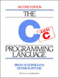

## Functies

We hebben reeds een aantal keer kennisgemaakt met functies, meer specifiek het gebruik ervan.  
Vandaag gaan we kijken hoe we zelf functies kunnen produceren.  

### Duiding: wat is een functie?

Een functie is een op zich staand stuk code ontwikkeld om een specifieke taak uit te voeren.  
Een functies kan 2 rollen in een programma innemen:

* Een **actie** uitvoeren zoals bijvoorbeeld:   
     * scanf voor een waarde in te lezen
     * printf om een waarde af te drukken.
     * een waarde wegschrijft naar een file
     * ...
* Een **waarde berekenen of genereren**, meestal op basis van een 1 of meerdere getallen, zoals bijvoorbeeld:
     * een functie die de lengte van een string uitrekent
     * de macht berekent over een getal
     * een string converteert naar hoofdletters
     * ...


### Voorbeeld: een eerste functie

Ons eerste voorbeeld bevat 2 functies.    
Dit eerste voorbeeld zal een tekst naar de console printen:  

```c
#include <stdio.h>

void print_een_boodschap()
{
   printf("%s","Een boodschap\n");
}

int main()
{
   print_een_boodschap();
   return 0;
}
```

* De functie ```main``` roept een eerder gedefinieerde functie ```print_een_boodschap``` aan
* De body van ```print_een_boodschap``` bevat een lijn code die een tekst print (via een andere functie)
* Deze functie bevat geen return-statement, dit is typisch voor "procedure"-functies
* Het keyword **void** duidt erop dat deze functie geen waarde aflevert (procedure)

> **Nota:**  
>  De **main-functie** is ook een functie.
>  Weliswaar een functie met een specifieke rol(hier komen we verder nog op terug).

Als we de functie compilen krijgen we het volgende resultaat:

```
$ gcc simpele_functie.c -o simpele_functie
$ ./simpele_functie
Een boodschap
$

```


### Duiding: verschil tussen een functie en procedure

Er wordt soms ook de naam procedure gebruikt.  
Deze naam is enkel van toepassing voor functies die een **actie** uitvoeren.  
Een (zuivere) functie die enkel een waarde berekent (zonder side-effects zoals naar een file of het scherm te schrijven benoemen we gewoon als functie.

> **Nota:**     
> Belangrijk in de design van een applicatie is proberen deze 2 concepten niet in 1 procedure te vermengen.   
> Dit gaan we nog later in deze cursus bekijken.

### Duiding: waarvoor gebruikt men functies

Kort gezegd een functie (en/of procedure) is een **"building block"** van een applicatie en wordt gebruikt voor:

* **Herhaling** van dezelfde functionaliteit binnen hetzelfde programma
* **Generaliseren** en hergebruik van functionaliteit over verschillende programma's
* **Opdelen** van je programma in logische delen
* **Abstraheren** door het scheiden van declaratie en definitie (hier komen we later op terug)
* ...

### Duiding: opbouw van een functie

Tot nog toe hebben we dus enkel functies aangeroepen, vandaag gaan we functies leren schrijven of beter gezegd **definiëren**.  
De definitie van een zo een functie bestaat uit 2 delen:

* De **functie-header**:  
Een **header** bevat de beschrijving of **signatuur** van de functie:
    * **Naam** van een functie
    * **Return-type** (optioneel)
    * 1 of meerdere **argumenten**
* De **functie-body:**:  
    * Een **body** bevat de code die wordt uitgevoerd als deze functie wordt aangeroepen.
    * Dit is een sequentie van statements omsloten door **braces** (```{code}```), net zoals de code binnen if- en while-statements is omsloten
    * 0 of meerdere **return-statements**

```
<returntype> <functienaam>(<argument 1>,<argument 2>,...)
{
    statement1;
    statement2;
    ...
}
```


### Duiding: Return-statements

Je kan vanuit een functie "communiceren" naar de aanroepende code toe via een return statement.  
Je moet hiervoor 2 elementen toevoegen aan je functie:

* Een **return-statement** toevoegen aan het einde van de functie  
  Deze bestaat uit het keyword **return** gevolgd door een waarde, expressie of variabele  
  (bv ```return (1 + 1);```)
* Het **return-type** aanduiden in de header (signatuur) van je functie.  
  Vanzelfsprekend moet dit type overeenkomen met de de expressie of variabele die je in de functie-body "returned".

Zo'n return-statement (in geval er slechts 1 is) moet altijd het laatste statement zijn anders zal deze functie niet compilen.   
Later gaan we nog zien dat we meerdere return-statements kunnen toevoegen.  

> **Nota:**  
> Later in de cursus gaan we zien dat je partiële types in je signatuur kan declareren maar dit is nog niet aan de orde.  

### Voorbeeld: functie met 1 return

Om return-statements te illustreren het volgende voorbeeld, een functie die:

* Een getal uitleest van de console.
* Het resultaat hiervan teruggeeft via een return-statement.

```c
#include <stdio.h>

int vraag_een_nummer()
{
    int nummer;
    printf("Gelieve een nummer in te geven");
    scanf("%i",&i);
    return nummer;
}

void main()
{
    int nummer=vraag_een_nummer();
    printf("Het nummer is %i",nummer);
}

```

* Deze functie geeft aan in zijn signatuur dat een integer zal worden teruggegeven (return).  
* De aanroepende code vangt deze waarde op in een variabele
* En drukt deze waarde af via een andere functie (```printf```)

### Duiding: Communiceren met argumenten

Een 2de manier van communicatie is via functie-argumenten:  

* Deze argumenten worden gebruikt als **input** van een functie
* Ze zijn in de functie beschikbaar net zoals klassieke variabelen

> **Nota:**  
> Later gaan we zien dat we argumenten ook kunnen gebruiken om waardes terug te geven als we pointers gebruiken.  

Argumenten volgen op de functie-naam ```(<argument1,argument2,...)```

* Deze argumenten worden tussen haakjes geschreven
* Meerdere argumenten worden gescheiden door haakjes

Deze argumenten zijn beschikbaar binnen de body van je functie (en alleen daar) net als de variabelen die je declareert.  
De naam van de argumenten moeten uniek zijn en hebben ook dezelfde conventies en beperkingen als andere variabelen.  

### Voorbeeld: gebruik van argumenten in een functie.   

We vullen het vorige voorbeeld aan en zorgen we ervoor dat we ook de boodschap kunnen doorgeven.  
We **parametreren** deze functie met een booschap, zodat we deze functie in verschillende situaties kunnen gebruiken.

```c
#include <stdio.h>

int vraag_een_nummer(char* boodschap)
{
    int nummer;
    printf("%s",boodschap);
    scanf("%i",&i);
    return nummer;
}

int main()
{
    int a,b;
    a=vraag_een_nummer("Geef een nummer aub");
    b=vraag_een_nummer("Geef nog een nummer aub");
    printf("De som van %i en %i is %i",a,b,(a + b));
    return 0;
}

```

Het toevoegen van dit argument zorgt dat je het gedrag van deze functie kan doen laten variëren door een andere waarde mee te geven.

### Voorbeeld: meerdere argumenten

Niets houdt ons dan ook tegen om meerdere argumenten te gebruiken.  
Ter aanvulling van het vorige voorbeeld voegen we nog een functie toe die 2 argumenten aanneemt en een som berekent.

```c
#include <stdio.h>

int vraag_een_nummer(char* boodschap)
{
    int nummer;
    printf("%s",boodschap);
    scanf("%i",&i);
    return nummer;
}

int som(int a,int b)
{
    return a + b;
}

void main()
{
    int a,b;
    a=vraag_een_nummer("Geef een nummer aub");
    b=vraag_een_nummer("Geef nog een nummer aub");
    printf("De som van %i en %i is %i",a,b,som(a,b));
}

```

### Duiding: Meerdere return-statements

Zoals eerder vermeld (en getoond), indien er slechts **1 return-statement** in de body van je functie staat dient dit het **laatste statement** te zijn binnen de **body** van je functie.  

Je kan echter **meerdere return-statements** in een functie plaatsen.  
Vanaf de moment dat je in het uitvoeren van zo'n functie bij deze statement komt zal je functie eindigen.  

De volgende regels gelden:

* Je mag binnen een functie meerdere return-statements hebben
* Maar enkel als deze in een block zitten (functie, loop, clausules van condities)
* De laatste statement in je functie moet een return-statement zijn
* Deze laatste statement mag een block-statement zijn (if, while, ...),  
  maar dan moet er in elke vertakking (of clausule) een return worden voorzien.    
  Bijvoorbeeld een if-else zal zowel in de if- als in de else-statement een return moeten geven

De filosofie achter deze regels komt terug op:

* Elke **logische vertakking van een functie** moet in een **return-waarde** resulteren.  
  Met andere woorden, je functie moet voor **elke mogelijke combinatie van argumenten een antwoord geven** (ofwel geen enkel antwoord in geval van procedures)  
* Code die nooit kan uitgevoerd worden, ook wel **dode code** genoemd is niet toegestaan en zal een error veroorzaken bij compilatie.  
  Bijvoorbeeld code die binnen een functie na een return-statement wordt geplaatst veroorzaakt zal altijd een error veroorzaken bij compilatie.  


### Voorbeelden: Meerdere return-statements

In deze functie is het laatste een block-statement.  
In deze code is het duidelijk gegarandeerd dat er altijd een waarde vanuit de functie wordt teruggegeven.  
(zowel in de if en else-clausule)

```c
int max(int a,int b)
{
    if(a > b) {
         return a;
    } else {
	return b;
    }
}
```

De compiler zal niet aanvaarden dat je nog een statement hierna plaatst.

```c
// deze code compileert niet
int max(int a,int b)
{
    if(a > b) {
         return a;
    } else {
         return b;
    }
    printf("Deze statement kan niet worden uitgevoerd");
}
```

En ook niet in dit geval want de if-else clausule vangt alle mogelijkheden op.

```c
// deze code compileert niet
int max(int a,int b)
{
    if(a > b) {
         return a;
    } else {
         return b;
    }
    return a;
}
```

De volgende schrijfwijze zal wel werken.  
Deze zal het zelfde resultaat geven als de eerste implementatie.
Dit aangezien je in beide gevallen toch aan ```return b;``` uitkomt als de if-statement 0 evalueert.

```c
int max(int a,int b)
{
    if(a > b) {
         return a;
    }
    return b;
}
```


### Duiding: void-return

Een functie die geen return-waarde teruggeeft (void als return waarde) kan echter ook vervroegd het programma beëindigen via een return-statement.
Hier geldt wel de regel van **dode code** - code die na zo een **expliciete return** komt (en deze return staat niet afgeschermd door een conditie) - een fout zal genereren.

### Voorbeelden: void-return

Bijvoorbeeld het volgende programma zal terugkeren als a kleiner is dan 0.

```c
void print_enkel_positieve_getallen(int a)
{
    if(a < 0) {
        return;
    }
    printf("%i",a));

}
```

Het programma is echter wel equivalent aan het volgende:

```c
void print_enkel_positieve_getallen(int a)
{
    if(a >= 0) {
        printf("%i\n");
    }
}
```


### Duiding en voorbeelden: Scope van variabelen

Nu we met functies beginnen te werken is het de goede moment om ook over **scope** te praten
Tot nog toe hebben we 2 soorten variabelen gezien:

* Argumenten (een waarde meegegeven aan een functie)
* Lokale variabelen (gedeclareerd binnen een variabele)

Deze variabelen hebben als eigenschap dat deze enkel binnen een functie bereikbaar (accessible) zijn.  
We noemen dit fenomeen ook wel de **scope** van een variabele.

De scope van zo'n lokale variabele is enkel zichtbaar en beperkt tot de functie waarin ze wordt gebruikt.  
In het voorbeeld hieronder zal a enkel zichtbaar zijn in de de methode ```hello()``` en niet de methode ```world()```


```c
//deze code zal niet compilen
void hello()
{
    int a = 5;
}

void world()
{
    printf("%i",a);
}
```

Eenzelfde variabele-naam kan echter ook voorkomen in verschillende functies.  
Deze zal dan ook worden beschouwd als een andere variabele.

In code hieronder is de variabele ```a``` in de methode ```hello()``` is namelijk niet dezelfde als de variabele ```a``` in de functie ```world()```

```c
void hello()
{
    char* a = "hello";
}

void world()
{
    char* a = "world";
}
```

Deze scope benoemen we als **functie-scope**.

### Duiding en voorbeelden: block-scope

Dit principe kunnen we echter nog verder trekken, namelijk **block-scope** (op niveau van clausules binnen loops, condities, ...).   
We illustreren dit als volgt:  

```c
//deze code zal niet compileren
void hello(int x)
{
    if(x) {
        int a = 5;
    }
    printf("%i",a);
}
```

Variabele ```a``` is enkel zichtbaar tussen de accolades van de if-statement.  
De lijn binnen de printf-statement kan echter de variabele a niet zien aangezien de scope enkel beperkt is tot de if-clausule

Ook als deze statement binnen de else-clausule staat zal dit niet werken want de scope is letterlijk beperkt tot de accolades.  

```c
//deze code zal niet compileren
void hello(int x)
{
    if(x) {
        int a = 5;
    } else {
        printf("%i",a);
    }
}
```

Het omgekeerde is echter wel waar.  
Een variabele gedeclareerd op een hoger niveau is zichtbaar voor de blocks op een lager niveau.   
Hoewel nutteloos zal de code hieronder wel compilen.  

```c
//deze code zal niet compileren
void hello(int x)
{
    int a = 5
    if(x) {
        printf("%i",a);
    } else {
        printf("%i",a);
    }
}
```

### Duiding en voorbeelden: naam-conflicten

Naam-conflicten in C worden als volgt behandeld in C

* Op hetzelfde niveau of scope kan je geen 2 variabelen declareren met dezelfde naam.  
* In een subniveau (bijvoorbeeld condities of loops) kan je een variabele declareren met dezelfde naam als degene op een hoger niveau.  
  In dit geval zal de bovenste variabele buiten scope worden gesteld.  

In de onderstaande code printen we een variabele genaamd a.  
Deze variabele is echter op 2 niveaus gedeclareerd:

* functie-scope
* block-scope  

```c
void hello(int x)
{
    int a = 10;

    if(x) {
        int a = 5;
        printf("%i",a);
    } else {
        printf("%i",a);
    }
}
```

* Als je de functie zou aanroepen met ```hello(1)``` zal deze 5 afprinten  
  De variabele op het bovenste niveau wordt als het ware buiten scope gezet of genegeerd.
* Als je de functie zou aanroepen met ```hello(0)``` zal deze 10 afprinten.

### Duiding en voorbeelden: globale scope

Er is echter nog een derde soort scope mogelijk namelijk de globale scope.
Deze scope geldt voor variabelen die gedeclareerd worden buiten functies om.


```c
#include <stdio.h>

int teller = 0;

void tel_omhoog()
{
    teller++;
}

void tel_omlaag()
{
    teller--;
}

void print_teller()
{
     printf("teller= %i\n",teller);
}

void main()
{
    print_teller();
    tel_omhoog();
    print_teller();
    tel_omhoog();
    print_teller();
    tel_omlaag();
    print_teller();
}
```
Dit geeft als resultaat:

```
$ gcc teller.c -o teller
$ ./teller
0
1
2
1
$
```

De variabelen die je dus buiten een functie declareert kan je dus lezen vanuit elke functie binnen het zelfde programma.  

### Voorbeeld: Conventies rond plaatsing van accolades

```c
#include <stdio.h>

int main()
{
    int i=0;
    while(i < 8) {
        if((i%2) == 0) {
            printf("%i is deelbaar door 2\n",i);
	}
        i = i + 1;
    }
}

```

Zoals je ziet start de accolade bij de functie op volgende lijn en de accolades bij andere constructies zoals loops en condities op de zelfde lijn.  

Dit is een algemeen aangenomen conventie in de c-wereld en komt voor uit het boek "The C Programming Language" van Brian Kernighan en wijlen Dennis Ritchie.  



Hoewel zeker niet het enige boek over C, wordt dit boek beschouwd als de bijbel ivm C-programmatie.  
Met als gevolg dat wat in dit boek staat als algemene conventie wordt aanvaard.

### Functie-prototype

In de voorgaande voorbeelden kan je al zien dat functies altijd worden (eigen moeten worden) gedeclareerd voor de functies die deze gebruiken  
(bijvoorbeeld main gebruikt print_teller dus print_teller mag niet na main worden gedeclareerd).    

Dit is een regel binnen c waarmee je rekening mee moet houden, je kan enkel gebruiken wat reeds eerder is gedeclareerd (zowel functies als variabelen).


```c
#include <stdio.h>

void main()
{
    print_hello("Het getal is %i",getal);
}

int getal = 5;

```
Bovenstaande code bijvoorbeeld zal niet compileren want getal is gedeclareerd na de main-functie (en dus niet gekend).

> **Nota:**  
> Dit is niet altijd het geval in andere talen verwant aan c zoals Java en C# die minder streng zijn hieromtrent.

Het zelfde geldt trouwens ook voor functies.  
De volgende code zal desgevolg ook niet compilen aangezien de functie main de functie print_hello() gebruikt.

```c
#include <stdio.h>

void main()
{
    print_hello();
}

void print_hello()
{
    printf("Hello World");
}
```

Dit kan je echter oplossen door een **functie-prototype** te gebruiken.  
Dit is een declaratie om de compiler aan te geven dat deze functie later in het programma zal worden gedefiniëerd.

```c
#include <stdio.h>

void print_hello();

void main()
{
    print_hello();
}

void print_hello()
{
    printf("Hello World");
}
```

> **Nota: **
> We komen hier later op terug, want in combinatie met **preprocessing** kan dit een zeer krachtig mechanisme zijn.  
> Maar daarvoor moeten we eerst nog verdere inleiding krijgen in **preprocessing** en **header-files**


### Voorbeeld: main-functie

Eigenlijk maken we al onze eigen functies sinds de start van de cursus, namelijk de main-functie.  
Dit is een functie als een ander, met diens verschil dat deze functie altijd als het **entry point** wordt beschouwd van je programma (door de compilers).  

```c
#include <stdio.h>

void main()
{
    printf("Hello world");
}
```

Nu dat we echter weten wat een return-statement is zullen we in de cursus altijd een return-statement plaatsen.  
De conventie is dat als het programma eindigt zonder error dat de waarde 0 is.

```c
#include <stdio.h>

int main()
{
   printf("Hello world");
   return 0;
}
```

Deze return-code wordt trouwens door het OS opgevangen en kan je gebruiken om aan te tonen of je programma succesvol is beëindigd.  
Niets houdt ons echter tegen om een andere waarde terug te geven.  

```c
#include <stdio.h>

int main()
{
   printf("Hello world\n");
   return 1;
}
```
Ter illustratie, op Linux en Mac kan je deze code opvragen na het beëindigen van het programma met de shell-variabele ```$?```

```
$ gcc errorcode.c -o errorcode
$ ./errorcode
Hello worldbart
$ echo $?
1
$
```

In Windows kan je dit doen via de shell-variabele ```%errorlevel%```
