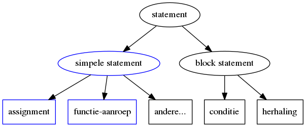

## Code: Eerste stappen in programmeren met c

Als voorbereiding op de labo's, gaan we een aantal elementaire kenmerken van een software-programma in C verder onder de loep nemen:

We starten met een kort voorbeeld:


```{.c}
void main ()
{
	int a;
	a = 1 + 2;
	printf("1 + 2 = %i",a);
}
```

Deze code-snippet heeft als **functionaliteit** het **afdrukken** van de **som** van de getallen **1 en 2**.    
Het eindresultaat van dit programma is een afdruk op het scherm:

```
1 + 2 = 3
```

Om deze bewerkingen te kunnen voltooien zijn er 3 (soorten) belangrijke elementen die we vandaag gaan bespreken:  

* Een **declaratie**:  
We **declareren** wat we noemen een **variabele** van het **type integer**  
In de praktijk betekent dit dat het programma een stukje geheugen zal reserveren ter grootte van een integer (4 of 8 bytes) en dit linken aan een naam. 
* Een **assignment** (of initialisatie) :    
We **initialiseren** deze **variabele** met een waarde (in dit geval het resultaat van de expressie 1 + 2)
* Een **functie-aanroep**:  
We **roepen** de **functie printf aan** (reeds voorzien in de C-libraries) die er voor zorgt dat het resultaat wordt afgedrukt naar het scherm.


### Duiding: simpele statements  

De 2 lijnen (in voorgaande code) die na de declaratie kwamen (assignment en functie-aanroep) benoemen we **statements**.  
 
Waar een declaratie dient om het werkgeheugen van een programma te organiseren, stellen statements concrete acties voor (waarde toekennen, berekening, printen, ...).

Er zijn veel verschillende soorten statements in c, degene die we vandaag bekijken kunnen we definiëren als we **simpele statements**, deze :  

* Doen slechts 1 (functionele) taak
* Worden in C altijd beindigd met een ; (semicolon in het Engels)
* Kunnen (en worden meestal op 1 lijn) geschreven worden



> Bemerking:  
> Deze les heeft slechts 1 doel, namelijk de student de eerste basis te geven om een heel eenvoudige command-line applicatie te doen schrijven (hetgeen voor een eerste kennismaking met programmeren al een hele hoop werk is).  

Daarom focussen we eerst op de deze "simpele statements" (**blauwe gedeelte** in het diagram), daarnaast zullen we ook kennis maken met de volgende begrippen gerelateerd aan simple statements:

* Variabelen en waardes
* Expressies (nummer-expressies) en operatoren
* Constanten

De andere soorten statements zoals bijvoorbeeld:

* het conditioneel uitvoeren van statements
* het herhalen van deze statements (onder bepaalde condities)
* zelf schrijven van functies en procedures
* return statements
...

nemen we onder loep in de volgende hoofdstukken.  

### Voorbeeld: Een leeg programma (body)

Deze statements kunnen niet zomaar in een C-programma worden geschreven, daarvoor heeft ons programma eerst een body nodig (main-functie).
Dit illustreren aan de hand van een leeg programma zonder statements.  

Als je dit programma zou aanroepen zou dit direct beëindigen zonder iets te doen maar het zeker een **geldig programma**.

~~~{.c}
void main ()
{

}
~~~

Hoewel dit programma niets doet is het wel een **geldig programma** dat je kan uitvoeren vanuit de command line.
Als je dit programma compileert en vervolgens uitvoert zie je dat dit programma niets afdrukt.

~~~
$ gcc empty.c -o empty
$ ls
empty.c empty
$ ./empty
$
~~~  

```void main(){ }``` zelf is - naast de body van het programma - wat we noemen een functie, meer details over functies volgt later.  

> Bemerking:  
> Soms zie je ook in plaats van ```void main()``` andere vormen/notaties terug:  
>  
*  ```int main()``` met ``` return 0``` (of ```return EXIT_SUCCESS;```) tussen de accolades toegevoegd
*  ```int main(int argc, char *argv[])```  (met zelfde return-statements)
>  
>
> Voorlopig houden we in deze voorbeelden bij de oorspronkelijke versie, de volgende les gaan we hier dieper op ingaan maar voorlopig hebben we deze niet nodig om onze eerste programma's te schrijven.

**Wat je echter moet onthouden naar de volgende voorbeelden toe:**

* Een c-programma **start** met **"void main()"**
* **Tussen** de **accolades** kan je een **sequentie** van **statements** schrijven.
* Wat er tussen deze accolades staat wordt ook wel de **body** van je programma genoemd.

### Voorbeeld: Schrijven van tekst naar een console  

Een eerste stap bij het aanleren van programmeertalen is het schrijven van programma dat een tekst-boodschap afdrukt.  
Dit noemt men ook wel een "Hello World"-programma, de meeste voorbeelden op het internet printen ook effectief de tekst "Hello World" afdrukken.  

> Bemerking:  
> Je moet maar eens in google de zoekterm Hello World C typen en naar de voorbeelden kijken.  
>  
> Op Wikipedia (http://en.wikipedia.org/wiki/List_of_Hello_world_program_examples) zie je trouwens voorbeelden voor zowat alle programmeer-talen die er bestaan..

In C bestaat er voor het afdrukken een specifieke functie genaamd "printf", zoals geïllustreerd hieronder:  

```{.c}
#include <stdio.h>
void main ()
{
  printf("Hello World\n");
}
```

Als je nu dit programma compileert en uitvoert, zie je dat het via via een terminal print de boodschap print die we aan deze functie hebben meegegeven.

```
$ gcc helloworld.c -o helloworld
$ ls
$ helloworld helloworld.c
$ ./helloworld
Hello World
$
```

Tegenover het vorige programma hebben we **3 nieuwe elementen** kunnen we hier onderscheiden:  

1. Het **aanroepen** van een **functie**
2. Gebruik van **tekst** of een **string**
3. Importeren van een **bibliotheek**/library   


* **Aanroepen van een functie**    

De eerste statement (uit bovenstaand programma) die we bekijken is het **aanroepen van een functie**.  
Een **functie** zelf - is in essentie - een stuk **herbruikbare** functionaliteit (code).

Die functionaliteit (zoals het printen) kan je dan aanroepen met de volgende syntax  
```
<naam van de procedure>(<argument>,<argument>,...);
```  
Je typt de naam van de procedure, en daarna (tussen de haakjes) een lijst van argumenten (gescheiden met komma's als er meerdere argumenten zijn).

``` {.c}
printf("Hello World");
```  
> Later in deze cursus gaan we functies nog verder bekijken:
>  
> * Beter overzicht van bestaande procedures
> * Procedures (en functies) zelf maken
> * Functies, zijnde procedures die een waarde teruggeven (eigenlijk is printf een functie maar daarover later meer)  
>
> Voorlopig zijn we echter enkel geïnteresseerd in het schrijven van tekst naar de console, we komen hier later op de cursus nog op terug.

* **Gebruik van tekst(string)**  

We hebben met dit voorbeeld reeds ons eerste datatype gezien dat je in een programma kunt gebruiken, namelijk een string (of tekst maar meestal bij programmeren gebruiken we het woord string).  

In C kan je dus een stuk tekst uitdrukken/definiëren met quotes rond (dubbele haakjes)
```
"Deze tekst staat tussen dubbele haakjes"
```
> Zelfde bemerking zoals bij functies, het concept van strings gaan we gedurende de cursus veel verder onderzoeken.  

* **Importeren van een library (of header-file)**  

Procedures (en functies) staan dikwijls (in het geval van printf bijvoorbeeld) gegroepeerd in **bibliotheken** (libraries).

De procedure die wij kunnen gebruiken (printf) staat samen met andere procedures (en functies) gedefinieerd in een **header-file**.  
Zo'n header-file kan je beschouwen als de catalogus van deze procedure-file, je krijgt daar een oplijsting van de procedures die je kan gebruiken.

Concreet gezien, om de procedure uit zo'n een bibliotheek te kunnen gebruiken moet je deze header-file aanduiden bij de start van je programma.  
Dit wordt gedaan via de volgende lijn code:
```
#include <stdio.h>
```  
De naam van de header-file staat tussen < en > geplaatst.  
Met deze include of import van deze file zorg je ervoor dat je programma beschikking krijgt tot een serie van procedures (functies) gerelateerd aan io (input/output).

> Deze bibliotheek (of library) is by default voor zien door je omgeving, en moet je niets meer doen dan deze include-statement te voorzien bij de start je programma.  
> Later gaan we andere libraries zien en ook hoe dat je zelf je eigen libraries kan definieren.

### Voorbeeld: Meerdere statements sequentieel na elkaar uitvoeren

Tot nog toe hadden we enkel 1 instructie doorgegeven, je kan het programma ook **meerdere instructies** na mekaar laten uitvoeren.  
In het programma hieronder, hebben we 2-maal een printf-functie-aanroep geplaatst:

```{.c}
#include <stdio.h>
void main ()
{
    printf("Hello world");
    printf(" is een typisch voorbeeld-programma");
}
```
Als je dit programma uitvoert krijg je het volgende resultaat:  

```
$ gcc doublestatement.c -o doublestatement
$ ./doublestatement
Hello World is een typisch voorbeeld programma
$
```
We zien we dat er 2 statements sequentieel na mekaar zijn uit gevoerd en dat de 2 stukken test naar de console worden afgedrukt.

Ter herhaling, de nieuwigheid t.o.v. het vorig  voorbeeld is:

* dat je **meerdere statements** na elkaar kan uitvoeren  
* deze statements worden van elkaar **gescheiden** door elk statement te eindigen met een **";"**


### Voorbeeld: Werken met getallen

We hadden reeds een eerste **datatype** bekeken tot nog toe, namelijk **string** (tekst).  
C ondersteunt echter **veel meer datatypes**, 1 van deze datatypes is een **integer**.

Een getal in C - in het voorbeeld hieronder een extra argument aan printf - wordt uitgedrukt door gewoon het getal te typen.  
In tegenstelling tot een string moet je hier **geen quotes** rond plaatsen.

```{.c}
#include <stdio.h>
void main ()
{
    printf("Het getal is: %i\n",5);
}
```

Met het voorbeeld hierboven voegen we 2 nieuwe elementen toe:

* Een **integer/getal** meegeven als aan **printf** (2de argument)
* Het gebruik van placeholders binnen het eerste argument van printf

De functie printf kan niet rechtstreeks getallen afdrukken.  
Daarvoor bestaat er specifieke syntax, je kan namelijk binnen het eerste (string-)argument de plek waar je het getal wil printen met %i markeren.  
De functie printf zal deze dan deze placeholder (%i) vervangen door het getal bij het afdrukken.

```
$ gcc printnumber.c -o printnumber
$ ./printnumber
$ Het getal is: 5
```

Dit lijkt vrij overbodig want ```printf("Het getal is: 5");``` geeft hetzelfde resultaat.  
Bij het begrip "variabelen" gaat het nut hiervan duidelijker worden.

### Voorbeeld: printf met meerdere argumenten

Je kan aan printf ook meerdere placeholders meegeven in 1 functie-aanroepen (het mechanisme komen we later op terug)
```{.c}
#include <stdio.h>
void main ()
{
    printf("De getallen zijn %i en %i\n",5,6);
}
```
Bovenstaand programma drukt af ```De getallen zijn 5 en 6```
Onderstaand programma drukt af ```De getallen zijn 5,6 en 7```

```{.c}
#include <stdio.h>
void main ()
{
    printf("De getallen zijn %i, %i en %i\n",5,6,7);
}
```

Als je dat programma uitvoert:

```
$ gcc printnumber.c -o printnumber
$ ./printnumber
$ De getallen zijn Het getal is: 5,6,7
```

#### Line feed

Let ook dat we aan het eind van deze string altijd **\\n** toevoegen, dit is een trucje om het programma na het afdrukken de cursus naar een nieuwe lijn te brengen.

### Voorbeeld: Variabelen en data-types  

De C-programmeertaal laat je ook toe van - tijdens het uitvoeren van je programma - bepaalde waardes bij te houden in het geheugen.
Deze waardes worden bijgehouden in wat noemen variabelen.  

```{.c}
#include <stdio.h>
int main ()
{
    int getal;
    getal = 5; 	// Geheel getal 1 = 5
    printf("Het getal is: %i\n",getal);
    printf("Nog 1 maal printen van %i\n",getal);
}
```

Het resultaat is uiteindelijk

```
$ gcc printnumber.c -o printnumber
$ ./printnumber
$ Het getal is: 5
$ Nog 1 maal printen van 5
```
### Duiding: Wat is een variabele?

Een variabele is een plekje geheugen waar je een waarde (in dit geval 5) kan opslaan en een naam kan toekennen (in dit geval een integer-getal).

Kenmerken van variabelen:  

* Heeft een naam, deze vrij te kiezen (liefst betekenisvolle namen gebruiken) Vb. L123, appel, rekeningNummer, ... )
* Met wel een aantal beperkingen zoals 
   * Mag niet starten met een cijfer
   * Mag een aantal gereserveerde karakters niet bevatten  
Voornamlijk karakters die worden gebruikt voor operatoren (*,+,-,/,%,..)  
```int een*variable;``` is bijvoorbeeld geen geldige variabele-naam
   * Geen aantal key-word van de C-taal mag worden gebruikt zoals datatypes (int, float, ..) of andere (zoals include, void, volatile, ...) 
* Heeft een bepaalde waarde of inhoud  
* Heeft een bepaald type: cijfers, karakters, strings (numerieke en alfanumerieke variabelen)  

> Bemerking:  
een belangrijk kenmerk van een variabele, namelijk geheugen-adres hebben we express niet vermeld.  
We gaan hier de volgende hoofdstukken dieper op in.

Om een variabele te gebruiken moeten we - net zoals in het eerste voorbeeld - deze variabele:

* eerst declareren ```int getal;```  (eerste lijn body)
(dit houdt in dat software een geheugenplekje reserveert in het geheugen
* daarna initialiseren met een waarde ```getal = 5;```


Een variabele zoals we zullen zien in de volgende voorbeelden kunnen we dan verder in het programma herbruiken in andere statements (ipv de waarde zelf)
   * als argument van een functie
   * de variabele gebruiken in een expressie (zie later)
   * de variabele gebruiken om een andere variabele in te stellen

### Voorbeeld: Assignment operator =

Bij deze zien we ook onze eerste **operator** in C, de assignment-operator.  
Een operator is binnen een programmeer taal (C in ons geval):  

* een **symbool** ondersteund door je compiler  
* dat een bewerking of actie voorsteld
* werkt met operanden 
    * 2 operanden in dit geval (binaire operator)
    * 1 operand gaan we later zien (unitaire operator)

In dit geval heeft een assignment:

* Het **symbool "="** als operator.
* Een **linker-operand** als **variabele** (zijn naam)
* Een **rechter-operand** als **waarde** (constante, andere variabele, expressie, ...)

### Voorbeeld: declaratie en assignment in 1 statement
Tot nog toe hebben we de declaratie en assignment van ene variabele gescheiden gehouden.  
Het onderstaande programma doet hetzelfde als het voorgaande programma

```{.c}
#include <stdio.h>
int main ()
{
    int getal = 5;
    printf("Het getal is: %i",getal);
    printf("Nog 1 maal printen van %i",getal);
}
```

(het resultaat zal identiek zijn aan ons vorig programma)  
Zoals je ziet worden de eerste 2 lijnen gecombineerd in 1 statement en winnen we 1 lijn code.
Welke stijl dat je kiest is afhankelijk van de situatie (en soms ook persoonlijke smaak).

> **Nota:**  
> Sommige compilers (en oudere versie van de C-specificatie ondersteunen deze combinatie niet) en verplichten je declaratie en assignment altijd gescheiden te houden.

### Voorbeeld: variabelen gebruiken voor initialisatie

Je kan met een variabele ook een andere variabele initialiseren.  

```{.c}
#include <stdio.h>
int main ()
{
    int getal = 5;
    int zelfde_getal = getal;
    printf("Het getal is: %i",getal);
    printf("Nog 1 maal printen van %i",zelfde_getal);
}

```
Dit gedeelte gebruikt nu 2 variabelen die dezelfde waarde bevatten
Het resultaat zal ook opnieuw hetzelfde zijn zoals de vorige getallen


### Voorbeeld: variabelen bevatten waardes

Het is belangrijk om te weten (maar ook wel logisch) dat als je een variabele initialiseert met een waarde van een aandere variabele deze de waarde overneemt
```{.c}
#include <stdio.h>
int main ()
{
    int getal = 5;
    int getal_dat_we_wijzigen = getal;
    getal_dat_we_wijzigen=10;
    printf("Het getal is: %i",getal);
    printf("Ander getal is %i",getal_dat_we_wijzigen);
}
```
Het bovenstaande programma zal eerst de waarde 5 toekennen aan de variabele getal:


De zal het de waarde van getal_dat_we_wijzigen wijzigen naar 10:


De eerste variabele (getal) blijft de waarde 5 behouden want beide variabelen wijzen naar een andere geheugenlocatie.  De statement ```int getal_dat_we_wijzigen = getal;``` zal dus enkel de waarde overdragen.

### Voorbeeld: operatoren en expressies (getallen)

Belangrijk om met onze variabelen iets dynamischer te kunnen doen dan deze enkel maar af te drukken.  
Daarvoor introduceren we het laatste element van deze les namelijk expressies.

Tot nu toe hadden we enkel gezien hoe dat we een variabele konden initialiseren met statische waardes (buiten het allereerste voorbeeld van dit hoofdstuk).  
Je kan deze waardes echter ook berekenen uit waardes, door bijvoorbeeld wiskundige expressies uit te voeren zoals in het voorbeeld hieronder:

```{.c}
#include <stdio.h>
void main ()
{
    int getal1 = 5; 	// Geheel getal 1 = 5
    int getal2 = 7;	// Geheel getal 2 = 7
    int som = getal1 + getal2;
    printf("Het resultaat is: %i",som);
}
```
Je ziet dat het programma hier 2 bestaande variabelen gebruikt om een andere variabele te initialiseren.  
Als je dit programma dan compileert en uitvoert krijg je het volgende resultaat

```
$ gcc firstexpression.c -o firstexpression
$ ./firstexpression
$ Het resultaat is 12
```

### Duiding: Operatoren en operanden (arithmetic)

Een expressie bestaat uit 2 soorten elementen (herinner operator en operanden bij de assignment) :  

* Operatoren die een specifiek bewerking voorstellen (zie tabel hieronder)   
  Elke operator is meestal **binair**, dit wil zeggen omringd door 2 operanden  
<operand> <operator> <operator> => met als voorbeeld 5 + 10 of 3 * 5
* Operanden, deze kunnen zijn:
    * Constante waardes ```5 + 6)```
    * Variabelen ```(a + 6)```
    * Andere expressies  
      Net als in wiskunde kan je complexere expressies samenstellen met meerdere operatoren  
      bv (5 + 6 * 9)
    * C volgt de matische regels door expressies in volgorde op te lossen (bv eerst */ dan +-)

Andere kenmerken:

* Je kan verschillende soorten operatoren combineren in een expressie
* Je kan ook met haakjes werken om de volgorde van uitvoering af te dwingen  
    * ```(5 + 6) * 3``` geeft 33
    * ```5 + 6 * 3``` zal eerst ```6 * 3``` uitvoeren met als resultaat ```23```
* Naast binaire operatoren bestaan er ook unitaire operatoren  
```- a + 5``` zal de waarde van a omdraaien binnen deze bewerking
 

Zoals je zie volgt een expressie in C dezelfde regels als algemen wiskunde is eigenlijk bijna identiek aan een wiskundig expressie:  

* **Overzicht operatoren**

| Operator | Operatie         |
|:---------|:-----------------|
| +        | optellen         |
| -        | aftrekken        |
| *        | vermenigvuldigen |
| /        | delen            |
| %        | rest             |

### Voorbeeld: expressies met waardes en variabelen

Een expressie bestaat niet noodzakelijk uit variabelen, je kan deze ook wisselen met constante waardes:  
(```int som = getal1 + 7;``` in plaats van ```int som = getal1 + getal2;```)

```{.c}
#include <stdio.h>
void main ()
{
    int getal1 = 5; 	// Geheel getal 1 = 5
    int som = getal1 + 7;
    printf("Het resultaat is: %i",som);
}
```

### Voorbeeld: expressies als argument van een functie

Of je kan zelfs een expressie gebruiken rechtstreeks als argument van een functie:
```
#include <stdio.h>
void main ()
{
    int getal1 = 5; 	// Geheel getal 1 = 5
    printf("Het resultaat is: %i",getal1 + 7);
}
```
(hetgeen vanzelfsprekend hetzelfde resultaat oplevert)

### Voorbeeld: expressies met meerdere operatoren

Een expressie is niet beperkt tot slechts 2 operatoren

```{.c}
#include <stdio.h>
void main ()
{
    int getal1 = 5; 	// Geheel getal 1 = 5
    int som = getal1 + 5 + 2;
    printf("Het resultaat is: %i",som);
}
```

### Voorbeeld: expressies met verschillende soorten operatoren

En je kan verschillende soorten operatoren combineren:

```{.c}
#include <stdio.h>
void main ()
{
    int getal1 = 5; 	// Geheel getal 1 = 5
    int som = ((getal1 - 3) * 3) + 6;
    printf("Het resultaat is: %i",som);
}
```
Met hetzelfde resultaat zijnde 12

### Voorbeeld: unitaire operator

Een laatste voorbeeld is de unitaire operator, in het voorbeeld hieronder gebruiken we deze om een negatie op een operand uit te voeren.

```{.c}
#include <stdio.h>
void main ()
{
    int getal1 = 5; 	// Geheel getal 1 = 5
    int som = -(getal1) + 17;
    printf("Het resultaat is: %i",som);
}
```
Bij de evaluatie van deze expressie wordt de waarde van getal1 eerst negatief gemaakt alvorens dat hier 17 wordt bij opgeteld.  
Belangrijk is te weten dat net als in de wiskunde unitaire operatoren 1st worden uitgevoerd.

### Voorbeeld: Lezen van een getal

Als laatste van deze sessie (ter voorbereiding van de labo's) leggen we uit hoe we getallen kunnen inlezen.

```{.c}
#include <stdio.h>

int main()
{
  int getal1,getal2;

  printf("%s","Geef getal 1 in ");
  scanf("%i",&getal1);
  printf("%s", "Geef getal 2 in ");
  scanf("%i",&getal2);
  printf("Het resultaat van %i + %i is %i",getal1,getal2,(getal1 + getal2));
  return 0;
}
```
Dit programma zal 2 getallen inlezen.
Hiervoor gebruikt het de procedure/functie scanf (tegenhanger van printf):
Om een waarde in een variabele in te lezen in een getal:

* Roep je deze functie aan
* Het eerste argument is voor integers (altijd) %i
* Daarna geef je een de variabele mee voorafgegaan door een & (ampersand)

> Deze & gaan we momenteel nog niet verklaren (werken met pointers zal een volledige aparte les innemen), ga er voorlopig van uit je dit moet doen.  
> Ook van deze printf- en scanf-methoden hebben we enkel nog maar het tipje van de ijsberg gezien, voorlopig leggen we enkel voldoende uit om zo snel mogelijk aan de slag te gaan. 

### Tot hier toe ...

Hebben we de eerste stap gezet in het programmeren

* We kunnen verschillende statements schrijven (declaraties, assignement, functies aanroepen, ...)
* We kunnen wiskundige bewerkingen doen (expressies)
* We kunnen stukjes geheugen gebruiken om tussentijdse resultaten op te slaan (variabelen)
* We kunnen deze data schrijven naar de console (printf)

### Wat volgt ...
We gaan nu in het labo:

* Deze kennis proberen uit te werken in een aantal labo-oefeningen en gaan 
* Kennismaken met de tools en editors die ons in staat stellen een programma te schrijven

Na dit eerste kennismakings-labo gaan we uitleggen hoe:

* Je code conditioneel kan uitvoeren 
* Je code repetitief kan uitvoeren (met bepaalde condities)
* Andere expressies (tot nu enkel numerieke) en operatoren
    * Logische operatoren
    * Relationele operatoren
    * Bit operatoren


