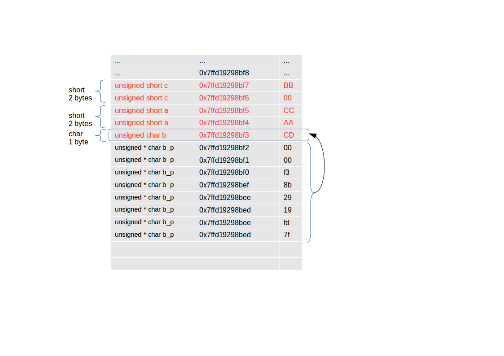

# Pointers (deel 1)

In een C-programma kan je variabelen gebruiken om toegang te verkrijgen tot het geheugen.

Met welk stuk van het geheugen deze variabelen worden geassocieerd wordt grotendeels door je compiler bepaald
(en voor een deel door je OS als er één is).

Met "klassieke" variabelen heb je eigenlijk dus niet veel controle over welk stuk van het geheugen wordt gebruikt.


## Waarom nu al pointers gebruiken

Er zijn echter scenario's (die we nog gaan zien) waar je rechtstreeks een stuk geheugen wil benaderen
(zonder hiervoor assembly-taal te moeten gebruiken).

Eén van deze scenario's die we nu gaan nodig hebben is rechtstreeks het geheugen van een microcontoller (zie later met memory-mapped IO).

Andere scenario's zijn het gebruik van dynamische geheugen, arrays, datastructuren, performantie, ...
Deze komen later in de cursus nog uitgebreid aan bod ...

## Gebruik van sizeof

De operator sizeof kan gebruikt worden om de grootte van een variabele te verkrijgen.  
Deze grootte wordt uitgedrukt in bytes.

```c
#include <stdio.h>

int main()
{
  unsigned short a = 0xCCAA;
  unsigned char b = 0xCD;
  unsigned short c = 0xBB00;
  printf("sizeof(a) = %zu bytes\n",sizeof(a));
  printf("sizeof(b) = %zu bytes\n",sizeof(b));
  printf("sizeof(c) = %zu bytes\n",sizeof(c));
  return 0;
}
```
Let ook dat je voor het afdrukken van een sizeof de placeholder %zu gebruikt ipv %i.
Dit komt later nog aan bod als we verder ingaan op de "Standard C library".

```
sizeof(a) = 2 bytes
sizeof(b) = 1 bytes
sizeof(c) = 2 bytes
```

Zoals verwacht krijgen voor a en c 2 bytes (short = 2 bytes) en voor b 1 byte (char = 1 byte)


## Adres afdrukken via referentie-operator

Het adres van een variabele kan je opvragen vanuit je programma, hiervoor bestaat er de
referentie-operator, uitgedrukt door het symbool & (of ampersand).  

Als je deze operator plaatst voor een variabele (of toch zijn naam) verkrijg je als resultaat het adres van deze variabele.  
Vorig voorbeeld breiden we uit met het adrukken van deze adressen:

```c
#include <stdio.h>

int main()
{
  unsigned short a = 0xCCAA;
  unsigned char b = 0xCD;
  unsigned short c = 0xBB00;
  printf("sizeof(a) = %zu bytes\n",sizeof(a));
  printf("address a = %p\n",&a);
  printf("sizeof(b) = %zu bytes\n",sizeof(b));
  printf("address b = %p\n",&b);
  printf("sizeof(c) = %zu bytes\n",sizeof(c));
  printf("address c = %p\n",&c);
  return 0;
}
```

Let ook dat we bij het printen de placeholder %p hebben gebruikt ipv de %i.  
Dit is een specifieke placeholder die er voor zorgt dat het adres in hexadecimaal formaat wordt afgedrukt (en rekening houdt met ).

```
sizeof(a) = 2 bytes
address a = 0x7ffd19298bf4
sizeof(b) = 1 bytes
address b = 0x7ffd19298bf3
sizeof(c) = 2 bytes
address c = 0x7ffd19298bf6
```

Merk ook op dat deze deze waardes (adressen) 8 bytes langs zijn, het gevolg van een 64-bit-(bus)-architectuur.

Visueel in het geheugen kan je deze output als volg voorstellen.


Let ook dat deze waardes zeer hoog zijn, de meeste compilers zorgen ervoor dat lokale variabelen (variabelen binnen een functie) zeer hoog in het geheugen worden bijgehouden.

## Lokale vs globale variabelen

Lokale en globale variabelen worden ook op een andere plek in het geheugen geplaatst, als we 3 globale variabelen toevoegen:

```c
#include <stdio.h>

unsigned short d = 0xCCAA;
unsigned char e = 0xAB;
unsigned short f = 0xBB00;

int main()
{
  unsigned short a = 0xCCAA;
  unsigned char b = 0xCD;
  unsigned short c = 0xBB00;

  printf("sizeof(a) = %zu bytes\n",sizeof(a));
  printf("address a = %p\n",&a);
  printf("sizeof(b) = %zu bytes\n",sizeof(b));
  printf("address b = %p\n",&b);
  printf("sizeof(c) = %zu bytes\n",sizeof(c));
  printf("address c = %p\n",&c);

  printf("sizeof(d) = %zu bytes\n",sizeof(d));
  printf("address d = %p\n",&d);
  printf("sizeof(e) = %zu bytes\n",sizeof(e));
  printf("address e = %p\n",&e);
  printf("sizeof(f) = %zu bytes\n",sizeof(f));
  printf("address f = %p\n",&f);

  return 0;
}
```

krijgen we het volgende resultaat

```
sizeof(a) = 2 bytes
address a = 0x7ffd19298bf4
sizeof(b) = 1 bytes
address b = 0x7ffd19298bf3
sizeof(c) = 2 bytes
address c = 0x7ffd19298bf6
sizeof(d) = 2 bytes
address d = 0x601040
sizeof(e) = 1 bytes
address e = 0x601042
sizeof(f) = 2 bytes
address f = 0x601044
```

Zoals we zien in onderstaande grafische voorstelling zien we dat de locatie van deze variabelen in dit programma onderaan het geheugen worden geplaatst.


## Het adres opslagen in een variabele (pointer)

```c
#include <stdio.h>

int main()
{
  unsigned short a = 0xCCAA;
  unsigned char b = 0xCD;
  unsigned short c = 0xBB00;
  unsigned char* b_p = &b;
  printf("sizeof(a) = %zu bytes\n",sizeof(a));
  printf("address a = %p\n",&a);
  printf("sizeof(b) = %zu bytes\n",sizeof(b));
  printf("address b = %p\n",&b);
  printf("sizeof(c) = %zu bytes\n",sizeof(c));
  printf("address c = %p\n",&c);

  printf("sizeof(b_p) = %zu bytes\n",sizeof(b_p));
  printf("adress b_p = %p\n",&b_p);
  printf("value b_p = %p\n",b_p);

  return 0;
}
```

```
sizeof(a) = 2 bytes
address a = 0x7ffd19298bf4
sizeof(b) = 1 bytes
address b = 0x7ffd19298bf3
sizeof(c) = 2 bytes
address c = 0x7ffd19298bf6
sizeof(b_p) = 8 bytes
address c = 0x7ffd19298bed
value b_p = 0x7ffd19298bf3
```



## Data uit geheugen ophalen via de-referentie

Nu je het adres hebt kan je dit afdrukken, maar er is meer...
Je kan met dit adres (zonder de eigenlijke variabele te gebruiken) rechtstreeks het geheugen aanspreken.

```c
#include <stdio.h>

int main(void)
{
    unsigned int a = 1;
    unsigned int* adres_van_a = &a;

    printf("Waarde van a: %i\n",a );
    printf("Waarde van a = %i (via adres): %p\n",*adres_van_a, adres_van_a );

    return 0;
}
```
Met als resultaat:

```
Waarde van a: 1
Waarde van a = 1 (via adres): 0x7fff058873bc
```


## Data aanpassen via een pointer (dereferentie)

Een 2de gebruik van dereferentie is de data op de memory-locatie aanpassen via pointers.

```c
#include <stdio.h>

int main(void)
{
    unsigned int a = 1;
    unsigned int* adres_van_a = &a;

    printf("Waarde van a: %i\n",a );
    *adres_van_a = 2;
    printf("Waarde van a: %i\n",a );

    return 0;
}
```

```
Waarde van a: 1
Waarde van a: 2
```

## AVR

```c
int main(void)
{
  volatile unsigned char* portb = (unsigned char*)0x25;
  volatile unsigned char* ddrb = (unsigned char*)0x24;
  int led_number = 5;

  volatile unsigned long busy_counter;
  unsigned long count_until = 500000;

  *ddrb |= (1<<led_number);

  while (1) {
      *portb ^= (1<<led_number);
      busy_counter = 0;
      while(busy_counter < count_until) {
          busy_counter++;
      }
  }
  return 0;
}
```
