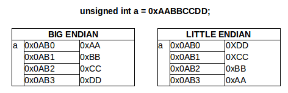

## Encodering van data in C

### Adresseerbaarheid van geheugen

Zoals we reeds eerder hebben gezien wordt het **werk-geheugen** van een computer:

* Opgedeeld in geheugen-locaties van **1 byte** groot
* Elk van deze adressen is **adresseerbaar** (of **indexeerbaar**)
* Deze **adressen volgen elkaar op** zoals in het onderstaand voorbeeld
* Je kan dit het gemakkelijkst bekijken als een **lange rij** van geheugencellen van 1 byte lang

| **adres**        |  **inhoud**     |
|------------------|-----------------|
| ```0X0000```     |  ```0XAA```     |
| ```0X0001```     |  ```0X00```     |
| ```0X0002```     |  ```0XAA```     |
| ```0X0003```     |  ```0X00```     |
| ...              |  ...            |


Bovenstaande tabel illustreert een 16-bit geheugen (zoals het datageheugen van een AVR Atmega).  
De **16 bit** van zo'n geheugen betekent dat:

* **2^16** (65536) verschillende **geheugen-cellen**
* **adresseerbaar** zijn (niet noodzakelijk beschikbaar)
* die telkens **1 byte** adresseren.

> Bij 32- of 64-bit hoef je maar om te rekenen maar ook hetzelfde principe geldt daar

### Duiding: Random-access

Dit werk-geheugen - waar je data of variabelen naar schrijft of uit leest - noemen we **Random Access Memory**, beter gekend als **RAM**.  
Random-access staat bij deze voor het feit:

* Dat geheugen adresseerbaar is
* Willekeurig (random) kan worden bereikt (schrijven of lezen)
* Met dezelfde snelheid

Dit in tegenstelling tot **sequentiele** access waarbij je het geheugen stuk voor stuk moet doorlopen.  
Bijvoorbeeld bij een seriele verbinding zal je bit per bit moeten inlezen.

### Herhaling: Variabelen en geheugen

Zeer kort samengevat, tot nog toe hebben we rond **variabelen** gezien:

* Dit stellen **locaties** in het **geheugen** voor
* Deze variabelen hadden een **type**
* We hebben ons (tot nog toe) beperkt tot **integer-types**
* We hebben ons (in het bit-mask-hoofdstuk) beperkt tot **unsigned** integer-types
* Elk van deze types hebben verschillende **grootte** (of dimensies)
* De c-standaard verplicht c-compilers (en platformen) een **minimum grootte** te respecteren (zie tabel hieronder)
* De c-compilers zijn in principe vij van boven deze minima te gaan

|type                  |minimum           | x86               |
|----------------------|------------------|-------------------|
| unsigned char        | 1                | 1                 |
| unsigned short       | 2                | 2                 |
| unsigned int         | 2                | 4                 |
| unsigned long        | 4                | 4                 |
| unsigned long long   | 8                | 8                 |

> **Nota:**  
> De types die we hieronder zijn in volgorde.  
> De C-specificatie vermeldt enkel het **minimum** maar deze **volgorde** moet wel blijven **gerespecteerd**.    
> Bijvoorbeeld een unsigned int mag op bepaalde platformen 8 bytes lang zijn, maar dan moet een unsigned long minimum 8 bytes zijn.

### Data-types en geheugen

De meeste van deze types (met uitzondering van een unsigned char) zijn groter dan een byte.
Een **c-compilers** zorgt er voor dat deze bytes achter elkaar worden geplaatst.

Als we de volgende code bekijken:

```c
unsigned char a = "0xAA";
unsigned short b = "0xAABB";
unsigned int c = "0xAABBCCDD";
```

Dan zouden deze variabelen als volgt kunnen **geencodeerd** zijn in het **geheugen**:

| **variabele** | **adres**        |  **inhoud**     |
|---------------|------------------|-----------------|
|   a           | ```0X0000```     |  ```0XAA```     |
|   b           | ```0X0001```     |  ```0XAA```     |
|   b           | ```0X0002```     |  ```0XBB```     |
|   c           | ```0X0003```     |  ```0XAA```     |
|   c           | ```0X0004```     |  ```0XBB```     |
|   c           | ```0X0005```     |  ```0XCC```     |
|   c           | ```0X0006```     |  ```0XDD```     |

Groteren types worden dus gespreid over meerdere bytes en nemen dus meerdere locaties of adressen in beslag.

* a start op adres 0  
  (0 om het gemakkelijk te maken)
* b start direct 1 byte verder op adres 1
* c start echter op adres 3 want c neemt al 2 bytes in beslag

Een compiler (en processor-architectuur) gaat altijd:

* **Opeenvolgende/aansluitende geheugencellen** gebruiken
* voor **1 variabele**.  

Dit is echter een **te simpele voorstelling...**

### Duiding: little vs big-endian

Binnen 1 variabele kan de **volgorde** of **richting** per architectuur verschillen.
Dit is het concept van **endianness**.  



Er bestaan 2 varianten:

* **Little Endian** betekent dat je de LSB (mist significante byte) aan het start-adres van je variabele zet.  
  Daarna zullen de andere bytes in (omgekeerde) volgorde van significantie geadresseerd worden.  
  De MSB (meest significante) zal je dan aan op het laatste adres aantreffen  
  (in geval het voorbeeld op adres ```0x0AB01 + 3 = 0x0AB03```)
* **Big Endian** gaat dezelfde volgorde respecteren zoals je deze in gewone wiskunde (en c-code) zou encoderen.

> **Nota:**  
> De architecturen waar me mee werken (AVR voor MCU en X86 voor PC) zijn beide little endian.  
>  
> Als we echter met pointers gaan werken kan dit van belang zijn ... zoals we later gaan zien.  

### Voorbeeld: little-endian

Als we dus bovenstaande code hernemen:

```c
unsigned char a = "0xAA";
unsigned short b = "0xAABB";
unsigned int c = "0xAABBCCDD";
```

En volgens het principe van **little-endian** coderen:

| **variabele** | **adres**        |  **inhoud**     |
|---------------|------------------|-----------------|
|   a           | ```0X0000```     |  ```0XAA```     |
|   b           | ```0X0001```     |  ```0XBB```     |
|   b           | ```0X0002```     |  ```0XAA```     |
|   c           | ```0X0003```     |  ```0XDD```     |
|   c           | ```0X0004```     |  ```0XCC```     |
|   c           | ```0X0005```     |  ```0XBB```     |
|   c           | ```0X0006```     |  ```0XAA```     |

### Duiding: endiannes

Alle operators (ook de bitwise en shift-operators) garanderen te werken zoals je de waardes in de code (en in conventionele > wiskunde) zou gebruiken.  
Dit ongeacht de architectuur en je processor, ... gelukkig maar

> Waarom is dit dan van belang?  
> Dit gaan we zien als we bij arrays en pointers belanden, zeker in combinatie met **casting**  

We gaan eerst echter nog zien wat casting betekent.

### Voorbeeld: Casten van waardes?

Je kan waarden overdragen tussen variabelen van verschillende types (en verschillende groottes).  
We noemen dit casting, er bestaan 2 varianten hierin:

* **promotie**  
  Je **initialiseert** een variabele van een bepaald type met de waarde van die van een **kleiner type**.  
  Dit geeft geen problemen, je verliest geen data.  
* **degradatie**  
  Je **initialiseert** een variabele van een bepaald type met de waarde van een variabele met een **groter type**.  
  In dit geval kan je data verliezen, de meest significante bytes zullen verloren gaan.  
  Stel dat je de variabelen van 1 byte probeert te initialiseren vanuit een 8 byte variabele zal je de 7 MSB-bytes kwijtgeraken.  
  maw als je een waarde groter dan 255 ingeeft zal je data kwijt geraken zoals in onderstaand voorbeeld

Het volgende voorbeeld van een expliciete casting illustreert de 2 principes:

```c
#include <stdio.h>

int main(void)
{
    unsigned short groter_getal=0xFFFF;
    printf("groter getal: %x\n",groter_getal);

    //promotie van een short naar een long
    unsigned long nog_groter_getal=(unsigned int)groter_getal;
    printf("nog groter getal: %x\n",nog_groter_getal);

    //degradatie van een short naar een char, je geraakt data kwijt
    unsigned char kleiner_getal=(unsigned har)groter_getal;
    printf("kleiner getal: %x",kleiner_getal);
    return 0;
}
```

In de code zie je dat je het type meegeeft tussen haakjes naar waartoe je wil casten (of converteren).  

Men noemt dit **expliciet casten**, je laat de compiler weten dat je naar dit type will converteren.  
Dit is niet verplicht maar wel belangrijk als je een degradatie toepast anders zal de compiler warnings genereren.  

```
$ gcc casting_voorbeeld.c -o casting_voorbeeld
$ ./casting_voorbeeld
groter getal: aabb
nog groter getal: aabb
kleiner getal: bb
```

Als resultaat zie je dat de waarde in het kleiner getal als het ware wordt afgeknipt.  
Enkel minst significante gedeelte "bb" blijft behouden, de boodschap is hier dat je voorzichtig moet zijn met conversies tussen types (zeker in het geval van degradatie).

> **Nota:**  
> We komen later nog terug op conversie als we bij signed integers en floating-point getallen gaan bekijken.

### Voorbeeld: toepassing van conversie

Soms kan dit verlies van data gewenst zijn.  
Stel het volgende voorbeeld:

* Een variabele bevat 2 bytes aan data
* We willen deze splitsen in 2 variabelen van 1 byte
* 1 met de minst significante byte, 1 met de meest significante byte

```c
#include <stdio.h>

int main(void) {
    unsigned short hello=0xBBAA;
    unsigned char a = hello;
    unsigned char b = hello >> 8;

    printf("%x\n",hello);
    printf("%x\n",a);
    printf("%x\n",b);

    return 0;
}
```

### Herhaling: sizeof en size_t

In C kan je de werkelijk grootte (of dimensie) van een variabele (of rechtstreeks van zijn type) opvragen via de **operator sizeof** (geen functie!!).  
Deze operator zal dan een waarde teruggeven van het type **size_t**, dit is een type specifiek voorzien voor het uitdrukken van dimensies van types en variabelen die elke C-compiler moet voorzien.  

Dit type **size_t**

* Is gemaakt om de grootte van data uit te drukken
* Is bedoeld om iets uit te drukken in bytes
* De grootte van **size_t** zal verschillen met platform en compiler
* Dit wordt gebruikt voor zowel enkelvoudige datatypes (de integers die daarnet zagen) uit te drukken,  
  maar ook complexere types zoals arrays
* **size_t** zal typisch even groot zijn als het beschikbaar geheugen van je platform  
  Bijvoorbeeld voor een 32-bit zal dit 4 (bytes) zijn, voor 64-bit 8 (bytes)

```c
#include <stdio.h>
#include <stddef.h>

int main(void)
{
    unsigned int getal = 5;
    printf("Grootte variabele type integer: %zu\n",sizeof(getal));
    printf("Grootte type integer: %zu\n",sizeof(int));

    size_t register_grootte = sizeof(size_t);
    printf("Grootte size_t: %zu\n",register_grootte);
    return 0;
}
```

Bovenstaand voorbeeld illustreert het gebruik van deze sizeof-operator:

* Je kan deze toepassen op **zowel variabelen als types** (een eender welke expressie)
* Je kan deze waarde opvangen in een variabele van het type **size_t**
* De definitie van dit type kan je vinden in de header-file **stddef.h**
* Je gebruikt de placeholder "zu" via printf

Het resultaat hiervan uitgevoerd (en gecompileerd) op een 64-bit-processor (gcc

```bash
$ lscpu | grep Architecture
Architecture:          x86_64
$ gcc --version
gcc (Ubuntu 4.9.1-16ubuntu6) 4.9.1
Copyright (C) 2014 Free Software Foundation, Inc.
This is free software; see the source for copying conditions.  There is NO
warranty; not even for MERCHANTABILITY or FITNESS FOR A PARTICULAR PURPOSE.
$ gcc sizeof_voorbeeld.c -o sizeof_voorbeeld
$ ./sizeof_voorbeeld
Grootte variabele type integer: 4
Grootte type integer: 4
Grootte size_t: 8
$
```

Zoals eerder vermeld, de grootte van deze size_t hangt af van platform en compiler, dit in de meeste gevallen overeen met de adres-dimensies van een platform.  
In het voorbeeld hierboven is dit gecompileerd en uitgevoerd op een 64-bit machine en zie je dat size_t 8 bytes lang is (hetgeen overeenstemt met 64 bits).  

### Voorbeeld: afdrukken van het geheugen-adres

In c is er ook een manier om de **adressen** (of locaties in het geheugen) te zien van variabelen.  
Men kan de **locatie in het werk-geheugen** bekomen door de naam van de variabele te prefixen met een **&-symbool**.  
Als resultaat verkrijg je dan het geheugen-adres waar deze variabele is gelocaliseerd.  
Om de waarde van dit adres af te drukken dien je de placeholder **p** te gebruiken (zoals we i gebruiken voor integers en uhh voor unsigned chars).  

```c
#include <stdio.h>

int main(void)
{
    unsigned char test=2;
    printf("Waarde van test: %uhh\n", test);
    printf("Adres van test: %p\n", &test);
    return 0;
}
```
Code:

* We extraheren het adres door **&** te plaatsen voor de variabele-naam test
* Om dit af te drukken moet je de placeholder **p** gebruiken

```
$ gcc geheugenadress_voorbeeld.c -o geheugenadress_voorbeeld
$ ./geheugenadress_voorbeeld
Waarde van test: 2hh
Adres van test: 0x7ffd772e33e7
```

Om de de waarde van dit adres op te vangen in een variabele is er ook een specifiek type voorzien (zoals we eerder hebben gezien voor size_t), namelijk pointers.  
Hier komen we later nog op terug als we bij het onderwerp pointers komen.

Voorlopig hebben we deze operator (&) nodig om in onze voorbeelden adressen af te drukken in ons volgend voorbeeld, namelijk om het concept van  **arrays te verduikelijken**.  
