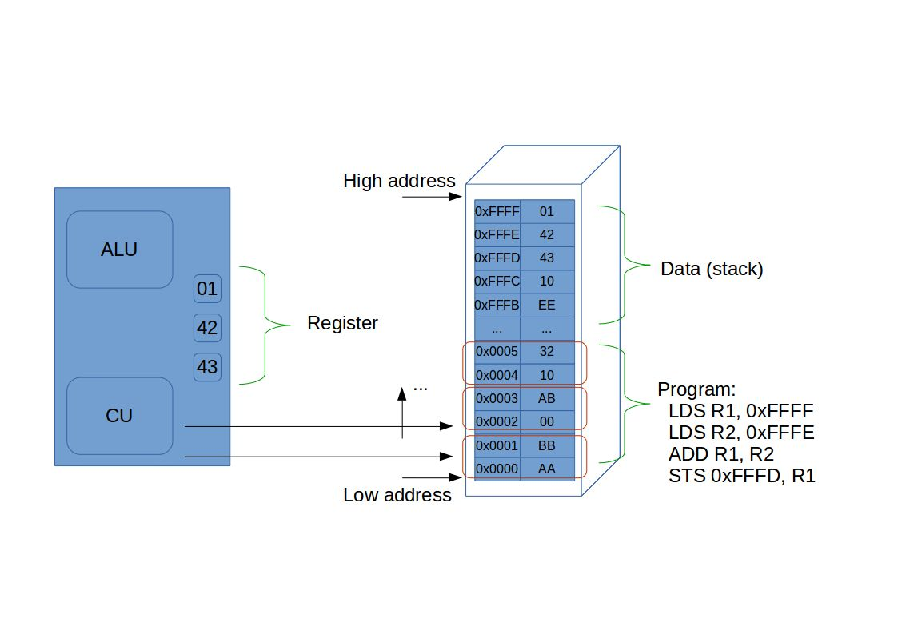
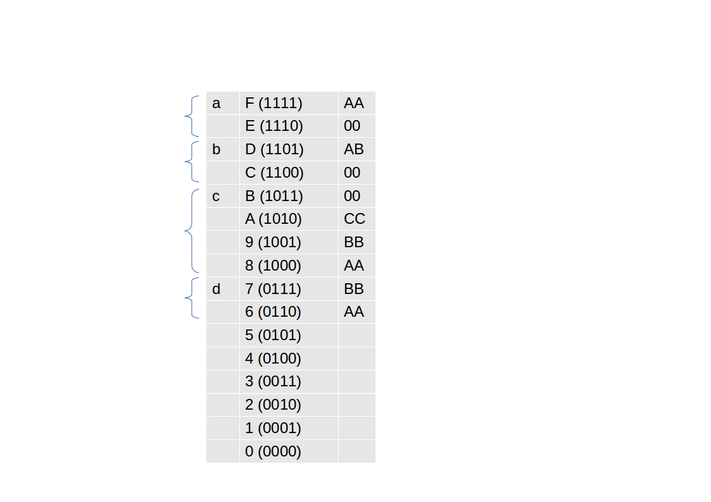
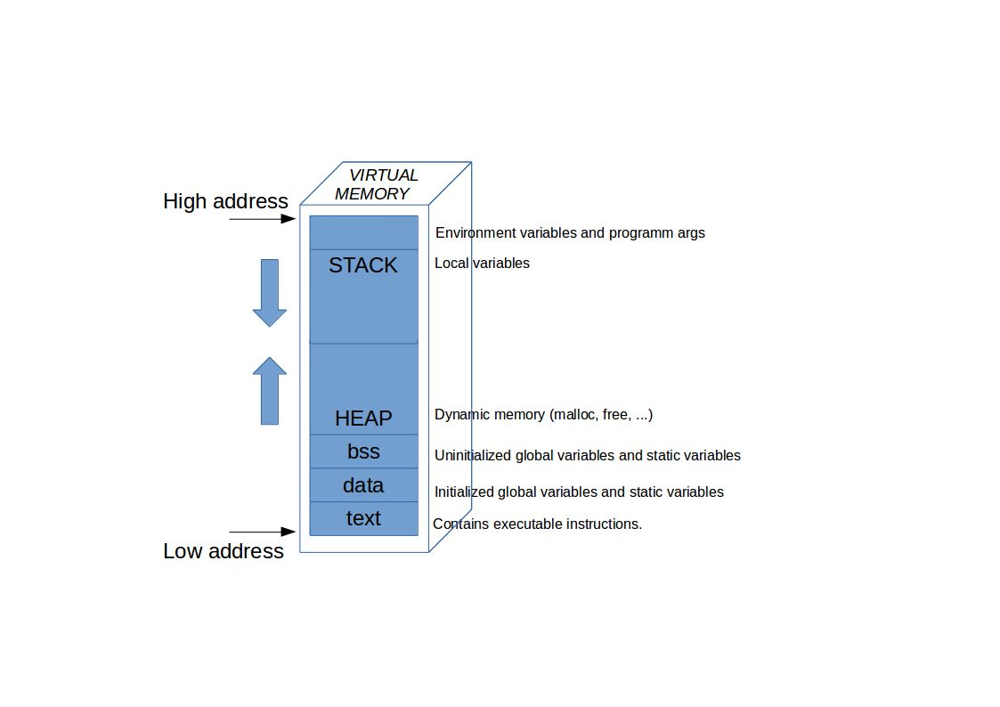

# Gebruik van geheugen

## RAM als adresseerbaar geheugen (herhaling)

Het geheugen gebruikt door een computer-(c)-programma is het RAM.  
De **RA** verwijst naar **"Random Access"***, anders gezegd kan je eender welke plek in het geheugen even snel bereiken

## Werking van een processor (en geheugen)

Heel kort ter inleiding een sterk veréénvoudigde voorstelling van de interactie tussen een processor en het RAM-geheugen (voorlopig gaan we er vanuit dat het zelfde geheugen voor instructies en data wordt gebruikt)

1. Bij het opstarten wordt het programma van de schijf in het geheugen geladen
2. Het programma wordt geladen aan de start van het geheugen (een laag adres)
3. De CU zal de computer instructies 1 voor 1 laden (in dit voorbeeld 16-bit instructies) en zal de andere componenten (ALU en DATA-bus) instrueren
4. Deze instructies worden geinterpreteerd door de CU
  * LDS zorgt er voor dat 2 bytes uit het ram-geheugen (0xFFFF en 0x FFFE) worrden geladen door de  DATA-bus  
   (respectievelijk naar register R1 en R2)   
  * ADD activeert de ALU om een optelling te doen (R1 en R2), en zal het resultaat overschrijven naar R1
  * STS zal het resultaat uit R1 terugzetten naar het RAM-geheugen

Zoals eerder meegegeven is RAM-geheugen adresseerbaar, elke stuk gegeheugen is aanspreekbaar via een adres.

We gaat dit later nog verder

## Adres afdrukken via referentie-operator
