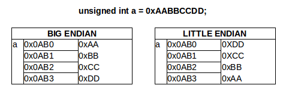
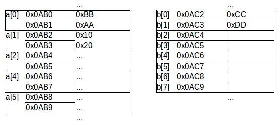
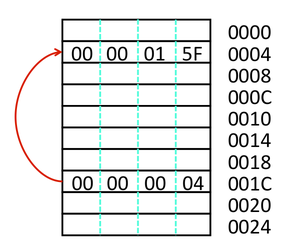
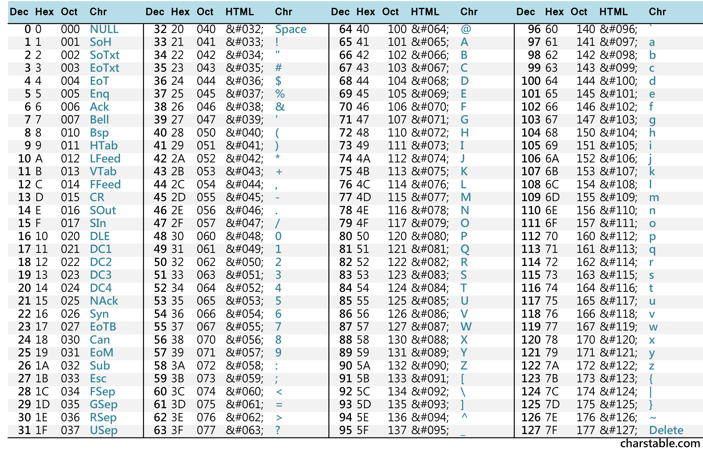

## Geheugen, pointers and arrays

### Herhaling: geheugen van een computer (memory-organisatie)

Zoals we reeds eerder hebben gezien wordt het werk-geheugen van een computer:

* Opgedeeld in geheugen-locaties van **1 byte** groot
* Elk van deze adressen is **adresseerbaar**
* Deze **adressen volgen elkaar op** zoals in het onderstaand voorbeeld
* Je kan dit het gemakkelijkst bekijken als een **lange rij** van geheugencellen van 1 byte lang

| **adres**        |  **inhoud**     |
|------------------|-----------------|
| ```0X0000```     |  ```0XAA```     |
| ```0X0001```     |  ```0X00```     |
| ```0X0002```     |  ```0XAA```     |
| ```0X0003```     |  ```0X00```     |
| ...              |  ...            |


Bovenstaande tabel illustreert een 16-bit geheugen (zoals het datageheugen van een AVR Atmega).  
De 16 bit van zo'n geheugen staat er voor dat er 2^16 (65536) verschillende geheugen-cellen beschikbaar zijn die telkens 1 byte adresseren.

### Herhaling: Variabelen en geheugen

Zeer kort samengevat, tot nog toe hebben we rond **variabelen** gezien:

* Dit stellen **locaties** in het **geheugen** voor
* Deze variabelen hadden een **type**
* We hebben ons (tot nog toe) beperkt tot **integer-types**
* We hebben ons (in het bit-mask-hoofdstuk) beperkt tot **unsigned** integer-types
* Elk van deze types hebben verschillende **grootte** (of dimensies)
* De c-standaard verplicht c-compilers (en platformen) een **minimum grootte** te respecteren (zie tabel hieronder)
* De c-compilers zijn in principe vij van boven deze minima te gaan 

|type                  |minimum           | x86               | 
|----------------------|------------------|-------------------|
| unsigned char        | 1                | 1                 |
| unsigned short       | 2                | 2                 |
| unsigned int         | 2                | 4                 |
| unsigned long        | 4                | 4                 |
| unsigned long long   | 8                | 8                 |

> **Nota:**  
> De types die we hieronder zijn in volgorde.  
> De C-specificatie vermeldt enkel het **minimum** maar deze **volgorde** moet wel blijven **gerespecteerd**.    
> Bijvoorbeeld een unsigned int mag op bepaalde platformen 8 bytes lang zijn, maar dan moet een unsigned long minimum 8 bytes zijn. 

De meeste van deze types (met uitzondering van een unsigned char) zijn groter dan een byte.
Belangrijk te weten (voor de komende onderwerken) is dat c-compilers er voor zorgen dat deze bytes achter elkaar worden geplaatst.  

### Voorbeeld: Casten van waardes?

Je kan waarden overdragen tussen variabelen van verschillende types (en verschillende groottes).  
We noemen dit castingi, er bestaan 2 varianten hierin:

* **promotie**  
  Je **initialiseert** een variabele van een bepaald type met de waarde van die van een **kleiner type**.  
  Dit geeft geen problemen, je verliest geen data.  
* **degradatie**  
  Je **initialiseert** een variabele van een bepaald type met de waarde van een variabele met een **groter type**.  
  In dit geval kan je data verliezen, de meest significante bytes zullen verloren gaan.  
  Stel dat je de variabelen van 1 byte probeert te initialiseren vanuit een 8 byte variabele zal je de 7 MSB-bytes kwijtgeraken.  
  maw als je een waarde groter dan 255 ingeeft zal je data kwijt geraken zoals in onderstaand voorbeeld

Het volgende voorbeeld van een expliciete casting illustreert de 2 principes:

```{.c}
#include <stdio.h>

int main(void) 
{
    unsigned short groter_getal=0xFFFF;
    printf("groter getal: %x\n",groter_getal);

    //promotie van een short naar een long
    unsigned long nog_groter_getal=(unsigned int)groter_getal;
    printf("nog groter getal: %x\n",nog_groter_getal);

    //degradatie van een short naar een char, je geraakt data kwijt
    unsigned char kleiner_getal=(unsigned har)groter_getal;
    printf("kleiner getal: %x",kleiner_getal);
    return 0;
}
```

In de code zie je dat je het type meegeeft tussen haakjes naar waartoe je wil casten (of converteren).  

Men noemt dit **expliciet casten**, je laat de compiler weten dat je naar dit type will converteren.  
Dit is niet verplicht maar wel belangrijk als je een degradatie toepast anders zal de compiler warnings genereren.  

```
$ gcc casting_voorbeeld.c -o casting_voorbeeld
$ ./casting_voorbeeld
groter getal: aabb
nog groter getal: aabb
kleiner getal: bb
```

Als resultaat zie je dat de waarde in het kleiner getal als het ware wordt afgeknipt.  
Enkel minst significante gedeelte "bb" blijft behouden, de boodschap is hier dat je voorzichtig moet zijn met conversies tussen types (zeker in het geval van degradatie).

> **Nota:**  
> We komen later nog terug op conversie als we bij signed integers en floating-point getallen gaan bekijken.

### Voorbeeld: toepassing van conversie

Soms kan dit verlies van data gewenst zijn.  
Stel het volgende voorbeeld:

* Een variabele bevat 2 bytes aan data
* We willen deze splitsen in 2 variabelen van 1 byte
* 1 met de minst significante byte, 1 met de meest significante byte 

```{.c}
#include <stdio.h>

int main(void) {
    unsigned short hello=0xBBAA;
    unsigned char a = hello;
    unsigned char b = hello >> 8;

    printf("%x\n",hello);
    printf("%x\n",a);
    printf("%x\n",b);

    return 0;
}
```

### Herhaling: sizeof en size_t

In C kan je de werkelijk grootte (of dimensie) van een variabele (of rechtstreeks van zijn type) opvragen via de **operator sizeof** (geen functie!!).  
Deze operator zal dan een waarde teruggeven van het type **size_t**, dit is een type specifiek voorzien voor het uitdrukken van dimensies van types en variabelen die elke C-compiler moet voorzien.  

Dit type **size_t** 

* Is gemaakt om de grootte van data uit te drukken
* Is bedoeld om iets uit te drukken in bytes
* De grootte van **size_t** zal verschillen met platform en compiler
* Dit wordt gebruikt voor zowel enkelvoudige datatypes (de integers die daarnet zagen) uit te drukken,  
  maar ook complexere types zoals arrays
* **size_t** zal typisch even groot zijn als het beschikbaar geheugen van je platform  
  Bijvoorbeeld voor een 32-bit zal dit 4 (bytes) zijn, voor 64-bit 8 (bytes)

```{.c}
#include <stdio.h>
#include <stddef.h>

int main(void) 
{
    unsigned int getal = 5;
    printf("Grootte variabele type integer: %zu\n",sizeof(getal));
    printf("Grootte type integer: %zu\n",sizeof(int));

    size_t register_grootte = sizeof(size_t);
    printf("Grootte size_t: %zu\n",register_grootte);
    return 0;
}
```

Bovenstaand voorbeeld illustreert het gebruik van deze sizeof-operator:

* Je kan deze toepassen op **zowel variabelen als types** (een eender welke expressie)
* Je kan deze waarde opvangen in een variabele van het type **size_t**
* De definitie van dit type kan je vinden in de header-file **stddef.h** 
* Je gebruikt de placeholder "zu" via printf

Het resultaat hiervan uitgevoerd (en gecompileerd) op een 64-bit-processor (gcc

```
$ lscpu | grep Architecture
Architecture:          x86_64
$ gcc --version
gcc (Ubuntu 4.9.1-16ubuntu6) 4.9.1
Copyright (C) 2014 Free Software Foundation, Inc.
This is free software; see the source for copying conditions.  There is NO
warranty; not even for MERCHANTABILITY or FITNESS FOR A PARTICULAR PURPOSE.
$ gcc sizeof_voorbeeld.c -o sizeof_voorbeeld
$ ./sizeof_voorbeeld
Grootte variabele type integer: 4
Grootte type integer: 4
Grootte size_t: 8
$
```

Zoals eerder vermeld, de grootte van deze size_t hangt af van platform en compiler, dit in de meeste gevallen overeen met de adres-dimensies van een platform.  
In het voorbeeld hierboven is dit gecompileerd en uitgevoerd op een 64-bit machine en zie je dat size_t 8 bytes lang is (hetgeen overeenstemt met 64 bits).  

### Voorbeeld: afdrukken van het geheugen-adres

In c is er ook een manier om de **adressen** (of locaties in het geheugen) te zien van variabelen.  
Men kan de **locatie in het werk-geheugen** bekomen door de naam van de variabele te prefixen met een **&-symbool**.  
Als resultaat verkrijg je dan het geheugen-adres waar deze variabele is gelocaliseerd.  
Om de waarde van dit adres af te drukken dien je de placeholder **p** te gebruiken (zoals we i gebruiken voor integers en uhh voor unsigned chars).  

```{.c}
#include <stdio.h>

int main(void) 
{
    unsigned char test=2;
    printf("Waarde van test: %uhh\n", test);
    printf("Adres van test: %p\n", &test);
    return 0;
}
```
Code: 

* We extraheren het adres door **&** te plaatsen voor de variabele-naam test
* Om dit af te drukken moet je de placeholder **p** gebruiken

```
$ gcc geheugenadress_voorbeeld.c -o geheugenadress_voorbeeld
$ ./geheugenadress_voorbeeld
Waarde van test: 2hh
Adres van test: 0x7ffd772e33e7
```

Om de de waarde van dit adres op te vangen in een variabele is er ook een specifiek type voorzien (zoals we eerder hebben gezien voor size_t), namelijk pointers.  
Hier komen we later nog op terug als we bij het onderwerp pointers komen.

Voorlopig hebben we deze operator (&) nodig om in onze voorbeelden adressen af te drukken in ons volgend voorbeeld, namelijk om het concept van  **arrays te verduikelijken.  

### Duiding: little vs big-endian

Zoals we eerder hebben vermeld zijn (bijna) alle compouters byte-georienteerd.  
Dit houdt in dat voor variabele van een groter type (zoals unsigned shorts die 2 byte lang zijn) hun inhoud is gespreid is over meerdere geheugen-cellen (in geval van unsigned short 2 cellen).  

Een compiler (en processor-architectuur) gaat vanzelfsprekend:

* Opeenvolgende geheugencellen gebruiken.  
  Als de eerste cel van een short zich op 0x0AB0 bevindt zal de volgende zich op 0x0AB1 bevinden
* Geheugencellen gebruiken in een volgorde van minst naar meest significante byte



Deze volgorde wordt altijd gerespecteerd.  
Echter zoals je hierboven kan de **richting** van deze volgorde per architectuur verschillen.  
Hierbij hebben we het concept van **endianness** geintroduceerd, hetgeen de volgorde aanduidt waarin je de individuele bytes gaat encoderen in het geheugen, er bestaan 2 varianten:

* **Little Endian** betekent dat je de LSB (mist significante byte) aan het start-adres van je variabele zet.  
  Daarna zullen de andere bytes in (omgekeerde) volgorde van significantie geadresseerd worden.  
  De MSB (meest significante) zal je dan aan op het laatste adres aantreffen  
  (in geval het voorbeeld op adres ```0x0AB01 + 3 = 0x0AB03```)
* **Big Endian** gaat dezelfde volgorde respecteren zoals je deze in gewone wiskunde (en c-code) zou encoderen.

**Belanrijke nota:**  
De architecturen waar me mee werken (AVR voor MCU en X86 voor PC) zijn beide little endian.  
Dit had weinig belang tot nog toe, gezien alle operators (ook de bitwise en shift-operators) garanderen te werken zoals je de waardes in de code (en in conventionele wiskunde) zou gebruiken.  
Als we echter met pointers gaan werken kan dit van belang zijn ... zoals we later gaan zien.  

### Introductie: wat is een array

Tot nu toe hebben we variabelen gebruikt (gedeclareerd en geïnitialiseerd) die slecht 1 waarde kunnen bevatten.  
Deze benoemen we als simpele (of enkelvoudige datatypes).

C voorzien echter ook in complexe (of samengstelde) datatypes.  
Een eerste van deze types zijn arrays (heel soms ook geïndexeerde variabele genoemd).  

Praktisch uitgedrukt arrays zijn:

* Een **verzameling** of collectie van elementen van bepaald **type**  
  (zoals we eerder int, short, char, ... hebben gezien).
* Elk **element** van zo'n array worden **gelezen of gewijzigd** via een **index**
* Een array heeft een **grootte of dimensie** (die we voor de gemakkelijkheid aanduiden als n)
* Deze index **start** bij **0** (1ste element) en **eindigt** bij de index **n-1***
* De **dimensie** van een array-variabele kan niet wijzigen tijdens de loop van het programma  
  Deze is zelfs vastgesteld bij **compilatie**  

> **Nota:**    
> Later gaan we zien dat de laatste bemerking niet volledig waar is als we spreken over dynamisch geheugen en heaps. 

### Voorbeeld: initialiseren en gebruiken van een array

Dit was de theoritische verklaring, laten we verklaren met een voorbeeld.  
Het voorbeeld hieronder declareert zo'n array en print elk **element** van deze array af.  

```{.c}
#include <stdio.h>

int main(void) {
    unsigned char een_array[2];
    een_array[0]=1;
    een_array[1]=2;

    printf("een_array[0]=%hhu\n",een_array[0]);
    printf("een_array[1]=%hhu\n",een_array[1]);

    return 0;
}
```

In dit voorbeeld:

* Declareren we een array met als dimensie 2
* We initialiseren elk van deze elementen aan de hand van de index
* We lezen ook op dezelfde manier de waardes uit deze array uit

Het resultaat is zoals verwacht:

```
$ gcc array_voorbeeld.c -o array_voorbeeld
$ ./array_voorbeeld
een_array[0]=1
een_array[1]=2
$
```

### Duiding: syntax om een array declareren en initialiseren

De declaratie van een array gaat dus als volgt:

```{.c}
type naam[grootte];
```
Belangrijk te bemerken is dat deze array eender welk type kan zijn (zelfs een array)

Je kan deze ook (optioneel) initialiseren tijdens de declaratie als volgt:

```{.c}
type naam[grootte]={waarde_1,waarde_2,...,waarde_n};
```

Assignen van een individueel element (of initialiseren) kan je doen door de index tussen vierkante haken te zetten:

```{.c}
naam[index]=waarde;
```

We zullen dit illustreren met enkele voorbeelden

### Voorbeeld: declaratie en initialisatie tegelijk

Je kan ook een array initialiseren tijdens de declaratie.

```{.c}
#include <stdio.h>

int main(void) {
    unsigned char een_array[2]={0,1};

    printf("een_array[0]=%hhu\n",een_array[0]);
    printf("een_array[1]=%hhu\n",een_array[1]);

    return 0;
}
```

Dit geeft het hezelfde resultaat als vorig voorbeeld.

### Voorbeeld: dimensie is optioneel bij gelijktijdige declaratie en initialisatie

Als je een waarde initialiseert bij declaratie kan de compiler zelf afleiden hoe groot dat de array is 

```{.c}
#include <stdio.h>

int main(void) {
    unsigned char een_array[]={0,1};

    printf("een_array[0]=%hhu\n",een_array[0]);
    printf("een_array[1]=%hhu\n",een_array[1]);

    return 0;
}
```

Het resultaat is identiek aan vorig voorbeeld.

### Voorbeeld: gebruik van sizeof bij arrays

Net zoals bij gewone variabelen kan je de grootte van zo'n array opmeten met de sizeof-operator.

```{.c}
#include <stdio.h>

int main(void) {
    unsigned char char_array[3];
    unsigned short short_array[3];

    printf("Grootte van char-array van %i elementen is %zu\n",3,sizeof(char_array));
    printf("Grootte van short-array van %i elementen is %zu\n",3,sizeof(short_array));

    return 0;
}
```

De sizeof-operator zal: 

* De grootte van de arrays in bytes geven
* Deze wordt uitgedrukt in size_t
* De grootte wordt bepaald door het aantal bytes voor een gegeven type te vermenigvuldigen met de dimensie van de array 

```
$ gcc sizeofarray_voorbeeld.c -o sizeofarray_voorbeeld
$ ./sizeofarray_voorbeeld
Grootte van char-array van 3 elementen is 3
Grootte van short-array van 3 elementen is 6
$
```

In dit voorbeeld zien we dat:

* De char-array ```3 * 1 = 3``` bytes groot is (char is 1 byte)
* De short-array ```3 * 2 = 6``` bytes groot is (short is 2 bytes)

### Voorbeeld: loopen door een array

Arrays worden in praktijk zeer veel gebruikt in combinatie met een loop.  
Volgend voorbeeld gebruikt een teller-variabele om telkens het volgende element te gebruiken. 

```{.c}
#include <stdio.h>

int main()
{
    unsigned char een_array[3]={1,2,3};

    int teller = 0;
    while(teller<sizeof(een_array)) {
        printf("Index %i heeft waarde %hhu \n",teller,een_array[teller]);
        teller++;
    }

    return 0;
}
```
Als resultaat gaat hij de individuele elementen van de array afprinten.

```
$ gcc loopingarray_voorbeeld.c -o loopingarray_voorbeeld
$ ./loopingarray_voorbeeld
Index 0 heeft waarde 1 
Index 1 heeft waarde 2 
Index 2 heeft waarde 3 
```

In de praktijk noemt men dit ook **een array iterreren**

### Voorbeeld: een niet geinitialiseerde array

Een array waarvan de elementen niet zijn geinitialiseerd zal rommel bevatten (garbage)

```{.c}
#include <stdio.h>

int main()
{
    unsigned char een_array[3];

    int teller = 0;
    while(teller<sizeof(een_array)) {
        printf("Index %i heeft waarde %hhu \n",teller,een_array[teller]);
        teller++;
    }

    return 0;
}
```

Als resultaat zal je arbitraire waardes verkrijgen (rommmel)

```
$ gcc noninit_voorbeeld.c -o noninit_voorbeeld
$ ./noninit_voorbeeld_voorbeeld
Index 0 heeft waarde 16 
Index 1 heeft waarde 46 
Index 2 heeft waarde 66 
```


### Voorbeeld: een gedeeltelijk geinitialiseerde array

Een array kan je ook gedeeltelijk initialiseren

```{.c}
#include <stdio.h>

int main()
{
    unsigned char een_array[3]={1};

    int teller = 0;
    while(teller<sizeof(een_array)) {
        printf("Index %i heeft waarde %hhu \n",teller,een_array[teller]);
        teller++;
    }

    return 0;
}
```

Deze initialisatie zal er voor zorgen:

* Dat het eerste element op 1 wordt gezet
* De andere element (index 1 en 2) worden op 0 gezet

```
$ gcc partialinit_voorbeeld.c -o partialinit_voorbeeld
$ ./partialinit_voorbeeld
Index 0 heeft waarde 1 
Index 1 heeft waarde 0 
Index 2 heeft waarde 0 
```

### Voorbeeld: een array initialiseren met 0

Dit kan ook een manier zijn om alle waardes op 0 te initialiseren bij declaraite

```{.c}
#include <stdio.h>

int main()
{
    unsigned char een_array[3]={};

    int teller = 0;
    while(teller<sizeof(een_array)/sizeof(unsigned char)) {
        printf("Index %i heeft waarde %hhu \n",teller,een_array[teller]);
        teller++;
    }

    return 0;
}
```

Zoals je zien
 
```
$ gcc arrayall0_voorbeeld.c -o arrayall0_voorbeeld_voorbeeld
$ ./arrayall0_voorbeeld
Index 0 heeft waarde 0 
Index 1 heeft waarde 0 
Index 2 heeft waarde 0 
```

### Illustratie: een array bestaat uit aangesloten geheugen-locaties

Een andere manier van te bekijken is dat een array, een array is een manier om een stuk geheugen te reserveren ter grootte van ```n * s``` waar:

* n (number) het **aantal elementen** in deze array bevat (of de dimensie)
* s (size) de **groott0**e van deze elementen (bepaalt door het type van deze array)  

Net zoals bij een gewone variabelen zal elk element van de array zijn geheugencellen adresseren



In bovenstaande illustratie:

* van het type **unsigned char** (s=1 byte)  
  met een **dimensie van 8** (n=2)  
  zou deze array ```8 * 1 = 2``` bytes geheugen innemen (opeenvolgend).  
* van het type **unsigned short** (s=2 bytes)   
  met een **dimensie van 5** (n=5) 
  zou deze array ```5 * 2 = 10``` bytes geheugen innemen (opeenvolgend). 

Let wel elke element zal (net zoals bij enkelvoudige integers) een endiannes hebben.  
Gezien we in deze cursus enkel met x86 en AVR werken zal die little endian zijn.  

**Let wel:**  
De waarde die geencodeerd is op adres 0x0AB0 (gereferenceerd door 0x0AB0) heeft dus in werkelijkheid de waarde 0xAABB  
(en niet 0xBBAA zoals je op het eerste zicht zou kunnen vermoeden)

### Voorbeeld: printen van geheugen-adressen op een array

Stel bijvoorbeeld:

* Een array met een dimensie van 3
* Op basis uit een type van bijvoorbeeld 2 bytes
* Het adress van deze array is bijvoorbeeld ```0xA0```

Dit zou inhouden dat:

* Het eerste element op ```0xA0``` zou zitten
* Het 2de op ```0xA2 (0xA + (1 * 2))```
* Het 2de op ```0xA4 (0xA + (2 * 2))```

Dit wordt geillustreerd door het volgende programma:

```{.c}
#include <stdio.h>

int main(void) {
    unsigned char char_array[3];
    unsigned short short_array[3];
    int teller=0;

    printf("Grootte van char-array van %i elementen is %zu\n",3,sizeof(char_array));

    while(teller<(sizeof(char_array)/sizeof(unsigned char))) {
        printf("Index %i heeft adres %p \n",teller,&char_array[teller]);
        teller++;
    }

    printf("\n");
    printf("Grootte van short-array van %i elementen is %zu\n",3,(sizeof(short_array)/sizeof(unsigned short)));
    teller=0;
    while(teller<(sizeof(short_array)/sizeof(unsigned short))) {
        printf("Index %i heeft waarde %p \n",teller,&short_array[teller]);
        teller++;
    }

    return 0;
}
```

Dit programma zal het volgend afprinten:

```
$ gcc arrayadress_voorbeeld.c -o arrayadress_voorbeeld_voorbeeld
$ ./arrayadress_voorbeeld
Grootte van char-array van 3 elementen is 3
Index 0 heeft adres 0x7fffea7cf490 
Index 1 heeft adres 0x7fffea7cf491 
Index 2 heeft adres 0x7fffea7cf492 

Grootte van short-array van 3 elementen is 6
Index 0 heeft waarde 0x7fffea7cf480 
Index 1 heeft waarde 0x7fffea7cf482 
Index 2 heeft waarde 0x7fffea7cf484 
Index 3 heeft waarde 0x7fffea7cf486 
Index 4 heeft waarde 0x7fffea7cf488 
Index 5 heeft waarde 0x7fffea7cf48a 
```

### Array als argument van een functie

```{.c}
#include <stdio.h>

void print_array(unsigned char a[],int index) {
	printf("%hhu\n",a[1]);
}

int main(void) {
	unsigned char hello[]={1,2,3};
	print_array(hello,1);
	printf("%li\n",sizeof(hello));
	return 0;
}
```

### Array als argument van een functie, inhoud wijzigen

```{.c}
#include <stdio.h>

void wijzig_naar_0(unsigned char a[],int index) {
	a[index]=0;
}

void print_array(unsigned char a[],int index) {
	printf("%hhu\n",a[1]);
}

int main(void) {
	unsigned char hello[]={1,2,3};
	wijzig_naar_0(hello,1);
	print_array(hello,1);
	return 0;
}
```

Later gaan we zien dat de array die je aan deze functie meegeeft eigenlijk niet volledig een array is (als we bij pointers komen)

### Waarschuwing: boundaries van een array

Zoals we reeds hebben gezien in vorig voobeeld, arrays worden in het geheugen als een aan elkaar gesloten rij opgeslagen.  
Een array met dimensie 10 en type unsigned char is opgeslagen als 10 na elkaar geplaatste unsigned char's.  

Er wordt alleen een referentie bijgehouden naar het eerste element, de andere elementen worden gevonden door adresberekening.
Er is geen controle op de grenzen (bounds) van een array, te grote indexen overschrijven geheugen dat niet voor de array was bestemd = VIEZE FOUTEN!

Als je een element van een array gaat proberen te lezen of schrijven zal deze:

* In het slechtse geval niets doen en een andere waarde uit het geheugen overschrijven.  
  Dit kan onverwachte fouten voor je programma.
* In het beste geval zal het programma eindigen (op zijn minst ga je weten dat er een fout is in je programma)  
  In de meeste operating systemen is hier wel een beveiliging op ingebouwd die je programma gaat stoppen maar dat is niet altijd een garantie.  

### Voorbeeld: pointers

We hadden reeds gezien dat je - in C - een adres kan opvragen van een variabele (via de &-operator).  
Je kan dit adres opvangen in een pointer-variabele, zoals in het code-voorbeeld hieronder:

```{.c}
#include <stdio.h>

int main(void) {

    unsigned int a = 0x5F010000;
    unsigned int* adres_van_a = &a;

    printf("Waarde van a: %x\n",a );
    printf("Adres van a: %p\n",adres_van_a );
    printf("Waarde van a die : %x\n",*adres_van_a );

	return 0;
}
```

Wat dit programma doet:

* Declareert en initialeert een variabele a op **0x5F010000**
* Vraagt het adres op van deze variabele a via de **&**-operator
* Bewaart het adres in een andere variabele adres_van_a
* Het print de waarde en adres van a af
* Gebruikt echter ook echter de pointer variabele om deze waarde te verkrijgen (en af te drukken)
  hiervoor gebruiken we de dereferentie-operator ```*```

Als resultaat krijgen we: 

```
Waarde van a: 5f010000
Adres van a: 0x7ffdcdf795ac
Waarde van a: 5f010000
```

### Referentie en de-referentie

Er zijn hier 3 belangrijke elementen in de code:

**Declaratie van een pointer:**

```{.c }
unsigned int* adres_van_a
``` 

```*``` wordt hier gebruikt als een deel van het type (geen operator) op aan te duiden dat dit:

* een variabele is van het type **pointer**
* naar een variabele van het type **unsigned int verwijst**
 

**Referentie nemen van een adres:**  

```{.c }
&a
``` 

```&``` speelt hier bij initialisatie de rol van **referentie-operator**  
(referentie kan je hier als rechtstreekse vertaling van pointer bekijken)


**De-referentie van een pointer:**  

```{.c }
*adres_van_a
``` 

```*``` speelt de rol van **de-referentie-operator**
(je gaat als het ware de referentie gebruiken om de geheugenplaats aan te spreken)

### Duiding: pointers

De onderstaande tekening illustreert de code op een andere manier:



Verklaring:  

* In de tekening hierboven zetten we **variabele a** zich op het **adres 0x00000004**.
* We initialiseren echter een 2de **variabele adres_van_a** die het adres van van a bevat.  
  Deze pointer-variabele bevindt zich op het adres 0x00000001c.  
* Deze pointer-variabele is een variabele zoals een ander specfiek type (pointer-type)
* Een pointer-variabele heeft altijd dezelfde grootte, ongeacht de grootte van het type waarnaar deze "point"  
  Een pointer naar een unsigned char zal dezelfde grootte hebben als een pointer naar het type unsigned long long.  
* Deze grootte komt meestal overeen met de grootte van de adress-bus (probeer dit uit met sizeof uit te voeren op een pointer-variabele of type)   
  Op een 32-bit-platform zal dit 32 bit zijn (x86), op een 64-bit-platform zal dit 64 bit zijn (x86-64)

> **Nota:**  
> We gaan hier uit van de hypotese dat zowel een **unsigned int** als een **pointer** 4 bytes lang zijn voor het voorbeeld. 

### Voorbeeld: pointer gebruiken om een waarde te wijzigen:

We breiden het voorgaand voorbeeld om de waarde te wijzigen aan de hand van een pointer aan de hand van de **de-referentie-operator**.

```{.c}
#include <stdio.h>

int main(void) {

    unsigned int a = 0x5F010000;
    unsigned int* adres_van_a = &a;

    printf("Waarde van a: %x\n",a );
    printf("Adres van a: %p\n",adres_van_a );
    printf("Waarde van a (met de-referentie): %x\n",*adres_van_a );

    *adres_van_a = 0x10;

    printf("\n");
    printf("Waarde van a: %x\n",a );
    printf("Adres van a: %p\n",adres_van_a );
    printf("Waarde van a (met de-referentie): %x\n",*adres_van_a );

	return 0;
}
```

### Voorbeeld: pointers en functies

Een pointer - zijnde een variabele als een ander - kan je ook meegegeven aan functies.

```{.c}

#include <stdio.h>

void wijzig_pointer(int* a,int nieuwe_waarde);
void print_pointer(int* a);

int main(void) {

    unsigned int a = 0x5F010000;
    unsigned int* adres_van_a = &a;

    print_pointer(adres_van_a);
    wijzig_pointer(adres_van_a,10);
    print_pointer(adres_van_a);

	return 0;
}

void wijzig_pointer(int* a,int nieuwe_waarde)
{
    *a = nieuwe_waarde;
}

void print_pointer(int* a)
{
    printf("Adres van a: %p\n",a );
    printf("Waarde van a (met de-referentie): %x\n",*a );
}
```

Het "side-effect" hier van is dat je een pointer kan gebruiken om (via dit adres) de waarde van een variabele te wijzigen.

### Voorbeeld: pointers en arrays

```{.c}
#include <stdio.h>

int main(void) {
    unsigned short short_array[3]={1,2,3};
    int teller=0;

    printf("Eerst via een array\n");
    printf("Grootte van short-array van %i elementen is %zu\n",3,(sizeof(short_array)/sizeof(unsigned short)));
    teller=0;
    while(teller<(sizeof(short_array)/sizeof(unsigned short))) {
        printf("Index %i heeft waarde %i \n",teller,short_array[teller]);
        printf("Index %i heeft adres %p \n",teller,&short_array[teller]);
        teller++;
    }


    teller=0;

    printf("Nu met pointer-arithmetiek\n");

    printf("Grootte van short-array van %i elementen is %zu\n",3,(sizeof(short_array)/sizeof(unsigned short)));
    teller=0;
    while(teller<(sizeof(short_array)/sizeof(unsigned short))) {
        printf("Index %i heeft waarde %i \n",teller,*(short_array + teller));
        printf("Index %i heeft adres %p \n",teller,(short_array + teller));
        teller++;
    }

    return 0;
}
```


```
Eerst via een array
Grootte van short-array van 3 elementen is 3
Index 0 heeft waarde 1 
Index 0 heeft adres 0x7fffb48559e0 
Index 1 heeft waarde 2 
Index 1 heeft adres 0x7fffb48559e2 
Index 2 heeft waarde 3 
Index 2 heeft adres 0x7fffb48559e4 
Nu met pointer-arithmetiek
Grootte van short-array van 3 elementen is 3
Index 0 heeft waarde 1 
Index 0 heeft adres 0x7fffb48559e0 
Index 1 heeft waarde 2 
Index 1 heeft adres 0x7fffb48559e2 
Index 2 heeft waarde 3 
Index 2 heeft adres 0x7fffb48559e4 
```


### Voorbeeld: array-notatie op gewone variabelen

```{.c}
#include <stdio.h>

int main() {
    int test=1;
    int* referentie_naar_test = &test;

    printf("Rechtstreeks: %i\n",test);
    printf("Via de-reference-operator: %i\n",*referentie_naar_test);
    printf("Via array-notatie: %i\n",referentie_naar_test[0]);

    return 0;
}
```

```
Rechtstreeks: 1
Via de-reference-operator: 1
Via array-notatie: 1
```
### Voorbeeld: je kan een array als argument van een functie is een pointer

We hadden daarnet gezien dat een array en een pointer eigenlijk zo goed als hetzelfde is.  
Het enig verschil tussen beide is de declaratie, als je een variabele ```char a[5]``` declareert vraag je aan de compiler om 5 bytes te reserveren.  

In het vervolg van het programma wordt deze variabele a eigenlijk beschouwd als een pointer.  
Het volgende programma illustreert dit door een variabele mee te geven als argument aan een functie: 

```{.c}
#include <stdio.h>

void print_array(unsigned char a[]) {
	printf("%li\n",sizeof(a));
	printf("%hhu\n",a[1]);
}

int main(void) {
	unsigned char hello[]={1,2,3};
	print_array(hello);
	printf("%li\n",sizeof(hello));
	return 0;
}
```

Het verschil tussen beide ligt in het feit dat een array eigenlijk enkel een declaratie is (reservatie) van geheugen.
De waarde van een array kan je eigenlijk niet meegeven aan een functie, in plaats daarvan geef je het adres van de array mee.


### Voorbeeld: pointers en casten

```{.c}
#include <stdio.h>

int main(void) {


    unsigned short short_array[3]={0xABCD,0xEF12,0x3456};
    unsigned char* char_array=(unsigned char*)short_array;
    int teller=0;

    printf("Eerst via een array\n\n");
    printf("Grootte van short-array van %i elementen is %zu\n",3,(sizeof(short_array)/sizeof(unsigned short)));
    teller=0;
    while(teller<(sizeof(short_array)/sizeof(unsigned short))) {
        printf("Index %i heeft waarde %x \n",teller,short_array[teller]);
        printf("Index %i heeft adres %p \n",teller,&short_array[teller]);
        teller++;
    }


    teller=0;

    printf("\nNu met pointer-arithmetiek\n\n");

    printf("Grootte van short-array van %i elementen is %zu\n",3,(sizeof(short_array)/sizeof(unsigned char)));
    teller=0;
    while(teller<(sizeof(short_array)/sizeof(unsigned char))) {
        printf("Index %i heeft waarde %x \n",teller,*(char_array + teller));
        printf("Index %i heeft adres %p \n",teller,(char_array + teller));
        teller++;
    }

    return 0;
}
```


```
Eerst via een array

Grootte van short-array van 3 elementen is 3
Index 0 heeft waarde abcd 
Index 0 heeft adres 0x7fff6db9ccc0 
Index 1 heeft waarde ef12 
Index 1 heeft adres 0x7fff6db9ccc2 
Index 2 heeft waarde 3456 
Index 2 heeft adres 0x7fff6db9ccc4 

Nu met pointer-arithmetiek

Grootte van short-array van 3 elementen is 6
Index 0 heeft waarde cd 
Index 0 heeft adres 0x7fff6db9ccc0 
Index 1 heeft waarde ab 
Index 1 heeft adres 0x7fff6db9ccc1 
Index 2 heeft waarde 12 
Index 2 heeft adres 0x7fff6db9ccc2 
Index 3 heeft waarde ef 
Index 3 heeft adres 0x7fff6db9ccc3 
Index 4 heeft waarde 56 
Index 4 heeft adres 0x7fff6db9ccc4 
Index 5 heeft waarde 34 
Index 5 heeft adres 0x7fff6db9ccc5 
```

### Duiding: ASCCI

Tot nu toe hebben we de unsigned char gebruikt om bytes (8 bits) in variabelen op te slagen.  
char (afkorting van character) wordt ook gebruikt om assci-karakters voor te stellen.

**ASCCI** is een internationale conventie die bepaalt welke cijfer-waarde overeenkomt met welke code:



### Voorbeeld: char-datatype als tekst

Deze ASCCI wordt ook door c-programma's gebruikt als conventie voor encoderen van karakter-waardes en het printen van tekst.

```{.c}
#include <stdio.h>


int main(void) {
    char hello = 'a';
    printf("hello als karakter: %c\n",hello);
    printf("hello als cijfer: %i\n",hello);
}
```

### Voorbeeld: String

Zo 1 karakter is op zich niet zo heel bruikbaar.  
Daarom gebruikt met meestal array van char's om tekst bij te houden.  
Dit noemen ze ook strings

```{.c}
#include <stdio.h>

int main(void) {
    char* hello = "TEST";
    printf("%s\n",hello);
    return 0;
}
```


### Voorbeeld: string wijzigen

In vorige code kon je echter deze string niet wijzigen.  
Dit was omdat deze string een constante was in het geheugen van het programma (komen we later nog op terug)

```{.c}
#include <stdio.h>

int main(void) {
    char hello[5] = "TEST";
    hello[1]='A';
    hello[4]='A';
    printf("%s\n",hello);
	return 0;
}
```
### Voorbeeld: string inlezen en wijzigen

```{.c}
#include <stdio.h>

int main(void) {
    char hello[20];
    fgets(hello, sizeof(hello), stdin);
    printf("%s\n",hello);
    return 0;
}
```

### Duiding: String  en terminator

Een string niet langer kan zijn dan het geheugen in de char-array gereserveerd.  
Meer precies het maximum aantal karakter is gelijk aan het de grootte van de array - 1.  

Waarom is dit en hoe dat een printf-functie weet hoeveel karakters het mag afdrukken (als hij bijvoorbeeld maar met 4 karakters is gevuld (in een buffer van 20)?

Het antwoord ligt hier in de conventie die wordt gebruikt in c-programma's (en andere platformen).  
Een string wordt in een array namelijk altijd beeïndigd met het karakter ```\0``` (ook wel string-terminator genoemd)

In het voorbeeld hieronder zien we de inhoud van een char-array van 20 chars nadat hij is ingelezen met de tekst "TEST".

|0   | 1    |  2   |   3   |  4     |   5   |    6   |   ....  | 20 |
|----|------|------|-------|--------|-------|--------|---------|----|
|T   | E    |S     | T     |```\0```|       |        |         |    |

Op positie 4 zien we het karakter ```\0``` dat het einde van de eigenlijke tekst bepaald.  
Het gebruik van deze string-terminator (0-karakter) betekent dat je maar maximum 19 karakters in een char-array van 20 karakter kan opslaan.

### Voorbeeld: een while loop en een string

```{.c}
#include <stdio.h>

int main(void)
{
    char hello[20]="TEST";
    printf("%s\n",hello);

    int teller = 0;

    while(teller < sizeof(hello)/sizeof(char)) {
        if(hello[teller]=='\0') {
            return 0;
        } else {
            printf("%c",hello[teller]);
        }
        teller++;
    }

    return 0;
}
```
