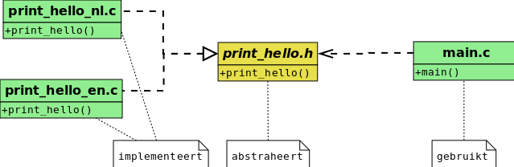

## Programma's bouwen met meerdere files

De basis (en grootste kwaliteit) van een goed programma is leesbaarheid en onderhoudbaarheid.  
Zonder deze basis is het niet mogelijk een goed werkend en flexibel programma te maken, echt niet.  

Een belangrijk element hiervan hebben we reeds gezien namelijk het werken met functies.  
In dit hoofdstuk bouwen we hierop verder door te kijken hoe je je code kan verdelen over meerdere files.

> **Nota:**
> Nogmaals ter herhaling, dit is het belangrijkste voor een een ontwikkelaar, zeker als je met andere ontwikkelaars samenwerkt.  
> **Simpele, goed opgedeelde code** die bovendien goed **getest en voorbereid** is maakt **90,00 %** uit van het **succes van een project**, de andere **10 %** in het vinden van een goed idee of concept.  
>
> Dit is wat men met andere woorden noemt vakmanschap.  
> Elke professional zal dit bevestigen, een taal goed kennen komt er op neer de mechanismes van de taal te beheersen om dit resultaat te bereiken.  
> Dit thema zal bijgevolg vanaf dit deel veel terugkomen in deze cursus.

### Herhaling: Functie-prototypes

In de les ivm functies spraken we reeds van functie-prototypes.  
We hernemen hierbij de voorbeeld-code van onze eerste kennismaking van functie-prototypes.  

```{.c}
#include <stdio.h>

void print_hello();

void main()
{
    print_hello();
}

void print_hello()
{
    printf("Hello World");
}
```

Ter **herhaling**, deze functie-prototypes stelden ons in staat de functie ```print_hello()``` te gebruiken op een moment dat deze nog niet gedefinieerd was in de functie ```main()``` door deze functie te declareren in een functie-prototype.  

Prototypes binnen dezelfde file kan handig zijn als je je programma leesbaar wil maken, in dit geval bijvoorbeeld kan je de belangrijkst functie (main) vanboven zetten.  

In dit klein programma maakt het minder uit maar als programma +100 lijnen groot is begint dit belangrijker te worden.  


### Voorbeeld: je programma verdelen over verschillende files

Een volgende stap is de de logica in je programma over verschillende files gaan verdelen.

* Je kan bijvoorbeeld de logica voor het printen van een boodschap in een aparte file bijhouden (helloworld.c):

```{.c}
#include <stdio.h>

void print_hello()
{
    printf("Hello World\n");
}
```

* En het main-programma in een aparte file main.c

```{.c}
void print_hello();

void main()
{
    print_hello();
}

```

* Deze 2 files kan je daarna toevoegen als argument aan het gcc-commando

```
$ gcc main.c helloworld.c -o main
$ ./main
Hello World
$
```

Dit geeft als gevolg hetzelfde resultaat als de code uit het voorgaand voorbeeld maar we winnen een beetje aan flexibiliteit.  

### Voorbeeld: je programma flexibeler maken

Deze flexibiliteit ligt in het feit dat je de declaratie en definitie fysisch van elkaar hebt
Stel nu dat we hetzelfde programma willen maken in een andere taal zonder main te wijzigen dan kunnen we dit doen:

* We bouwen een nieuwe file "helloworld_nl.c"

```{.c}
#include <stdio.h>

void print_hello()
{
    printf("Hallo Wereld in het Nederlands\n");
}
```

* Samen met de code van het vorig voorbeeld kunnen we nu  
  (zonder de main-methode te wijzigen)
  2 verschillende programma's bouwen:
    * Een Engelstalige versie
    * Een Nederlandstalige versie

```
$ gcc main.c helloworld.c -o main_en
$ gcc main.c helloworld_nl.c -o main_nl
$ ./main_en
Hello World
$ ./main_nl
Hallo Wereld in het Nederlands
$
```

Dit is een eerste naïef maar eenvoudig voorbeeld van abstractie.  
Momenteel is de functie-declaratie of -prototype nog ingebakken in de de file die de main-functie bevat.  

Een volgende stap die we nu zetten is het scheiden van deze declaratie(s) in een aparte file.

### Voorbeeld: gebruik van een header-file

Zo'n apart-file voor functie-declaraties noemt men een **header-file** (eindig meestal op .h).  
Zo'n header-file kan maar 2 zaken bevatten, namelijk functie-prototytypes en macro's (dit komt later).  

* We starten met een file aan te maken met de naam "helloworld.h"  
  Zoals we zien bevat deze enkel een functie-declaratie.  
  Deze file moet in dezelfde directory staan.  

```{.h}
void print_hello();
```

* De andere files die deze functie gebruiken of implementeren moeten naar deze file te verwijzen.  
  We passen deze aan door een include-directive toe te voegen.  
  **Let op**: dit is niet met ```<...>``` maar met  ```"..."```  
  We starten met de main-file:  

```
#include "print_hello.h"

void main()
{
    print_hello();
}

```

* De Engelstalige versie:

```{.c}
#include <stdio.h>
#include "print_hello.h"

void print_hello()
{
    printf("Hello World\n");
}
```

* De Nederlandstalige versie:

```{.c}
#include <stdio.h>
#include "print_hello.h"

void print_hello()
{
    printf("Hallo Wereld in het Nederlands\n");
}
```

* Deze 2 files kan je daarna toevoegen als argument aan het gcc-commando

```
$ gcc main.c helloworld.c -o main_en
$ gcc main.c helloworld_nl.c -o main_nl
$ ./main_en
Hello World
$ ./main_nl
Hallo Wereld in het Nederlands
$
```

Net als vorige keer hebben we hetzelfde resultaat.  
We zijn er nu wel in geslaagd het functie-prototype in een apart fysiche file te declareren.  


### Duiding: Waarom verschillende files gebruiken?

We gaan dit proberen te duiden door terug te komen op de redenen voor het gebruik van functies (uit het vorige hoofdstuk),

* **Herhaling** van de zelfde functionaliteit binnen hetzelfde programma
* **Generaliseren** en hergebruik van functionaliteit over verschillende programma's
* **Opdelen** van je programma in logische delen
* **Abstraheren** door het scheiden van declaratie en definitie (hier komen we later op terug)
* ...

In voorgaande voorbeeld zijn vooral de 2 laatste principes belangrijk (opdelen en abstraheren)

* Je **deelt** je programma **op** in **logische stukken**, in dit geval:  
    * Je programma-logica (main)
    * Het printen van de boodschap
* Je **abstraheert** het concept van het **printen van "Hello World"** achter een **declaratie** van een **functie**.  
  Dit geeft je de vrijheid van hier eender welke definitie of implementatie achter te plakken.  




Bovenstaande tekening illustreert de structuur van onze programma's:

* Aan de linkerkant heb je 2 mogelijk implementaties (nederlands- en engelstalig)
* In het midden heb je de header-file die de beschikbare functionaliteit
* Aan de rechterkant je hoofd-functie of entrypoint van je programma (main.c)

Eigenlijk kan je de header-file bekijken als een soort van **contract** of **interface**.  

Let wel het feit dat er 2 implementaties zijn, is voorlopig enkel ter illustratie en zal pas in latere labo's terugkomen.
Op **deze moment** (en de huidige labo) is het **eerste aspect**; het opdelen van je programma **belangrijker** dan de abstractie.  

Als je echter grotere systemen gaat bouwen zal dit nog zeer nuttig blijken (in de volgende hoofdstukken meer hierover).  

### Duiding: het "builden" van C programma's (werking)

We hebben tot nu een eerste voorbeeld van hoe we met verschillende files kunnen werken.  

Voordat we echter nieuwe coding-technieken gaan introduceren (en verder gaan bouwen met grotere voorbeelden) gaan we even terugkomen hoe het bouwproces van code werkt.

**Structuur: Files gebruikt voor het bouwen van een programma**

Het builden van C programma's voor een desktop-omgeving (x86) bestaat uit 4 types van files:

* **Source-files**:  
  Deze files bevatten functie-definities, globale variabelen, ... en eindigen op ".c" per conventie.  
  Dit zijn de files waar we onze programma's hebben in gemaakt tot nog toe.  
* **Header-files**:  
  Deze files bevatten functie-declaraties (<> definities) of beter gezegd functie-prototypes.  
  Deze zorgen ervoor dat je vanuit de voorgaande source-files bepaalde functies kan accessen die in andere compileer-eenheden zitten.  
  Bij conventie hebben deze de extensie ".h"
* **Object-files**:  
  De *directe* output van een compiler is een object-file.  
  Deze zijn de output van de compiler, namelijk de functies en hun interne statements onder hun binaire vorm.  
  Conventie hier is ".o", hoewel bij exotische besturingssystemen zoals Windows eindigen deze in ".obj"
  Hoewel dat deze files al machinecode bevatten zijn deze nog niet uitvoerbaar op het specifiek platform.  
  Daarvoor moeten ze nog eerst gelinkt worden.  
* **Binary executables**:  
  Het uiteindelijke doel is een uitvoerbaar programma (of in besommmige gevallen een library).  
  Deze file (meestal 1) is de output van een programma genaamd de linker.  
  De linker linkt of bindt de object-files samen to een uitvoerbaar programma.  
  Typisch op unix-varianten hebben deze files geen extensie, op Windows niet verassend zal deze eindigen op ".exe"
* **Andere files**:  
  Er zijn andere zoals libraries (.a) en shared libraries (.so).  
  Deze zijn meestal reeds in je operating system of je compiler inbegrepen en je komt hier niet direct mee in contact.  
  In het volgende deel van de cursus komen we hier nog op terug.  

> **Nota:**  
> Voor andere platformen is dit zeer gelijkaardig, we komen hier nog op terug voor wat het ontwikkelen van AVR-programma's.

**Proces: Bouwen van een programma**

De volgende vraag is natuurlijk, hoe gaat dit in zijn werk?  
We illustreren dit aan de hand van een overzichtje van het proces dat de compiler volgt:  


Dit proces bestaat uit 3 stappen die we elk kort gaan beschrijven.

* **Preprocessing:**  
  voor dit specifiek geval betekent dit het samenvoegen van de c-files (main.c en helloworld.c) en de h-files (helloworld.h en stdio.h)  
  We komen hier dadelijk op terug.
* **Compiling:**  
  De preprocessed versies van deze main.c en helloworld.c worden daarna vertaald naar assembly-instructions.
* **Linking:**  
  Deze object files worden met elkaar gelinked tot een uitvoerbaar programma.  
  Alle verwijzingen naar methodes

### Duiding: Preprocessing

Deze eerste stap kunnen we pas nu in deze les beschrijven, aangezien header-files (meestal) een belangrijke rol spelen.  

Voordat de compiler zijn werk/vertaling doet wordt de files gescanned en (intern) geconverteerd (preprocessing).  
In unix/linux is het programma **cpp** hier voor verantwoordelijk (**C** **p**re**p**rocessor).  

Ter illustratie passen we dit command toe op het vorige voorbeeld:

```{.h}
#include "print_hello.h"

void main()
{
    print_hello();
}
```

Als we preprocessing-tool loslaten op deze file krijgen we als resultaat dezelfde code, maar we zien dat ```#include "print_hello.h"``` verdwenen is.  
Op de plaats van deze include-directive is nu de inhoud (in dit geval het functie-prototype) verschenen van de file print_hello.h.

```
$ cpp -E -P helloworld.c
void print_hello();
void main()
{
     print_hello();
}
$
```

Dit is wat preprocessing doet, het zoekt naar zogenoemde directives in de code (zoals include) en voert deze uit.  
In dit voorbeeld is dit het includeren van de inhoud van print_hello.h

Dagdagelijks zal je niet rechtstreeks met cpp worden geconfronteerd, gcc zal deze tool intern gebruiken op alle files die worden gecompileerd.  
Het is transparant.
Dit is wat intern eveneens gebeurt wanneer je 1 of meerdere C-files compileert (met gcc maar ook met andere compilers).  

Wanneer je compileert met bv.  
```$ gcc main.c helloworld.c -o main_en```  
zal gcc intern cpp toepassen op main.c en helloworld.c om deze preprocessing of vertaling uit te voeren.


### Duiding: Onderscheid maken tussen compilatie en linken

Je kan deze 2 files compilen via het volgende commando.

```
$ gcc main.c helloworld.c -o main
$ ./main
Hello World
$
```
Dit commando doet echter 2 zaken, compilen en linken.


```
$ gcc main -c
$ ls
$ main.o
$ gcc main.o -o main
main.o: In function `main':
main.c:(.text+0xa): undefined reference to `print_hello'
collect2: error: ld returned 1 exit status
$
```

```
$ gcc -c main.c
$ ls
$ main.o
$ gcc -c helloworld.c
$ ls
$ main.o helloworld.o
$ gcc helloword.o main.o -c main
$ ls
$ main.o helloworld.o main
$ ./main
$ Hello World
$
```
> **Nota**  
> We komen later nog terug op compilen, linken en shared libraries en objects.  
> Momenteel is het belangrijk is te weten hoe werken met verschillende source-files en header-files in dit plaatje passen.  
> We gaan nu eerst dieper in op **preprocessing** en **directives**

### Duiding: Directives

Terugkomende op preprocessing:

* Het scannen van source-files (.c)
* Op zoek naar directives (starten met ```#```)
* Deze directives toepassen op de code

Deze **directives** zijn eigenlijk **commando's** voor preprocessor.
Deze starten altijd met een ```#``` zoals bijvoorbeeld ```#include <stdio.h>```

In dit geval was er de directive ```#include "print_info.h" die de macros en functie-prototypes gaan "includen" in de code.

> **Bemerking:**  
> De compiler zal de oorspronkelijke source-files natuurlijk niet wijzigen.  
> Dit gebeurt intern (in het geheugen) of via tijdelijke files.

### Duiding: include-directive

De eerste directive die we zijn tegenkomen is **include**

Deze is gebruikt om functie-prototypes en macro's (macro's leggen we direct uit) te importeren in de source-code van een file.
Als de preprocessor deze directive tegenkomt zal hij de header-file opzoeken relatief van de source-file op de moment van compilatie.  

De verwijzing naar de header-file - die moet worden included - kan op 2 manieren:  

* **"Dubbele quotes"**: voorbeeld ```{.h}#include "print_hello.h"```  
De quotes wil zeggen dat men de header file moet zoeken in dezelfde directory (of relatief bij gebruik van folders).
Deze file wordt meestal gebruikt voor zelf-gedefinieerde header-files.  
* **<tussen brackets>**: voorbeeld ```{.h}#include <stdio.h>"```
Deze notatie zal zoeken paden geconfigureerd op compiler-niveau.  
Dit wordt hoofdzakelijk gebruikt voor standaard library header files zoals we bijvoorbeeld reeds hebben gezien:
    * stdio.h die algemene input- en output-functies bevat (zoals scanf en printf)
    * avr/io.h die verwijzingen bevat naar pin-mappingen gebruikt voor avr-mcu's

Andere noemenwaardige feiten:

* Voor beide soorten kunnen deze verwijzingen een folder structuur bevatten.  
  Als je bijvoorbeeld voor een file hello.h in een folder print relatief van een file main.c plaatst moet je de volgende include-directive plaatsen
  bv. ```{.h}#include print/hello.h```
* Include-directives in header-files worden ook uitgevoerd.
  Deze include-statements zijn als het ware recursief.
  Als je de directive ```#include <stdio.h>``` in een header-file print_hello.h plaatst en je include deze vervolgens in een source file zal deze ook de inhoud van stdio.h includen.

### Duiding: define-directive (macro's)

Hier komen bij het begrip **macro's**  
Macro's in hun simpelste vorm zij placeholders:  

* Je bindt een waarde aan een bepaalde naam
* Deze waarde kan ook optioneel zijn (zien we later bij ifdef)
* Overal in de code waar deze naam voorkomt zal deze waarde vervangen worden
* Dit gebeurt vanzelfsprekend tijdens het preprocessen

Dit heeft de volgende vorm:  
```{.c}#define HELLO 123```

* Deze start met de token ```{.c}#define```
* Gevolgd door een symbool (HELLO)
     * Gelijkaardig regels zoals variabele-namen
     * Niet verplicht maar bij conventie lieft in hoofletters
* Een waarde, dit kan eender wat zijn zoals we gaan zien in de voorbeelden
		 * Een getal
		 * Een stuk code
		 * Een stuk tekst
		 * ...

We verduidelijken het gebruik met een aantal voorbeelden:

### Voorbeeld: macro's voor constanten

Een veelvuldig gebruik van macro's is het bepalen van constante waardes (waardes die vaststaan bij het bouwen/compilen van een programma)

Bijvoorbeeld:

* We maken een functie (procedure) die een boodschap print wanneer een getal te groot is
* In de file definiëren we de MAXIMUM_NUMMER met een specifieke waarde


```{.c}
#define MAXIMUM_NUMMER 1000000

void print_boodschap_bij_te_groot_getal(int getal)
{
     if(getal > MAXIMUM_NUMMER) {
         printf("Getal %i moet kleiner zijn dan %i",MAXIMUM_NUMMER);
     }
}
```

* Als deze file wordt ge-preprocessed zal overal in de code (wel beperkt tot deze file)  
  waar het symbool MAXIMUM_NUMMER vervangen worden door de tekst 1000000
* Als we deze file zouden pre-processen met cpp krijgen we het volgende resultaat

```{.c}
#include <stdio.h>

void print_boodschap_bij_te_groot_getal(int getal)
{
     if(getal > 1000000) {
         printf("Getal %i moet kleiner zijn dan %i",1000000);
     }
}
```

### Voorbeeld: macro's om veelgebruikte statements te herhalen

Zo een define-directive kan voor eender wat worden gebruikt.
Zo kan je bijvoorbeeld

```{.c}
#define LOGGEN printf("Probleem in de code")
#define MAXIMUM_NUMMER 1000000
#include <stdio.h>

int main()
{
    int getal = 1500000;

    if(getal > MAXIMUM_NUMMER) {
        LOGGEN;
    }
}
```

### Voorbeeld: macro's met argumenten

Je kan ook argumenten meegeven, net zoals functies.
Zo kan je bijvoorbeeld een stuk tekst meegaat in de "macro-expansie".

```{.c}
#define LOGGEN(tekst) printf(tekst)
#define MAXIMUM_NUMMER 1000000
#include <stdio.h>

int main()
{
    int getal = 1500000;

    if(getal > MAXIMUM_NUMMER) {
        LOGGEN("nummer is veel te groot vergeleken met MAXIMUM_NUMMER");
    }
}
```

### Definitie: Standaard macro's

Er zijn ook een aantal macros

| MACRO            | Betekenis                                         |
|------------------|---------------------------------------------------|
|```__DATE__```    | Formaat "Mmm dd yyyy"                               |
|```__FILE__```    | Source-file waar deze macro is expanded           |
|```__LINE__```    | Line inde source-file waar deze macro is expanded |
|```__TIME__```    | De tijd in hh:mm:ss                               |


### Voorbeeld: Hergebruik van standaard macro's + meerdere statements

Het volgende voorbeeld illustreert:

* Gebruik van deze standaards macro's 
* Je kan macro's ook in macro's herbruiken
* Als een macro te lang is (je wil bijvoorbeeld meerdere statmenents genereren) kan je de macro over meerdere lijnen spreiden.
* Je moet de lijn dan met ```\``` beëindigen
  
```{.c}
#define LOGGEN(tekst) printf("Datum %s, Lijn %i\n",__DATE__,__LINE__); \
                      printf("%s\n",tekst)
#define MAXIMUM_NUMMER 1000000
#include <stdio.h>

int main()
{
    int getal = 1500000;

    if(getal > MAXIMUM_NUMMER) {
        LOGGEN("nummer is veel te groot vergeleken met MAXIMUM_NUMMER");
    }
}
```

Na het compilen en uitvoeren van deze code:

```{.c}
bart@bvpers2:~/tmp$ gcc blabla.c -o blabla
bart@bvpers2:~/tmp$ ./blabla
Datum Mar 18 2015, Lijn 11
nummer is veel te groot vergeleken met MAXIMUM_NUMMER
bart@bvpers2:~/tmp$
```

Wordt de lijn in file verwezen + datum van uitvoering

### Duiding: Conditionele directives

Je kan ook condities plaatsen of een bepaalde macro-waarde aanwezig zijn.  
De volgende directives worden hiervoor gebruikt:  

* Conditie bepalen
     * if => een macro is bepaald onder een bepaalde naam 
     * ifdef => geen macro bepaald met een specifieke naam
* Equivalent van else en else if 
     * else
     * elif
* Beëindigen van condities
     * endif

We bekijken het volgende voorbeeld:

* 2 ifdef-directives
   * 1 voor een gedefinieerde macro (MACRO1)
   * 1 voor een niet gedefinieerde macro (MACRO2)

```{.c}
#include <stdio.h>

#define MACRO1

int main(void)
{
#ifdef MACRO1 
    printf("MACRO1 is daar\n");
#endif

#ifdef MACRO2 
    printf("MACRO2 is daar\n");
#else    
    printf("MACRO2 is daar niet \n");
#endif
    return 0;
}
```

* Als je cpp hier op loslaat krijg je

```{.c}
//de inhoud van stdio weglaten ter volledigheid
int main(void)
{
     printf("MACRO1 is daar\n");
     printf("MACRO2 is daar niet \n");
     return 0;
}
```


* Desgevolg zal gcc dit ook zo uitvoeren

```
$ gcc macro.c -o macro
$ ./macro
MACRO1 is daar
MACRO2 is daar niet
$
```

* Wel interessant is dat gcc (en ook andere compilers) toelaat macro's via environment-variabelen te activeren  
  In dit voorbeeld geef je MACRO2 als environment-variable mee:

```
$ gcc macro.c -DMACRO2 -o macro
$ ./macro
MACRO1 is daar
MACRO2 is daar
$ 
```

Dit is een voorbeeld van conditionele compilatie.  
Afhankelijk van bepaalde variabelen zal het programma anders compilen.


