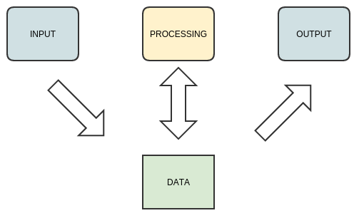
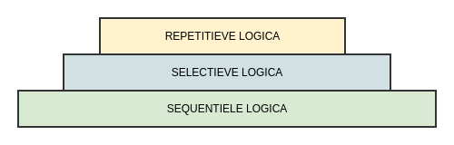

# Loops en condities in C

-------

## Voorbeschouwing

**Tot nu toe** hebben we geleerd:

* **Input** van **console** (integers)
* Integer bijhouden in **variabele**
* **Mathematische bewerkingen** in c
* **Output** naar de **console** (integers)

----------

### Selectie en repetitie

* **Tot nog toe sequentiele** logica
  (statement na statement)



-----------

### Selectie en repetitie

* Nu selectieve en repetitieve logica
  (if/else, while, ...)



------------

## Logische expressies

Tot nog toe mathematsche expressies:

* Klassieke wiskundige operaties
* Operaties en operatoren
* Werken met getallen (tot nog toe integers)

------------

### Duiding: Logische expressies

Logische expressies:

* Vergelijken 2 waardes
* Hebben integer als resultaat
* Stellen een vergelijking voor

```c
int a = 5 > 2;
int b = 5 <= 2;
```

------------

### Duiding: Logische expressies

Logische expressies:

* Ook wel boolean-expressies genoemd
* Echter 2 mogelijke output
    * 0 == als de vergelijking foutief is
    * 1 == als de vergelijking correct is

----------

### Duiding: Relationele operatoren

* Tot nog toe hebben we
     * "arithmetic" (wiskundige) operatoren
     * Maken berekeningen
* Nu bekijken we
     * Relationele operatoren
     * Meestal binaire operatoren (2 operanden)

------------

### Overzicht: Relationele operatoren:

Er bestaan binnen de syntax van C 6 relationele operatoren:

| Operator | Vergelijking            |
|:---------|:------------------------|
| ```>```  | Kleiner dan             |
| ```<```  | Groter dan              |
| ```>=``` | Kleiner of gelijk dan   |
| ```<=``` | Groter of gelijk dan    |
| ```==``` | Gelijk aan              |
|```!=```  | Niet gelijk aan         |

------------

### Voorbeeld: resultaat relationele expressie 0 of 1

Een relationele operator geeft als resultaat een integer, weliswaar met 2 mogelijke waarden.

```c
//file: {selective/ok_printing_logical_expressions.c}
#include <stdio.h>

int main()
{
    int is_5_smaller_compared_to_10 = 5 < 10;
    int is_5_bigger_compared_to_10 = 5 > 10;
    printf("%i\n",is_5_smaller_compared_to_10);
    printf("%i\n",is_5_bigger_compared_to_10);
    return 0;
}
```

------------


### Voorbeeld: resultaat relationele expressie 0 of 1

Als we deze code daarna uitvoeren:

```bash
$ make selective/printing_logical_expressions
$ ./selective/printing_logical_expressions.c
$ 1
$ 0
$
```

```bash
$ # make and run: {selective/ok_printing_logical_expressions}
```


### Voorbeeld: resultaat relationele expressie 0 of 1

zien we bij het uitvoeren van deze code dat :

* 0 wordt gebruikt als representatie van een logische "false"
* 1 wordt gebruikt als representatie van een logische "true"

---------------------

### Voorbeeld: inline vergelijking

Net zoals mathematische expressies kan je deze inline in een functie (of andere statements gebruiken).

```c
//file: {selective/printing_logical_expressions.c}
#include <stdio.h>

int main()
{
    printf("%i - ",(5 < 10));
    printf("%i - ",(5 > 10));
    printf("%i - ",(5 == 10));
    printf("%i\n", (5 == 5));
    return 0;
}
```

-------------

### Voorbeeld: inline vergelijking

Vanzelfsprekend geeft dit het verwachte resultaat:


```bash
$ make selective/printing_logical_expressions
$ ./selective/printing_logical_expressions
1 - 0 - 0 - 1
$
```
---------

### Opgelet: = <> == (assignment vs equality)

Let op!!!

* **Equality**-operator: ```==``` (2 \*)
* **Assignment**-operator: ```=``` (1 \*)

!!Veel gemaakte vergissing/verwarring, zelfs bij ervaren ontwikkelaars!!

------------

### Voorbeeld: = <> ==

```c
//file: {selective/equal_and_assignment_operator_not_same.c}
#include <stdio.h>

int main()
{
	int a=5;
	int b=6;
	printf("%i\n",(a==b));
	printf("%i\n",(a=b));
  return 0;
}
```

--------------

### Voorbeeld: = <> ==

* 1ste printf resultaat van vergelijking
* 2de printf restulaat van assignment (waarde a)

``` bash
$ make selective/equal_and_assignment_operator_not_same
$ ./selective/equal_and_assignment_operator_not_same
0
6
$
```

---------

### Voorbeeld: ```!=```

* ```!=``` geeft het omgekeerde resultaat van ```==```

```c
//file: {selective/not_equal_operator.c}
#include <stdio.h>

int main()
{
	printf("%i!=%i geeft %i\n",5,5,(5!=5));
	printf("%i==%i geeft %i\n",5,5,(5==5));

	printf("%i!=%i geeft %i\n",5,6,(5!=6));
	printf("%i==%i geeft %i\n",5,6,(5==6));
  return 0;
}
```

---------

### Voorbeeld: ```!=```

```bash
$ make selective/not_equal_operator
$ ./selective/not_equal_operator
5!=5 geeft 0
5==5 geeft 1
5!=6 geeft 1
5==6 geeft 0
$
```

--------------

### Voorbeeld: <= en >=

* >= en <= vergelijkbaar met > en <
* resulteren ook in true als beide operanden gelijk aan elkaar zijn.

```c
//file: {selective/compare_or_equal_operators.c}
#include <stdio.h>

int main()
{
	printf("%i<=%i geeft %i\n",5,5,(5<=5));
	printf("%i<=%i geeft %i\n",5,6,(5<=6));

	printf("%i>=%i geeft %i\n",5,5,(5>=5));
	printf("%i>=%i geeft %i\n",5,6,(5>=6));

  return 0;
}
```

----------

### Voorbeeld: <= en >=

```bash
$ make selective/compare_or_equal_operators
$ ./selective/compare_or_equal_operators.c
5<=5 geeft 1
5<=6 geeft 1
5>=5 geeft 1
5>=6 geeft 0
$
```

--------------

## if-statements

------------

### Duiding: Condities uitdrukken in een C-programma

Code **selectief/conditioneel** uitvoeren **in C**

* **Relationele/logsche** expressies gebruiken om **vergelijkingen** te maken
* Deze **vergelijkingen** gebruiken we om **beslissingen** te maken
* Hoe? Dan komen bij het **if-(else-)statement**.

------------

### Duiding: complex statement

Een if-statement is een complex statement:

* **Statement** dat **andere** statements **bevat**
* Ook verwezen als **samengesteld** **statement**

------------

### Duiding: complex statement

* **Complexe statements** worden **omsloten** door braces
* ```{``` en ```}```
* Dit noemen we **block** (groep van statements)
* Dit hebben we **eerder ook** al gezien bij **functies**

------------

### Voorbeeld: "if"-statement

* **Lees** een **getal** in
* Druk enkel af indien het een **even getal** is.

------------

### Voorbeeld: "if"-statement

```c
//file: {selective/is_pair.c}
#include <stdio.h>

int main()
{
    int input;
    printf("Gelieve een getal in te geven: ");
    scanf("%i",&input);
    if((input % 2) == 0) {
       printf("Het getal %i is even\n",input);
    }
    return 0;
}
```

------------

### Duiding: "if"-statement

* Na het keyword if (tussen haakjes)
* staat een expressie ```(input % 2) == 0```
* Evalueert deze true (<> 0) wordt code uitgevoerd

------------

### Bemerking: "if"-statement

> Meestal zal je een logische expressie willen gebruiken die 2 waardes gaat vergelijken  
> Het is echter mogelijk van eender welke expressie te gebruiken die een getal als resultaat heeft:  
> ```5 + 6``` zal dan true opleveren  
> ```5 - 5 ``` zal dan false opleveren

---------------------

### Voorbeeld: "if"-statement

* **code** die **tussen accolades** staat
* enkel en alleen **uitgevoerd**
* als de **logische expressie** als "waar" **evalueerd**  
  (verschillend van 0)

---------------------

### Voorbeeld: "if"-statement  

Met **even** input:

```bash
$ make selective/is_pair
./selective/is_pair
$ Gelieve een getal in te geven: 4
$ Het getal 4 is even
```

------------

### Voorbeeld: "if"-statement

Met even **oneven** input:

```bash
$ make ./selective/is_pair
$ ./selective/is_pair
$ Gelieve een getal in te geven:
$ 3
$
```

------------

### Belangrijke nota:

> Ondanks het feit dat een logische expressie garandeert dat "true" naar 1 wordt vertaald en "false" naar 0 wordt vertaald, zal een if-statement (en aanverwanten) alles wat niet 0 is als "true" interpreteren.

------------

### Voorbeeld: else-clausule

* **Bouwen voort** op voorgaand programma
* **Probleem:**  
  drukt niets af wanneer het getal oneven is?

------------

### Voorbeeld: else-clausule

* 2de if-statment kan een oplossing zijn?
* Betere oplossing: else-clausule!!!

------------

### Voorbeeld: else-clausule

```c
//file: {selective/is_pair_or_not.c}
#include <stdio.h>

int main()
{
    int input;
    printf("Gelieve een getal in te geven: ");
    scanf("%i",&input);
    if((input % 2) == 0) {
	     printf("Het getal %i is even",input);
    } else {
       printf("Het getal %i is oneven",input);
    }
    return 0;
}
```

------------

### Voorbeeld: else-clausule

Met even **oneven** input:

```bash
$ make ./selective/is_pair_or_not
$ ./is_pair_or_not
$ Gelieve een getal in te geven: 4
$ Het getal 4 is even
$
```

------------

### Voorbeeld: else-clausule

Met even **even** input:

```
$ ./is_pair_or_not
$ Gelieve een getal in te geven: 3
$ Het getal 3 is oneven
$
```
----------

### Duiding if-else

* if-statement kan een 2 block-code aan zich verbinden
* men noemt deze 2de **block** de **else-clausule**  
  (1ste noemt dan de **if-clausule**)
* in de **else-clausule** code die wordt uitgevoerd  
  als conditie naar false evalueert


------------

### Voorbeeld: Geneste if-staments

Programma-uitbreiden:

* **Ook** testen of het **negatief of positief** is.
* 4 mogelijke zinnen afdrukt:
    * Het getal x is een positief even getal
    * Het getal x is een positief oneven getal
    * Het getal x is een negatief even getal
    * Het getal x is een negatief oneven getal

---------

### Voorbeeld: Geneste if-staments

Hoe?

* Wijzigen voorgaand programma
* **Binnen** de 2 verschillende clausules (if en else)
* **Andere** if-else **combinaties** plaatsen

------------

### Voorbeeld: Geneste if-staments

```c
//file: {selective/check_pair_positive_and_negative.c}
#include <stdio.h>

int main()
{
    int input;
    printf("Gelieve een getal in te geven: ");
    scanf("%i",&input);
    if(input > 0) {
    	if((input % 2) == 0) {
    		printf("Het getal %i is een positief even getal",input);
    	} else {
    		printf("Het getal %i is een positief oneven getal",input);
        }
    } else {
    	if((input % 2) == 0) {
    		printf("Het getal %i is een negatief even getal",input);
    	} else {
    		printf("Het getal %i is een negatief oneven getal",input);
        }
    }
    return 0;
}
```

---------------------

### Voorbeeld: Geneste if-staments

```bash
$ make check_pair_positive_and_negative
$ ./check_pair_positive_and_negative.
$ Gelieve een getal in te geven: 4
Het getal 4 is een positief even getal
$ ./check_pair_positive_and_negative
$ Gelieve een getal in te geven: -5
$ Het getal -5 is een negatief oneven getal
$
```

---------------------

### Voorbeeld: else if-staments

Aan dit programma is echter nog iets fout, wat als we het getal 0 ingeven?

---------

### Voorbeeld: else if-staments

```c
#include <stdio.h>

int main()
{
    int input;
    printf("Gelieve een getal in te geven: ");
    scanf("%i",&input);
    if(input > 0) {
    	if((input % 2) == 0) {
    		printf("Het getal %i is een positief even getal",input);
    	} else {
    		printf("Het getal %i is een positief oneven getal",input);
        }
    } else {
    	if((input % 2) == 0) {
    		printf("Het getal %i is een negatief even getal",input);
    	} else {
    		printf("Het getal %i is een negatief oneven getal",input);
        }
    }
    return 0;
}
```

---------


### Duiding: else if-staments

* Code wordt een beetje complex!!
* Er is echter een alternatieve manier!!

---------

### Duiding: "else if"-clausule

Er is nog een 3de soort clausule die je kan toevoegen namelijk "else if"

* Bevat - net als de if-clausule - een logische expressie (tussen haakjes)
* Altijd tussen de "else"- en de "if"-clausule geplaatst worden
* Men kan meerdere "if else"-clausules plaatsen
* Maar wel maar 1 "if"-
* en 1 "else"-clausele  
* (waarbij if verplicht is en else optioneel)

---------

### Duiding: "else if"-clausule

```c
//file: {selective/check_pair_positive_and_negative_and_zero.c}
#include <stdio.h>

int main()
{
    int input;
    printf("Gelieve een getal in te geven: ");
    scanf("%i",&input);
    if(input > 0) {
    	if((input % 2) == 0) {
    		printf("Het getal %i is een positief even getal",input);
    	} else {
    		printf("Het getal %i is een positief oneven getal",input);
        }
    } else if(input==0) {
	      printf("Het getal %i is noch even of oneven",input);
    } else {
    	if((input % 2) == 0) {
    		printf("Het getal %i is een negatief even getal",input);
    	} else {
    		printf("Het getal %i is een negatief oneven getal",input);
        }
    }

    return 0;
}
```

-------------------

### Voorbeeld: else if-staments

```bash
$ make  selective/check_pair_positive_and_negative_and_zero
$ ./selective/check_pair_positive_and_negative_and_zero
Gelieve een getal in te geven: 4
Het getal 4 is een positief even getal
$ ./selective/check_pair_positive_and_negative_and_zero
Gelieve een getal in te geven: -5
Het getal -5 is een negatief oneven getal
$ ./selective/check_pair_positive_and_negative_and_zero
Gelieve een getal in te geven: 0
$ Het getal 0 is noch even of oneven
$
```

-------------------

### Belangrijk: leesbaarheid

> Je ziet dat de programma's groter en groter worden naarmate de cursus vordert.  
> In de programma's worden de statements altijd geindenteerd om leesbaarheid te behouden.  
> Gelieve deze regel ook aan te houden, in het beroepsleven moet je meestal je code delen met collega's dus je hebt er alle belang bij om deze leesbaar te houden (en er wordt rekening mee gehouden in de punten).

---------------------

### Voorbeeld: Mathematische expressies en getallen

Tot nog toe hebben we een if-statement enkel met logische expressies gebruikt.
Een if-statement kan echter ook met getallen of mathematische expressies werken
(die een integer terug geven) zoals het voorbeeld hieronder

```c
//file: {selective/math_inside_if.c}
#include <stdio.h>

int main()
{
     if(5 + 5) {
    	 printf("hello\n");
     }
     if(5 - 5) {
    	 printf("Deze statement print niet af\n");
     }
     return 0;
}
```

### Voorbeeld: Mathematische expressies en getallen

```bash
$ make  selective/math_inside_if
$ ./selective/math_inside_if
hello
$
```

----------------

### Voorbeeld: Mathematische expressies en getallen

Dit programma zal enkel hello afdrukken, de regel is simpel:

* 0 zal altijd evalueren als false
* Alle andere getallen als true

----------------

## Logische operatoren

Een 2de soort operator:

* die je kan gebruiken in logische expressies
* is de logische operator.

| Operator        | Vergelijking            |
|:----------------|:------------------------|
| &&              | Logische "AND"          |
| &#124;&#124;    | Logische "OR"           |
| !               | Logische "NOT"          |

----------------

### Logische operatoren

De 2 eerste operatoren && en ||

* stellen respectievelijk de combinaties **and** en **or** voor
* zijn **binair** (2 operanden)
* geven **0** of **1** terug
* evalueren volgens de **klassieke waarheidstabellen**  
  (die je hebt gezien in combinatorische)
* maar gelijkaardig aan if-statement wordt elke getal **verschillend van 0** gezien als **"true"**

----------------


### Logische operatoren (and)

&& (and)

* zal in **0** resulteren als
* **1** van beide operanden **gelijk** is aan **0**
* (of in 1 als beide operanden <> 0 zijn)

| A | B | S  |
|:--|:--|:---|
| 0 | 0 | 0  |
| 0 | x | 0  |
| x | 0 | 0  |
| x | x | 1  |

-----------------

### Logische operatoren (or)

|| (or)

* zal in **1** resulteren als
* **1** van beide opereranden **niet** gelijk is aan **0**

| A | B | S  |
|:--|---|:---|
| 0 | 0 | 0  |
| 0 | x | 1  |
| x | 0 | 1  |
| x | X | 1  |

-----------------

### Bemerking

> Nota: x in de waarheidheids-tabel stelt elke "niet 0"-waarde true voor

-----------------

### Bemerking

> Je zou je kunnen afvragen waarom deze operatoren bestaan uit 2 karakters.
> Dit wordt verklaard in de volgende les, wanneer we "bitwise"-operators bekijken.

-----------------

### Logische operatoren (or)

De negatie-operator ! is een unitaire operator:

* Maakt van een **0** een **1**
* Maakt van eender welk **ander getal** een **0**

| A | S  |
|:--|:---|
| 0 | 1  |
| x | 0  |

--------

### Voorbeeld: ! (negatie-operator)

We **hernemen** het voorbeeld van ons programma dat nagaat of een getal:

* **positief** of **negatief** is
* **even** of **oneven** is

--------

### Voorbeeld: ! (negatie-operator)

In dit programma voeren we 2 wijzigingen uit:

* **((input % 2) == 0)** wijzigen we naar **!(input % 2)**
* **(input == 0)** wijzigen we naar **!input**

--------

### Voorbeeld: ! (negatie-operator)


```c
#include <stdio.h>

int main()
{
    int input;

    printf("Gelieve een getal in te geven: ");
    scanf("%i",&input);
    if(input > 0) {
    	if(!(input % 2)) {
    		printf("Het getal %i is een positief even getal",input);
    	} else {
    		printf("Het getal %i is een positief oneven getal",input);
        }
    } else if(!input) {
    	printf("Het getal %i is noch even of oneven",input);
    } else {
    	if(!(input % 2)) {
    		printf("Het getal %i is een negatief even getal",input);
    	} else {
    		printf("Het getal %i is een negatief oneven getal",input);
        }
    }
    return 0;
}
```

--------

### Voorbeeld: ! (negatie-operator)


|        | **(input % 2)** | **! (input % 2)**      |
|:-------|:----------------|:-----------------------|
| even   | 0               | 1                      |
| oneven | 1               | 0                      |

* Als de input **even** is zal
     * (input % 2) in 0 resulteren en
     * !(input % 2) in 1
* Als de input **oneven** is zal
     * (input % 2) in 1 resulteren en
     * !(input % 2) in 0

--------

### Voorbeeld: ! (negatie-operator)

```
$ make check_pair_positive_and_negative_and_zero2
$ ./check_pair_positive_and_negative_and_zero2
$ Gelieve een getal in te geven:
$ 4
$ Het getal 4 is een positief even getal
$ ./check_pair_positive_and_negative2
$ Gelieve een getal in te geven:
$ -5
$ Het getal -5 is een negatief oneven getal
$ ./check_pair_positive_and_negative2
$ Gelieve een getal in te geven:
$ 0
$ Het getal 0 is noch even of oneven
$
```

--------


### Voorbeeld: &&

* We bouwen voort op hetzelfde programma en vervangen de geneste statements door &&
* Om het programma overzichtelijk te maken houden we de testen bij in een variabele.

--------

### Voorbeeld: &&

```c
#include <stdio.h>

int main()
{
    int input, number_is_pair, number_is_positive;

    printf("Gelieve een getal in te geven: ");
    scanf("%i",&input);

    number_is_pair = !(input % 2);
    number_is_positive = input > 0;

    if(!input) {
    	printf("Het getal %i is noch even of oneven",input);
    } else if(number_is_positive && number_is_pair) {
    	printf("Het getal %i is een positief even getal",input);
    } else if (number_is_positive && ! number_is_pair){
    	printf("Het getal %i is een positief oneven getal",input);
    } else if(!number_is_positive && number_is_pair) {
    	printf("Het getal %i is een negatief even getal",input);
    } else {
    	printf("Het getal %i is een negatief oneven getal",input);
    }
    return 0;
}
```

----------------

### Voorbeeld: &&

Output is zelfde als vorige voorbeelden

----------------

### Voorbeeld: ||

Voor het volgende deel schrijven we een programma dat nakijkt of een getal zich tussen 2 andere getallen bevindt.

```c
#include <stdio.h>

int main()
{
    int first,second;

    printf("Gelieve een positief getal in te geven: ");
    scanf("%i",&first);

    printf("Gelieve een 2de positief getal in te geven: ");
    scanf("%i",&second);

    if(first < 0 || second < 0) {
    	printf("1 van de 2 getallen is negatief");
    } else {
    	printf("beide getallen zijn positief");
    }
    return 0;
}
```

----------------

### Voorbeeld: Alles tesamen

```c
#include <stdio.h>

int main()
{
    int first,second,test;

    printf("Gelieve een getal in te geven: ");
    scanf("%i",&first);

    printf("Gelieve een 2de getal in te geven: ");
    scanf("%i",&second);

    printf("Gelieve een test-getal in te geven: ");
    scanf("%i",&test);

    if(((test <= first) &&  (test >= second)) 	||
		   ((test >= first) &&  (test <= second))) {
    	  printf("Getal %i ligt tussen %i en %i",test,first,second);
    } else {
    	  printf("Getal %i ligt niet tussen %i en %i",test,first,second);
    }
    return 0;
}
```

----------------

## Loops

Tot **nog toe** hadden we **logische expressies** en operatoren enkel gebruikt voor het **conditioneel uitvoeren** van code.
Als je een stuk code wil **herhalen** op basis van een logische expressie kan je dit doen met een **while loop**.

----------------

### While-loops

* Deze is **gelijkaardig** aan de **if**-conditie **van vorm**
* ipv een if schrijf je while
* De code blijft uitvoeren zolang de expressie true evalueert
* Een while-statement bevat geen clausules (1 block)

----------------

### Voorbeeld: Eenvoudige lus

We starten met een programma:

* Dat een **vermenigvuldigings-tabel** afdrukt
* Op **basis** van een **getal** dat de gebruiker **ingeeft**

----------------

### Voorbeeld: Eenvoudige lus

```c
//file: {repetition/multiplication.c}
#include <stdio.h>

int main() {
  int number_to_multiply,i;
  printf("Gelieve het basis-nummer in te geven voor de tafel: \n");
  scanf("%i",&number_to_multiply);

  i=1;
  while(i<10) {
    printf("%i * %i = %i\n",i,number_to_multiply,(i * number_to_multiply) );
    i=i+1;
  }
  return 0;
}
```

----------------

### Voorbeeld: Eenvoudige lus

* Dit programma zal de statements binnen de while-statement **blijven uitvoeren zolang i kleiner is dan 10**.
* **"i"** wordt **telkens verhoogt met 1** met het gevolg dat de vermenigvulding **9 maal** wordt afgedrukt.

---------------------

### Voorbeeld: Eenvoudige lus

```
$ make repetition/multiplication
$ ./repetition/multiplication
Gelieve het basis-nummer in te geven voor de tafel: 5
1 * 5 = 5
2 * 5 = 10
3 * 5 = 15
...
$
```

----------------

### Voorbeeld: Geneste loops

Je kan deze loops ook in elkaar nesten (zoals we reeds bij de if's hebben gezien).
We wijzigen het voorgaande programma en drukken alle tafels af (geen input meer vereist).

-----------

### Voorbeeld: Geneste loops

```c
int main() {
	int j,i;

	i=1;
	while (i<10) {
		j=1;
		while(j<10) {
			printf("%i * %i = %i\n",i,j,(i * j) );
			j=j+1;
		}
		i=i+1;
	}
  return 0;
}

```

---------------------

### Voorbeeld: Geneste loops

De output is:

* gelijkaardig aan het vorige-programma
* maar zal dus de tafels van alle getallen afdrukken.

-----------------------

### Voorbeeld: <= tov <

We gebruikten voor de vergelijking de expressie ```i < 10```, je kan dit ook wijzigen naar ```i <= 9```.


```c
#include <stdio.h>

int main() {
	int j,i;

	i=1;
	while (i <= 9) {
		j=1;
		while(j <= 9) {
			printf("%i * %i = %i\n",i,j,(i * j) );
			j=j+1;
		}
		i=i+1;
	}
  return 0;
}

```

---------------------

### Voorbeeld: <= tov <

> Welke optie je gebruikt is een kwestie van leesbaarheid, het hangt af van het geval (zoals we later bij de for-loop and arrays gaan zien).

----------------------

### Voorbeeld: ++-operator

Je kan ook een verkorte versie gebruiken van het statment i=i+1, namelijk i++.
Dit is een unitaire operator (1 operand) die na het getal komt.
We komen hier later nog op terug want er zijn meer varianten hierop.

----------------------

### Voorbeeld: ++-operator


```c
#include <stdio.h>

int main(void) {
	int j,i;

	i=1;
	while (i <= 9) {
		j=1;
		while(j <= 9) {
			printf("%i * %i = %i\n",i,j,(i * j) );
			j++;
		}
		i++;
	}
  return 0;
}

```

----------------------


### Voorbeeld: Loops en input

Een laatste voorbeeld:

* herneemt het eerder voorbeeld
* dat nakijkt of 2 getallen tussen een test-getal liggen
* en **combineert** een **complexe** logische **expressie**
* met een **while-loop**
dat we eerder hebben gezien en combineert een complexe logische expressie met een while loop.

----------------------

### Voorbeeld: Loops en input

* Eerste deel

```c
//file-1: {selective/printing_logical_expressions.c}
#include <stdio.h>

int main()
{
    int first,second,test;

    printf("Gelieve een getal in te geven: ");
    scanf("%i",&first);

    printf("Gelieve een 2de getal in te geven: ");
    scanf("%i",&second);

    printf("Gelieve een test-getal in te geven: ");
    scanf("%i",&test);
    //}
```

----------------------

### Voorbeeld: Loops en input

* Tweede deel

```c
//file-2: {selective/printing_logical_expressions.c}
  while(((test <= first) &&  (test >= second)) ||
  	    ((test >= first) &&  (test <= second))) {
    printf("Getal %i ligt tussen %i en %i\n",test,first,second);

  	printf("Gelieve een getal in te geven: ");
  	scanf("%i",&first);

  	printf("Gelieve een 2de getal in te geven: ");
  	scanf("%i",&second);

  	printf("Gelieve een test-getal in te geven: ");
  	scanf("%i",&test);

  }
	printf("Getal %i ligt niet tussen %i en %i, programma eindigt nu\n",test,first,second);
  return 0;
}
```
