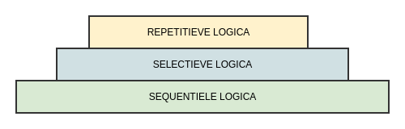
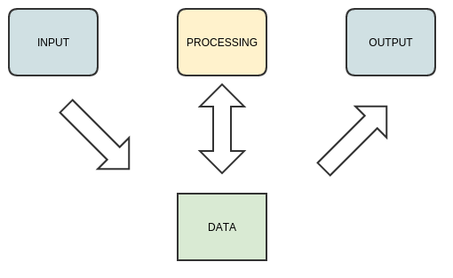

# Introductie in programmeren in C

* Doel:
    * **Bouwen** en **Uitvoeren** van een **programma**
    * **Introductie** in (sequentieel) **programmeren**

------

## Bouwen van een programma


------

## Bouwen van een programma

* Hoe?
    * Ontwikkelaar **schrijft** een **programma** in code
    * Programma wordt **gecompileerd** vanuit **C-code**
    * Naar een bestand dat **sequentiële** computer-**instructies** bevat
    * Dit (meestal uitvoerbaar bestand) wordt (op schijf) **opgeslagen**

------

### Bouwen van een programma: Code schrijven

* **Schrijven** van de **programma-code**
* Gebruiken hier een **gewone teksteditor** voor

```c
#include <stdio.h>

int main()
{
  printf("hello world!!!\n");
  return 0;
}
```
> Code-voorbeeld wordt later verklaard

------

### Bouwen van een programma: Compilen (en uitvoeren)

* **Compilen** van het programma
* Uitgevoerd door het **gcc**-programma  
 (zie installatie-hoofdstuk)

```bash
$ ls                    # een c-file is al geschreven    (Windows = dir-command)
hello.c
$ gcc hello.c -o hello  # compilen van hello.c -> hello  (Windows = hello.exe)
$ ls                    # Een 2de bestand (hello)        (Windows = hello.exe)
hello.c hello
$ ./hello               # uitvoeren van hello            (Windows = hello.exe)
hello world!!!
$
```
------

### Het gaat verder ...

* Het gaat nog iets **verder dan** enkel **compilen** (linken)
* Er gebeurt meer in de achtergrond...


------

### Gelukkig voor later...

* Huidige fase: **"Getting Started"**
* Later meer over: (Fase "Basic")
     * **Pre-compilatie**
     * **Compilatie**
     * **Linken**
* En nog later over: (Fase "Intermediate")
     * **Loaden**
     * **Libaries** (static vs dynamic)
     * ...
* Gelukkig dat is **voor later!!!!**

------

## Leer-fases in programmeren...

* Kennismaking met programmeren in **3 leer-fases**:



------

### Sequentiele logica

* We voeren een statement **1 voor 1** uit (input, output, processing)
* We voeren deze **na elkaar** uit (sequentieel)
* Bijvoorbeeld:
     1. We **lezen** een **getal** in
     2. We **vermenigvuldigen** dit getal **met 2**
     3. We **printen** het **resultaat** af
     4. Het programma **stopt**

------

### Selectieve logica

* We voeren onze statements nog altijd sequentieel uit (zelfde volgorde)
* Maar welke statements we uitvoeren hangt af van een aantal **condities**
* Bijvoorbeeld in **aanvulling** van **vorig voorbeeld**:
    * We printen het resultaat af  
      **enkel en alleen als** het resultaat even is

------

### Repetitieve logica

* We voeren onze statements nog altijd sequentieel uit (zelfde volgorde)
* Maar we herhalen bepaalde statements onder een aantal **condities**
* Bijvoorbeeld:
    * We berekenen en printen het resultaat
    * **Zolang** de gebruiker een positief getal inbrengt
    * We stoppen dus enkel **afhangende van de conditie**

------

## Starten met programmeren!!!

* **Genoeg** theorie...
* We **starten** met programmeren!!!
* We starten bij het **begin**: een **leeg programma**

------

### Basis-voorbeeld: een leeg programma

* Eerste voorbeeld:

~~~c
//file: {intro/empty.c}
int main ()
{
  return 0;
}
~~~

------

### Basis-voorbeeld: een leeg programma

* Leeg programma, niets wordt gelezen, berekend of geschreven
* Bevat een return-statement

------

### Basis-voorbeeld: een leeg programma

* **Resultaat:** Programma start en eindigt onmiddelijk

~~~bash
$ gcc empty.c -o empty
$ ./empty
$
~~~

------

### Basis-voorbeeld: ontleden (1)


* 1ste element: **Commentaar:**  
    * Tekst **vooraf** gegaan door **//**
    * Wordt **genegeerd door de compiler**
    * Dient als **documentatie** bij je programma
    * Kan overal in je programma geplaatst worden

> Later zien we nog andere vormen van commentaar

------

### Basis-voorbeeld: ontleden (2)


* 2de element: **Main-functie (en accolades)**  
    * **Start** altijd met **definitie** van een **main-functie** ```int main ()```
    * **Gevolgd** door **2 accolades**: ```{ }```
    * Tussen de accolades kan je 1 of meerdere statements schrijven
    * Deze **statements** (tussen accolades) worden **sequentieel uitgevoerd** als je het programma start
    * **Laatste** van deze statements moet een **return-statement** zijn

> We zien later het concept functie nog terug  
> Voorlopig onthouden we enkel dat we tussen de accolades al onze code/statements moeten schrijven

------     

### Basis-voorbeeld: ontleden (3)


* 3de element: **Return statement**
    * Start met keyword return
    * Gevolgd door een getal (meestal 0)
    * Eindigt met ;
    * **Nut**
         * Zorgt er voor dat je programma eindigt
         * Kan een code communiceren aan het OS
         * Programma gebruikt dit om aan te geven of er iets is misgelopen
    * 1ste statement dat we leren

------

### Basis-voorbeeld: ontleden (3)


* 3de element: **Return statement**
   * Zorgt er voor dat je programma eindigt
   * Kan een code communiceren aan het OS (bij het einde van het programma)
   * Programma gebruikt dit om aan te geven of er iets is misgelopen  
     (return-code <> 0 wordt meestal beschouwd als error)
   * 1ste statement dat we leren

------

## Werken met return-codes

Een variatie op ons vorig programma:

* met een andere return-code:
* om aan te tonen hoe je deze kan gebruiken

~~~c
//file: {intro/empty_with_one.c}
int main ()
{
  return 1;
}
~~~

------

### Return-codes gebruiken van shell

* Voorbeeld hoe je een return-code kan opvragen (Linux en Mac)

~~~bash
$ gcc empty.c -o empty
$ ./empty
$ echo $?
0
$ gcc empty_with_one.c -o empty_with_one
$ ./empty_with_one
$ echo $?
1
~~~

------

### Return-codes gebruiken vanuit Windows-cmd

* Voorbeeld hoe je een return-code kan opvragen (Windows)

~~~bat
c:\> gcc empty.c -o empty
c:\> empty.exe
c:\> echo %errorlevel%
0

c:\> gcc empty_with_one.c -o empty_with_one
c:\> empty_with_one.exe
c:\> echo %errorlevel%
1
~~~

-----

## Duiding: aspecten van sequentiele logica

We bekijken in dit deel we het sequentiele aspect van C:

* **Output:**
    * Het schrijven van data  naar de command-line  
    * Het gebruik van printf om tekst en getallen af te drukken
* **Processing:**
     * Bewerkingen doen op integers
     * Expressies en operatoren
* **Data:**
     * Data tijdelijk in het geheugen opslaan door middel van variabelen
* **Input:**
     * Inlezen van data vanaf de commmand-line

-----

### Duiding: aspecten sequentiele logica (overview)



-----

### Duiding: aspecten sequentiele logica (overview)


-----

## Output: schrijven naar consolue

* 1ste voorbeeld: printen van "Hello World"

-----

### Output-voorbeeld: hello world

* Printen naar de console van "Hello World"
* Klassiek voorbeeld dat meestal wordt gebruikt bij de 1ste maal werken met een programmeertaal

~~~c
#include <stdio.h>

int main ()
{
  printf("Hello World\n");
  return 0;
}
~~~

-----

### Output-voorbeeld: hello world

* Resultaat:

```bash
$ gcc helloworld.c -o helloworld
$ ls
$ helloworld helloworld.c
$ ./helloworld
Hello World
$
```
-----

### Output-voorbeeld: hello world

Vergeleken met het vorige programma onderscheiden we **4 nieuwe elementen** uit de programmeertaal C:  

1. Het **aanroepen** van een **functie**
2. Gebruik van **tekst** of een **string**
3. Importeren van een **bibliotheek**/library
4. Het gebruik van een line-feed of \\n

-----

#### Aanroepen van een functie

* **functie** is - in essentie - een stuk **herbruikbare** functionaliteit (code)
* in dit geval het **printen naar de console**
* **Vorm:** ```<naam van de procedure>(<argument>,<argument>,...);```  

-----

#### Aanroepen van een functie

Samengevat, je typt:

* de naam van de procedure
* daarna (tussen de haakjes) een lijst van argumenten
* meerdere argumenten (gescheiden met komma's als er meerdere argumenten zijn).

```c
printf("Hello World");
```
-----

#### Gebruik van tekst(string)

* We hadden eerder gezien dat we getallen kunnen gebruiken
* Je kan ook tekst gebruiken   
* Een stuk tekst kan je uitdrukken/definiëren met quotes rond (dubbele haakjes)

```
"Deze tekst staat tussen dubbele haakjes"
```
> Zelfde bemerking zoals bij functies, het concept van strings gaan we gedurende de cursus veel verder onderzoeken.  

-----

#### Importeren van een library

* **Vorm**: ```#include <stdio.h>```
     * Het keyword #include
     * De naam van de header-file staat tussen < en > geplaatst.  
     * Zo'n library eindigt altijd op .h
* Functies zijn dikwijls gegroepeerd in **bibliotheken** (of libraries)
* Het eerste voorbeeld van zo'n herbruikbare functie is printf
* Alle beschikbare funcites van zo'n library staan gedefinieerd in een **header-file** (zoals een catalogus)  
* Als je deze wil gebruiken

> Opnieuw zelfde bemerking zoals bij functies

-----

#### Gebruik van line-feed

* Aan het eind van deze string voegen we **\\n**
* Dit is een meta-karakter en wordt dus niet letterlijk afgedrukt
* Samengevat een een trucje om naar een nieuwe lijn te springen

-----

### Voorbeeld: Meerdere statements sequentieel na elkaar uitvoeren

* Tot nog toe hadden we enkel 1 instructie doorgegeven,
* Je kan het programma ook **meerdere instructies** na mekaar laten uitvoeren.  

```c
#include <stdio.h>
int main ()
{
    printf("Hello world");
    printf(" is een typisch voorbeeld-programma");
    return 0;
}
```
-----

### Voorbeeld: Meerdere statements sequentieel na elkaar uitvoeren

* 2 statements sequentieel na mekaar zijn uit gevoerd
* 2 stukken tekst naar de console worden afgedrukt (in volgorde)

```
$ gcc doublestatement.c -o doublestatement
$ ./doublestatement
Hello World is een typisch voorbeeld programma
$
```
-----

### Duiding: Meerdere statements

Nieuw t.o.v. vorige voorbeelden:

* Dat je **meerdere statements** na elkaar kan uitvoeren  
* Deze statements worden van elkaar **gescheiden** door elk statement te eindigen met een **";"**

-----

### Duiding: Wat zijn statements?

* Een statement **voert** een concrete **actie uit**
* Een statement wordt door de compiler **omgezet naar instructie-codes**

-----

### Duiding: Wat zijn statements?


------

### Voorbeeld: Printen van getallen

* Getallen in een string verwerken
* Systeem van placeholders

```c
#include <stdio.h>
int main ()
{
    printf("Het getal is: %i\n",5);
    return 0;
}
```
------

### Voorbeeld: Printen van getallen

```
$ gcc printnumber.c -o printnumber
$./printnumber
Het getal is: 5
```

------

### Duiding: Printen van getallen

Met het voorbeeld hierboven voegen we 2 nieuwe elementen toe:

* Een **integer/getal** meegeven als aan **printf** (2de argument)
* Het gebruik van **placeholders** (startende met %) binnen het eerste argument van printf

------

### Voorbeeld: Printf met meerdere argumenten

* We kunnen ook meerdere argumenten (getallen) toevoegen
* In dit geval is het 3de getal het resultaat van een expresssie (10*20)  
  (expressies zien we zo dadelijk)

```c
#include <stdio.h>
int main ()
{
    printf("%i * %i = %i\n",10,20,(10*20));
    return 0;
}
```
------

### Voorbeeld: Printf met meerdere argumenten

```bash
$ gcc printmultiplication.c -o printmultiplication
$./printmultiplication
10 * 20 = 200
$
```
------

## Variabelen (memory)

------

### Voorbeeld: Variabelen en data-types  

De C-programmeertaal laat je ook toe van:

* Tijdens het **uitvoeren van je programma**
* **Waardes** bij te houden in het **geheugen**
* Dit noemen we **variabelen**.  

------

### Voorbeeld: Variabelen en data-types

```c
#include <stdio.h>
int main ()
{
    int getal;
    getal = 5; 	// Geheel getal 1 = 5
    printf("Het getal is: %i\n",getal);
    printf("Nog 1 maal printen van %i\n",getal);
    return 0;
}
```
------

### Voorbeeld: Variabelen en data-types

Het resultaat is uiteindelijk

```bash
$ gcc printnumber_with_var.c -o printnumber_with_var
$ ./printnumber_with_var
$ Het getal is: 5
$ Nog 1 maal printen van 5
```

------

### Variabelen: declaratie en initialisatie

Om een variabele te gebruiken moeten we - net zoals in het eerste voorbeeld - deze variabele:

* eerst declareren ```int getal;```  (eerste lijn body)
* dit houdt in dat software een geheugenplekje reserveert in het geheugen
* daarna initialiseren met een waarde ```getal = 5;```

------

### Duiding: Wat is een variabele?

Een variabele is:

* Een plekje geheugen
* Waar je een waarde (n het voorbeeld 5) kan opslaan
* Een naam (in het voorbeeld getal) kan toekennen

------

### Duiding: Wat is een variabele?

Een variabele heeft een data-type (int in het voorbeeld)

* cijfers, karakters, strings (numerieke en alfanumerieke variabelen)
* Dat aanduidt hoeveel plek dit in het geheugen inneemt
* Wat je er mee kan doen
* Hoe je berekeningen mee kan doen

------

### Duiding: Benaming van variabelen:  

* Heeft een naam, deze is **vrij** te kiezen (liefst wel **betekenisvolle** namen gebruiken ter leesbaarheid)
* Met wel een aantal beperkingen zoals
   * Mag **niet starten met een cijfer**
   * Mag een aantal **gereserveerde karakters niet** bevatten
   * Voornamelijk operatoren zijn verboden zoals ```*,+,-,/,%``` ...
* Mag slechts **1 maal** voorkomen in de (main)-**functie**
* Mag geen **keyword** van de C-taal zijn zoals datatype-definities (int, float, ..)  
  of andere (zoals include, void, volatile, ... die we nog gaan tegenkomen)

------

### Duiding: Benaming van variabelen

Bijvoorbeeld:

```c
int een*variable;
```

* Is bijvoorbeeld geen geldige variabele-naam en -definitie

------

### Variabelen: hoe te gebruiken

Een variabele zoals we zullen zien in de volgende voorbeelden kunnen we dan verder in het programma herbruiken in andere statements (ipv de waarde zelf)

   * als argument van een functie
   * de variabele gebruiken in een expressie (zie later)
   * de variabele gebruiken om een andere variabele in te stellen

------

### Duiding: Assignment operator =

In dit geval heeft een assignment:

* Het **symbool "="** als operator.
* Een **linker-operand** als **variabele** (zijn naam)
* Een **rechter-operand** als **waarde** (constante, andere variabele, expressie, ...)

------

### Variatie: declaratie en assignment in 1 statement

Tot nog toe hebben we de declaratie en assignment van ene variabele gescheiden gehouden.  
Het onderstaande programma doet hetzelfde als het voorgaande programma

```c
#include <stdio.h>
int main ()
{
    int getal = 5;
    printf("Het getal is: %i",getal);
    printf("Nog 1 maal printen van %i",getal);
    return 0;
}
```
------

### Variatie: declaratie en assignment in 1 statement

```bash
$ gcc printnumber_with_var_assignment.c -o printnumber_with_var_assignment
$ ./printnumber_with_var_assignment
$ Het getal is: 5
$ Nog 1 maal printen van 5
```
------

### Voorbeeld: variabele met een andere variabele initialiseren

```c
#include <stdio.h>
int main ()
{
    int getal = 5;
    int zelfde_getal = getal;
    printf("Het getal is: %i\n",getal)n;
    printf("Nog 1 maal printen van %i\n",zelfde_getal);
    return 0;
}
```

------

### Voorbeeld: variabele met een andere variabele initialiseren

* Dit gedeelte gebruikt nu 2 variabelen die dezelfde waarde bevatten
* Het resultaat zal ook opnieuw hetzelfde zijn zoals de vorige getallen

```bash
$ gcc var_with_var.c -o var_with_var
$ ./var_with_var
Het getal is: 5
Nog 1 maal printen van 5
$
```

------


## Expressies

------

### Expressies

Een expressie in c is:

* Een stuk Code
* Dat een waarde genereert

------

### Expressies

Voorbeelden:

* Een wiskundige **bewerking**
* Een **getal** (literal)
* Aanroepen van een **functie** (kan een waarde geven)  
  (kan zowel een statement als een expressie zijn)
* ...
* Kortom alles wat een waarde produceert

------

### Duiding: Operatoren en operanden (arithmetic)

Een expressie bestaat uit 2 soorten elementen :

* Operatoren
* Operanden

------

### Duiding: Operatoren en operanden (arithmetic)

* Operatoren:
     * Zijn **symbolen**
     * Stellen een **specifieke bewerking** voor (in dit deel wiskundige bewerkingen)   
     * Kan binair zijn (omringd door 2 operanden) of unitair (1 operand)

------

### Duiding: Operatoren en operanden (arithmetic)

* Operanden, deze kunnen zijn:
    * Constante waardes ```(5 + 6)```
    * Variabelen ```(a + 6)```
    * Andere expressies  
      Net als in wiskunde kan je complexere expressies samenstellen met meerdere operatoren  
      bv (5 + 6 * 9)
    * C volgt de matische regels door expressies in volgorde op te lossen (bv eerst ```*/``` dan ```+-```)

------    

###  Andere kenmerken:

* Je kan verschillende soorten operatoren **combineren** in een expressie
* Je kan ook met **haakjes** werken om de volgorde van uitvoering af te dwingen  
    * ```(5 + 6) * 3``` geeft 33
    * ```5 + 6 * 3``` zal eerst ```6 * 3``` uitvoeren met als resultaat ```23```
* Naast binaire operatoren bestaan er ook unitaire operatoren, ```- a + 5``` zal de waarde van a omdraaien binnen deze bewerking

> Samengevat volgt C de klassieke wiskundige regels


------  

### Overzicht operatoren

| Operator | Operatie         |
|:---------|:-----------------|
| +        | optellen         |
| -        | aftrekken        |
| *        | vermenigvuldigen |
| /        | delen            |
| %        | rest             |

------

### Voorbeeld: expressies met waardes en variabelen

Een expressie bestaat niet noodzakelijk uit variabelen, je kan deze ook wisselen met constante waardes:  
(```int som = getal1 + 7;``` in plaats van ```int som = getal1 + getal2;```)

```c
#include <stdio.h>
int main()
{
    int getal1 = 5; 	// Geheel getal 1 = 5
    int som = getal1 + 7;
    printf("Het resultaat is: %i",som);
    return 0;
}
```

------  

### Voorbeeld: expressies als argument van een functie

Of je kan zelfs een expressie gebruiken rechtstreeks als argument van een functie:

```c
#include <stdio.h>
int main ()
{
    int getal1 = 5; 	// Geheel getal 1 = 5
    printf("Het resultaat is: %i",getal1 + 7);
    return 0;
}
```
(hetgeen vanzelfsprekend hetzelfde resultaat oplevert)

------

### Voorbeeld: expressies met meerdere operatoren

Een expressie is niet beperkt tot slechts 2 operatoren

```c
#include <stdio.h>
int main ()
{
    int getal1 = 5; 	// Geheel getal 1 = 5
    int som = getal1 + 5 + 2;
    printf("Het resultaat is: %i",som);
    return 0;
}
```

------

### Voorbeeld: expressies met verschillende soorten operatoren

En je kan verschillende soorten operatoren combineren:

```c
#include <stdio.h>
int main ()
{
    int getal1 = 5; 	// Geheel getal 1 = 5
    int som = ((getal1 - 3) * 3) + 6;
    printf("Het resultaat is: %i",som);
    return 0;
}
```
Met hetzelfde resultaat zijnde 12

------

### Voorbeeld: unitaire operator

Een laatste voorbeeld is de unitaire operator, in het voorbeeld hieronder gebruiken we deze om een negatie op een operand uit te voeren.

```c
#include <stdio.h>
int main ()
{
    int getal1 = 5; 	// Geheel getal 1 = 5
    int som = -(getal1) + 17;
    printf("Het resultaat is: %i",som);
    return 0;
}
```
Bij de evaluatie van deze expressie wordt de waarde van getal1 eerst negatief gemaakt alvorens dat hier 17 wordt bij opgeteld.  
Belangrijk is te weten dat net als in de wiskunde unitaire operatoren 1st worden uitgevoerd.

------

## Input

------

### Voorbeeld: Lezen van een getal

Als laatste van deze sessie (ter voorbereiding van de labo's) leggen we uit hoe we getallen kunnen inlezen.

```{.c}
#include <stdio.h>

int main()
{
  int getal1,getal2;

  printf("%s","Geef getal 1 in ");
  scanf("%i",&getal1);
  printf("%s", "Geef getal 2 in ");
  scanf("%i",&getal2);
  printf("Het resultaat van %i + %i is %i",getal1,getal2,(getal1 + getal2));
  return 0;
}
```
------

### Voorbeeld: Lezen van een getal

* Dit programma zal 2 getallen inlezen.
* Hiervoor gebruikt het de procedure/functie scanf (tegenhanger van printf):

------

### Voorbeeld: Lezen van een getal

Om een waarde in een variabele in te lezen in een getal:

* Roep je deze functie aan
* Het eerste argument is voor integers (altijd) %i
* Als volgende argument geef je dan de variabele waar je een waarde in wil laten lezen
* Maar je laat deze variabele(naam) voorafgegaan door een &-teken (ampersand)

------

### Voorbeeld: Lezen van een getal

> Deze & gaan we momenteel nog niet verklaren (werken met pointers zal een volledig aparte les innemen), ga er voorlopig van uit je dit moet doen.  
> Ook van deze printf- en scanf-methoden hebben we enkel nog maar het tipje van de ijsberg gezien, voorlopig leggen we enkel het nodige uit om zo snel mogelijk aan de slag te gaan.

------

### Tot hier toe ...

Hebben we de eerste stap gezet in het programmeren

* We kunnen verschillende statements schrijven (declaraties, assignement, functies aanroepen, ...)
* We kunnen wiskundige bewerkingen doen (expressies)
* We kunnen stukjes geheugen gebruiken om tussentijdse resultaten op te slaan (variabelen)
* We kunnen deze data schrijven naar de console (printf)

------

### Wat volgt ...
We gaan nu in het labo:

* Deze kennis proberen uit te werken in een aantal labo-oefeningen en gaan
* Kennismaken met de tools en editors die ons in staat stellen een programma te schrijven

Na dit eerste kennismakings-labo gaan we uitleggen hoe:

* Je code conditioneel kan uitvoeren
* Je code repetitief kan uitvoeren (met bepaalde condities)
* Andere expressies (tot nu enkel numerieke) en operatoren
    * Logische operatoren
    * Relationele operatoren
    * Bit operatoren

------
