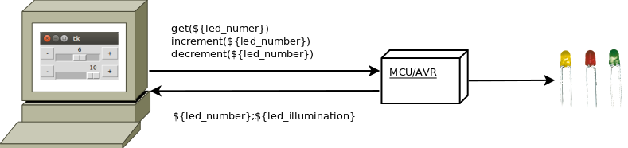

## Bedoeling van dit hoofdstuk

We hebben ondertussen geleerd hoe we vanuit onze MCU (AVR) kunnen communiceren naar een computer toe (over een seriële poort).  
We gebruikten hiervoor een programmas zoals putty, picocom, ... om data door te sturen of te ontvangen.  

Dit was mogelijk - over een seriële vebinding - dankzij de ftdi-converter (die op de Arduino zit of optioneel een externe als je met direct met een AVR werkt) die de conversie tussen uarti- en usb-communicatie verzorgt.  

Het doel van deze les is dit principe nog iets verder te trekken en een **applicatie** op je computer te bouwen die deze seriële communicatie gebruikt om instructies te geven aan de microcontroller.

### Python leren in een c-cursus?

We gaan hier geen C (voor het pc-gedeelte) voor gebruiken, maar een andere taal genaamd **Python**.  
Waarom moeten we een andere taal hiervoor gebruiken en werken we niet verder met onze verworven C-kennis?

* **"Using the right tool for the job"**
     * Python is zeer geschikt om **applicaties** te schrijven
     * C is een taal die wordt gebruikt om **systeem**-software (mcu, drivers, os, real time, weinig resources...) te gebruiken  
* Python is een taal gebruikt om kleine tot grote applicaties te bouwen  
     Je kan hier heel éénvoudig en snel applicaties (command line of gui) bouwen zonder al te veel voorkennis.
* Python is zeer **éénvoudig** aan te leren (zeker in vergelijking met C)
* Python is enorm **populair**
* Python heeft enorm veel **libraries** en **utilities** om allerlei **taken** uit te voeren
* Python heeft  zeer grote **community** en online **support**
* Python is een **scripting**-taal en is zeer **flexibel**
* Python is **open-source**, vrij beschikbaar en gesupporteerd voor **alle opertating systems**

Samengevat, als je een toepassing of applicatie maakt op je PC (GUI, Webapp, command-line, ...) is C niet altijd wat je nodig hebt.  
Hiervoor zijn er talen zoals Python, Java, Ruby, C#, ... die je de job kunnen gemakkelijker maken.

### Waarschuwing: crashcourse

Let wel, deze les is enkel te beschouwen als een **introductie** in python, niets meer.  
Bedoeling is een voorbeeld-applicatie te maken om met de MCU samen te werken.

Hierbij wordt enkel het minimum aangeleerd nodig om een kleine support-applicatie te schrijven voor je MCU.

### Installatie van Python

**Python 2.7**

Bij deze gaan we python 2.7 installeren.  
Er bestaat ook python 3 maar deze is niet volledig compatibel met 2.7 (en 2.7 is momenteel nog het meest gebruikt)

Voor deze les willen moeten er volgende zaken aanwezig zijn:

* Python runtime (-interpreter)
* 2 libraries
     * Py-serial (seriële communicaties)
     * Tkinter (gui)

Deze installatie is getest op 3 Operating Systems:

**Installatie op Linux:**

Python is by default geïnstalleerd op vrijwel elke Linux-distributie en in de meeste gevallen is dit ook de versie die wij gebruiken, namelijk python 2.7.

*Debian/Ubuntu:*

Voor Debian of Ubuntu, voer de 2 volgende aptitude-commando's uit om support voor tk (gui) en seriële connecties te gebruiken:

~~~bash
$ sudo apt-get install python-tk
...
$ sudo apt-get install python-serial
...
~~~

*Fedora/Red Hat:*

Voor Fedora of Red Hat, voor de 2 volgende dnf-commando's uit:

~~~bash
# dnf install pyserial
...
# dnf install tkinter
...
~~~

**Installatie op Mac:**

Voor de meer recentere versies van Mac OS X is Python geïnstalleerd by default:

* Installeren van gui  
http://www.activestate.com/activetcl/downloads/thank-you?dl=http://downloads.activestate.com/ActiveTcl/releases/8.5.18.0/ActiveTcl8.5.18.0.298892-macosx10.5-i386-x86_64-threaded.dmg
* Installeren van pyserial
     * Download vanaf https://pypi.python.org/pypi/pyserial
     * Je krijgt tar-file, deze kan je gewoon extracten vanaf de command-line (tar -xvf ${naam_tar_file})
     * python setup.py install (in de directory waar je de tar hebt uitgepakt)

**Installatie op Windows:**

In tegenstelling tot Mac en Linux is bij Windows is Python niet by default voorzien, volgende stappen moet je uitvoeren:

* Installeren van python  
https://www.python.org/ftp/python/2.7.10/python-2.7.10.amd64.msi
* Installeren van gui  
http://www.activestate.com/activetcl/downloads/thank-you?dl=http://downloads.activestate.com/ActiveTcl/releases/8.6.4.1/ActiveTcl8.6.4.1.299124-win32-x86_64-threaded.exe
* Download vanaf https://pypi.python.org/pypi/pyserial  
  Installeer de msi

### Starten met python: werken met een interactieve shell of uitvoeren vanuit een file

Nu dat Python is geïnstalleerd, kunnen we aan de slag met deze programmeer-omgeving.  
Het enige wat je nodig hebt is een goede text-editor (GEdit, Notepad++, TextMate, Vi, ...) en je command-line (Bash voor Mac en Linux, Powershell voor Windows).

> **Nota:**  
> Python komt met een ontwikkelings-omgeving IDLE, we gebruiken deze voorlopige nog niet.

**Python: interactief of vanuit een file**

Python-code kan je uitvoeren op 2 manieren:

* **Interactief:** van uit een shell statement per statement uitvoeren
* **File:** python-statements in een file zetten

Laten we van start gaan met de eerste manier.

**Interactief programmeren (REPL)**

Je kan python-code (statements) rechtstreeks vanuit een interactieve shell uitvoeren.  
Men noemt die ook soms wel **REPL** of **R**ead **E**val **P**rint **L**oop.  

* **R**ead: lezen van een expressie van de gebruiker
* **E**val: evaluatie van deze expressie en uiteindelijk uitvoering hiervan
* **P**rint: uitprinten van het resultaat van deze expressie (als er één is)
* **L**oop: wacht opnieuw op de volgende expressie of statement

Als Python correct is geïnstalleerd is het voldoende om:

* Naar de **command-line** te gaan (cmd of bash afhangende van je OS)
* Het **commando python** in te te **typen**

Als alles goed verloopt krijg je min of meer volgend resultaat:

~~~bash
$ python
Python 2.7.10 (default, Oct 14 2015, 16:09:02)
[GCC 5.2.1 20151010] on linux2
Type "help", "copyright", "credits" or "license" for more information.
>>>
~~~

Vanaf dat er **>>>** verschijnt (voorafgegaan door wat systeem-info) kan je aan de slag en Python-statement of commando's uitvoeren.  
We gaan verder met het volgende voorbeeld:

~~~python
$ python
Python 2.7.10 (default, Oct 14 2015, 16:09:02)
[GCC 5.2.1 20151010] on linux2
Type "help", "copyright", "credits" or "license" for more information.
>>> 5 + 5
10
>>> print("hello")
hello
>>> exit()
$
~~~

3 (voorbeeld-)acties zijn hier uitgevoerd:

* Een **expressie** (in dit geval een wiskundige) kan **direct** uitvoeren (in een C programma kan je dat niet een expressie op zich uitvoeren)  
  Als je enkel een expressie typt (wiskundige, naam van een variabele, ...) zal je direct het resultaat **uitprinten** naar de interpreter (print uit RE**P**L)
* Vervolgens roepen we onze eerste python-**functie** aan **print**, deze zal een tekst afdrukken naar de stdout (gelijkaardig aan de printf uit C)
* Om uit deze interactieve shell te geraken typ je **exit()** (gevolgd door enter) en je komt gewoon **terug** op de **command-line**.  

> **Nota:**  
> Je ziet dat het aanroepen van een methode heel veel lijkt op de manier zoals we dat in c deden.  
> We komen hier zodadelijk nog op terug

Deze interactieve modus hadde we nog niet gezien bij C-ontwikkeling, dit is echter wel zeer courant bij scripting-talen zoals Python, Ruby, Groovy, ....  
Het laat je toe om je code "uit te proberen" in een omgeving waar je direct feedback krijgt.  

**Python-programma's bouwen (FILE)**

Deze REPL- of Interpreter-modus is heel handig om te ontwikkelen en snel feedback te krijgen.

In het geval je een programma wil bouwen, is het interessant deze "statements" sequentieel in een file te plaatsen (zoals we tot nog toe bij C hebben gezien).  
Dit doe je door een file te creeren met een text-editor (gedit, notepad++, vi, ...), bijvoorbeeld met de volgende inhoud:   

~~~python
print("hello")
print("world")
~~~

Deze inhoud plaats je (via een tekst-editor) in een file met de extensie py (dit voorbeeld noemen we deze hello.py)  
Net als bij het interactieve voorbeeld gebruik je het commando python, maar nu dan gevolgd door de naam (of beter gezegd het path) van de file.

~~~bash
$ python hello.py
hello
world
$
~~~

Zo'n een file kan je meerdere malen aanroepen en zoals we verder gaan zien een volledige gui-applicatie mee maken.

### Programmeren met Python

We hebben onze eerste kennismaking gehad met python en je zou nu instaat moeten zijn van een éénvoudige hello world (met print) te schrijven.   
We gaan nu wat dieper in op de basis-syntax van deze taal.  

### Aanroepen van methodes

Zoals je bij vorige stukken hebt gezien is het aanroepen van een methode heel gelijkaardig aan hoe we dat in c kennen:

* Een **naam** van deze functie
* Gevolgd door 1 of meerdere **argumenten** tussen haakjes
* Argumenten gescheiden door **,**

> **Nota:**  
> Later zien we hoe we onze eigen functies aanmaken.

### Werken met variabelen

Nu dat we éénmaal weten hoe te printen (en functies aan te roepen) introduceren we **variabelen**.  

Net zoals bij C kan je een waarde in het geheugen plaatsen onder de vorm van een variabele.  
Deze variabele kan je meegeven aan een functie zoals print.

~~~pythonthon
>>> say_hello = "hello"
>>> print(say_hello)
>>>
~~~

De variabele die je nu hebt gezien is van het type string (net zoals je ook zo'n type in C hebt).  
Let ook op het feit dat je **geen type** moeten **aanduiden** bij declararatie van zo'n variabele, dit betekent evenwel niet dat er geen type bestaat natuurlijk.

Ook nieuw is dat je zo'n variabele kan verwijderen via het commando **del** in Pythoni, als je deze niet meer nodig hebt (om geheugen te besparen).  
(ga je meestal niet nodig hebben)

~~~python
>>> say_hello = "hello"
>>> print(say_hello)
hello
>>> del say_hello
>>> print(say_hello)
Traceback (most recent call last):
  File "<stdin>", line 1, in <module>
NameError: name 'say_hello' is not defined
>>>

~~~

### Primitieve data-types

Naast het type string heb je ook support voor allerlei numerieke types, vergelijkbaar met degene die we in C hebben gezien:

* **Integers:** (geen onderscheid tussen signed en unsigned)  
  —1, –3, 42, 355, 888888888888888, –7777777777
* **Floats:**  
  —3.0, 31e12, –6e-4
* **Complexe getallen:**  
  —3 + 2j, –4- 2j, 4.2 + 6.3j
* **Booleans:** (in C was 0 false en alle anderen getallen true)  
  True, False

### Mathematische operatoren

Alle operatoren die je gewoon bent uit C zijn zeer vergelijkbaar met degene uit Python:  

~~~python
>>> x = 5 + 2 - 3 * 2
>>> x
1
>>> x = 5 + (2 - 3) * 2
>>> x
3
>>> 5 / 2
2
>>> 5 // 2
2
>>> 5.5 / 2
2.75
>>> 2 ** 8
256
>>> 5 % 2
1
>>>
~~~

* ~~~+ - * /~~~ gesupporteerd
* 2 integers door elkaar delen zal afronden naar beneden
* ~~~%~~~ geeft de rest van een deleing
* ~~~** ~~~ stelt macht voor

~~~//~~~ is het zelfde als ~~~/~~~ in Python 2
In Python 3 echter zal ~~~/~~~ niet afronden maar in een floating point-nummer resulteren  

~~~python
$ python3
Python 3.4.3+ (default, Oct 14 2015, 16:03:50)
[GCC 5.2.1 20151010] on linux
Type "help", "copyright", "credits" or "license" for more information.
>>> 5 / 2
2.5
>>> 5 // 2
2
>>>
~~~

### Formatteren van een string

Net zoals je bij de sprintf- en printf-functies in C kan je een stuk tekst formatteren.  
In Python zijn 3 verschillende manieren hiervoor

De oude manier, niet gesupporteerd in Python 3, maar van wel dezelfde formatters als C gebruikmakende:

~~~python
>>> "decimaal: %i hex: %x" % (10 , 10)
'decimaal: 10 hex: a'
>>> print("a %i %x" % (10,10))
decimaal: 10 hex: a
>>>
~~~

De nieuwe manier, zowel in Python 2 als Python 3 gesupporteerd:

~~~python
print("{:d}-{:d}".format(1,2))
1-2
>>> print("{}-{}".format(1,2))
1-2-1
~~~

Bij dezei (nieuwe) manier ben je niet verplicht een formaat aan tegen een {} is voldoende.  
Optioneel kan je - binnen de string selecteren - welk getal uit de luist je wil selecteren:

~~~python
>>> print("{0}-{1}-{0}".format(1,2))
1-2-1
>>> print("{0:d}-{1:d}-{0:d}".format(1,2))
1-2-1
~~~

Een ander voorbeeld is het uitlijnen van tekst.

~~~python
>>> print("{0:2d}{1:3d}{0:4d}".format(1,2))
 1  2   1
>>> print("{0:2d}{1:3d}{0:4d}".format(10,20))
10 20  10
~~~

Voor een volledig overzicht kan je naar de betreffende python-documentatie gaan kijken:  
https://docs.python.org/2/tutorial/inputoutput.html

> Nota:  
> In dit geval zien we dat we dat we een methode aanroepen op een manier die we nog niet kennen vanuit C, namelijk vanuit een object (string.methode()).  
> Dit is Object-Georienteerd programmeren, hier komen we zoda

### Inlezen vanaf de command-line

We weten nu min of meer hoe we data naar de console moeten schrijven (equivalent van printf).  
Om data in te lezen van de command line bestaat er een andere functie, namelijk raw_input.  

~~~python
x = raw_input("Geef een string")
print(x)
~~~

Deze zal een stuk tekst inlezen van de STDIN (input command-line), deze tekst kan je dan opvangen in een variabele.  
Als je dit programma zou uitvoeren krijg je ongeveer de volgende output:

~~~bash
$ python print_een_string.py
Geef een string:
Hello
Hello
$
~~~

### Inlezen en converteren

Je wil niet altijd tekst inlezen, in bepaalde gevallen wil je gewoon een nummer inlezen.  
Daarvoor bestaan er conversie-functies in Python.

~~~python
input_string = raw_input("Geef een nummer: ")
x = int(input_string)
print('1ste macht: {0:2d} 2de macht: {1:3d} 3de macht{2:4d}'.format(x, x*x, x*x*x))
~~~

Dit geeft het volgende resultaat:

~~~
$ python input_and_convert.py
Geef een nummer: 5
1ste macht:  5 2de macht:  25 3de macht 125
~~~

Ter vervollediging, je kan dit ook verkort door de 2 functie-aanroepen te nesten.

~~~python
x = int(raw_input("Geef een nummer: "))
print('1ste macht: {0:2d} 2de macht: {1:3d} 3de macht{2:4d}'.format(x, x*x, x*x*x))
~~~

### C vs python blocks

We hebben tot nog toe gezien:

* Mathematische expressies
* Variabelen
* Output met print
* Input met raw_input
* Conversie naar een getal met int()

Samengevat, de basis om een eerste heel éénvoudig programma te schrijven.  

We starten nu aan meer complexere code (condities en herhalingen).  
We zullen eerst even basis van de syntax in python vergelijken tov deze van C:

* Geen main-methode nodig
* **tab** gebaseerd  
  (tov accolades die worden gebruikt voor blocks te onderscheiden)
* geen **;** verplicht
* **geen type** nodig voor een variabele  
  (in c moet je altijd een type aangeven)
* **oo** (zien we nog)

We starten met een stuk code in c te vergelijken met een equivalent stuk code in python (loop):

~~~c
int main() {
    int n, r;
    n = 9;
    r = 1;
    while (n > 0) {
        r = r * n;
        printf("%i\n",r);
        n--;
    }
}
~~~

We zien in de C code:

* We schrijven een main-methode waarbinnen we codere
* Alle simpele statements gescheiden door een ;
* Accolades demarkeren de code die binnen de loop wordt uitgevoerd

Dezelfde functionaliteit in python:

~~~python
n = 9
r = 1
while n > 0:
    r *= n
    print(r)
    n -= 1
~~~

We zien heel veel gelijkenissen tussen C en python maar:

* Python heeft geen main-methode nodig  
  Alle code die niet binnen een functie staat wordt zowiezo uitgevoerd
* Een complexe statement start met een :
* Alle statements binnen zo'n complexe statements moeten 1 tab verder worden geindenteerd

We komen hier zo dadelijk nog op terug.

### Strings

In python wordt er geen onderscheid gemaakt tussen een karakter en een string:

~~~python
>>> a = "A string in double quotes can contain 'single quote' characters."
>>> b = 'A string in single quotes can contain "double quote" characters.'
>>> c = '''\This string starts with a tab and ends with a newline character.\n'''
>>> d = """This is a triple double quoted string, the only kind that can
    contain real newlines."""
>>>
~~~

### Commentaar

Waar je in C ~~~//~~~ en ~~~/**/~~~ gebruikt om je code te becommentariëren bestaan er in python de 2 volgende manieren:

Of je gebruikt een hashbang:

~~~python
# This is python-comment
~~~

Of je zet een multi-line string zonder hem aan een variabele te assignen

~~~python
"""This is a multiline comment.
The following lines concatenate the two strings."""
~~~

### Condities en herhaling

Loops en condities zijn vergelijkbaar met wat je uit C kent, dezelfde of vergelijkbare constructies vind je terug:

* if-else
* elif (tov else if in C)
* while-loop
* for-loop

### Condities

We starten met condities.
Een conditie kan uit 3 delen bestaan:

* if-clausules
* else-clausule
* 1 of meerdere elif-clausules

~~~python
if expression:
   statement(s)
elif:
   statements(s)
...elif:...
else:
   statement(s)
~~~

De volgende voorbeelden illustreren het gebruik van een conditie:

~~~python
a = 10
if a > 10:
   print("a > 10")
else:
   print("a <= 10")
~~~

Met een elif toegevoegd ...

~~~python
a = 10
if a > 10:
   print("a > 10")
elif a == 10:
   print("a == 10")
else:
   print("a > 10")
~~~

### While-loop (en break)

Een while-loop is ook zeer vergelijkbaar met C.

Bijzonder is dat je bij Python ook een else-clausule kan worden toegevoegd.   
Deze wordt uitgevoerd wanneer de while-conditie false evalueert, maar niet als er een break of exceptie (komen we nog op terug) wordt gegenereerd

~~~python
while condition:
    body
else:
    post-code
~~~

Volgende voorbeelde illustreren:

**Basis-voorbeeld while-loop:**

~~~python
x = 5
y = 10
while x > y:
    print(x)
    x = x + 1
~~~

Net zoals verwacht zal deze van 5 tem 9 printen

~~~python
$ python simple_while_loop.py
5
6
7
8
9
$
~~~

**While met else en break:**

Een loop kan ook (in tegenstelling to C) een else-clausule bevatten.  
Deze else-clausule wordt uitgevoerd wanneer de conditie in de while-clausule negatief evalueert:

~~~python
x = 5
y = 10
while x < y:
    print(x)
    x = x + 1
#    if x == 7:
#        break
else:
    print("deze code wordt altijd uitgevoerd")
~~~

Met het zelfde resultaat als boven

~~~python
$ python simple_while_else_loop.py
5
6
7
8
9
deze code wordt altijd uitgevoerd
$
~~~

In bovenstaande code heeft deze else-clausule niet veel nut, gezien je ook de print-statement achter de loop kan plaatsen.  
Waar dit wel nut kan hebben is bij break-statements (net zoals in C supporteert Python ook break- en continue-statements) zoals geillustreerd in onderstaand voorbeeld.  

~~~python
x = 5
y = 10
while x < y:
    print(x)
    x = x + 1
    if x == 7:
        break
else:
    print("deze code wordt altijd uitgevoerd")
~~~

Als je dan bovenstaande code uitvoert zal deze de code uit de else-clausule niet uitvoeren.

~~~python
$ python simple_while_else_break_loop.py
5
6
7
$
~~~

### For-loop

Python supporteert ook for-loops, hoewel deze niet volledig identiek zijn aan de for-loops zoals we ze kennen uit C:

~~~python
for x in range(1,11):
     print('{0:2d} {1:3d} {2:4d}'.format(x, x*x, x*x*x))
~~~

Deze for-loop zal voor elk getal in de "range" tussen een start (1) en einde (11) de statements uitvoeren.  
Let wel het einde is niet inclusief (loop telt tot 10)

~~~
$ python example_for_loop.py
 1   1    1
 2   4    8
 3   9   27
 4  16   64
 5  25  125
 6  36  216
 7  49  343
 8  64  512
 9  81  729
10 100 1000
$
~~~

Dit is een eerste voorbeeld van een for loop, we gaan direct ook tonen hoe je deze loop kan gebruiken om lijsten te itereren.  

> **Nota:**  
> Deze for-constructie is zeer krachtig, maar om dat ik enkel een intro is gaan we hier niet verder op in dan het praktisch gebruik.  
> Als je echter meer wil weten zie Deze for-loop zal voor elk getal in de "range" tussen een start en einde de statements uitvoeren.

### Nesten van codities en herhaling

Net zoals in C kan je loops en condities in elkaar nesten.  
Let natuurlijk wel dat je de correcte identatie gebruikt.

~~~python
for x in range(1,11):
    for y in range(x,11):
        if x != y:
            print('{0:3d}'.format(x))
            print('{0:3d}'.format(y))
            print("*--")
            print('{0:3d}'.format(x * y))
            print("")
~~~

### List

Arrays zoals we ze uit C kennen bestaan niet in Python.   
In de plaats daarvan spreken we in Python van het datatype list.  

Volgende code:

* initialiseert een list 3 elementen
* print het 2de element (positie 1)
* wijzigt het 3de element (positie 2)
* print ditzelfde 3de element

~~~python
x = [1.0, 2.0, 3.0]
print(x[1])
x[2]=10
print(x[2])
~~~

~~~
$ python hello.py
2.0
10
~~~

### Lijsten doorlopen

~~~python
x = [1.0, 2.0, 3.0]
for n in x:
    print(n)
~~~

### Slicing

~~~python
x = [0,1,2,3,4,5,6,7,8,9]
print(x[-1])
print(x[-3])
~~~

### Slicing

~~~python
x = [0,1,2,3,4,5,6,7,8,9]
for n in x[2:4]:
    print(n)
~~~

~~~python
x = [0,1,2,3,4,5,6,7,8,9]
for n in x[2:-2]:
    print(n)
~~~

## Functies

### Formaat

~~~python
def name(parameter1, parameter2, . . .):
    body
~~~

### Functie met 1 argument

~~~python
def table_of_powers(until):
    for x in range(1,until):
         print '{0:2d} {1:3d} {2:4d}'.format(x, x*x, x*x*x)

table_of_powers(10)
~~~

### Functie met 2 argumenten en return

~~~python
>>> def macht(x,y):
...     return x**y
...
>>> print(macht(5,6))
15625
~~~

## Classes

~~~python
class MyClass:
    body
~~~

### Voorbeeld

~~~python
class Circle:
    def __init__(self,rad):
        self.radius = rad
    def area(self):
        return self.radius * self.radius * 3.14159

circle = Circle(10)
print(circle.area())
~~~

## Schermen

### Voorbeeld 1

~~~python
from tkinter import *
import sys
win = Tk()
button = Button(win, text="Goodbye", command=sys.exit)
button.pack()
mainloop()
~~~

### Voorbeeld 2

~~~python
from Tkinter import *

def increment_led_0():
    print("increment led 0")

def increment_led_1():
    print("increment led 1")

def decrement_led_0():
    print("decrement led 0")

def decrement_led_1():
    print("decrement led 1")

def set_value_led_0(value):
    print("set value led 0")

def set_value_led_1(value):
    print("set value led 1")

master = Tk()

Button(master,text='-').grid(row=0,column=0)
w = Scale(master, from_=1, to=10,command=set_value_led_0,orient=HORIZONTAL)
w.grid(row=0,column=1)
Button(master,text='+').grid(row=0,column=2)
Button(master,text='-').grid(row=1,column=0)
w = Scale(master, from_=1, to=10,command=set_value_led_1,orient=HORIZONTAL)
w.grid(row=1,column=1)
Button(master,text='+').grid(row=1,column=2)

mainloop()
~~~

### Voorbeeld 3

~~~python
from Tkinter import *

class Led:
    def __init__(self,master,led_number):
        self.led_number = led_number
        row_number = self.led_number        
        Button(master,text='-',command=self.decrement_led).grid(row=row_number,column=0)
        self.scale = Scale(master, from_=1, to=10,command=self.set_value_led,orient=HORIZONTAL)
        self.scale.grid(row=row_number,column=1)
        Button(master,text='+',command=self.increment_led).grid(row=row_number,column=2)

    def increment_led(self):
        print("increment led {}".format(self.led_number))

    def decrement_led(self):
        print("decrement led {}".format(self.led_number))

    def set_value_led(self,value):
        print("set value led {} to value {}".format(self.led_number,value))

master = Tk()
led = Led(master,0)
led = Led(master,1)
mainloop()
~~~

### Voorbeeld 3

~~~python
from Tkinter import *
from serial

class SerialConnection:
    def __init__(self,connection_string,baud):
        self.ser = serial.Serial(port=connection_string,baudrate=baud)

    def write_command(self,command):
        self.ser.write(command)
        val = self.ser.readline()
        return val.split(';')[1]

class Led:
    def __init__(self,master,serial,led_number):
        self.led_number = led_number
        row_number = self.led_number        
        Button(master,text='-',command=self.decrement_led).grid(row=row_number,column=0)
        self.scale = Scale(master, from_=1, to=10,orient=HORIZONTAL)
        self.scale.grid(row=row_number,column=1)
        Button(master,text='+',command=self.increment_led).grid(row=row_number,column=2)
        self.command("get({})".format(self.led_number))

    def command(self,com):
        val = serial.write_command(com)
        self.scale.set(val)

    def increment_led(self):
        self.command("up({})".format(self.led_number))

    def decrement_led(self):
        self.command("down({})".format(self.led_number))

master = Tk()
serial = SerialConnection('/dev/serial/by-id/pci-Arduino__www.arduino.cc__Arduino_Uno_64935343333351F08192-if00',9600)
led = Led(master,serial,0)
led = Led(master,serial,1)

mainloop()
~~~

Code die hier mee praat aan AVR-kant

~~~{.c}
#include <avr/io.h>
#include <util/delay.h>
#include <avr/interrupt.h>
#include "serieel.h"

#define MAX_COMMAND_SIZE  100

int read_command(char* line)
{
    int i = 0;
    while(1) {
      line[i] = serial_receive_byte();
      if (line[i] == ')' || i >= MAX_COMMAND_SIZE) break;
      i++;
    }
    line[i] = 0;
    return i-1;
}

char leds[] = {5,5};

int up(char* line)
{
    switch(line[3]) {
        case '0' : if(leds[0]<10) leds[0]++;return 0;
        case '1' : if(leds[1]<10) leds[1]++;return 1;
    }
    return -1;
}

int down(char* line)
{
    switch(line[5]) {
        case '0' : if(leds[0]>0) leds[0]--;return 0;
        case '1' : if(leds[1]>0) leds[1]--;return 1;
    }
    return -1;
}

int get(char* line)
{
    switch(line[4]) {
        case '0' : return 0;
        case '1' : return 1;
    }
    return -1;
}

void adapt_pwm(char number) {
    switch(number) {
        case 0 : OCR1A = 0xFFFF / 10 * leds[number];break;
        case 1 : OCR1B = 0xFFFF / 10 * leds[number];break;
    }
}

void execute_command(char* line)
{
    int led = -1;
    if(strncmp(line,"up",2) == 0) {
        led = up(line);
    } else if(strncmp(line,"down",2) == 0) {
        led = down(line);
    } else if(strncmp(line,"get",2) == 0) {
        led = get(line);
    }

    if(led >= 0) {
        serial_send_number(led);
        serial_send_byte(';');
        serial_send_number(leds[led]);
        serial_send_byte('\n');
    }
}

int main(void) {
    DDRB |= (1 << DDB1) | (1 << DDB2); // PB1 and PB2 als output

    ICR1 = 0xFFFF; //TOP-waarde op 16-bit

    //Je hebt 2 uitgangen die je kan laten uitgaan bij ...
    OCR1A = 0xFFFF; // 25% duty cycle PB1
    OCR1B = 0xBFFF; // 75% duty cycle @ 16bit
    //TOP = 0xFFFF

    TCCR1A |= (1 << COM1A1) | (1 << COM1B1); // none-inverting mode

    // FAST PWM mode (16-bit) met ICR1 as TOP    1110
    TCCR1A |= (1 << WGM11);
    TCCR1B |= (1 << WGM12) | (1 << WGM13);

    // Voorlopig geen prescaler nodig (volle snelheid)
    TCCR1B |= (1 << CS10);

    serial_initialise();

    while (1) {
        char line[MAX_COMMAND_SIZE];
        read_command(line);
        execute_command(line);
        adapt_pwm(0);
        adapt_pwm(1);
    }
    return 0;
}
~~~
