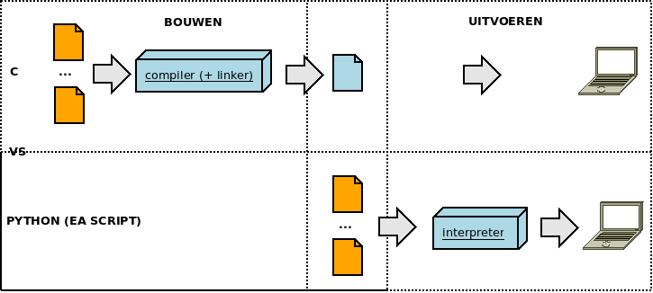

## Welkom

Welkom bij de cursus "Basis Programmeren".  
In deze eerste les gaan we:

* Installeren van tools
* Eerste programma schrijven
  * sequentieel programmeren
  * statement en expressies
  * variabelen en literals
  * text vs nummers
  * input en output van een programma
* Afspraken en andere ...
* Oefening...

### Verloop van de les

~~~

18.00     (1)                  Thuis      (6)
+-----------+                  +------------+
|   Quiz    |                  |  Oefenen   |
|    en     <------------------+    en      |
| Herhaling |                  |  studeren  |
+-----+-----+                  +------^-----+
      |                               |
      |                               |
18.30 |    (2)                 21.30  |   (5)
+-----v------+                 +------+-----+
|  Leerstof  |                 |  Slides    |
|    en      |                 |    en      |
|  Coderen   |                 |  Herhaling |
+------------+                 +------^-----+
      |                               |
      |                               |
19.45 |    (3)                 20.15  |   (4)
+-----v------+                 +------+-----+
|            |                 |Opdracht(en)|
|   Pauze    +----------------->     en     |
|            |                 |   Support  |
+------------+                 +------------+
~~~

**(1) 18.00-18.30: Quiz en Herhaling**

* We starten met een **Quiz** over de **vorige les**
* Vervolgens - tesamen met het overlopen van de quiz - is er tijd voorzien voor Q&A over de leerstof van vorige les

**(2) 18.30-19.45: Leerstof en Coderen**

* Op basis van de slides
* Maken oefeningen in groep
* Studenten 
* Q&A over deze oefeningen

> Nota: de slides worden getoond

**(3) 19.45-20.15 => PAUZE!!!**

**(4) 20.15-21.30: Opdrachten (met support)**

* Opdracht maken
* Lector loopt rond en helpt

**(5) 21.30-22.00: Slides en herhaling**

* Slides worden ter beschikking gesteld
* Belangrijkste punten worden herhaald
* Q&A

**(6) After class: Oefenen en studeren**

* Slides bestuderen ter voorbereiding quiz
* Vragen en antwoorden per mail
* Bemerkingen en feedback op cursus
* Extra oefeningen worden beschikbaar gesteld

## Een stuk tekst

De functie print heeft in dit geval een stuk tekst als argument.  

Zo'n stuk tekst wordt een **string** genoemd en wordt in python altijd **omgeven** door **quotes**.  

Dit kunnen **dubbele quote**s zijn zoals in *"Hello World"* als enkele quotes zoals *'Hello World'*.

### Wat is python

* Programmeer- en scripting-taal
* Uitgevonden door Guido Van Rossum
* Naam gebaseerd op "Monty Python" (een programmeer-taal moet ook fun zijn)

### Waarom Python?

De keuze voor deze introductie-cursus is gevallen op **Python**, waarom?  

* Python is zeer **éénvoudig** aan te leren
  (wordt ook veel gebruikt om kinderen te leren programmeren)
* Een taal gebruikt om **kleine tot grote applicaties** te bouwen  
* Python is enorm **populair**
* Python heeft enorm veel **libraries** en **utilities** om allerlei **taken** uit te voeren
* **Eénvoudig en snel** applicaties (command line of gui) bouwen **zonder al te veel voorkennis.**  
* Python heeft  zeer grote **community** en online **support**
* Python is **open-source**, vrij beschikbaar en gesupporteerd voor **alle operating systems**
* ...

### Waar gaan we python voor gebruiken binnen de cursus?

* scripting en automatisatie
* destop-gui
* data-verwerking
* plotting
* scientific programming (ipv matlab of maple)
* interfacing
* api's
* text
* scriping
* automatisatie
* encryptie
* web
* netwerken
* embedded programming
* ...

### Let op, introductie in programmeren!!

Let wel, het betreft een **introductie** in programmeren in python, niets meer.  
We zien nog maar het tipje van de ijsberg...

## Voorbereiding

Dit is een **praktische cursus**, dus we vliegen er direct in.  
Het motto van deze cursus, **"eerst coderen, dan leren"** (of eerst schieten dan praten)

Alvorens te kunnen starten heb je op de desbetreffende computer 2 zaken
Om het eerste deel van de cursus te kunnen uitvoeren heb je 2 componenten nodig op je PC:

* "**Python** 3"-interpreter
* **Texteditor**

### Leren met command-line te werken

Alvorens te installeren heb je eerste een minimale kennis nodig van het werken met een **command-line** op je besturingsysteem.  

* Op **Linux/Mac/Unix** is de meest gebruikte command-line omgeving **Bash**
* Op **Windows** heb je keuze tussen de klassieke **CMD-applicatie of** het iets uitgebreidere **Powershell**

Als je jezelf **niet confortabel** voelt op de **command-line** (of erger je hebt er nog **nooit** van **gehoord**), kan je naar **Appendix A** kijken voor een introductie voor zowel Linux als Windows.

### Installatie van Python

**Eerst** installeren we de **Python-interpreter**, dit is de software die zorgt dat je Python-programma's worden uitgevoerd.

#### Python 3.7

Voor deze cursus gebruiken we als referentie versie **Python 3.7**.  
Als je een eerdere versie mocht hebben van Python 3 is dit ook OK.  

> Nota:  
> Python 2 kan je bij aanvang van de cursus ook gebruiken maar later in de cursus gaan we toch Python 3 moeten gebruiken.

#### Testen installatie

Alvorens te installeren kan je **nakijken** of je systeem **reeds** een **Python-installatie** bevat en **welke versie** deze is.  
Dit kan je doen via de **command-line**:

Op Linux/Mac/Unix:

~~~bash_terminal
a@a:~$ python --version
Python 3.6.8
a@a:~$
~~~

Op Windows komt dit neer op

~~~
C:\users\py> python --version
Python 3.6.8
C:\users\py>
~~~

> Nota:  
> Als je de installatie kan je dit ook gebruiken om je installatie te testen.

#### Installeren op Windows

Zie https://www.python.org/downloads/ en installeer de laatste versie Python-versie

#### Installeren op Mac

Mac komt meestal met Python pre-geinstalleerd, mocht dit niet het geval zijn of enkel Python 2 is geinstalleerd, gelieve hier ook de link https://www.python.org/downloads/ te gebruiken.

#### Installeren op Linux

*Debian/Ubuntu:*

~~~bash
$ sudo apt-get install python3
...
bart@bvomini:~/Projects/ucll_python$ python --version
Python 2.7.15+
bart@bvomini:~/Projects/ucll_python$ python3 --version
Python 3.6.8
...
~~~

Python 3 wordt geinstalleerd onder het allias python3 dus gelieve deze te gebruiken.

*Fedora/Red Hat:*

Voor Fedora of Red Hat, voor de 2 volgende dnf-commando's uit:

~~~bash
# dnf install python3
~~~

### Texteditor

Om een programma te schrijven hebben we een goede "**text-editor"** nodig.  

* Voor Windows-gebruikers is dit Notepad++
* MacOS gebruikers maken veelal gebruik van TextMate
* Voor Linux hangt dit af van de distribtrutie (Gedit, Xedit, Kate, Vi, ...)

Er zijn buiten deze editors zeer veel goede teksteditor op de markt (Atom, Sublime, Brackets, ...).  
Mocht je hier reeds ervaring met hebben mag je deze ook gebruiken.

> Nota:  
> Word, Libreoffice of Pages (Mac) zijn geen text-editors maar text-verwerkers.  
> Deze worden gebruikt voor text-formattering, een text-editor enkel voor "zuivere tekst"

## Python-code uitvoeren

Als we eerder vermelde installaties hebben uitgevoerd kunnen we starten met ons eerste programma.

### Python is een scripting-taal

Python is een scripting-taal, net zoals bij C schrijf je **code** in 1 of meerdere **tekst-files** **maar** je moet deze code **niet compilen**.  

Zoals geillustreerd hieronder moet je c-code (oranje==tekst-files) eerst via een compiler (en linker) naar een uitvoerbaar bestand vertalen (blauw==uitvoerbaar bestand)

Een script daarentegen wordt door een speciaal programma - de **interpreter** - gelezen en uitgevoerd.

De code/instructies worden als het ware (at runtime) geinterpreteerd en uitgevoerd op de computer als tekst.

### Interactief python of file based

**Python: interactief of vanuit een file**

Python-code kan je uitvoeren op 2 manieren:

* **File-based:** python-statements vanuit in een file uitvoeren
* **Interactief:** van uit een shell statement per statement uitvoeren

We gaan beide manieren afwisselen waar van toepassing...  
In deze les **beperken** we ons voorlopig nog tot het **file-based uitvoeren**

### File-based "Hello World"

Nu eindelijk het langverwachte allereerste Python-programma...  

**Stap 1:** Open je favoriete text-editor en type de volgende tekst in

~~~python
print("hello world")
~~~

**Stap 2:** **Bewaar** dit op je harde schijf als **hello_world.py**  
Bijvoorbeeld bewaar dit op je home-folder in een subfolder "python_projects"

**Stap 3:** **Navigeer** op de command-line naar deze folder:

~~~
C:\users\python> cd my_first_programm
C:\users\python\my_first_programm> 
~~~

**Stap 4:** Voer dit programma uit.  
Dit doe je door de python-interpreter aan te roepen met als argument hello_world.py (naam van het python-programma)

~~~
C:\users\python\my_first_programm> python hello_world.py
Hello World
C:\users\python\my_first_programm> 
~~~

> Nota: afhankelijk van de installatie moet je py typen ipv python

### Wat hebben we zo net gedaan...

We hebben de python-interpreter een text-file gegeven.

Zo'n python text-file bevat 1 of meerdere statements die door deze interpreter worden uitgevoerd.  
Zo'n statement is "unit of work" dat een bepaalde actie uitvoert. 

### Functie-aanroep

Het statement dat we hier uitvoeren, is de aanroep naar de systeem-functie genaamd print.  
Functies zijn herbruikbare stukken code die je kan aanroepen vanuit je programma onder de volgende vorm.

~~~
<functie-naam>(<argument>)
~~~

Je schrijft eerst de naam van de functie gevolgd - tussen haakjes - door het argument.  
Je kan ook meerdere argumenten meegeven aan sommige functies maar dan moeten deze gescheiden zijn door komma's.  
We komen hier later nog op terug...

### Een 2de programma ... met meerdere statements

Je bent niet beperkt tot 1 statement, je kan er meerdere aanroepen.

~~~python
print("hello")
print("world")
~~~

In welke volgorde wordt deze aangeroepen?  
Heel éénvoudig, de statements worden uitgevoerd in de volgorde zoals jij ze er in zet.

~~~bash
$ python hello.py
hello
world
$
~~~

Zoals je ziet zal deze eerst hello  en dan pas world afdrukken.

### Sequentiele uitvoering met python

Dit is wat noemen **sequentiele uitvoering**  
**Sequentieel** betekent hier, alle **statements** die je in een Python-script plaatst:

* Worden **1 voor 1** uitgevoerd
* In de **volgorde** dat jij ze hebt geplaatst (eerst print("hello") dan print("world"))

We starten met de basis namelijk **sequentiele uitvoering**, zeer snel in de cursus gaan we hier ook nog **conditionele** en **repetitieve** **uitvoering** aan toevoegen, maar first things first.

#### Variabelen

Nu dat we éénmaal weten hoe te printen (en functies aan te roepen) introduceren we **variabelen**.  

Net zoals bij C kan je een waarde in het geheugen plaatsen onder de vorm van een variabele.  
Deze variabele kan je meegeven aan een functie zoals print.

~~~python
>>> say_hello = "hello"
>>> print(say_hello)
>>>
~~~

De variabele die je nu hebt gezien is van het **type string** (net zoals je ook zo'n type in C hebt).  
Let ook op het feit dat je **geen type** moeten **aanduiden** bij declararatie van zo'n variabele, dit betekent evenwel niet dat er geen type bestaat natuurlijk.

#### Variabele verwijderen

Ook **nieuw tov C** is dat je zo'n **variabele** kan **verwijderen** via het commando **del** in Python, als je deze niet meer nodig hebt (om geheugen te besparen).  
(ga je meestal niet nodig hebben)

~~~python
>>> say_hello = "hello"
>>> print(say_hello)
hello
>>> del say_hello
>>> print(say_hello)
Traceback (most recent call last):
  File "<stdin>", line 1, in <module>
NameError: name 'say_hello' is not defined
>>>
~~~

> Nota: deze feature is hier gewoon voor de volledigheid, in werkelijkheid wordt dit zelden gebruikt tenzij dat het om zeer grote variabelen gaat...

#### Werken met getallen

Naast het **type string** heb je ook support voor allerlei **numerieke types**, vergelijkbaar met degene die we in C hebben gezien:

* **Integers:** (geen onderscheid tussen signed en unsigned)  
  —1, –3, 42, 355, 888888888888888, –7777777777
* **Floats:**  
  —3.0, 31e12, –6e-4
* **Complexe getallen:**  
  —3 + 2j, –4- 2j, 4.2 + 6.3j
* **Booleans:** (in C was 0 false en alle anderen getallen true)  
  True, False

#### Mathematische operatoren

Alle operatoren die je gewoon bent uit C zijn zeer vergelijkbaar met degene uit Python:  

~~~python
>>> x = 5 + 2 - 3 * 2
>>> x
1
>>> x = 5 + (2 - 3) * 2
>>> x
3
>>> 5 / 2
2
>>> 5 // 2
2
>>> 5.5 / 2
2.75
>>> 2 ** 8
256
>>> 5 % 2
1
>>>
~~~

* ~~~+ - * /~~~ gesupporteerd
* 2 integers door elkaar delen zal afronden naar beneden
* ~~~%~~~ geeft de rest van een deleing
* ~~~** ~~~ stelt macht voor

### Commentaar

Waar je in C "//" en "/**/" gebruikt om je code te becommentariëren bestaan er in python de 2 volgende manieren:

Of je gebruikt een hashbang:

~~~python
# This is python-comment
print("hello world")
~~~

Of je zet een multi-line string zonder hem aan een variabele te assignen

~~~python
"""This is a multiline comment.
The following lines concatenate the two strings."""
print("hello world);
~~~

### Heb je nog ";" nodig

Waar we in c een ; nodig hadden om de verschillende lijnen van elkaar te scheiden is die niet meer verplicht in Python

~~~python
# Dit programma bevat meerdere lijnen
print("Dit programma bevat meerdere lijnen")
a = 5
b = 10
c = a + b
print(a)
print("+")
print(b)
print("=")
print(c)
~~~

### Conditioneel programmeren

We starten nu aan meer complexere code (condities en herhalingen).  
Condities zijn vergelijkbaar met wat je uit C kent, dezelfde 3 constructies vind je terug:

* if-clausules
* else-clausule
* 1 of meerdere elif-clausules

~~~python
if expression:
   statement(s)
elif:
   statements(s)
...elif:...
else:
   statement(s)
~~~

#### Relationele en logische operatoren

Python supporteert **dezelfde relationele operatoren** als degene die we kennen uit C:

* X < Y
* X <= Y
* X > Y
* X >= Y

Let wel op de **verschillende notatie** voor de **logische operatoren**

* X or Y (ipv X || Y)
* X and Y  (ipv X && Y)
* not X (ipv !X)

#### Verschillen met C (blocks)

Condities (en later ook loops) brengen nog wat verschillen in het volgende met C:

* De **conditie** wordt **beëindigd** met een **:**
* **Geen accolades** worden gebruik
* **Indentatie** is **verplicht**

Met andere woorden Python heeft een andere manier om **blocks** te **demarkeren**.  
Laten we 2 stukken code vergelijken **C** vs **Python**:

~~~c
int main() {
    int n, r;
    n = 9;
    r = 1;
    if (n > 0) {
        r = r * n;
        printf("%i\n",r);
        n--;
    }
}
~~~

Dezelfde functionaliteit in **python** wordt als volgt geschreven:

~~~python
n = 9
r = 1
if n > 0:
    r *= n
    print(r)
    n -= 1
~~~

Python heeft als gevolg van het **ontbreken** van deze **accolades**, tabs (of spaties is ook mogelijk) nodig om een **block** te onderscheiden

#### if-else

De volgende voorbeelden illustreren het gebruik van een conditie:

~~~python
a = 10
if a > 10:
   print("a > 10")
else:
   print("a <= 10")
~~~

#### if-else-elif

Met een elif toegevoegd ...

~~~python
a = 10
if a > 10:
   print("a > 10")
elif a == 10:
   print("a == 10")
else:
   print("a > 10")
~~~

#### meerdere elif's

~~~python
a = 10
if a > 10:
   print("a > 10")
elif a == 10:
   print("a == 10")
elif < 10:
   print("negatief getal")
else:
   print("a > 10")
~~~

#### Logische operatoren

~~~python
a = 10
b = 5
c = 15
if (a > 5) and (a < c) :
    print("a is tussen b en c")
~~~

> Nota: de haakjes zijn niet noodzakelijk in Python, dit is een persoonlijke voorkeur

#### Geneste condities

Je kan bovenstaande code ook herschrijven als een geneste conditie

~~~python
a = 10
b = 5
c = 15
if (a > 5):
    if (a < c) :
         print("a is tussen b en c")
~~~

In dit geval moet je deze verder indenteren

### Repetitief programmeren

Naast if-conditie heb je ook loops

#### while-loop

Een while-loop is ook zeer vergelijkbaar met C.

Bijzonder is dat je bij Python ook een else-clausule kan worden toegevoegd.  
Deze wordt uitgevoerd wanneer de while-conditie false evalueert, maar niet als er een break of exceptie (komen we nog op terug) wordt gegenereerd

~~~python
while condition:
    body
else:
    post-code
~~~

Volgende voorbeelde illustreren:

#### Basis-voorbeeld while-loop

~~~python
x = 5
y = 10
while x > y:
    print(x)
    x = x + 1
~~~

Net zoals verwacht zal deze van 5 tem 9 printen

~~~bash
$ python simple_while_loop.py
5
6
7
8
9
$
~~~

#### While-loop met break

Net zoals bij C kan je een break gebruiken om de loop te beindigen:

~~~python
x = 5
y = 10
while x < y:
    print(x)
    x = x + 1
    if x == 7:
        break
~~~

~~~bash
$ python simple_while_loop_break.py
5
6
7
$
~~~

#### While-loop met continue

Net zoals bij C kan je een break gebruiken om de loop te beindigen:

~~~python
x = 5
y = 10
while x < y:
    if x == 7:
        continue
    print(x)
    x = x + 1
~~~

~~~bash
$ python simple_while_loop_break.py
5
6
8
9
$
~~~

#### While met else

Een loop kan ook (in tegenstelling to C) een else-clausule bevatten.  
Deze else-clausule wordt uitgevoerd wanneer de conditie in de while-clausule negatief evalueert:

~~~python
x = 5
y = 10
while x < y:
    print(x)
    x = x + 1
else:
    print("deze code wordt altijd uitgevoerd")
~~~

Met het zelfde resultaat als boven

~~~bash
$ python simple_while_else_loop.py
5
6
7
8
9
deze code wordt altijd uitgevoerd
$
~~~

#### While met else

In bovenstaande code heeft deze else-clausule niet veel nut, gezien je ook de print-statement achter de loop kan plaatsen.  
Waar dit wel nut kan hebben is bij break-statements (net zoals in C supporteert Python ook break- en continue-statements) zoals geillustreerd in onderstaand voorbeeld.  

~~~python
x = 5
y = 10
while x < y:
    print(x)
    x = x + 1
    if x == 7:
        break
else:
    print("deze code wordt altijd uitgevoerd")
~~~

Als je dan bovenstaande code uitvoert zal deze de code uit de else-clausule niet uitvoeren.

~~~bash
$ python simple_while_else_break_loop.py
5
6
7
$
~~~

#### For-loop

Python supporteert ook for-loops, hoewel deze niet volledig identiek zijn aan de for-loops zoals we ze kennen uit C:

~~~python
for x in range(1,11):
     print('{0:2d} {1:3d} {2:4d}'.format(x, x*x, x*x*x))
~~~

> Nota: We gaan direct hierna bekijken hoe je met strings moet werken in Python

Deze for-loop zal voor elk getal in de "range" tussen een start (1) en einde (11) de statements uitvoeren.  
Let wel het einde is niet inclusief (loop telt tot 10)

~~~
$ python example_for_loop.py
 1   1    1
 2   4    8
 3   9   27
 4  16   64
 5  25  125
 6  36  216
 7  49  343
 8  64  512
 9  81  729
10 100 1000
$
~~~

Dit is een eerste voorbeeld van een for loop, we gaan direct ook tonen hoe je deze loop kan gebruiken om lijsten te itereren.  

> **Nota:**  
> Deze for-constructie is zeer krachtig, maar om dat ik enkel een intro is gaan we hier niet verder op in dan het praktisch gebruik.  
> Als je echter meer wil weten zie Deze for-loop zal voor elk getal in de "range" tussen een start en einde de statements uitvoeren.

#### nesten ...

Net zoals in C kan je loops en condities in elkaar nesten.  
Let natuurlijk wel dat je de correcte identatie gebruikt.

~~~python
for x in range(1,11):
    for y in range(x,11):
        if x != y:
            print('{0:3d}'.format(x))
            print('{0:3d}'.format(y))
            print("*--")
            print('{0:3d}'.format(x * y))
            print("")
~~~

Als je de hele tafel zou willen afdrukken:

~~~bash
$ python test.python
  1
  2
*--
  2

  1
  3
*--
  3

  1
  4
*--
  4

  1
  5
*--
  5

...enzovoort...

  8
 10
*--
 80

  9
 10
*--
 90

### Werken met tekst

In python wordt er geen onderscheid gemaakt tussen een karakter en een string:

~~~python
>>> a = "A string in double quotes can contain 'single quote' characters."
>>> b = 'A string in single quotes can contain "double quote" characters.'
>>> c = '''\This string starts with a tab and ends with a newline character.\n'''
>>> d = """This is a triple double quoted string, the only kind that can
    contain real newlines."""
>>>
~~~

#### Formatteren van een string

Net zoals je bij de sprintf- en printf-functies in C kan je een stuk tekst formatteren.  
In Python zijn 3 verschillende manieren hiervoor

De oude manier, niet gesupporteerd in Python 3, maar van wel dezelfde formatters als C gebruikmakende:

~~~python
>>> "decimaal: %i hex: %x" % (10 , 10)
'decimaal: 10 hex: a'
>>> print("a %i %x" % (10,10))
decimaal: 10 hex: a
>>>
~~~

De nieuwe manier, zowel in Python 2 als Python 3 gesupporteerd:

~~~python
print("{:d}-{:d}".format(1,2))
1-2
>>> print("{}-{}".format(1,2))
1-2-1
~~~

Bij dezei (nieuwe) manier ben je niet verplicht een formaat aan tegen een {} is voldoende.  
Optioneel kan je - binnen de string selecteren - welk getal uit de luist je wil selecteren:

~~~python
>>> print("{0}-{1}-{0}".format(1,2))
1-2-1
>>> print("{0:d}-{1:d}-{0:d}".format(1,2))
1-2-1
~~~

Een ander voorbeeld is het uitlijnen van tekst.

~~~python
>>> print("{0:2d}{1:3d}{0:4d}".format(1,2))
 1  2   1
>>> print("{0:2d}{1:3d}{0:4d}".format(10,20))
10 20  10
~~~

Voor een volledig overzicht kan je naar de betreffende python-documentatie gaan kijken:  
https://docs.python.org/2/tutorial/inputoutput.html

> Nota:  
> In dit geval zien we dat we dat we een methode aanroepen op een manier die we nog niet kennen vanuit C, namelijk vanuit een object (string.methode()).  
> Dit is Object-Georienteerd programmeren, hier komen zo direct nog even op terug

#### Inlezen vanaf de command-line

We weten nu min of meer hoe we data naar de console moeten schrijven (equivalent van printf).  
Om data in te lezen van de command line bestaat er een andere functie, namelijk raw_input.  

~~~python
x = raw_input("Geef een string")
print(x)
~~~

Deze zal een stuk tekst inlezen van de STDIN (input command-line), deze tekst kan je dan opvangen in een variabele.  
Als je dit programma zou uitvoeren krijg je ongeveer de volgende output:

~~~bash
$ python print_een_string.py
Geef een string:
Hello
Hello
$
~~~

#### Inlezen en converteren

Je wil niet altijd tekst inlezen, in bepaalde gevallen wil je gewoon een nummer inlezen.  
Daarvoor bestaan er conversie-functies in Python.

~~~python
input_string = raw_input("Geef een nummer: ")
x = int(input_string)
print('1ste macht: {0:2d} 2de macht: {1:3d} 3de macht{2:4d}'.format(x, x*x, x*x*x))
~~~

Dit geeft het volgende resultaat:

~~~
$ python input_and_convert.py
Geef een nummer: 5
1ste macht:  5 2de macht:  25 3de macht 125
~~~

Ter vervollediging, je kan dit ook verkort door de 2 functie-aanroepen te nesten.

~~~python
x = int(raw_input("Geef een nummer: "))
print('1ste macht: {0:2d} 2de macht: {1:3d} 3de macht{2:4d}'.format(x, x*x, x*x*x))
~~~

### Werken met lijsten (vs arrays in C)

Arrays zoals we ze uit C kennen bestaan niet in Python.  
In de plaats daarvan spreken we in Python van het datatype list.  
Deze heeft dezelfde gedrag als een array

Volgende code:

* initialiseert een list van 3 elementen
* print het 2de element (positie 1)
* wijzigt het 3de element (positie 2)
* print ditzelfde 3de element

~~~python
x = [1.0, 2.0, 3.0]
print(x[1])
x[2]=10
print(x[2])
~~~

~~~bash
$ python hello.py
2.0
10
~~~

#### Lijsten doorlopen

~~~python
x = [1.0, 2.0, 3.0]
for n in x:
    print(n)
~~~

#### Negatieve indexen

Je kan bij Python ook negatieve indexen gebruiken.
Deze zullen

~~~python
x = [0,1,2,3,4,5,6,7,8,9]
print(x[-1])
print(x[-3])
~~~

Deze zullen een overflow-gedrag vertonen, en worden afgetrokken worden van de grootte van de array:

~~~bash
$ python test.python
9
7
~~~

#### Selecteren met "scices"

Je kan ook een stuk nemen uit zo'n list, dit noemt met slicing.

~~~python
x = [0,1,2,3,4,5,6,7,8,9]
for n in x[2:4]:
    print(n)
~~~

De eerste index is de start-index, let wel de 2de index is niet inclusief!!!

~~~bash
$ python test.python
2
3
~~~

#### Slicing met negatieve indexen

Je kan hier ook negatieve indexen gebruiken:

~~~python
x = [0,1,2,3,4,5,6,7,8,9]
for n in x[2:-2]:
    print(n)
~~~

~~~bash
$ python test.python
2
3
4
5
6
7
~~~

### Werken met functies

Functies in python hebben 2 grote verschillen:

* Ze starten met het keyword "def"
* Zoals andere blocks geen accolades
     * Functie-definitie eindigt met ":"
     * Inhoud van de functie wordt geindenteerd

#### Formaat

Functie bestaat uit volgende onderdelen:

~~~python
def name(parameter1, parameter2, . . .):
    body
~~~

* Functie-definitie
    * Voorafgegaan door def
    * Gevolgd door een naam
    * 1 of meerdere parameters (zoals in C tussen haakjes en gescheiden door ",")
* 1 of meerdere statements
* Optioneel beeindigd met een return-statement (zelfde regels als in C)

We illustreren met een aantal voorbeelden...

#### Functie met 1 argument

Volgende functie gaat de machten afrdukken van 1 tem een gegeven getal als argument:

~~~python
def table_of_powers(until):
    for x in range(1,until):
         print '{0:2d} {1:3d} {2:4d}'.format(x, x*x, x*x*x)

table_of_powers(10)
~~~

Deze functie gebruikt geen return, net zoals in C is dit verplicht

#### Functie met 2 argumenten en return

In een volgende voorbeeld maken we een functie aan die 2 argumenten neemt een een resultaat terug-geeft

~~~python
def macht(x,y):
    return x**y

print(macht(5,6))
~~~

~~~bash
$ python test.python
15625
~~~

#### Functie met meerdere returns

In een volgende voorbeeld maken we een functie aan die 2 argumenten neemt een een resultaat terug-geeft.  
We implementeren een functie die het maximum uitrekent...

~~~python
def max(x,y):
    if x > y:
       return x
    else:
       return y

print(max(5,6))
print(max(6,7))
~~~

Met als volgend resultaat

~~~bash
$ python test.python
6
7
~~~

#### Argumenten met naam

Een ander verschil met C is dat je functies dat je argumenten ook kan doorgeven met de naam:

~~~python
def max(x,y):
    if x > y:
       return x
    else:
       return y

print(max(x=5,y=6))
print(max(y=6,x=5))
~~~

Bovenstaande code zal 2 maal hetzelfde afdrukken, je mag hier de argumenten trouwens in een andere volgorde zetten.

~~~bash
$ python hello.py
6
6
~~~

#### Argumenten met een default waarde

Je kan ook argumenten een default-waarde geven.  
Dit kan door een assignment-operator toe te voegen aan het betreffende argument.

~~~python
def macht(x,y=1):
 return x**y

print(macht(x=5,y=6))
print(macht(x=6))
~~~

Bij de 2de aanroep zal y - bij ontbreken - de waarde 1 aannemen.

~~~bash
$ python hello.py
15625
6
~~~

### Hergebruik van code (modules)

In C hadden we de mogelijkheid code te gebruiken dankzij het onderscheid tussen compilatie en linken:

In python is het ook mogelijk je code te verspreiden over files.  
We spreken over **modules** in Python:

* Zoals in C) een reeks bevatten deze **functies** en classes (zie later) kunnen bevatten:
* Je gebruikt het keyword **import** om functies uit een andere module te laden
* Header-files en macro's zoals in C bestaan niet

Laten we starten met een voorbeeld:

#### Een module maken

*Stap 1:* Module aanmaken

* We maken een **module** met de **2 functies**
* We bewaren deze onder een file **hello.py**

~~~python
def say_hello():
print("hello")

def say_world():
print("world")
~~~

Dit is een stuk code dat we nu gaan aanroepen vanuit een programma dat zich in een andere python-file begint

*Stap 2:** Module gebruiken

* We maken een **2de file** met bijvoorbeeld de naam **main.py**  
* We importeren de module via het **keyword import**
* Gevolgd door de **naam** van de module
* Die overeenkomt met de naam van de **python-file** die deze module bevat
* Je kan nu de functies uit deze module aanroepen/gebruiken onder de vorm **"modulenaam.functie"**

~~~python
import hello
hello.say_hello()
hello.say_world()
~~~

*Stap 3*: We voeren deze uit

~~~bash
$ ls
hello.py main.py
$ python main.py
hello
world
$
~~~

De modules die we zelf aanmaken dienen zich in dezelfde directory te bevinden.  
Net zoals bij header-files

#### Vanuit de REPL hergebruiken...

Als je de REPL in dezelfde directory opstart kan je deze ook op dezelfde manier gebruiken.

~~~python
>>> import hello
>>> hello.say_hello()
hello
>>> hello.say_world()
world
~~~

#### Andere notatie...

Een alternatieve vorm is de volgende:

~~~python
from hello import *
say_hello()
say_world()
~~~

Dit geeft het zelfde resultaat maar je moet niet de functie te prependen met de modulenaam.  
Dit heeft wel als nadeel dat je collisies kan hebben, andere modules die je gebruikt zouden ook eventueel kunnen de zelfde methodes kunnen "exposen"

#### Standard library modules

Python voorzien een aantal functies die zowiezo in de taal zijn ingebakken, voor meer info hierover zie
https://docs.python.org/2/library/functions.html  

Voor meer specifiekere zaken (httpserver opstarten, filemanipulatie, ...) bestaan er de Standaard library modules, die je wel specifiek moet importeren.
https://docs.python.org/2.7/library/  

Een voorbeeldje voor file-manipulatie vanuit een python-programma:

~~~python
import os

os.rename( "test1.txt", "test2.txt" )
~~~

Een voorbeeldje dat in enkele lijnen een lokale http-server opstart:

~~~python
import SimpleHTTPServer
import SocketServer

PORT = 8000

Handler = SimpleHTTPServer.SimpleHTTPRequestHandler

httpd = SocketServer.TCPServer(("", PORT), Handler)

print "serving at port", PORT
httpd.serve_forever()
~~~

### Exceptions

In C hebben werkten we dikwijls met return-codes om aan te duiden dat er een fout is gebeurd bij de uitvoering van een stukd code.  
Python gebruikt hiervoor het concept van excepties, stel volgende code:

~~~python
10 * (1/0)
~~~

Als je deze uitvoert, dan krijg je volgende error.

~~~bash
$ python test.py
Traceback (most recent call last):
  File "exception.py", line 1, in <module>
    10 * (1/0)
ZeroDivisionError: integer division or modulo by zero
$
~~~

Python laat je echter toe hierop te anticiperen door een try-except-constructie

~~~python
try:
10 * (1/0)
except ZeroDivisionError:
print("OK, we weten het wel")
~~~

In bovenstaand voorbeeld "intercepteren" we de exceptie en printen we zelf een boodschap in de plaats

~~~bash
$ python test.py
OK, we weten het wel
$
~~~

#### Zelf excepties sturen

Je kan ook zelf excepties genereren

~~~python
def function_with_exception():
raise Exception('hello', 'world')

try:
function_with_exception()
except Exception as inst:
print type(inst)
print inst.args
~~~

En vervolgens intercepteren

~~~
$ python test.py
<type 'exceptions.Exception'>
('hello', 'world')
~~~

> Je kan ook zelf exceptie-types aanmaken maar daarvoor moet je eerst een intro in OO krijgen

### Werken met classes (vs structs in C)

In Python bestaat er ook een equivalent van wat we in C kennen als structs, namelijk classes.  
Classes beschrijven - net zoals structs in C

* Het is een samengesteld datatype
* Bevat 1 of meerdere velden
* Je kan deze meegeven als argument aan functies
* ...

#### Notatie

~~~python
class MyClass:
    body
~~~

#### Samengestelde datastructuur

~~~python
class Student:
def __init__(self, a, b, c):
 self.name = a
 self.exam = b
 self.labo = c

def average(student):
return (student.exam + student.labo)/2

def succeeded_or_not(student):
return average(student) >= 10

studenten = [Student("C#",16,15),Student("Java",15,16)]

for student in studenten:
if succeeded_or_not(student):
 print(student.name + " is geslaagd met " + str(average(student)))
else :
 print(student.name + " is niet geslaagd met " + str(average(student)))
~~~

#### Object georienteerde code

~~~python
class Student:
def __init__(self, name, exam,labo):
 self.name = name
 self.exam = exam
 self.labo = labo

def average(self):
 return (self.exam + self.labo)/2

def succeeded_or_not(self):
 return self.average() >= 10

studenten = [Student("C#",16,15),Student("Java",15,16)]

for student in studenten:
if student.succeeded_or_not():
 print(student.name + " is geslaagd met " + str(student.average()))
else :
 print(student.name + " is niet geslaagd met " + str(student.average()))
~~~

### Praktijk-voorbeeld

#### Stap 1

~~~python
from tkinter import *
import sys
win = Tk()
button = Button(win, text="Goodbye", command=sys.exit)
button.pack()
mainloop()
~~~

#### Stap 2

~~~python
from Tkinter import *

def increment_led_0():
    print("increment led 0")

def increment_led_1():
    print("increment led 1")

def decrement_led_0():
    print("decrement led 0")

def decrement_led_1():
    print("decrement led 1")

def set_value_led_0(value):
    print("set value led 0")

def set_value_led_1(value):
    print("set value led 1")

master = Tk()

Button(master,text='-').grid(row=0,column=0)
w = Scale(master, from_=1, to=10,command=set_value_led_0,orient=HORIZONTAL)
w.grid(row=0,column=1)
Button(master,text='+').grid(row=0,column=2)
Button(master,text='-').grid(row=1,column=0)
w = Scale(master, from_=1, to=10,command=set_value_led_1,orient=HORIZONTAL)
w.grid(row=1,column=1)
Button(master,text='+').grid(row=1,column=2)

mainloop()
~~~

#### Stap 3

~~~python
from Tkinter import *

class Led:
    def __init__(self,master,led_number):
        self.led_number = led_number
        row_number = self.led_number        
        self.scale = Scale(master, from_=1, to=10,command=self.set_value_led,orient=HORIZONTAL)
        self.scale.grid(row=row_number,column=1)
Button(master,text='-',command=self.decrement_led).grid(row=row_number,column=0)
        Button(master,text='+',command=self.increment_led).grid(row=row_number,column=2)

    def increment_led(self):
        print("increment led {}".format(self.led_number))
self.scale.set(self.scale.get() + 1)

    def decrement_led(self):
        print("decrement led {}".format(self.led_number))
self.scale.set(self.scale.get() - 1)

    def set_value_led(self,value):
        print("set value led {} to value {}".format(self.led_number,value))

master = Tk()
led = Led(master,0)
led = Led(master,1)
mainloop()
~~~

https://pyserial.readthedocs.io/en/latest/tools.html

#### Stap 4

~~~python
from Tkinter import *
from time import sleep
import serial

class SerialConnection:
    def __init__(self,connection_string,baud):
        self.ser = serial.Serial(port=connection_string,
  baudrate=baud,
    bytesize=serial.EIGHTBITS,
                      parity=serial.PARITY_NONE,
                      stopbits=serial.STOPBITS_ONE,
                      timeout=1,
                      xonxoff=0,
                      rtscts=0)
sleep(2)

    def write_command(self,command):
        self.ser.write(command)
        val = self.ser.readline()
        return val.split(';')[1]

class Led:
    def __init__(self,master,serial,led_number):
        self.led_number = led_number
        row_number = self.led_number        
        Button(master,text='-',command=self.decrement_led).grid(row=row_number,column=0)
        self.scale = Scale(master, from_=1, to=10,orient=HORIZONTAL)
        self.scale.grid(row=row_number,column=1)
        Button(master,text='+',command=self.increment_led).grid(row=row_number,column=2)
        self.command("get({})".format(self.led_number))

    def command(self,com):
        val = serial.write_command(com)
        self.scale.set(val)

    def increment_led(self):
        self.command("up({})".format(self.led_number))

    def decrement_led(self):
        self.command("down({})".format(self.led_number))

master = Tk()
serial = SerialConnection('/dev/ttyACM0',9600)
led = Led(master,serial,0)
led = Led(master,serial,1)

mainloop()
~~~
