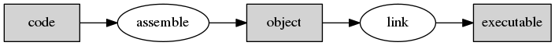

## Introductie in programmeren: van code naar bytes  

Alvorens van start te gaan met c, een korte **introductie** en/of eerste kennismaking met programmeren.  
De elementen die we hier bespreken gelden vanzelfsprekend voor C maar zijn natuurlijk ook toepasbaar voor andere (imperatieve) programmeertalen (zoals Java, C++, Python, Ruby, ...).  

>Op dit moment worden sommige zaken uitermate vereenvoudigd (en zelfs onvolledig) voorgesteld.
>Waarom?  
>Programmeren is niet de meest eenvoudige activiteit en we willen niet te snel vooruit lopen om iedereen (met of zonder eerdere programmeer-ervaring) van in het begin dezelfde basis (en kansen) mee te geven.

### Basisprincipe:  Wat is een (software-)programma?

In essentie bestaat een (uitvoerbaar) programma (executable) uit :

* een (of soms meerdere) **bestand**(en)  die een welbepaalde **sequentie** van **instructies** bevatten
* deze instructies worden door een **computer** **geïnterpreteerd** en **uitgevoerd**.

De **CPU (processor)** is het component verantwoordelijk voor het 1 voor 1 verwerken van deze **instructies** (hoewel sequentieel relatief is bij multicore-cpu's).   
In de praktijk gaat deze **CPU** :

* het programma van een hard-disk (pc) of een ander medium afhalen
* de instructies van dit programma in het RAM-geheugen laden


### Instructieset  

Binnen zo een programma zijn er verschillende soorten **instructies** die door een cpu kunnen worden verwerkt zoals :  

* Berekeningen maken
* Uitvoeren van deze instructies onder bepaalde voorwaarden
* Herhalen van instructies
* Aanroepen van andere stukken code (procedures)  
* Lezen van randapparatuur (bv. scherm, toetsenbord, ...)  
* ...

> In sommige gevallen kunnen deze instructies zelfs pas opgeroepen worden bij bepaalde events (wordt pas binnen een paar lessen besproken)

Hoe deze instructies er uitzien voor cpu/processor wordt uitgedrukt aan de hand van een **instructieset**.   

De beschikbare **instructies** (en hun representatie) verschillen van processor tot processor, de instructies die worden gebruikt voor x86 (wat in een 32-bit-computer) zijn bijvoorbeeld niet te vergelijken met die voor een microcontroller gebruiken 

We gaan hier (nog niet) over uitweiden, het enige dat we nu onthouden is dat zulk een instructie van een programma bestaat dit uit 2 componenten:

* **Opcode**  
De code die de instructie voorstelt (bestaat uit 1 of meer bytes), informeert de processor wat hij moet uitvoeren en welke operanden er nog volgen ...

* **Operand:**
De operand is de data die bij deze de instructie hoort (register-adress, geheugen-adres, ...),  
Het kunnen meerdere zijn en bestaan uit 1 of meerdere bytes. 

Schematisch kan een instructie er als volgt uit zien (in geval van AVR-instructies):


> later zullen we hier nog over uitweiden als we de AVR-architectuur bestuderen

###  Programmeertalen: van instructies naar assembler
 
Een programma is dus eigenlijk een hoop byte-codes en als gevolg niet echt leesbaar door een gebruiker (tenzij je een computer bent of veel hebt geoefend), zelfs in hexadecimale voorstelling.  
 
Om deze instructies te kunnen beschrijven van uit een leesbare tekst bestaan er wat we noemen **programmeertalen**.

De eerste groep van programmeertalen (die ooit werden geïntroduceerd) is wat we noemen **assembler**.  
Deze soort van programmeertalen staat zeer dicht bij deze instructies:  

* **1-2-1 mapping** van statements (tekst) naar instructies (van cpu)  
* Werkt met het principe van **mnemonics** hetgeen een tekstuele voorstelling is van de opcodes en hun operanden
* elke cpu-families hebben zijn eigen specifieke assembler-talen (overeenkomstig instructieset)


Een voorbeeld van zulk een assembler-programma is hieronder beschreven (GNU Assembler voor X86 die de  AT&T syntax volgt):

```
.data
hello:
        .string "Hello world\n"  # Een stukje constant geheugen

.text
.globl _start
_start:
        movl $4, %eax     # System call voor schrijven naar console
        movl $1, %ebx     # File descripter => sysout (of console)
        movl $hello, %ecx # Pointer (naar data) naar boodschap
        movl $13, %edx    # Lengte van de data (te printen vanaf pointer)
        int $0x80         # Interrupt die kernel vraagt system call uit te voeren

        movl $1, %eax     # System call voor afsluiten programma
        movl $0, %ebx     # Return code voor shell
        int $0x80         # Interrupt, kernel vragen system call uit te voeren
```

> We gaan dit (nog) niet in detail bespreken, dit is enkel ter illustratie en ter vergelijking.  
> Later gaan we assembly verder bekijken als we dieper ingaan op hoe een processor samenwerkt met het geheugen.  

Om deze code te **transformeren** of in vakjargon **"compilen"** voer je volgende 2 commando's uit (linux):

```
$ as helloworld.s -o helloworld.o  
$ ld -s -o helloworld helloworld.o  
$ ./helloworld  
$ Hello World
$ echo $?
$ 0
```

Volgende taken worden uitgevoerd:  

* as zijnde het programma dat de assembly transformeert naar "bits en bytes"  
* ld zijnde het programma dat deze assembly "linkt" met andere object-files (in dit geval slechts 1) 
* Als je daarna dit programma uitvoert, zie dat dit de tekst "Hello World" uitprint
* Met het commando $? zie je de return-code (0)  




Assembler is een **zeer efficiënte manier** van programmeren voor wat betreft performance **maar:**

* Is zeer moeilijk te schrijven en te lezen
* Programma's worden zeer groot
* Is niet overdraagbaar naar andere processor-architecturen

### High-Level programmeertalen
**(van assembler naar iets leesbaar)**

Omdat assembler dus nog altijd niet echt leesbaar is, zijn in de loop der tijden andere programmeertalen uitgevonden zoals C, Fortran, Lisp, C++, Java, Python, C#, ...   

(elk natuurlijk met hun eigen toepassingsgebied).  


In deze programmeertalen spreken we dus niet meer over instructies maar eerder over statements en declaraties.
In plaats van deze instructies programmeer-talen gebruiken de meeste programmeer-talen in plaats hiervan statements (actie uitvoeren) en declaraties (van variabelen en geheugen).

Voor deze cursus gaan we dit bekijken aan de hand van de programmeertaal C, momenteel nog altijd de meest gebruikte programmeertaal (zeker in de wereld van microcontrollers en embedded programming).

Ter illustratie zie je hier enkele voorbeelden van hetzelfde programma - printen van "Hello World" - geschreven in C (die we gaan gebruiken in onze labo's) maar ook in andere talen (ter illustratie).

#### Voorbeeld in C

```{.c}
#include <stdio.h>

int main(int argc, char** argv)
{
  printf("Hello World\n");
  return 0;
}

```

Deze code is al min of meer leesbaar en mapt ook niet meer 1-2-1 met cpu-instructies.    
De transformatie naar een uitvoerbaar bestand van deze code noemen we **compileren**, dit procesis natuurlijk een stuk complexer als bij assembler.

Dit programma voert het zelfde uit als het bovenstaande assembler-programma.
Dit programma kan je op een command-line compilen (transformeren naar byte-instructies) en uitvoeren.

```
$ gcc helloworld.c -c helloworld.o
$ gcc helloworld.o -o helloworld
$ ./helloworld
$ Hello World
$
```

Dit gebeurt ook - zoals bij assembler - in 2 fases:

* Compilen van de programma-code naar object-code (instructies)
* Linken van de object-code met andere code (in dit geval slechts 1 object-file)


#### Andere voorbeelden

Een ander voorbeeld van een high-level taal is **Java**, zeer populair in web- en enterprise-development

```{.java}
public class HelloWorld {
    public static void main(String[] args) {  
        System.out.println("Welkom in de cursus microcontrollers");
    }
}
```

```
$ javac HelloWorld.java
$ java HelloWorld
$ Hello World
$
```

Als laatste voorbeeld Python, een andere zeer populaire programmeer-taal
```{.py}
print("hello world")
```

```
$ python helloworld.py
$ Hello World
$
```

### En verder ...

Vanaf de volgende hoofdstukken gaan verder met de programmeertaal C en gaan we proberen de eerste programma's te schrijven. 

