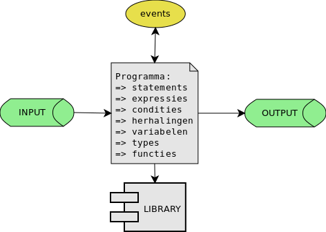
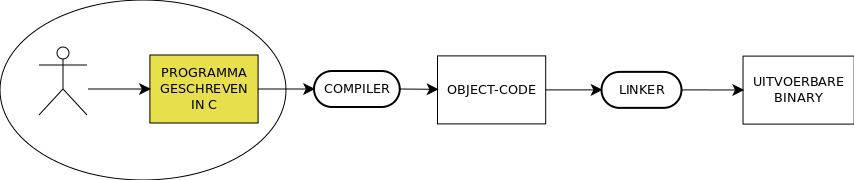

## Introductie in programmeren  

Dit is een **introductie** en/of eerste kennismaking met programmeren aan de hand van de programmeer-taal C.

We pakken dit stap-voor-stap en starten ook enkel met de absolute basis (niet meer dan nog om een basis command-line-programma te schrijven):

* Basis-structuur van een applicatie
    * Statements en expressies
    * Operatoren en functies (aanroepen)
    * Variabelen en constanten
    * Assignments
* Input en output verwerken in een command-line-applicatie

>**Nota:**  
>Sommige zaken worden in dit hoofdstuk uitermate vereenvoudigd en zelfs onvolledig voorgesteld.
>Waarom?  
>Programmeren is niet de meest eenvoudige activiteit en we willen niet te snel vooruit lopen om iedereen (met of zonder eerdere programmeer-ervaring) van in het begin dezelfde basis (en kansen) mee te geven.


### Wat is een (software-)programma?
In essentie is bestaat een (uitvoerbaar) programma (executable) uit :

* een (of meerdere) **bestand**(en)  die een welbepaalde **sequentie van instructies** bevatten
* deze instructies worden door een **computer** (meer bepaald een processor) **geïnterpreteerd** en **uitgevoerd**.

Binnen een computer is een **CPU (processor)** verantwoordelijk voor het 1 voor 1 verwerken van deze instructies.  
In de praktijd gaat deze **CPU**:

* het programma van een hard-disk of een ander medium afhalen
* de instructies van dit programma in het RAM-geheugen laden
en heeft toegang tot het geheugen voor het opslaan van data.


### Soorten van instructies (gemeenschappelijk voor alle talen)

Binnen zo een programma zijn er verschillende soorten statements:  

* Berekeningen maken
* Afdrukken van het resultaat op een scherm of een andere medium
* Herhalen van instructies
* Aanroepen van functies en procedures
* Enkel uitvoeren van deze instructies onder bepaalde voorwaarden
* Lezen van randapparatuur (bv. scherm, toetsenbord, ...)  
* ...



> In somige gevallen kunnen deze instructies zelfs pas opgeroepen worden bij bepaalde events (wordt pas binnen een paar lessen besproken)

### Programmeertalen

Hoe dat dit in zijn werk gaat bekijken we aan de hand van een programmeertaal.  
Er bestaan veel verschillende programmeer-talen zoals C, C++, Java, Python, C#, ...

Voor deze cursus gaan we dit bekijken aan de hand van de programmeertaal C, momenteel nog altijd de meest gebruikte programmeertaal (zeker in de wereld van microcontrollers en embedded programming).

In praktijk start een software-programma zijn leven als 1 (of meerdere) tekst-files.
Voor dit aan te maken heb je niet meer nodig dan een teksteditor (zoals bv. notepad, vim, notepad++, emacs, ...) zoals het c-programma geillustreerd hieronder:


Ter illustratie zie je hier enkele voorbeelden van hetzelfde programma - printen van "Hello World" geschreven in verschillende talen.

####  Assembler

De **statements** uit een programma worden gewoonlijk vertaald naar machine-taal.
Machine-taal zijn instructies die gecodeerd in een serie bytes (opcodes),deze instructie zijn meestal tussen 1 en 3 bytes lang (in geval van x86).

Deze **instructies** verschillen van processor tot processor, de instructies die worden gebruikt voor x86 (wat in een 32-bit-computer) zijn niet te vergelijken met bijvoorbeeld degene die voor een microcontroller worden gebruik (later zullen we hier nog over uitwijden als we de AVR-achitectuur bestuderen).

Aangezien dat deze instructies niet leesbaar zijn (tenzij je een computer bent), bestaat er assembler.  
Dit is de groep van **programmeer-talen** die het dichtste staat bij de eigenlijke machine-taal, elke processor-architectuur heeft natuurlijk zijn eigen assembler-taal maar de principes blijven dezelfde.

Het voorbeeld hieronder is geschreven met de gas-assember (GNU Assembler) die de  AT&T syntax:

```
.data
hello:
        .string "Hello world\n"

.text
.globl _start
_start:
        movl $4, %eax
        movl $1, %ebx
        movl $hello, %ecx
        movl $13, %edx
        int $0x80

        movl $1, %eax
        movl $0, %ebx
        int $0x80
```

Om dit uit te voeren:

```
$ as helloworld.s -o helloworld.o  
$ ld -s -o helloworld helloworld.o  
$ ./helloworld  
```

Assembler is een zeer efficiente manier van programmerenvoor wat betreft performance maar:
* Is zeer moeillijk te schrijven en te lezen
* Is niet overdraagbaar naar andere processor-architecturen

#### Voorbeeld in C

Vandaar dat er talen zijn die meer om maat van mensen zijn gemaakt zoals bijvoorbeeld C.

> Zoals eerder vermeld gaan we deze taal gebruiken de komende weken gebruiken voor onze labo's.

```
#include <stdio.h>

int main(int argc, char** argv)
{
  printf("Hello World\n");
  return 0;
}

```
Dit programma voert het zelfde uit als het bovenstaande assembler-programma.
Dit programma kan je op een command-line compilen (transformeren naar byte-instructies) en uitvoeren.

```
$ gcc helloworld.c -o helloworld
$ ./helloworld
$ Hello World
$
```

C is vergeleken met assembly zeer leesbaar, maar sluit in praktijk toch tamelijk dicht aan bij de hardware (vooral door pointers).  
Dat heeft zowel voor- als nadelen:
* Voordeel is dat C voor van alles gebruikt kan worden en relatief snel is.
Als gevolg is dit de meest populaire taal voor het programmeren van MCU'S of andere omgevingen waar performance en memory-verbruik zeer belangrijk zijn.
* Daarnaast is de taal gecompileerd worden naar zowat alle platformen en processor-architecturen die er bestaan
* Nadelen zijn dat de taal niet erg vergevingsgezind is met betrekking tot fouten en dat de C-compiler weinig controles uitvoert (hoewel die controles met diverse tools alsnog uitgevoerd kunnen worden).  
Een C-programma dat door de C-compiler correct wordt bevonden, hoeft niet per definitie goed te functioneren.  
Een oorzaak van vele problemen hier is het gebruik van pointers; dit is dan ook de reden waarom deze in afgeleide talen zoals Java en Python achterwege gelaten zijn..

#### Voorbeeld in Java

Een ander voorbeeld van een high-level taal is Java

```java
public class HelloWorld {
    public static void main(String[] args) {  
        System.out.println("Welkom in de cursus microcontrollers");
    }
}
```

```
$ javac HelloWorld.java
$ java HelloWorld
$ Hello World
$
```

#### Voorbeeld in Python
Of Python
```
print("hello world")
```

```
$ python helloworld.py
$ Hello World
$
```


##### Compileren en linken
Deze tekst kan je echter niet direct door een CPU laten uitvoeren.  
Alvorens je dat programma kan uitvoeren op het platform naar keuze (computer, microcontroller ...) moet deze tekst-file getransformeerd worden naar een uitvoerbare binaire file (in het geval van C).  



Deze transformatie wordt uitgevoerd door  3 programma's:

* Een assembler die je code vertaalt naar assembler (zie later)  
* Een **compiler** die deze assembler vertaalt naar binaire objecten
* Een **linker** die deze binaire objecten linkt tot een uitvoerbaar programma

Dit programma kan dan rechtstreeks geïnterpreteerd worden door een CPU

##### Command-line
In de praktijk zijn er programma's die dat voor jou doen.  Voorbeelden van zulke compilers zijn gcc en msc.  
Ter illustratie zie je hieronder een voorbeeld van hoe dat je met GCC (via de terminal) een tekstbestand (helloworld.c) transformeert naar een programma (helloworld)


Hoe dat precies in zijn werk gaat wordt in het volgend hoofdstuk uitgelegd.  
Voorlopig kan je er vanuit gaan (indien gcc geinstalleerd is) je dit onder de volgende vorm kan aanroepen:  
```gcc <c-file> -o <programmanaam>```  
om een uitvoerbaar command-line applicatie te verkrijgen.  
Het gebruik van deze tools wordt in een volgend hoofdstuk uitgelegd zodat we zelf de voorbeelden en labo's kunnen kunnen compileren en uitvoeren.

> Vooraleer te starten met microcontrollers oefenen we de basis van programmeren met c in aan de hand van dit soort programma's dat je van de command-line kan aanroepen.

> Hierover volgt in de volgende hoofdstukken nog zeer veel diepgang, voorlopig focussen we ons op de eerste activiteit, namelijk het schrijven  van code zelf.
