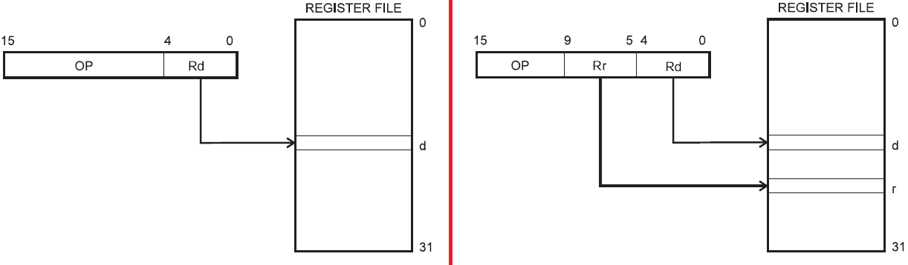

# De instructieset  
## Inleiding  

Dit hoofdstuk is enkel bedoeld om een indruk te schetsen hoe instructies worden uitgevoerd op processor niveau.  De assembly taal komt hierbij aan bod. Hoewel wij tijdens de labo zittingen werken met de programmeertaal C is dit hoofdstuk zeer belangrijk om de basis kennis en de structurele opbouw van een microcontroller te begrijpen.

De Atmel ATmega165P processor is opgebouwd volgens de harvard architectuur en werkt volgens het
RISC principe. RISC is het acroniem voor “Reduced Instruction Set computing”, wat impliceert dat de
microcontroller met een beperkte instructieset werkt. De door ons gebruikte controller bevat een 130
grote instructieset. Bij een RISC instructieset worden de complexe instructies achterwegen gelaten om
een hoge uitvoeringssnelheid en eenvoudigere decodering te bewerkstelligen.  

De meeste instructies worden uitgevoerd in één klokcyclus. Er zijn echter ook instructies die twee tot 4
cycli nodig hebben. Dit is enkel belangrijk om weten indien men tijd kritische toepassingen gaat
ontwikkelen.  

De bytes die het programma voorstellen worden OPCODE genoemd. Een instructie kan uit 1 tot 3 bytes
bestaan. Omdat 8 bit getallen voor ons niet erg praktisch en leesbaar zijn worden de instructies van de
CPU met woorden en afkortingen voorgesteld. Deze mnemonics 1 heeft men zo gekozen dat ze het
gevolg van de instructie beschrijven. De assembler compiler zal deze mnemonics converteren naar de
zogenaamde opcodes (bits). Dit is een begrijpelijke machinetaal voor de controller.  

Een instructie bevat een opcode en een operand.

**Opcode:**  
Deze beschrijft de instructie (ADD, SUBB, MUL,...) en informeert de processor over wat er nog volgt in de
instructie (vb het aantal bytes)

**Operand:**
De operand is de date waarop de instructie wordt uitgevoerd of dit kan ook een geheugenadres zijn.  

Schematisch kan een instructie er als volgt uit zien:


De meest algemene vorm van een instructie is:  
```
  MNEMONIC       BESTEMMING register, BRON register
```

Voorbeeld:  
```
  MOV     Rd, Rr; deze instructie verplaatst de inhoud van register Rr  
                ; naar register Rd  
```
> Opmerking:  
> Er is een wezenlijk verschil tussen assembler en machine code. Assembly code
omschrijft instructies en dit in tegenstelling tot machine taal, waar een instructie
een combinatie van éénen en nullen is.
Voor elke instructie kan men de binaire machinecode terugvinden in de algemene AVR
instructie set beschrijving. (http://www.atmel.com/Images/doc0856.pdf)  

>   

## Overzicht van de instructieset  

De instructies van de microcontroller kunnen in verschillende categorieën worden ingedeeld, afhankelijk van de manier waarop de instructies:  
* de data benaderen (directe of indirecte adressering)  
* inwerken op de data (vb twee getallen optellen)  
* Of de intentie/doel van de instructie (programma flow controle)  

Er zijn verschillende soorten instructies mogelijk, namelijk:  
* Aritmetische en logische instructies
* Conditionele en sprong instructies
* Bit en Bit Test instructies
* Data transfer instructies
* MCU controle instructies

Deze instructies zijn overzichtelijk beschreven in de datasheet.

Al deze instructies beïnvloeden de vlaggen in het Status register. Het statusregister bevat enkel bit informatie. Dit wil zeggen dat de waarde van de byte niet belangrijk is, wel de individuele toestand van de status bits. Ook andere registers kunnen status bits of vlaggen bevatten maar alleen het status register bevat een aantal vlaggen die bepaald worden door
het resultaat van een berekening.  

Welke instructie welke vlag beïnvloedt staat beschreven in de “instruction set summary”.  


**Verklaring van de operands:**  

Code   | Betekenis
-------|------------------------
Rd    |Bestemmings (en doel) register in het registerfile  
Rr   |Bron register in het registerfile  
R     |Resultaat nadat de instructie uitgevoerd is  
K     |constant data  
k     |constant adres  
b     |Bit in het register file of I/O Register  
s     |Bit in het status register  
X,Y,Z |indirect adres register  
A     |I/O locatie adres (poort adres)  
q     |isplacement for direct adressing (6-bit)  

## Adresseringsmethoden  

Om de instructieset van de controller te begrijpen, moet je weten hoe de CPU variabelen in het
systeem kan adresseren. Hiervoor zijn meerdere methoden denkbaar.

* Register Direct (1 of 2 registers) methode
* I/O Direct methode
* Immediate (constant) methode
* Data Direct methode
* Data Indirect methode
* Indirect Program Addressing
* Relative Program Addressing  

### Register Direct adresseringsmethode

Deze adresseringsmethode is werkzaam op elk van de 32 registers in de Register File (zie...). Zowel
instructies tussen twee registers als instructies op één enkel register zijn denkbaar.  

#### Één enkel register: Rd

**Instructie formaat:**  

  

**Voorbeeld:**
```
INC R15   ;increment the content of register 15 with 1
CLR R2    ;clear the content of register R2 (all bits on "0")
```
#### Twee registers: Rd en Rr

De microcontroller leest de data uit de registers Rd en Rs. Voert de instructie uit op de registers. Slaat het
resultaat terug op in het bestemmingsregister Rd

**Instructie formaat:**  
  

**Voorbeeld:**  
```
ADD R2, R5  ;add the content of both registers, the sum is stored in R2
            ;regiser R5 remains unchanged
```

#### Twee-register versus één-regiser directe adressering

Onderstaande figuur geeft het eerder besproken instructieformaat voor het direct en indirect adresseren van een geheugenplaats weer. De operands in deze afbeelding is beschreven met afkortingen. (zie ook eerder -> verklaring van de operands)



Het is belangrijk te leren werken met datasheets, deze beschrijvingen zijn een samenvatting van de datasheet http://www.atmel.com/Images/doc0856.pdf. De uitgebreide, in woorden beschreven, instructie formaten zullen achterwegen gelaten worden.

### I/O Direct adresseringsmethode  
I/O directe adressering wordt gebruikt om de I/O geheugenruimte te bereiken (I/O registers en
poorten).
I/O registers worden enkel aangesproken met de instructies IN en OUT
IN: Het lezen van data van een input poort (PINx)
OUT: wordt gebruikt voor het uitzenden van data naar de output poort (POORTx)

```
IN  Rd, Poort_Address
OUT  Poort_Address, Rs
```
**Instructie formaat:**  


Registers Rd en Rs: één van de 32 general purpose registers
Poort adres: Kan een willekeurig I/O register zijn

**Voorbeeld:**  
```
IN  R16, PORTA    ;Information on port A is stored in R16
OUT PORTA, R16    ;Information of R16 is pushed in R16
```
>Opmerking:  
>  
De AVR ATmega165P controller heeft meer randsytemen aan boord dan er door de 64 I/O registers kunnen ondersteund worden. De 160 Extended I/O geheugenplaatsen kunnen enkel bereikt worden via de data adresseringsmethode. I/O adressing is enkel mogelijk voor de 64 I/O registers.  

### Immediate adresseringsmethode  
Een constante (immediate data) kan weg geschreven worden naar één van de 32 General Purpose
Registers. Deze data is rechtstreeks, als operand, opgenomen in de instructie. Een immediate instructie
is duidelijk herkenbaar doordat de mnemonic code uitgebreid is met een “i”.

**Voorbeeld**
```
LDI  R2, 0X62    ;Loads the hex-number in register R2
```

> Opmerking:  
> Merk op dat we een constant hexadecimaal invoeren.  En dat we hiervoor de suffix 0x gebruiken.  

### Data directe adresseringsmethode

Tot op heden hebben we steeds met de registers in het General Purpose register gewerkt. We kunnen
echter ook data gaan lezen en schrijven uit bijvoorbeeld het SRAM geheugen en/of het extern I/O
geheugen. Deze adresseringsmethode werkt rechtstreeks met de adressen van geheugen plaatsen.
Instructies bestaan uit twee “woorden” van 16 bit, waarbij het 16-bit adres ondergebracht is in de 16 LSB
bits van deze instructie. Rd en Rs zijn het bestemmings en bron register.  

**Instructie formaat: **  


**Voorbeeld:**  
Onderstaande figur toont een specifieke start-situatie:  

|Register | Inhoud | | Gegeheugen adress | Inhoud geheugen-cel |
|-|-|-|-|
|R1|**F0**||0x0200|**F3**|
|R15|C5||0x0201|1A|
||||0x0202|32|
||||0x0203|BE|

Wij voeren enkele Instructies uit, namelijk:
```
LDS R1, 0x0202
STS 0x0200, R15
```

Wat is de inhoud van register R1 en R15 na deze 2 instructies?
```
LDS R1, 0x0202  ; De inhoud uit geheugen cel 0x0202 geladen en wordt in
                ; register R1 geschreven
STS 0x0200, R15 ; De inhoud van R15 (dus C5) wordt in data geheugen cel
                ; 0x0200 opgeslagen (STD = STORE Direct to SRAM)
```
De fysische gevolgen van bovenstaande instructies zijn hieronder visueel weergegeven:

|Register | Inhoud | | Gegeheugen adress | Inhoud geheugen-cel |
|-|-|-|-|
|R1|**32**||0x0200|**C5**|
|R15|C5||0x0201|1A|
||||0x0202|32|
||||0x0203|BE|

>Opmerking:  
>De instructie LDS = Load Direct to SRAM bevat als operands een register en een direct data adres. Dit data adres kunnen we echter ook indirect meegeven (adhv een pointer register).  
De instructie ```LDS R1, 0x0202```  
kunnen we ook schrijven als ```LDS R1, X```  
Waarbij X het X-register is dat opgebouwd is uit 2 registers.  
Deze 2 registers zijn
geladen met de waarde 0x02 en 0x02.  
Dit principe is het data indirect adresseren dat we later bespreken (zie...)

### Data Indirecte adresseringsmethode

Deze adresseringsmethode komt zeer overeen met de Data Direct mode, wat is het verschil?

#### Data direct
Eén van de 2 operands is een expliciet gespecifieerd geheugenadres, hetzij om data in op te slaan hetzij uit te lezen.
