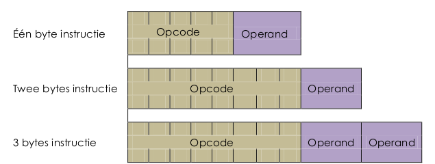

# De instructieset  
## Inleiding  

Dit hoofdstuk is enkel bedoeld om een indruk te schetsen hoe instructies worden uitgevoerd op processor niveau.  De assembly taal komt hierbij aan bod. Hoewel wij tijdens de labo zittingen werken met de programmeertaal C is dit hoofdstuk zeer belangrijk om de basis kennis en de structurele opbouw van een microcontroller te begrijpen.

De Atmel ATmega165P processor is opgebouwd volgens de harvard architectuur en werkt volgens het
RISC principe. RISC is het acroniem voor “Reduced Instruction Set computing”, wat impliceert dat de
microcontroller met een beperkte instructieset werkt. De door ons gebruikte controller bevat een 130
grote instructieset. Bij een RISC instructieset worden de complexe instructies achterwegen gelaten om
een hoge uitvoeringssnelheid en eenvoudigere decodering te bewerkstelligen.  

De meeste instructies worden uitgevoerd in één klokcyclus. Er zijn echter ook instructies die twee tot 4
cycli nodig hebben. Dit is enkel belangrijk om weten indien men tijd kritische toepassingen gaat
ontwikkelen.  

De bytes die het programma voorstellen worden OPCODE genoemd. Een instructie kan uit 1 tot 3 bytes
bestaan. Omdat 8 bit getallen voor ons niet erg praktisch en leesbaar zijn worden de instructies van de
CPU met woorden en afkortingen voorgesteld. Deze mnemonics 1 heeft men zo gekozen dat ze het
gevolg van de instructie beschrijven. De assembler compiler zal deze mnemonics converteren naar de
zogenaamde opcodes (bits). Dit is een begrijpelijke machinetaal voor de controller.  

Een instructie bevat een opcode en een operand.

**Opcode:**  
Deze beschrijft de instructie (ADD, SUBB, MUL,...) en informeert de processor over wat er nog volgt in de
instructie (vb het aantal bytes)

**Operand:**
De operand is de date waarop de instructie wordt uitgevoerd of dit kan ook een geheugenadres zijn.  

Schematisch kan een instructie er als volgt uit zien:



De meest algemene vorm van een instructie is:  
```
  MNEMONIC       BESTEMMING register, BRON register
```

Voorbeeld:  
```
  MOV     Rd, Rr; deze instructie verplaatst de inhoud van register Rr  
                ; naar register Rd  
```
> Opmerking:  
> Er is een wezenlijk verschil tussen assembler en machine code. Assembly code
omschrijft instructies en dit in tegenstelling tot machine taal, waar een instructie
een combinatie van éénen en nullen is.
Voor elke instructie kan men de binaire machinecode terugvinden in de algemene AVR
instructie set beschrijving. (http://www.atmel.com/Images/doc0856.pdf)  

>   

## Overzicht van de instructieset  

De instructies van de microcontroller kunnen in verschillende categorieën worden ingedeeld, afhankelijk van de manier waarop de instructies:  
* de data benaderen (directe of indirecte adressering)  
* inwerken op de data (vb twee getallen optellen)  
* Of de intentie/doel van de instructie (programma flow controle)  

Er zijn verschillende soorten instructies mogelijk, namelijk:  
* Aritmetische en logische instructies
* Conditionele en sprong instructies
* Bit en Bit Test instructies
* Data transfer instructies
* MCU controle instructies

Deze instructies zijn overzichtelijk beschreven in de datasheet.

Al deze instructies beïnvloeden de vlaggen in het Status register. Het statusregister bevat enkel bit informatie. Dit wil zeggen dat de waarde van de byte niet belangrijk is, wel de individuele toestand van de status bits. Ook andere registers kunnen status bits of vlaggen bevatten maar alleen het status register bevat een aantal vlaggen die bepaald worden door
het resultaat van een berekening.  

Welke instructie welke vlag beïnvloedt staat beschreven in de “instruction set summary”.  


**Verklaring van de operands:**  

Code   | Betekenis
-------|------------------------
Rd    |Bestemmings (en doel) register in het registerfile  
Rr   |Bron register in het registerfile  
R     |Resultaat nadat de instructie uitgevoerd is  
K     |constant data  
k     |constant adres  
b     |Bit in het register file of I/O Register  
s     |Bit in het status register  
X,Y,Z |indirect adres register  
A     |I/O locatie adres (poort adres)  
q     |isplacement for direct adressing (6-bit)  

## Adresseringsmethoden  

Om de instructieset van de controller te begrijpen, moet je weten hoe de CPU variabelen in het
systeem kan adresseren. Hiervoor zijn meerdere methoden denkbaar.

* Register Direct (1 of 2 registers) methode
* I/O Direct methode
* Immediate (constant) methode
* Data Direct methode
* Data Indirect methode
* Indirect Program Addressing
* Relative Program Addressing  

### Register Direct adresseringsmethode

Deze adresseringsmethode is werkzaam op elk van de 32 registers in de Register File (zie...). Zowel
instructies tussen twee registers als instructies op één enkel register zijn denkbaar.  

#### Één enkel register: Rd

**Instructie formaat:**  

  

**Voorbeeld:**
```
INC R15   ;increment the content of register 15 with 1
CLR R2    ;clear the content of register R2 (all bits on "0")
```
#### Twee registers: Rd en Rr

De microcontroller leest de data uit de registers Rd en Rs. Voert de instructie uit op de registers. Slaat het
resultaat terug op in het bestemmingsregister Rd

**Instructie formaat:**  
  

**Voorbeeld:**  
```
ADD R2, R5  ;add the content of both registers, the sum is stored in R2
            ;regiser R5 remains unchanged
```

#### Twee-register versus één-regiser directe adressering

Onderstaande figuur geeft het eerder besproken instructieformaat voor het direct en indirect adresseren van een geheugenplaats weer. De operands in deze afbeelding is beschreven met afkortingen. (zie ook eerder -> verklaring van de operands)


Het is belangrijk te leren werken met datasheets, deze beschrijvingen zijn een samenvatting van de datasheet http://www.atmel.com/Images/doc0856.pdf. De uitgebreide, in woorden beschreven, instructie formaten zullen achterwegen gelaten worden.

### I/O Direct adresseringsmethode  
I/O directe adressering wordt gebruikt om de I/O geheugenruimte te bereiken (I/O registers en
poorten).
I/O registers worden enkel aangesproken met de instructies IN en OUT
IN: Het lezen van data van een input poort (PINx)
OUT: wordt gebruikt voor het uitzenden van data naar de output poort (POORTx)

```
IN  Rd, Poort_Address
OUT  Poort_Address, Rs
```
**Instructie formaat:**  


Registers Rd en Rs: één van de 32 general purpose registers
Poort adres: Kan een willekeurig I/O register zijn

**Voorbeeld:**  
```
IN  R16, PORTA    ;Information on port A is stored in R16
OUT PORTA, R16    ;Information of R16 is pushed in R16
```
>Opmerking:  
>  
De AVR ATmega165P controller heeft meer randsytemen aan boord dan er door de 64 I/O registers kunnen ondersteund worden. De 160 Extended I/O geheugenplaatsen kunnen enkel bereikt worden via de data adresseringsmethode. I/O adressing is enkel mogelijk voor de 64 I/O registers.  

### Immediate adresseringsmethode  
Een constante (immediate data) kan weg geschreven worden naar één van de 32 General Purpose
Registers. Deze data is rechtstreeks, als operand, opgenomen in de instructie. Een immediate instructie
is duidelijk herkenbaar doordat de mnemonic code uitgebreid is met een “i”.

**Voorbeeld**
```
LDI  R2, 0X62    ;Loads the hex-number in register R2
```

> Opmerking:  
> Merk op dat we een constant hexadecimaal invoeren.  En dat we hiervoor de suffix 0x gebruiken.  

### Data directe adresseringsmethode

Tot op heden hebben we steeds met de registers in het General Purpose register gewerkt. We kunnen
echter ook data gaan lezen en schrijven uit bijvoorbeeld het SRAM geheugen en/of het extern I/O
geheugen. Deze adresseringsmethode werkt rechtstreeks met de adressen van geheugen plaatsen.
Instructies bestaan uit twee “woorden” van 16 bit, waarbij het 16-bit adres ondergebracht is in de 16 LSB
bits van deze instructie. Rd en Rs zijn het bestemmings en bron register.  

**Instructie formaat: **  


**Voorbeeld:**  
Onderstaande figur toont een specifieke start-situatie:  

|Register | Inhoud | | Gegeheugen adress | Inhoud geheugen-cel |
|-|-|-|-|
|R1|**F0**||0x0200|**F3**|
|R15|C5||0x0201|1A|
||||0x0202|32|
||||0x0203|BE|

Wij voeren enkele Instructies uit, namelijk:
```
LDS R1, 0x0202
STS 0x0200, R15
```

Wat is de inhoud van register R1 en R15 na deze 2 instructies?
```
LDS R1, 0x0202  ; The content of memorty-cell 0x0202 are loaded and writen in R1
STS 0x0200, R15 ; The content of R15 (C5) is stored in data memory cell 0x0200 (STD = STORE Direct to SRAM)
```
De fysische gevolgen van bovenstaande instructies zijn hieronder visueel weergegeven:

|Register | Inhoud | | Gegeheugen adress | Inhoud geheugen-cel |
|-|-|-|-|
|R1|**32**||0x0200|**C5**|
|R15|C5||0x0201|1A|
||||0x0202|32|
||||0x0203|BE|

>Opmerking:  
>De instructie LDS = Load Direct to SRAM bevat als operands een register en een direct data adres. Dit data adres kunnen we echter ook indirect meegeven (adhv een pointer register).  
De instructie ```LDS R1, 0x0202```  
kunnen we ook schrijven als ```LDS R1, X```  
Waarbij X het X-register is dat opgebouwd is uit 2 registers.  
Deze 2 registers zijn
geladen met de waarde 0x02 en 0x02.  
Dit principe is het data indirect adresseren dat we later bespreken (zie...)

### Data Indirecte adresseringsmethode

Deze adresseringsmethode komt zeer overeen met de Data Direct mode, wat is het verschil?

#### Data direct
Eén van de 2 operands is een expliciet gespecifieerd geheugenadres, hetzij om data in op te slaan hetzij uit te lezen.

#### Data indirect
Hier is het adres gespecifieerd als de inhoud van het X, Y of Z register, waarbij:  
* X=combinatie van R26 en R27
* Y=combinatie van R28 en R29
* Z=combinatie van R30 en R31
* X,Y of Z gebruikt als poiter register  

**Instructie formaat**


Data verplaatsen:
* Geheugen naar register: ```mnemonic    destinationregister,X```
* Register naar geheugen: ```mnemonic    X,sourceregister```  

> Opmerking:  X kan zowel X, Y als Z zijn  

**Voorbeeld:**  
We beschouwen volgende vertreksituatie:  

|Register | Inhoud | | Gegeheugen adress | Inhoud geheugen-cel |
|-|-|-|-|
|R0|**0x00**||0x0200|**0xF3**|
|R26|0x00||0x0201|0x1A|
|R27|0x02||0x0202|0x32|
||||0x0203|BE|

Wij voeren enkele Instructies uit, namelijk:
```
LD     R0,X; LD = loads data from memory-location
           ;0x02 00 en writes this content in register R0
           ;02=content of R27=MSB
           ;00=content of R26=LSB
```
|Register | Inhoud | | Gegeheugen adress | Inhoud geheugen-cel |
|-|-|-|-|
|R0|**0xF3**|<=|**0x0200**|**0xF3**|
|R26|0x00||0x0201|0x1A|
|R27|0x02||0x0202|0x32|
||||0x0203|BE|

De inhoud van de geheugenplaats waar naar register X wijst wordt in register R0. Dus Register R0, die bij
aanvang de waarde 0x00 had, bevat nu de waarde 0xF3. Dit is hierboven visueel weergeven.

#### Oefening
* Gegeven:  
R0=0x41  
R26=0x10  
R27=0x03  

| Gegeheugen adress | Inhoud geheugen-cel |
|-|-|
|0x0200|**C5**|
|0x0201|1A|
|0x0202|32|
|0x0203|BE|  


* Gevraagd:  
Wat is de inhoud van R0 na de instructie ```Lds R0,X```?

* Oplossing:  
X = R27 als MSB + R26 als LSB  
X= 0x0310

### Data indirecte adressering: Uitbreiding  
De data indirecte adressering is een zeer populaire adresserings-methode en wordt voor verschillende doeleinden gebruikt.  

#### Post-increment/Pre-decrement
De pointer registers X, Y of Z kunnen ook:  
* Vermeerderd worden met 1 alvorens de instructie uit te voeren (post-increment)  
* Eerst verminderd worden met 1 alvorens de instructie uit te voeren (pré-decrement)


A. Post-increment
```
LD   R0, X+ ; Laad de inhoud van de geheugencel, waarnaar X
            ; wijst, in register R0 en verhoog de inhoud van het X
            ; register met één en
ST   X+, R15; Sla de inhoud van register R15 op indirect op in de cel
            ; waarnaar de het X-register wijzigt en vermeerder
            ; nadien de inhoud van X met één
```
B. Pre-decrement  
```
LD R0, -X ; Verminder de waarde van register R0 met één en
          ; laadt de inhoud van de geheugencel , waarnaar X
          ; wijst in register R0
ST -X, r15; Verminder het X-register met één en sla de inhoud van
          ; register R15 indirect op.
```

#### Indirect adresseren met offset (Y en Z register)  
De adres operand is het resultaat van de som van het Y of Z register EN de off-set operand q.
**Voorbeeld**  
```
LDD R0, Z+0x10 ; Laad indirect de inhoud van het register Z+0x10 in register R0
               ; Dit is hieronder visueel weer gegeven
```
  
#### Indirecte programmageheugen adressering (z register)
Om het 16K grootte programmageheugen aan te spreken gebruiken we het Z-register als pointer voor indirecte sprongen of subroutines. Instructies die hiervoor gebruikt worden zijn bijvoorbeeld IJMP of ICALL.

Indien één van deze instructies gebruikt wordt moet men eerst het Z-register laden. De instructie IJMP laadt de waarde van het Z-register in de programcounter (PC). De programcounter wijst naar het adres van de volgende uit te voeren instructie.


#### Relatieve programmageheugen adresseringsmethode
De instructies rjmp en rcall werken volgens deze methode. Voor de relatieve programma geheugen adressering gebruikt men de PC als pointer.


De operand voor het constante adres (k) is 12 bit groot => 2<sup>12</sup> (= 4096) mogelijkheden. De maximale relatieve sprong kan dus + 2047 of -2048 stappen groot zijn. In dit geval zal de volgende instructie opgehaald worden op adess PC + k + 1

Bovenstaande procedure kan omslachtig lijken, een voorbeeld ter verduidelijking
```
        CPI   r16,$42   ; Vergelijk de inhoud van R16 met de waarde 0x0042  
        BRNE  error     ; “aftakken” naar ‘error’ indien R16 niet gelijk is aan $42  
        RJMP  ok        ; onvoorwaardelijke sprong
error:  ADD   r16,r17   ; Voeg de waarde van R17 toe aan de waarde van R16
        INC   r16       ; Verhoog R16 met één
ok:     NOP             ; Dit is de bestemming van de relatieve sprong
                        ; ‘RJMP ok’. NOP wil zeggen: No opperation
```  

De NOP instructie wordt door de CPU uit het geheugen gelezen, zodat ze een bepaalde tijd duurt.  
Bij uitvoering van de instructie gebeurt er niets.

## Programma en machine controle  
In de datasheet is de instructie set overzicht terug te vinden. De instructie set bevat de zogenaamde BRANCH instructies. Deze instructies laten toe om het programmaverloop te wijzigen, al of niet afhankelijk van de toestand van een (bit)variabele. Hierdoor is het niet alleen mogelijk om het programma een andere weg te laten volgen, afhankelijk van het resultaat van een berekening of variabele, maar ook om bepaalde delen programma vanuit verschillende plaatsen op te roepen.

We kunnen een duidelijk verschil maken tussen de sprong (**JUMP**) instructies en de “roep op” **CALL** instructies.  

### De jump instructies  
Deze instructies voeren een, al of niet voorwaardelijke sprong uit naar het adres dat in de instructie is opgenomen. Men wil, na de sprong, niet terugkeren naar het adres dat door de sprong verlaten werd. Dit zogenaamde terugkeeradres, of ook wel returnadres genoemd, wil men dan ook niet bewaren; Bij een voorwaardelijke sprong zullen we het programmaverloop afhankelijk willen maken van de toestand van een variabele.  

In jump instructies kan men nog een onderscheid maken:  
* Afhankelijk van het aantal adresplaatsen dat met de spronginstructie kan overbrugd worden spreken we van:  
  * Directe jumps (JMP)
  * Indirecte jumps (IJMP)
  * Relatieve jumps (RJMP, beperkt in sprong bereik)  
* We kunnen ook nog het verschil maken in
  * Voorwaardelijke (conditional jumps)
    Bij voorwaardelijke sprongen is het al of niet springen afhankelijk van de waarde   van een bit/byte variabele. De voorwaardelijke sprong instructies noemt men in de instructieset BRANCH instructies. To Branch betekent: “splitsen, aftakken”. We gaan letterlijk aftakken naar een ander stuk programma.
 * Onvoorwaardelijke (unconditional jumps)
Bij deze spronginstructies wordt de sprong steeds gemaakt.

### De CALL instructies  

Deze onvoorwaardelijke instructies hebben tot doel om subroutines te kunnen oproepen. Een subroutine is een stuk programma dat we op verschillende plaatsen in het hoofdprogramma willen uitvoeren. Het is dus wel de bedoeling om terug te keren naar het adres van waar de subroutine opgeroepen werd. Het return adres wordt door de cpu op de stack geplaatst, en bij een return (RET) instructie van de stack gehaald, en in de programcounter (PC) geplaatst.

> Opmerking:  
> Er bestaan zowel software als hardware call instructies.

> Software call:  
Dit is een instructie die expliciet opgenomen wordt in het programma. Het aangeroepen programma is dan ook een subroutine.

> Hardware call:  
Een hardware call noemen we ook INTERRUPT. Bij deze call instructie zal de CPU hardware matig het programmaverloop aanpassen. Een interrupt routine kan gezien worden als een subroutine die op een hardwarmatige manier wordt opgestart. Na het uitvoeren van zulke routine wordt de controle terug overgedragen aan het hoofdprogramma.

Bij alle CALL instructies wordt de stack gebruikt om het terugkeeradres te bewaren. De lengte van de stack wordt dus niet enkel bepaald door het aantal PUSCH en POP instructies (zie…) maar ook door het aantal geneste calls en het aantal interrupts.

Een subroutine of een interrupt routine moet afgesloten worden met een instructie die het return adres van de stack haalt, en naar dit adres terug springt. Hiervoor gebruiken we de return instructie (RET voor een return van een subroutine of RETI bij een terugkeer vanuit een interrupt routine).

> Opmerking:  
Interruptroutines worden door hardware opgestart, en het is dan ook onmogelijk om ten opziche van het hoofdprogramma te weten wanneer ze uitgevoerd gaan worden. Je weet niet welke registers op dat ogenblik in gebruik zijn en welke gebruikt mogen worden door de interruptroutine. De oplossing hier voor zijn de PUSH en POP instructies waarmee we tijdelijk bepaalde registers kunnen vrijmaken.  

## Instructievoorbeelden  
### Logische instructies  
De logische operaties die ATmega165P kan uitvoeren zijn de AND, OR en XOR instructies.


Deze logische bewerkingen kunnen uitgevoerd worden tussen twee registers  of tussen een register en een constante.

#### De AND functie  

**Voorbeeld:**  
Aan poort D, pin 7 is een motor aangesloten. Deze moet uitgeschakeld worden en tegelijkertijd moet de smeerpomp, die aangesloten is aan pin 2 van poort D ook uitgeschakeld worden. Alle andere pennen aan poort D blijven onveranderd.

A|B|Q
-|-|-
0|0|0
0|1|0
0|0|0
1|1|1

```
ANDI   R1, $01111011B
OUT    PORTD, R1
```
Wanneer één ingang van de en-functie 0 is dan zal de uitgang steeds nul zijn. Door bit 7 en 4 van poort D te AND’en met 0 worden de betroffen motoren uitgeschakeld (indien de motoren + geschakeld zijn)

#### De OR functie
Deze keer willen we de betroffen motoren inschakelen.  

A|B|Q
-|-|-
0|0|0
0|1|1
0|0|1
1|1|1

```
ORI    R1, $01111011B
OUT    PORTD, R1
```

Wanneer één ingang van de of-functie ‘1’ is, dan zal de uitgang
steeds ‘1’ zijn.

#### De EXOR functie
Stel volgende opstelling


De draaizin van de motor moet omgeschakeld worden. De andere bits van de poort mogen daarbij niet beinvloed worden.

A|B|Q
-|-|-
0|0|0
0|1|1
0|0|1
1|1|0

```
EOR    R1, $00010000B
OUT    PORTD, R1
```  

## Besluit  

In dit hoofdstuk hebben we zaken besproken die noodzakelijk zijn om een inzicht te verwerven in de signaal verwerking en registeradressering op hardware niveau. In het labo gaan wij werken met een hogere programmeer taal waardoor we niet geconfronteerd worden met voorgaande zaken; Daarom gaan we ook niet verder in detail in op dit onderwerp.
