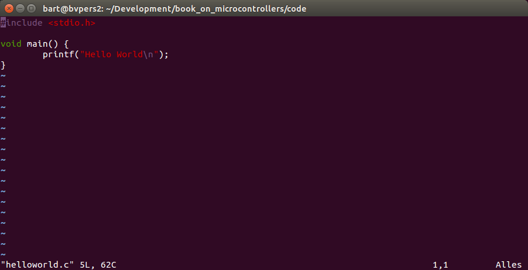
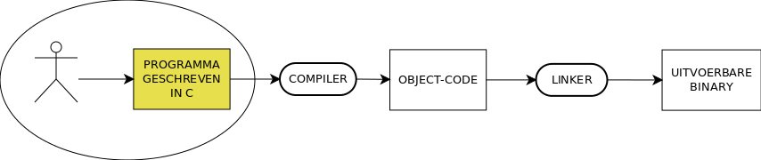
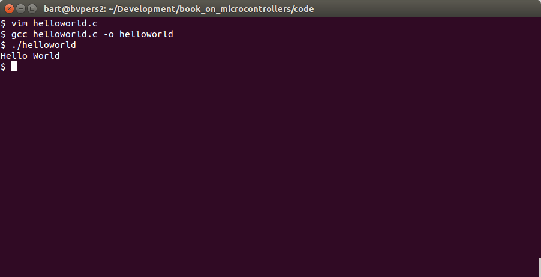
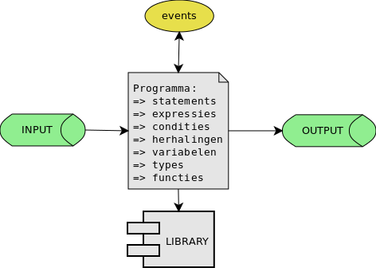
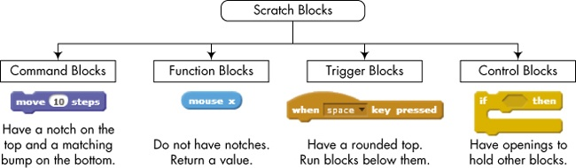

## Introductie in programmmeren

Programmeren kan **moeillijk** zijn en kan snel **demotiveren** bij de verkeerde en ongefundeerde aanpak.  
In dit eerste hoofdstuk proberen we dit te omzeilen door eerst de basis-concepten van een programma uit te leggen.  

### Wat is een programma?
Een programma (of software) is een bestand dat een sequentie van instructies bevat die door een computer (meer bepaald een processor) worden uitgevoerd.

### Creatie van een C-programma
#### C-programma is een tekstfile met instructies
In deze cursus leren we programma's schrijven in C, C is een taal waarmee we deze instructies kunnen uitdrukken.  
Het is lang niet de enige taal maar wel 1 van de talen die zeer goed past bij het ontwikkelen op micro-controllers.

In praktijk start een C-programma zijn leven als 1 (of meerdere) tekst-files.
Voor dit aan te maken heb je niet meer nodig dan een teksteditor (zoals bv. notepad, vim, notepad++, emacs, ...) zoals geillustreerd hieronder:



#### Compileren en linken

Alvorens je dat programma kan uitvoeren op het platform naar keuze (computer, microcontroller ...) moet deze tekst-file getransformeerd worden naar een uitvoerbare binaire file (in het geval van C).  




Deze transformatie wordt uitgevoerd door 2 andere programma's - **compiler** en **linker**.  
Deze programma's produceren  een serie van binaire instructies die kunnen worden uitgevoerd door **"centrale verwerkings éénheid"** (ook wel cpu of processor genoemd).

#### Command-line
Vooraleer te starten met microcontrollers oefenen we de basis van programmeren met c in aan de hand van command-lines-programma's.



De instructie ```gcc helloworld.c -o helloworld``` transformeert de eerder omschreven tekst-file in een programma dat je kan uitvoeren van een command-line-terminal (voor Mac en Linux bash, voor Windows cmd of powershell).

Hierover volgt in de volgende hoofdstukken nog zeer veel diepgang, voorlopig focussen we ons op de eerste activiteit, namelijk het schrijven  van code.

### Basis-elementen en structuur van een progamma
Een C-programma (en ook programma's in andere talen zoals Java, Python, C#, ...)




#### Voorbeeld 0: skelet en body van een programma
Een klassiek c-programma begint meestal met:  

* ```#include <stdio.h>```
* ```int main()```  
* De opsomming van deze eigenlijke statements binnen een c-programma noemen we de **body** en staan altijd tussen accolades  
    * ``` {...}```

Later echter meer hierover.
Neem voorlopig aan dat deze 3 elementen nodig zijn voor een klassiek console applicatie (command line-applicatie).  


```
#include <stdio.h>
void main ()
{

}
```

### Voorbeeld 1: body en statements
```
#include <stdio.h>
void main ()
{
    printf("Hello world");
    printf(" is een typisch voorbeeld-programma");
}
```
* Een c-programma is een opeenvolging van een aantal statements in dit geval:  
    * ```printf("Hello world")```
    * ```printf(" is een typisch voorbeeld-programma")```
* Elk van deze statements wordt gescheiden door een punt-komma
    * ```;```


### Voorbeeld 2: Variabelen en assignments
```
#include <stdio.h>
int main ()
{
    int getal1 = 5; 	// Geheel getal 1 = 5
    printf("Het getal is: %i",som);
}
```

Variabele is een plekje geheugen waar je een waarde kan opslaan.

Kenmerken van variabelen:  

* Naam: (literal, identifier) volledig vrij te kiezen (betekenisvolle namen gebruiken) Vb. L123, appel, RekeningNummer, ...  
* Waarde: inhoud  
* Type: cijfers, karakters, strings (numerieke en alfanumerieke variabelen)  

> Bemerking:  
een belangrijk kenmerk van een variabele, namelijk geheugen-adres hebben we express niet vermeld.  
We gaan hier de volgende hoofdstukken dieper op in.

### Voorbeeld 3: operatoren en expressies
Belangrijk om met onze variabelen en constanten iets te kunnen doen.
```
#include <stdio.h>
int main ()
{
    int getal1 = 5; 	// Geheel getal 1 = 5
    int getal2 = 7;	// Geheel getal 2 = 7
    int som = getal1 + getal2;
    printf("Het resultaat is: %i",som);
}
```


Rekenkundige uitdrukkingen worden samengesteld uit constanten/variabelen en wiskundige operatoren:
* ```+```		optelling
* ```-```		aftrekking
* ```*```		vermenigvuldiging
* ```/```		deling
* ```%```		gehele rest van een deling  

Andere bemerkingen:  

##### Haakjes en prioriteit!  
Wanneer met variabelen en constante wordt gewerkt is de normale wiskunde van tel!
Haakjes zijn zeer belangrijk.
A*B+C is niet A*(B+C)

### Ontwikkelen van een programma

1. Probleem definitie
2. Probleem analyse
3. Opstellen algoritme(n)
4. Schrijven van broncode
5. Builden van broncode
6. Testen en debuggen van broncode

### Illustratie met scratch  



#### Beslissingen  
#### Herhalingen  
#### Variabelen en data-types  
#### Input en output  
#### Functies en procedures  
#### Events  
#### Arrays en lijsten  

### Toegepast in C  
#### Beslissingen  
#### Herhalingen  
#### Variabelen en data-types  
#### Input en output  
#### Functies en procedures  
#### Events  
#### Arrays en lijsten  
