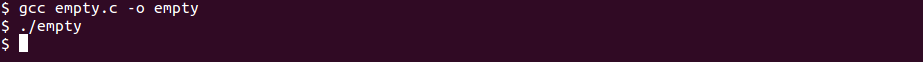
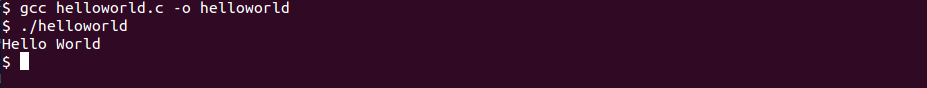
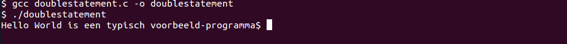

## Introductie in programmeren

Dit is een introductie en/of eerste kennismaking met programmeren aan de hand van de programmeer-taal C.

We pakken dit stap-voor-stap en starten ook enkel met de absolute basis:

* Basis-structuur van een applicatie
    * Statements en expressies
    * Operatoren en functies (aanroepen)
    * Variabelen en constanten
    * Assignments
* Input en output verweken in een command-line-applicatie

>**Nota:**  
>Sommige zaken worden in dit hoofdstuk uitermate vereenvoudigd en onvolledige voorgesteld.   
>Waarom?  
>Programmeren is niet de meest eenvoudige activiteit en we willen niet te snel vooruit lopen om iedereen (met of zonder eerdere programmeer-ervaring) van in het begin dezelfde basis (en kansen) te geven.


### Wat is een (software-)programma?
In essentie is bestaat een (uitvoerbaar) programma (executable) uit :

* een (of meerdere) **bestand**(en)  die een welbepaalde **sequentie van instructies** bevatten
* deze instructies worden door een **computer** (meer bepaald een processor) **geïnterpreteerd** en  **uitgevoerd**.

Binnen een computer is een **CPU (processor)** verantwoordelijk voor het 1 voor 1 verwerken van deze instructies.  
In de praktijd gaat deze **CPU**:

* het programma van een hard-disk of een ander medium afhalen
* de instructies van dit programma in het RAM-geheugen laden
en heeft toegang tot het geheugen voor het opslaan van data.


### Soorten van instructies  

Binnen zo een programma zijn er verschillende soorten instructies:  

* Berekeningen maken
* Afdrukken van het resultaat op een scherm of een andere medium
* Herhalen van instructies
* Aanroepen van functies en procedures
* Enkel uitvoeren van deze instructies onder bepaalde voorwaarden
* Lezen van randapparatuur (bv. scherm, toetsenbord, ...)  
* ...


> In somige gevallen kunnen deze instructies zelfs pas opgeroepen worden bij bepaalde events (wordt pas binnen een paar lessen besproken)

### Programmeertalen

Hoe dat dit in zijn werk gaat bekijken we aan de hand van een programmeertaal.  
Er bestaan veel verschillende programmeer-talen zoals C, C++, Java, Python, C#, ...

Voor deze cursus gaan we dit bekijken aan de hand van de programmeertaal C, momenteel nog altijd de meest gebruikte programmeertaal in de wereld van microctrollers en embedded programming.

### Programmeer-taal C

In praktijk start een C-programma zijn leven als 1 (of meerdere) tekst-files.
Voor dit aan te maken heb je niet meer nodig dan een teksteditor (zoals bv. notepad, vim, notepad++, emacs, ...) zoals geillustreerd hieronder:


##### Compileren en linken
Deze tekst kan je echter niet direct door een CPU laten uitvoeren.  
Alvorens je dat programma kan uitvoeren op het platform naar keuze (computer, microcontroller ...) moet deze tekst-file getransformeerd worden naar een uitvoerbare binaire file (in het geval van C).  


Deze transformatie wordt uitgevoerd door  3 programma's:

* Een assembler die je code vertaalt naar assembler (zie later)  
* Een **compiler** die deze assembler vertaalt naar binaire objecten
* Een **linker** die deze binaire objecten linkt tot een uitvoerbaar programma

Dit programma kan dan rechtstreeks geïnterpreteerd worden door een CPU

##### Command-line
In de praktijk zijn er programma's die dat voor jou doen.  Voorbeelden van zulke compilers zijn gcc en msc.


Ter illustratie zie je hierboven een voorbeeld van hoe dat je met GCC (via de terminal) een tekstbestand (helloworld.c) transformeert naar een programma (helloworld)

Hoe dat precies in zijn werk gaat wordt in het volgend hoofdstuk uitgelegd.  
Voorlopig kan je er vanuit gaan (indien gcc geinstalleerd is) je dit onder de volgende vorm kan aanroepen:  
```gcc <c-file> -o <programmanaam>```  
om een uitvoerbaar command-line applicatie te verkrijgen.

> Vooraleer te starten met microcontrollers oefenen we de basis van programmeren met c in aan de hand van dit soort programma's dat je van de command-line kan aanroepen.

> Hierover volgt in de volgende hoofdstukken nog zeer veel diepgang, voorlopig focussen we ons op de eerste activiteit, namelijk het schrijven  van code zelf   .

### Eerste stap in programmeren

#### Voorbeeld 0: Body van een programma

Hieronder zie je een leeg programma.  
Als je dit programma zou aanroepen zou dit direct beëindigen zonder iets te doen.

```
void main ()
{

}
```

##### Resultaat
Zoals je ziet doet dit programma niets, het voert uit en print geen resultaat uit

 

##### Wat je echter moet onthouden hieruit:
Ondanks dit leeg resulaat hebben we hier iets uit kunnen observeren/leren: 

* Een c-programma start met "void main()"
* Tussen de accolades kan je een sequentie van instructies schrijven.
* Wat er tussen deze accolades staat wordt ook wel de **body** van je programma genoemd.

#### Voorbeeld: Schrijven naar een console (deel 1)

Een eerste gewoonte bij het aanleren van programmeer-taal te leren kennen is het schrijven van programma dat een tekst-boodschap afrdukt.
Men noemt dit ook een "Hello World" (zie ook http://en.wikipedia.org/wiki/List_of_Hello_world_program_examples) met voorbeelden voor zowat alle talen:

```
#include <stdio.h>
void main ()
{
  printf("Hello World");
}
```
**2 nieuwe elementen** kunnen we hier onderscheiden:  

##### Aanroepen van een functie

De bibliotheek (of libary) die we hier willen gebruiken bevat een aantal functies die we willen gebruiken voor het lezen van en schrijven naar een scherm.

In dit geval bevat deze bibliotheek (library) een functie genaamd printf.  
```
printf("Hello World");
```
Dit is de eerste instructie die bekijken, een functie-aanroep.
Zo een functie kan je aanroepen onder de volgende vorm
```
<naam van de functie>(<argument>,<argument>,...);
```  

Eerst geef je de naam van deze functie en dan kan je een aantal argumenten meegeven.
In het voorbeeld eerder beschreven moet je maar 1 argument meegeven en dat is de tekst die je wil afdrukken.
Let wel, deze tekst moet omsloten zijn door dubbele quote ("tekst")

> Deze functies kan je ook zelf definieren, dit komt later in de cursus aan bode

##### Importeren van een library (of header-file)
Om deze functie te kunnen gebruiken echter, moet je aanduiden (voor de compiler) dat je functies wilt gebruiken die gerelateerd zijn aan het printen van boodschappen naar het scherm.  
Dit wordt gedaan via de volgende lijn code:
```
#include <stdio.h>
```  
Deze lijn zorgt ervoor dat je een lijst van voorgedefinieerde functies ter beschikking krijgt die je kan gebruiken die gerelateerd zijn aan het printen.

Voorlopig gaan we hier niet verder op ingaan, voorlopig gaan we van de stelling uit dat (tot nader order) al onze volgende programma's starten met deze lijn.

#### Resultaat
Als je nu dit programma uitvoert via een terminal print, deze de boodschap die we hebben hebt gecodeerd.

 


### Voorbeeld: Meerdere statements sequentiel na elkaar
Tot nog toe hadden we enkel 1 instructie doorgegeven, je kan ook **meerdere instructies** na mekaar doorgeven.  
In het volgende programma, hebben we 2-maal een printf-functie-aanroep geplaatst: 

```
#include <stdio.h>
void main ()
{
    printf("Hello world");
    printf(" is een typisch voorbeeld-programma");
}
```
##### Resultaat
Als je dit aanroept:  

 

zien we dat de 2 statements na mekaar zijn uit gevoerd

##### Observaties

Wat leren we hieruit:  

* Een c-programma is een opeenvolging van een aantal statements in dit geval:  
    * ```printf("Hello world")```
    * ```printf(" is een typisch voorbeeld-programma")```
* Elk van deze statements wordt gescheiden door een punt-komma
    * ```;```

### Voorbeeld: Variabelen en assignments
```
#include <stdio.h>
int main ()
{
    int getal1 = 5; 	// Geheel getal 1 = 5
    printf("Het getal is: %i",som);
}
```

Variabele is een plekje geheugen waar je een waarde kan opslaan.

Kenmerken van variabelen:  

* Naam: (literal, identifier) volledig vrij te kiezen (betekenisvolle namen gebruiken) Vb. L123, appel, RekeningNummer, ...  
* Waarde: inhoud  
* Type: cijfers, karakters, strings (numerieke en alfanumerieke variabelen)  

> Bemerking:  
een belangrijk kenmerk van een variabele, namelijk geheugen-adres hebben we express niet vermeld.  
We gaan hier de volgende hoofdstukken dieper op in.

### Voorbeeld 3: operatoren en expressies
Belangrijk om met onze variabelen en constanten iets te kunnen doen.
```
#include <stdio.h>
int main ()
{
    int getal1 = 5; 	// Geheel getal 1 = 5
    int getal2 = 7;	// Geheel getal 2 = 7
    int som = getal1 + getal2;
    printf("Het resultaat is: %i",som);
}
```

#### Operatoren

| Operator | Operatie        |
|----------|-----------------|
|+         |optellen         |
|-         |aftrekken        |
|*         |vermenigvuldigen |
|/         |delen            |
|%         |rest             |


------------------------------
TODO voorbeelden te includeren

Variable => plekje in het geheugen dat je kan gebruiken om een waarde op te slaan
  Variable names (and beperkingen + gereserveerde woorden)
  Variabele initialiseren
Expressie => iets dat je kan evalueren en een waarde kan geven
  Wiskundige expressies met operators


  Volgorde van uitvoeren (pemal - h-vdr-oa- van links naar rechts)
  Afronden (voorlopig bespreken we enkel ints, later volgen andere)

  !integer division!

  Naming => weten wat code doet

User input en output

Commentaar  


Assignment statement => je will beide koppelen of eventueel rechtsreeks een waarde
Constante is de zelfde


Statement
Assignment statement


  expression
  assignment
  function-calls
  operator

Constant vs variable

------------------------------------------------------------------

## TODO's

Rekenkundige uitdrukkingen worden samengesteld uit constanten/variabelen en wiskundige operatoren:
* ```+```		optelling
* ```-```		aftrekking
* ```*```		vermenigvuldiging
* ```/```		deling
* ```%```		gehele rest van een deling  

Andere bemerkingen:  

##### Haakjes en prioriteit!  
Wanneer met variabelen en constante wordt gewerkt is de normale wiskunde van tel!
Haakjes zijn zeer belangrijk.
A*B+C is niet A*(B+C)

### Ontwikkelen van een programma

1. Probleem definitie
2. Probleem analyse
3. Opstellen algoritme(n)
4. Schrijven van broncode
5. Builden van broncode
6. Testen en debuggen van broncode

### Illustratie met scratch  


#### Beslissingen  
#### Herhalingen  
#### Variabelen en data-types  
#### Input en output  
#### Functies en procedures  
#### Events  
#### Arrays en lijsten  

### Toegepast in C  
#### Beslissingen  
#### Herhalingen  
#### Variabelen en data-types  
#### Input en output  
#### Functies en procedures  
#### Events  
#### Arrays en lijsten  
