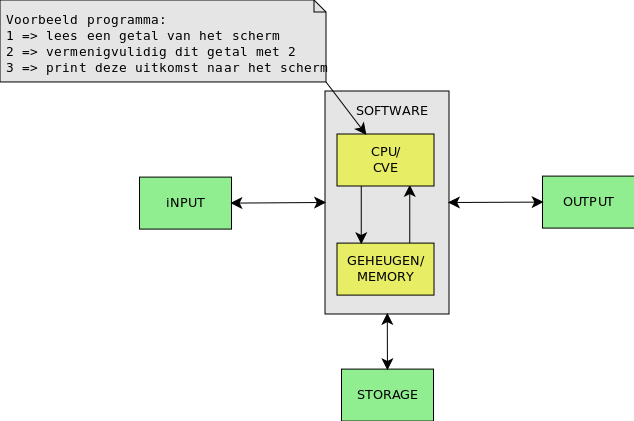

## Introductie in programmmeren

Programmeren kan **moeillijk** zijn en kan snel **demotiveren** bij de verkeerde en ongefundeerde aanpak.  
In dit eerste hoofdstuk proberen we dit te omzeilen door eerst de basis-concepten van een programma uit te leggen.  

### Wat doet een programma (vanop 10000 meter hoogte)?
Een programma (en software in het algemeen) is in essentie:

* een (of meerdere) **bestand**(en)  die een welbepaalde **sequentie van instructies** bevatten
* die door een **computer** (meer bepaald een processor) worden **uitgevoerd**.



Een **CPU (processor)** is in een computer verantwoordelijk voor het 1 voor 1 verwerken van deze instructies en heeft toegang tot een geheugen voor het opslaan van data.

### Structuur van een programma's

Binnen zo een programma zijn er verschillende soorten instructies:  

* Berekeningen maken
* Afdrukken van het resultaat op een scherm of een andere medium
* Herhalen van instructies
* Enkel uitvoeren van deze instructies onder bepaalde voorwaarden
* Lezen van randapparatuur (bv. scherm, toetsenbord, ...)  
* ...


> In somige gevallen kunnen deze instructies zelfs opgeroepen worden bij bepaalde events (wordt pas later besproken)

Hoe dat dit in zijn werk gaat bekijken we aan de hand van een programmeer-taal.  
Er bestaan veel verschillende programmeer-talen zoals:  
* C
* C++
* Java
* Python
* C#
* ...

In deze cursus - die rond microcontrollers draait - doen we dit met C.  
Momenteel nog altijd de meest gebruikte programmeertaal in de wereld van microctrollers en embedded programming.

#### Programmeer-taal C

In praktijk start een C-programma zijn leven als 1 (of meerdere) tekst-files.
Voor dit aan te maken heb je niet meer nodig dan een teksteditor (zoals bv. notepad, vim, notepad++, emacs, ...) zoals geillustreerd hieronder:


##### Compileren en linken

Alvorens je dat programma kan uitvoeren op het platform naar keuze (computer, microcontroller ...) moet deze tekst-file getransformeerd worden naar een uitvoerbare binaire file (in het geval van C).  


Deze transformatie wordt uitgevoerd door 2 andere programma's - **compiler** en **linker**.  
Deze programma's produceren  een serie van binaire instructies die kunnen worden uitgevoerd door **"centrale verwerkings éénheid"** (ook wel cpu of processor genoemd).

##### Command-line
Ter illustratie zie je hieronder een voorbeeld van een programma dat (via de terminal) een tekstbestand (helloworld.c) transformeert naar een programma (helloworld)


Hoe dat precies in zijn werk gaat wordt in het volgend hoofdstuk uitgelegd.  
Voorlopig kan je er vanuit gaan (indien gcc geinstalleerd is) je dit onder de volgende vorm kan aanroepen:  
```gcc <c-file> -o <programmanaam>```

Vooraleer te starten met microcontrollers oefenen we de basis van programmeren met c in aan de hand van dit soort programma's dat je van de command-line kan aanroepen.

Hierover volgt in de volgende hoofdstukken nog zeer veel diepgang, voorlopig focussen we ons op de eerste activiteit, namelijk het schrijven  van code.

### Basis-elementen en structuur van een progamma
Een C-programma (en ook programma's in andere talen zoals Java, Python, C#, ...) bevatten allemaal de volgende elementen:


Deze basis-elementen gaan we stap voor stap uitleggen aan de hand van een aantal voorbeelden.

#### Voorbeeld 0: skelet en body van een programma
Een klassiek c-programma begint meestal met:  

* ```#include <stdio.h>```
* ```int main()```  
* De opsomming van deze eigenlijke statements binnen een c-programma noemen we de **body** en staan altijd tussen accolades  
    * ``` {...}```

```
#include <stdio.h>
void main ()
{

}
```

Later echter meer hierover.  
Neem voorlopig aan dat je tussen deze accolades je programma moet schrijven (command line-applicatie).  

### Voorbeeld: Output van een programma

### Voorbeeld 1: body en statements  

Het eerste programma dat altijd wordt gebruikt om een taal te leren kennen is een programma dat een tekst-boodschap afrdukt

```
#include <stdio.h>
void main ()
{
    printf("Hello world");
    printf(" is een typisch voorbeeld-programma");
}
```
* Een c-programma is een opeenvolging van een aantal statements in dit geval:  
    * ```printf("Hello world")```
    * ```printf(" is een typisch voorbeeld-programma")```
* Elk van deze statements wordt gescheiden door een punt-komma
    * ```;```


### Voorbeeld 2: Variabelen en assignments
```
#include <stdio.h>
int main ()
{
    int getal1 = 5; 	// Geheel getal 1 = 5
    printf("Het getal is: %i",som);
}
```

Variabele is een plekje geheugen waar je een waarde kan opslaan.

Kenmerken van variabelen:  

* Naam: (literal, identifier) volledig vrij te kiezen (betekenisvolle namen gebruiken) Vb. L123, appel, RekeningNummer, ...  
* Waarde: inhoud  
* Type: cijfers, karakters, strings (numerieke en alfanumerieke variabelen)  

> Bemerking:  
een belangrijk kenmerk van een variabele, namelijk geheugen-adres hebben we express niet vermeld.  
We gaan hier de volgende hoofdstukken dieper op in.

### Voorbeeld 3: operatoren en expressies
Belangrijk om met onze variabelen en constanten iets te kunnen doen.
```
#include <stdio.h>
int main ()
{
    int getal1 = 5; 	// Geheel getal 1 = 5
    int getal2 = 7;	// Geheel getal 2 = 7
    int som = getal1 + getal2;
    printf("Het resultaat is: %i",som);
}
```


Rekenkundige uitdrukkingen worden samengesteld uit constanten/variabelen en wiskundige operatoren:
* ```+```		optelling
* ```-```		aftrekking
* ```*```		vermenigvuldiging
* ```/```		deling
* ```%```		gehele rest van een deling  

Andere bemerkingen:  

##### Haakjes en prioriteit!  
Wanneer met variabelen en constante wordt gewerkt is de normale wiskunde van tel!
Haakjes zijn zeer belangrijk.
A*B+C is niet A*(B+C)

### Ontwikkelen van een programma

1. Probleem definitie
2. Probleem analyse
3. Opstellen algoritme(n)
4. Schrijven van broncode
5. Builden van broncode
6. Testen en debuggen van broncode

### Illustratie met scratch  


#### Beslissingen  
#### Herhalingen  
#### Variabelen en data-types  
#### Input en output  
#### Functies en procedures  
#### Events  
#### Arrays en lijsten  

### Toegepast in C  
#### Beslissingen  
#### Herhalingen  
#### Variabelen en data-types  
#### Input en output  
#### Functies en procedures  
#### Events  
#### Arrays en lijsten  
