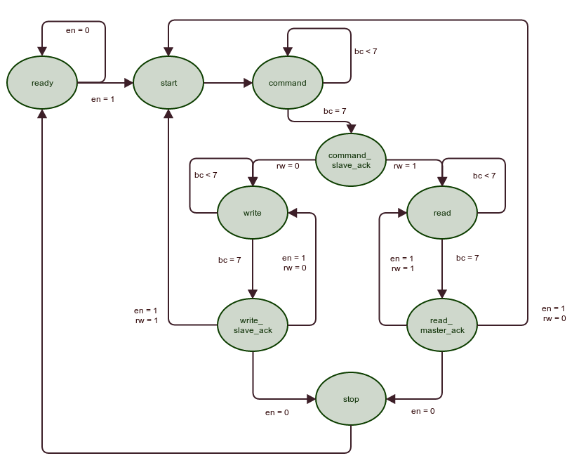

## Illustratie hardware-implementatie I2C

### Elementen voorbeeld hardware-implementatie (master):
Voor een master te ontwikkelen (7-bits-adressering niet de uitgebreide 10-bits-specificatie) heb je hardware matig moet je slechte 2 pins naar buiten openstellen(de common ground en Vcc buiten beschouwing gelaten), namelijk SDA en SCL.  

Intern naar de controller-unit (MCU) dien je een aantal hardware-registers open te stellen:
* Adres van de slave waar je met wil communiceren (7 bits is voldoende)
* Richtings-bit (waarchschijnlijk in dezelfde register-byte)
* Een tx-register (byte) voor data naar toe te schrijven
* Een rx-register (byte) waar de data van de slave naar toe wordt geschreven
* Een enable-flag om aan te duiden (vanuit de MCU) dat een transactie mag starten en of er nog data moet worden gelezen of geschreven na het geven van het commando naar de slave toe.

Daarnaast ook nog 2 bits of flags om status aan te duiden
* Busy-flag die aanduidt voor de MCU dat er transactie bezig is (van een andere master of zichzelf)
* Een flag die aanduidt dat probleem is met de “acknowledgment” van de slave.

In HDL-termen ga je 2 processen nodig hebben:  
* Een proces dat een SCL-clock genereert op basis van de systeem-clock
* Een proces dat de verschillende statussen van transmissie gaat beschrijven (gemakkelijkst beschreven als een state-machine.

Voor de de SCL-clock kan je in principe de 50 mHz-clock van een spartan-bord afdelen naar 400kHz (/125).
Deze SCL-clock wordt dan gebruikt als input (en cadans) van de volgende state-machine.

### I2C Statemachine:  
Het systeem start altijd op in de 'ready'-status, wanneer het 'enable'-signaal (en) '1' wordt zal het naar de 'start'-status gaan.

Deze start-status zal de start-conditie initiëren op de i2c-bus (SDA eerst laag dan SCL laag).
De daaropvolgende status 'command' zal dan het adres-register (7 bit) en rw-flag bit per bit naar de SDA-lijn schuiven (op SCL-clock).

Binnen de volgende 'command_slave_ack'-status wordt er nagekeken of de slave het commando heeft ontvangen.  

Afhankelijk van de inhoud van RW (read=1 en write=0) zal men naar de read of write status gaan.  
In deze statussen zal men (op het ritme van de clock) ofwel data lezen en het rx-register aanvullen ofwel data van het tx-register wegschrijven naar de SDA-lijn.  

Als tijdens de 'acknowledgment' van 1 van de 2 verschillende operaties de MCU (of gebruiker van deze hardware) de enable-flag op 1 heeft gezet gaat deze rechtstreeks terug naar de read- of write operatie voor de volgende data-byte (op voorwaarde dat het om dezelfde operatie gaat).
Zoniet gaat met opnieuw naar de start-status om een nieuwe transactie op te starten.  

Als de 'enable'-status echter op 0 staat gaat het systeem terug naar de 'ready'-status (of idle) en zal het opnieuw wachten tot wanneer de enable-status op 1 staat.  
