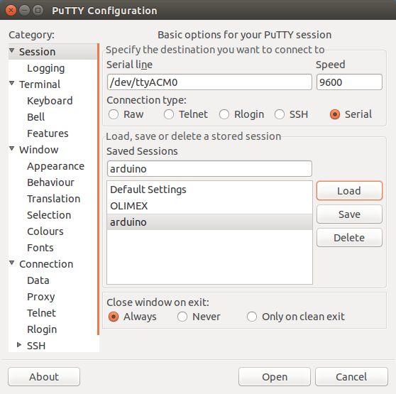

## Labo: ADC

### Opdracht 1: Spanning meten

Gegeven volgende code (en bijhorende header-file):

**serieel.c**:  

```c
#include <avr/io.h>
#include <util/delay.h>

#define BAUD_RATE 9600
#define BAUD_RATE_DIVISOR (F_CPU / 16 / BAUD_RATE - 1)

#define LOOP_TOT_BIT_SET(sfr, bit) do { } while (bit_is_clear(sfr, bit))

void serieel_initialiseer()
{
    UCSR0A = 0 << TXC0 | 0 << U2X0 | 0 << MPCM0;
    UCSR0B =  1 << RXCIE0 | 0 << TXCIE0
            | 0 << UDRIE0
            | 1 << RXEN0 | 1 << TXEN0
            | 0 << UCSZ02
            | 0 << TXB80;
    UCSR0C =  0 << UMSEL01 | 0 << UMSEL00
            | 0 << UPM01 | 0 << UPM00
            | 0 << USBS0
            | 1 << UCSZ01 | 1 << UCSZ00
            | 0 << UCPOL0;
    UBRR0 = BAUD_RATE_DIVISOR;
}

void serieel_verstuur_byte(unsigned char data)
{
        LOOP_TOT_BIT_SET(UCSR0A, UDRE0);
        UDR0 = data;
}


void serieel_verstuur_string(char* s)
{
    while (*s) {
        serieel_verstuur_byte(*s);
        s++;
    }
}

void serieel_verstuur_getal(unsigned char i)
{
    char s[25];
    itoa(i, s, 10);
    serieel_verstuur_string(s);
}
```

en bijhorende header **serieel.h**:  

```c
#ifndef SERIAL_H_
#define SERIAL_H_

void serieel_initialiseer();
void serieel_verstuur_byte(unsigned char data);
void serieel_verstuur_string(char* s);
void serieel_verstuur_getal(unsigned char i);

#endif
```

#### Deel A: communicatie met de computer

Integreer deze code in het eerste voorbeeld van het ADC-hoofdstuk (zet deze 2 files onder aparte files) om de ADC-waardes over een
seriele lijn weg te schrijven.

Om deze seriele communicatie te lezen gebruik een terminal-programma.  
Het programma dat



Putty bestaat enkel voor Linux - en zelfs voor Windows :) - maar niet voor Mac.  
Voor Mac en Linux kan je bijgevolg ook de volgende terminal-programma's gebruiken:

* picocom -r -b 9600 /dev/ttyACM0
* screen 9600 /dev/ttyACM0

> **Nota:**  
> Je kan hier ook testen zonder de leds als die niet voorradig zijn  
> Met deze seriele communicatie je ook het programma testen.

> **Nota**  
> Als je tijd heb mag je dit ook toepassen op het laatste voorbeeld

#### Deel B

Optimaliseer de prescaler zoals gevraagd in de cursus.  
Schrijf in commentaar van de code een verwijzing naar de datasheet waar je de nodige info hebt gevonden.  

#### Deel C

Wijzig de input-pin naar ADC3

#### Deel D (optioneel)

Maak dit voorbeeld interrupt-gebaseerd
