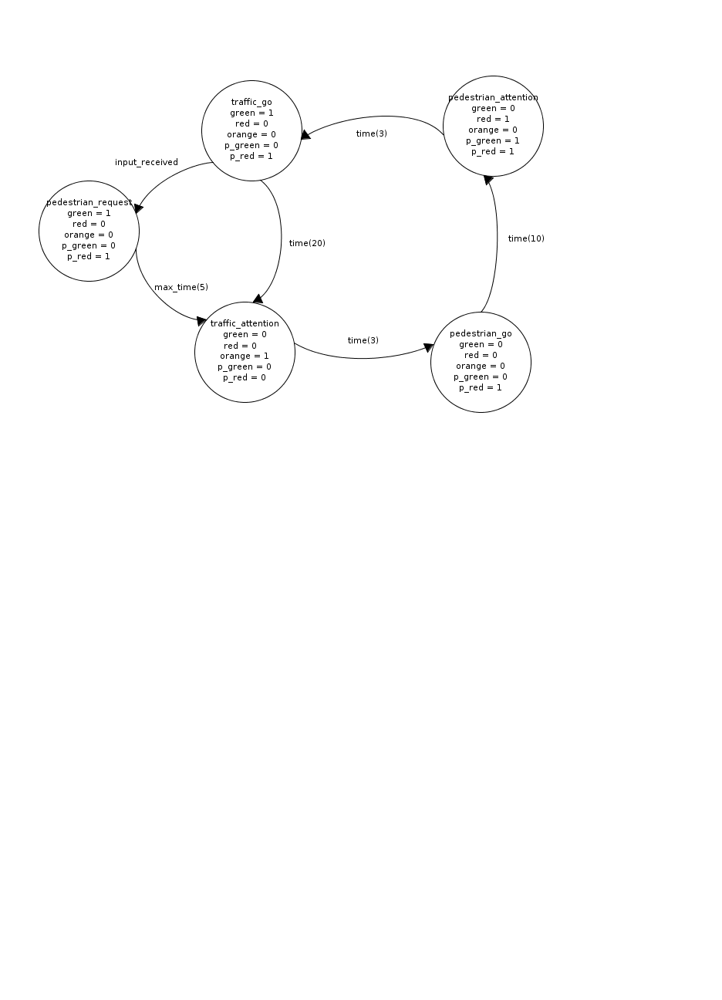

## Labo: verkeerslicht

### Opdracht 1: verkeerslicht

Doel is een éénvoudige verkeerslicht-simulator te maken.  
Bedoeling is de opgedane kennis van gpio's te testen.  
Indien mogelijk probeer deze  te maken met een statemachine (met behulp van een switch-statement)

#### Deel A

Schrijf een kort programma dat een verkeerslicht simuleert.  
Volg hiervoor het onderstaande statemachine:




```c
#include <avr/io.h>
#include <util/delay.h> 

#define TRAFFIC_GO			0
#define PEDESTRIAN_GO		1

#define GREEN_LED			1
#define YELLOW_LED			2
#define RED_LED				3
#define RED_LED_P			4
#define GREEN_LED_P			5

int main(void)
{

	int counter = 0;
	int state = TRAFFIC_GO;

  //TODO configure in- en output...

	while(1) {
		_delay_ms(10);
		counter = counter + 10;

    //TODO add other states and transitions
		switch(state) {
		case TRAFFIC_GO:

			PORTB = PORTB | (1 << GREEN_LED) |	(1 << RED_LED_P);
			PORTB = PORTB & ~((1 << YELLOW_LED) | (1 << RED_LED) | (1 << GREEN_LED_P));

			if(counter >= 20000) {
				state = PEDESTRIAN_GO;
				counter = 0;
			}
			break;
		case PEDESTRIAN_GO:

			PORTB = PORTB | (1 << RED_LED) |	(1 << GREEN_LED_P);
			PORTB = PORTB & ~((1 << YELLOW_LED) | (1 << RED_LED_P) | (1 << GREEN_LED));

			if(counter >= 10000) {
				state = TRAFFIC_GO;
				counter = 0;
			}
			break;
		}

	}

	return EXIT_SUCCESS;
}

```

#### Deel B

Integreer een push-button die een voetgangs overgang simuleert
Als deze button wordt ingedrukt zal een groen licht worden onderbroken

#### Deel C (optioneel)

Plaat leds bij voor de voetgangers (geel en rood is voldoende)
