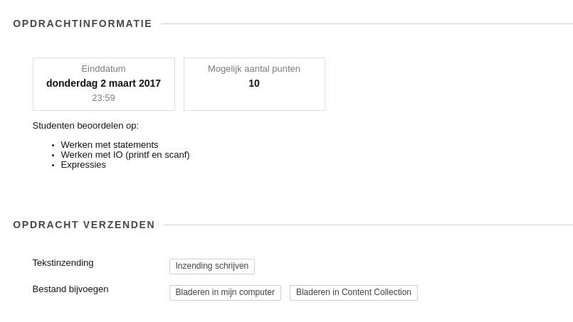
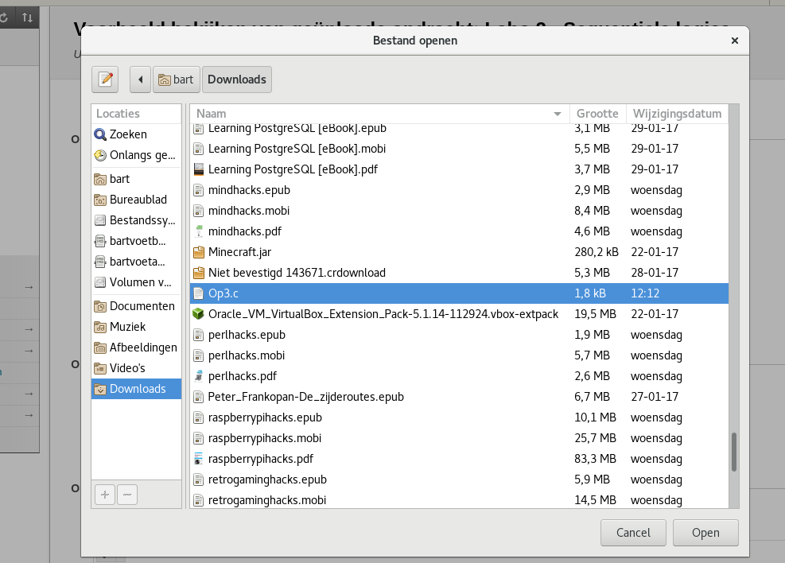
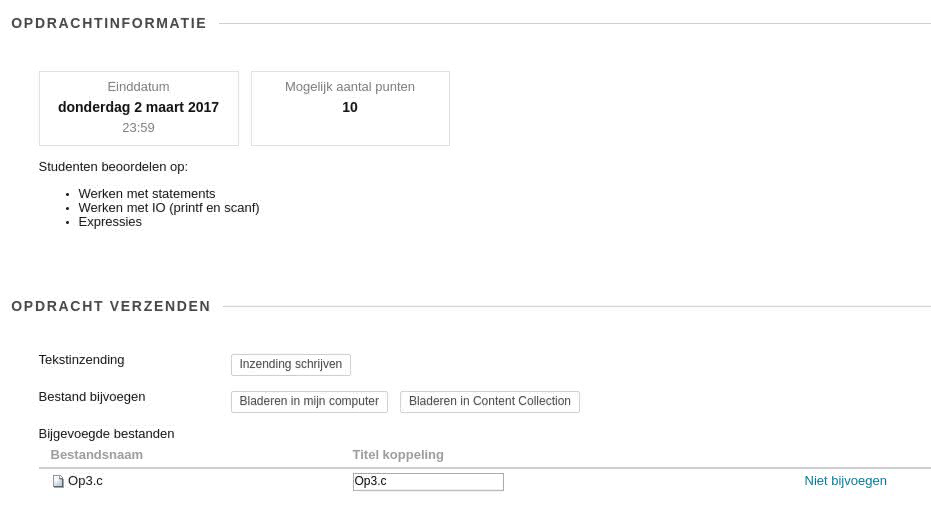
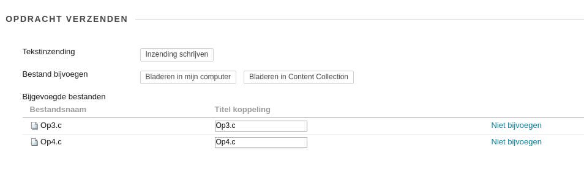
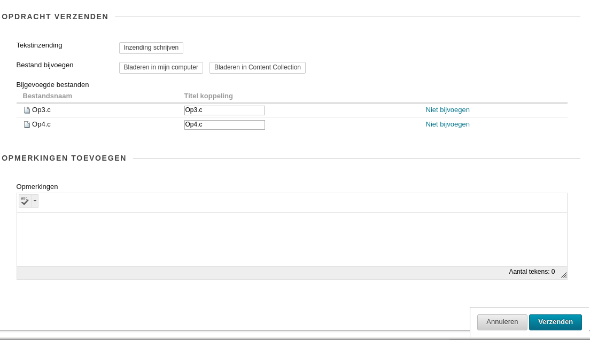

De opdrachten C kunnen toegevoegd worden dooe naar het betreffende labo te gaan  
Op deze pagina, druk je op de knop “Bladeren in mijn computer”

Als je hierop klikt kan je een **file selecteren**

Als je de file hebt **geselecteerd** (en op **open** hebt **geklikt**) zou er normaal gezien een file (onder 
dezelfde naam) moeten staan op deze pagina  

Je kan meerdere files toevoegen aan een opgave dooe opnieuwe via de button “Bladeren in mijn 
computer” te werken.

Als alle files zijn toegevoegd (eventueel met wat commentaar) moet je op de knop verzenden 
drukken.

> **Belangrijk**  
> Gelieve wel deze files niet als een zip-file op te laden.  
> Inzendingen met een zip-file worden niet bekeken.
