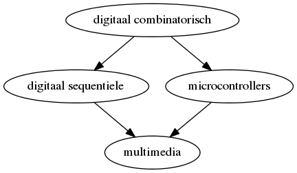

## Het vak "Microcontrollers"
Wat houdt de cursus microcontrollers gegeven in ACE Groep T?  
Hoe past deze cursus binnen de opleiding?  
Wat ga je hier leren?  

### Situering van de module in de opleiding
In de opleiding "digitale combinatorische" en "digitale sequentiële logica" heb je geleerd van (hardwarematig) logische devices te programmeren.

In de praktijk werkt deze hardware samen met (of wordt aangestuurd door) microcontrollers.

In deze cursus leren we omgaan met deze "kleine computers" of microcontrollers.

De kennis van deze 3 vakken (module digitale technieken) zal uiteindelijk worden gebruikt in het vak "multimedia" waar je deze vaardigheden zal combineren om multimedia-toepassingen te maken.

### Doelstelling van de cursus

De doelstellingen van deze cursus zijn inzicht verwerven in en te leren werken met zowel microcontrollers als met de programmeer-taal C  

Dit houdt in onder andere:

* De basis van de programmeertaal C (input/output, condities, loops, types, ...)
* Basis I/O periferieën en het leren aansturen ervan in de programmeertaal C
* Algemene communicatie-protocollen zoals i2c, spi, usart, ...
* De architectuur van een AVR microcontroller (en vergelijking met andere architecturen)
* Werken met datasheets
* Ter illustratie van deze architectuur AVR-assembler (enkel de noties)
* Het geheugen en registeropbouw in een microcontroller (en coputersystemen in het algemeen)
* Meer geavanceerde aspecten van C (bv. arrays, pointers, dynamisch geheugen, ...)
* Leren je code modulair en herbruikbaar te maken
* ...

> **Belangrijke bemerking:**  
> Een belangrijke achtergrond van deze cursus is de student klaar te maken:
>
> * Capabel zijn nieuwe platformen en architecturen te analyseren (naast AVR) 
> * Ook algemene aspecten bij te leren over programmeren in het algemeen zoals design en analyse

### Samenstelling cursus/Verschillende aspecten

* **Code:**  
Het aanleren van programmeren met een focus op de C-programmeertaal.  
Dit is meestal de start van een hoofdstuk waar we de nodige elementen aanleren die nodig zijn in de 2 in het toepassing-niveau (en ook niet meer want C is al voldoende complex).  
Dit wordt telkens ingeoefend aan de hand van korte labo-oefeningen op PC voor dat we dit toepassen op een microcontroller-omgeving.  

* **Architectuur en low-level**  
Het low-level en embedded programmeren steunt op een goede kennis van het platform.
Afhangende van het onderwerp zullen we dieper ingaan op instructie-sets, processsor-architectuur, opbouw van communicatie-protocols, ADC, ...  

* **Toepassing: tools en labo's**  
Het leren werken de benodigde tools zoals compilers, flash-tools, debuggers,  ...

* **Elektronica**  
Herhaling vanuit de andere elektronica-vakken waar nodig (bijvoorbeeld pull-up en pull-down, PWM, ...)
